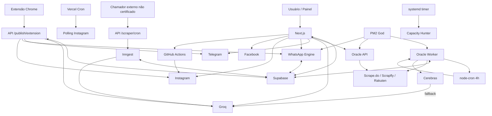
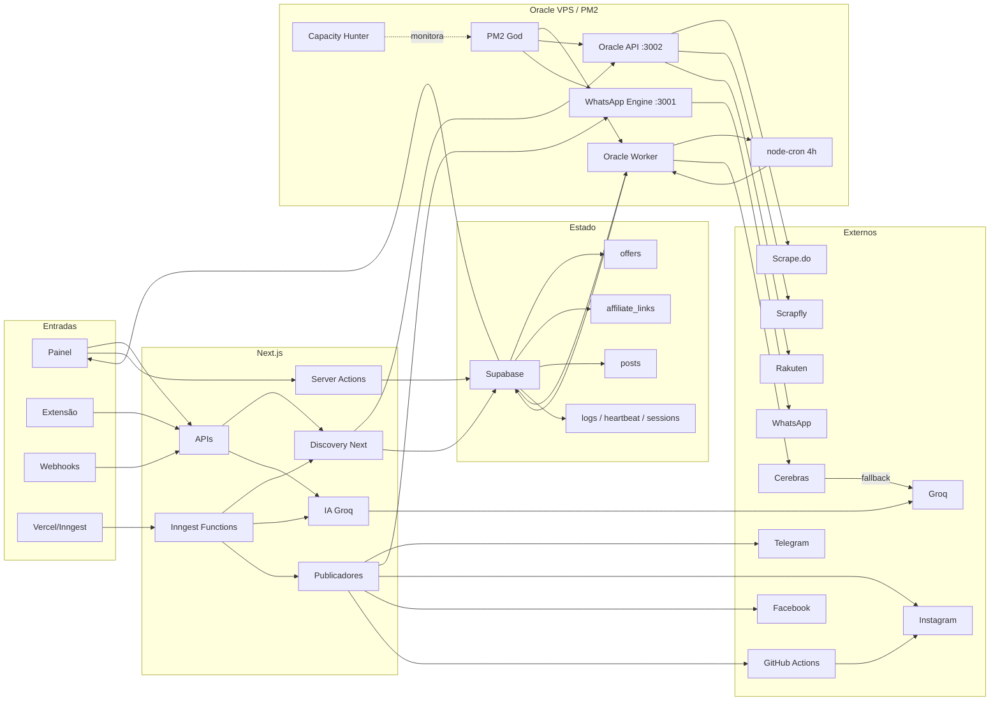

# Sprint 00.2 — Auditoria Sistêmica Completa do Ecossistema

**Modo:** READ-ONLY | FORENSE | ZERO ALTERAÇÕES OPERACIONAIS | ZERO DEPLOY | ZERO EXECUÇÃO

**Data da auditoria:** 13/07/2026

## 1. Resumo Executivo

- Não existe um único orquestrador; a governança é distribuída entre PM2, Oracle Worker, Next.js, Inngest, Vercel Cron, systemd e rotas alternativas.
- O Oracle Worker observado na VPS é iniciado pelo PM2 God e mantém seu próprio `node-cron`.
- A origem do PM2 God atual não pôde ser reconstruída: **NÃO CERTIFICADO**.
- Oracle Worker, Oracle API e WhatsApp Engine são processos PM2 independentes e concorrentes.
- Next.js/Vercel não depende da ordem de boot desses processos, mas algumas rotas dependem da Oracle API e do Supabase.
- Supabase é o ponto central de estado, mas não governa sozinho as transições de negócio.
- Existem sete caminhos de entrada para IA; dois motores principais: Oracle Cerebras→Groq e Next.js Groq.
- Existem múltiplos caminhos de publicação, com regras de persistência diferentes.
- A Extensão Chrome insere diretamente `approved`, chama IA e publica, ignorando a máquina V5 oficial.
- Oracle Worker e Inngest processam ofertas sem exigir consistentemente `selected`.
- Shopee EPIC 09 permanece como fallback ativo quando `SHOPEE_DISCOVERY_V5` não é `"true"`.
- Amazon V5, mesmo habilitada, executa discovery e retorna sem persistir.
- O bloco Amazon V3 posterior é código inalcançável.
- Mercado Livre V5 está implantado e alcançável, mas sua execução atual no notebook é **NÃO CERTIFICADO**.
- A VPS em `SCRAPER_MODE=LOCAL` não executa discovery: atua como leitora/orquestradora de drafts.
- Não foi encontrada publicação externa iniciada diretamente pelo Scheduler.
- O runtime real não corresponde integralmente à arquitetura V5 homologada.
- A arquitetura não está sistemicamente consistente.
- Existem estados externos ainda não certificados; uma Sprint corretiva não deve começar sem completar essas evidências.

## 2. Inventário completo dos processos executáveis

| Componente | Entrada/função principal | Iniciação/quem inicia | Produz / consome | Estado observado | Legado / V5 |
|---|---|---|---|---|---|
| Next.js | `next dev/start`; App Router e APIs | Node/Vercel; origem produtiva **NÃO CERTIFICADO** | Consome Supabase, Oracle API e serviços externos; produz ofertas, links, posts e eventos | Produção **NÃO CERTIFICADO** | Misto |
| Painel Next.js | páginas em `src/app` e Server Actions | Requisição HTTP do usuário | Lê/escreve Supabase; dispara IA/publicação | Ativação produtiva **NÃO CERTIFICADO** | Misto |
| APIs Next.js | 25 rotas `src/app/api/**/route.ts` | HTTP, Vercel Cron ou Inngest | Scraping, IA, publicação, configuração, imagens, webhooks | Código implantável | Misto |
| Oracle Worker | `runScrapingCycle()` | PM2 → execução imediata → `node-cron` | Lê/grava Supabase; discovery e IA | PM2 `oracle-scraper`: online observado | Misto |
| Scheduler do Worker | `cron.schedule()` | Criado dentro do Oracle Worker | Dispara `runScrapingCycle()` a cada quatro horas | Ativo enquanto o Worker estiver ativo | Misto |
| Oracle API | Express em porta 3002 | PM2 | Recebe Next.js; chama providers e funções do módulo Worker | PM2 `oracle-api`: online observado | Misto |
| WhatsApp Engine | Express/Baileys em porta 3001 | PM2 | Recebe Next.js; persiste sessão no Supabase; envia WhatsApp | PM2 `whatsapp-bot`: online observado | Ativo não V5 |
| PM2 God | daemon PM2 | Origem atual **NÃO CERTIFICADO** | Pai dos três processos Node | Ativo, PPID 1 observado | Infraestrutura |
| `pm2-ubuntu.service` | `pm2 resurrect` | systemd no boot, se executado | Restaura dump PM2 | Habilitado, porém inativo na inspeção | Infraestrutura |
| Capacity Hunter | `src/index.js --run` | systemd timer | Monitora PM2/OCI/SHA; alerta via Telegram | Timer ativo a cada cinco minutos | Monitoramento |
| Inngest | seis funções registradas em `/api/inngest` | Evento ou cron Inngest | Discovery, IA, publicação, analytics e polling | Registro estático; serviço ativo **NÃO CERTIFICADO** | Misto |
| Vercel Cron | `/api/instagram/poll-comments` | Plataforma Vercel | Polling de comentários Instagram | Configurado; execução real **NÃO CERTIFICADO** | Ativo-capaz |
| `/api/scraper/cron` | enfileira `cron/run-scraping` | Chamador externo | Produz eventos Inngest por usuário | Chamador/schedule **NÃO CERTIFICADO** | Legado/V2 |
| GitHub Actions | `publish-reel.yml` | API Instagram → `workflow_dispatch` | Gera vídeo, publica e atualiza Supabase | Configurado; histórico de execução **NÃO CERTIFICADO** | Ativo-capaz |
| Extensão Chrome | `popup.js` → `content.js` | Clique do usuário | Extrai Magalu e chama API pública de extensão | Instalação/uso atual **NÃO CERTIFICADO** | Fluxo paralelo |
| Supabase | serviço gerenciado | Externo ao repositório | Estado, autenticação, heartbeat, sessões, Storage | Estado produtivo não consultado | Central compartilhado |
| Scripts manuais | `ai-processor`, `local-scraper`, manutenção, backfills e diagnósticos | CLI/manual | Podem ler/escrever ou executar integrações | Nenhum launcher ativo encontrado | Misto/legado |
| Worktrees | `deploy-v53g-main`, ML V5, Shopee V5 | Não são processos | Cópias de código | Nenhum runtime próprio certificado | Fontes divergentes |

Não foi encontrada tarefa agendada Windows correspondente. `crontab` do usuário Ubuntu estava vazio; cron sistêmico completo: **NÃO CERTIFICADO**.

## 3. Cadeia completa de inicialização

A inicialização real não é uma cadeia linear:

```text
Sistema operacional
├─ PM2 God — origem do daemon atual: NÃO CERTIFICADO
│  ├─ oracle-scraper.cjs
│  │  ├─ runScrapingCycle() imediato
│  │  └─ node-cron "0 */4 * * *"
│  ├─ oracle-api.cjs :3002
│  └─ whatsapp-engine.cjs :3001
├─ systemd timer
│  └─ Capacity Hunter a cada 5 minutos
└─ Plataformas externas independentes
   ├─ Vercel → Next.js
   ├─ Vercel Cron
   ├─ Inngest
   ├─ GitHub Actions
   └─ Supabase
```

- Os três processos PM2 são irmãos e inicializam concorrentemente.
- PM2 não inicia Next.js/Vercel.
- Oracle API não inicia o Worker; apenas importa funções dele com o `require.main` protegido.
- O Scheduler é criado pelo próprio Worker, não por PM2.
- Não existe ordem obrigatória entre Worker, API e WhatsApp no PM2.
- Algumas operações Next.js falham funcionalmente se Oracle API, WhatsApp Engine ou Supabase estiverem indisponíveis.
- O `noOverlap: true` impede sobreposição apenas dentro daquela instância do `node-cron`; não é lock distribuído.

## 4. Fluxograma global



## 5. Comunicação entre todos os componentes

| Origem | Destino | Meio | Finalidade |
|---|---|---|---|
| Painel | APIs/Server Actions Next.js | chamada HTTP/action | Seleção, rejeição, IA, links e publicação |
| Next.js scraper | Oracle API | HTTP autenticado | HTML, tendências Shopee e Netshoes |
| Oracle API | Providers | HTTP | Scrape.do, Scrapfly e Rakuten |
| Oracle API | módulo `oracle-scraper` | `require()` e chamada direta | Executa funções dentro do processo da API |
| Oracle Worker | Supabase | cliente service-role | Heartbeat, ofertas, links, posts e logs |
| Next.js | Supabase | cliente de sessão/admin | Autenticação, painel e persistência |
| Inngest | Supabase | cliente admin | Ofertas, posts e vendas |
| Extensão | Next.js | HTTP CORS | Ingestão, IA e publicação direta |
| WhatsApp API Next.js | WhatsApp Engine | HTTP | Envio por Baileys |
| WhatsApp Engine | Supabase | cliente service-role | Sessões Baileys |
| Instagram API | GitHub Actions | `workflow_dispatch` | Reels não cupom |
| GitHub Actions | Supabase/Instagram | Node/HTTP | Storage, publicação e estados |
| Capacity Hunter | PM2/OCI/código | leitura | Métricas e alertas |
| Oracle Worker VPS | Notebook | Indireta via heartbeat/drafts no Supabase | Coordenação em `LOCAL`; não existe IPC direto |
| Scheduler | Publicadores externos | Nenhuma chamada encontrada | Publicação Scheduler→canal: **NÃO CERTIFICADO** |

## 6. Responsabilidades do Next.js

- Painel, autenticação e APIs.
- Discovery acionado pelo usuário e pelo Inngest.
- Persistência de discovery como `draft`.
- Curadoria manual `pending_manual_review → selected/rejected`.
- Geração de links.
- IA Groq por `/api/ai/generate`, Publish Express, Inngest e Extensão.
- Publicação Telegram, Instagram, WhatsApp e Facebook.
- Dispatch de GitHub Actions para Reels.
- Produção de eventos Inngest.
- Polling de comentários Instagram.
- Não governa o Scheduler do Oracle Worker.
- Não governa o ciclo de vida PM2.
- Não é o único responsável pela persistência, IA ou publicação.

Evidência central: `src/lib/affiliates/scraper.ts`, `src/lib/offers/actions.ts` e `src/app/api/ai/generate/route.ts`.

## 7. Responsabilidades da Oracle API

- Gateway HTTP Express na porta 3002.
- `/api/scrape`: executa scraping e normalização; não persiste.
- `/api/shopee/trends`: executa V5 com persistência quando a flag é `"true"`; caso contrário, EPIC 09.
- `/api/shopee/product`: executa EPIC 09 e procura um produto.
- `/api/netshoes/trends`: executa consulta Rakuten.
- `/api/amazon/trends`: sempre responde 403.
- Não envia comandos ao processo Worker.
- Não possui fila, IPC ou socket com o Worker.
- Compartilha código ao importar `oracle-scraper.cjs`; a guarda `require.main` impede iniciar o Scheduler.

Evidência: `scripts/oracle-api.cjs`.

## 8. Responsabilidades do Oracle Worker

- Inicialização imediata e agendamento a cada quatro horas.
- Discovery no Windows quando `SCRAPER_MODE=LOCAL`.
- Discovery local na própria máquina em `ORACLE/AUTO`.
- Na VPS Linux com `LOCAL`, valida heartbeat e processa drafts existentes.
- Persiste ML V5 e Shopee V5.
- Amazon V5 não persiste: executa módulo e retorna `[]`.
- Seleciona candidatos por score.
- Gera IA via Cerebras, com fallback Groq.
- Gera links/posts e promove ofertas.
- Executa limpeza de drafts.
- Não publica diretamente em Telegram, Instagram ou WhatsApp.
- Não exige `selected` antes de `processTopOffers`.

Evidência: `scripts/oracle-scraper.cjs`, funções `runScrapingCycle`, `scrapeStore` e `processTopOffers`.

## 9. Responsabilidades da Extensão Chrome

Fluxo certificado:

```text
Clique no popup
→ content.js extrai produto
→ POST produção /api/publish/extension
→ service-role escolhe usuário
→ valida/deduplica
→ insere offer como approved
→ cria links
→ chama Groq
→ publica diretamente nos canais
```

| Etapa | Bypass |
|---|---|
| Discovery oficial | SIM |
| `pending_manual_review` | SIM |
| `selected` | SIM |
| Gate V5 antes da IA | SIM |
| Painel autenticado | SIM, possui fallback para primeiro `user_id` encontrado |
| Persistência | NÃO; grava diretamente |
| IA | NÃO; chama IA |
| Quality Gate oficial completo | SIM; usa apenas validação de persistência |
| Atualização final para `posted` | Não encontrada |
| Criação de posts persistidos | Não encontrada |

Evidência: `src/app/api/publish/extension/route.ts`.

## 10. Fluxo completo do Banco

| Estado/entidade | Escritores certificados |
|---|---|
| `draft` | Next discovery, criação manual por default, Oracle legado, scripts locais/coupons |
| `pending_manual_review` | Persistores ML V5 e Shopee V5 |
| `selected` | Server Actions do painel e APIs de publicação Telegram/Instagram/WhatsApp |
| `approved` | Oracle `processTopOffers`, `/api/ai/generate`, Inngest, `ai-processor`, Extensão, Publish Express |
| `rejected` | Ações manuais e scripts de limpeza |
| `posted` | APIs de canal e `github-publish.ts` |
| `posts:draft` | Oracle, Next IA, Inngest e `ai-processor` |
| `posts:published` | APIs dos canais, Facebook e GitHub Actions |
| `posts:deleted` | IA ao substituir drafts e rotas de rejeição |
| links | Oracle, Next, Inngest, Extensão e `ai-processor` |
| vendas | Server Action e evento Inngest `analytics/sync` |

Há múltiplos escritores service-role e de sessão sem uma transação global de estado. Escrita concorrente e duplicada é arquiteturalmente possível; ocorrência produtiva: **NÃO CERTIFICADO**.

O esquema declarado permite `draft`, `approved`, `pending_manual_review`, `selected`, `posted` e `rejected`. A rota Instagram usa também `processing`; compatibilidade com o banco implantado: **NÃO CERTIFICADO**.

## 11. Máquina Global de Estados

Não existe uma única máquina global aplicada por todos os fluxos.

Fluxo V5 pretendido:

```text
discovery
→ pending_manual_review
→ selected
→ IA
→ approved
→ post draft
→ published
→ offer posted
```

| Transição | Quem decide |
|---|---|
| discovery → pending | Persistores V5 do Worker/API |
| pending → selected/rejected | Painel ou API de publicação |
| selected → IA | `/api/ai/generate` valida o gate |
| IA → approved | Score final no Next.js |
| post draft → published | API do canal ou GitHub Actions |
| approved → posted | API do canal/GitHub Actions |

Desvios certificados:

```text
Next discovery → draft → IA automática → approved
Oracle drafts → IA → approved
Inngest discovery → draft → IA → approved
Extensão → approved → IA → publicação
Publish Express → approved → IA → publicação manual
pending_manual_review → API de publicação → selected → publicação
```

A própria publicação pode converter `pending_manual_review` em `selected`, reduzindo a seleção manual a uma transição automática no momento do envio.

## 12. Fluxo completo da IA

Foram encontrados **sete caminhos de orquestração de IA**, dois deles reutilizando o mesmo endpoint:

1. Oracle Worker → `processTopOffers` → `generateOfferAnalysis` → Cerebras → fallback Groq.
2. `ai-processor.cjs` manual → função importada do Oracle Worker.
3. `/api/ai/generate` → Groq, com gates Shopee/ML/Amazon.
4. Next trends → chamada HTTP interna para `/api/ai/generate`.
5. Inngest `runUserScrapingBackground` → Groq diretamente, sem gate `selected`.
6. Publish Express `generateQuickPostAction` → Groq.
7. Extensão → Groq e publicação direta.

| Item | Resultado |
|---|---|
| Quem chama `processTopOffers` | Oracle Worker, nos fluxos de drafts/candidatos |
| Quem chama `generateOfferAnalysis` | Todos os caminhos acima, direta ou indiretamente |
| Quem chama Cerebras | Oracle Worker |
| Quem chama Groq | Oracle fallback e todos os fluxos Next.js |
| Geração automática | SIM: Worker, trends e Inngest |
| Geração manual | SIM: painel, Publish Express e script CLI |
| Bypass de seleção | SIM |
| Candidate Queue real | Não encontrada; Inngest funciona como fila de eventos |
| `pendingDrafts` | Ativo no Worker |
| Selection Engine único | NÃO |
| Mais de um pipeline | SIM |

## 13. Fluxo completo da Publicação

| Caminho | Estado e efeito |
|---|---|
| Painel → Telegram API | Auto-seleciona pending, publica, marca post `published` e oferta `posted` |
| Painel → WhatsApp API → Engine | Mesmo fluxo, via Baileys |
| Painel → Instagram cupom | Publica direto e marca estados |
| Painel → Instagram não cupom | Dispatch GitHub → renderização/publicação → atualiza estados |
| Painel → Facebook API | Publica e atualiza post; oferta `posted` não encontrada |
| Publish Express | Publicação direta por Server Actions; persistência não uniforme |
| Extensão | Publicação direta; não foi encontrada criação de posts nem transição para `posted` |
| Inngest `post/publish` | Chama `publisher.publish`; nenhum produtor interno do evento foi encontrado |
| Scheduler Oracle | Cria posts/dados, mas publicação externa direta não foi encontrada |

Não existe uma autoridade única que confirme a publicação e normalize os estados de todos os canais.

## 14. Componentes compartilhados

| Componente | Consumidores | Classificação |
|---|---|---|
| Supabase e esquema | Next, Worker, WhatsApp, Inngest, Extension, GitHub | Necessário, central |
| `oracle-scraper.cjs` | Worker, Oracle API, `ai-processor` | Compartilhado com efeitos e responsabilidades excessivas |
| `affiliates/scraper.ts` | Trends e Inngest | Discovery Next.js |
| `ai/groq.ts` | Next IA, Inngest, Extension, Publish Express | IA Next compartilhada |
| Validadores de persistência | Next discovery, IA e Extension | Necessário |
| Curadoria manual V5 | Painel e `/api/ai/generate` | Necessário, aplicação parcial |
| Tracking/sub-id | Next, Inngest e Extension | Necessário |
| `publisher` | Inngest | Ativo-capaz; métodos parcialmente stub |
| Inngest client/functions | APIs e tracking | Ativo-capaz; ativação externa não certificada |
| Token optimization | Oracle API | Necessário |
| PM2 | Worker, API e WhatsApp | Controle de processo |
| Supabase heartbeat | Notebook e Worker VPS | Coordenação indireta |

## 15. Código morto

Certificado estaticamente:

- Bloco Amazon V3 em `scrapeStore`: inalcançável, pois Amazon retorna tanto com a flag verdadeira quanto no bloco seguinte.
- `_DELETED_canonicalizeAmazonProductUrl`.
- `_DELETED_applyAmazonNoveltyGate`.
- `_DELETED_fetchAmazonDiscoveryV3`.
- `fetchAmazonTrendingProductsFromGenericProvider`: definição sem chamada.
- `ENABLE_SHADOW_SCORING`: flag declarada sem consumidor.
- `publishAutomatedOfferAction`: exportada sem chamada interna.
- `Publisher.schedule`, `retry`, `cancel` e `status`: sem chamadas internas; alguns são explicitamente stubs.

Dormência, mas não morte integral:

- `publishPostBackground`: registrado, porém nenhum produtor interno de `post/publish`.
- `processOfferBackground`: registrado, mas implementação é apenas TODO/stub.
- Scripts manuais sem launcher não podem ser classificados como mortos apenas por ausência de PM2.

## 16. Código legado ativo

- Shopee EPIC 09, chamado pelo Worker/API quando `SHOPEE_DISCOVERY_V5 !== "true"`.
- Processamento genérico de `draft` por `pendingDrafts`.
- IA automática sem `selected` no Oracle Worker.
- Discovery Next.js persistindo `draft`.
- Inngest `runUserScrapingBackground` V2, com Shopee/Shein e IA direta.
- Extensão com fluxo `approved` direto.
- Publish Express com criação direta de `approved`.
- `ai-processor.cjs` permanece executável manualmente, embora não esteja no PM2.
- `local-scraper.cjs` permanece executável manualmente.

## 17. Código V5 ativo

| Runtime | Situação certificada |
|---|---|
| Mercado Livre V5 | Código alcançável e sem flag dentro de `scrapeStore`; execução no notebook atual: **NÃO CERTIFICADO** |
| Shopee V5 | Código implantado; flag ausente no ambiente observado, portanto fallback EPIC 09 |
| Amazon V5 | Código implantado; flag ausente no processo observado; mesmo habilitado não persiste |
| Gates manuais V5 | Ativos em `/api/ai/generate` e painel |
| Gates na publicação | Parcialmente ativos, mas auto-selecionam |
| Gates no Oracle Worker/Inngest/Extension | Ausentes |
| Runtime V5 integral ponta a ponta | NÃO |

Na VPS, `SCRAPER_MODE=LOCAL` e Linux fazem o Worker atuar como leitor de drafts, não como executor de discovery V5.

## 18. Pontos únicos de controle

| Ponto | Impacto | Criticidade |
|---|---|---|
| Supabase | Estado, autenticação, heartbeat, sessões, links e posts | 🔴 Crítico |
| PM2 God | Derruba Worker, Oracle API e WhatsApp simultaneamente | 🔴 Crítico |
| Oracle Worker | Scheduler, drafts e IA Oracle | 🔴 Crítico |
| Next.js/Vercel | Painel, APIs, IA Next e publicação | 🔴 Crítico |
| Oracle API | Scraping remoto usado pelo Next.js | 🟠 Alto |
| WhatsApp Engine | Único transporte WhatsApp certificado | 🟠 Alto |
| GitHub Actions | Caminho de Reels não cupom | 🟠 Alto |
| Groq | Único provider dos fluxos Next.js | 🟠 Alto |
| Inngest | Jobs assíncronos, se ativado | 🟠 Alto |
| Feature flags distribuídas | Selecionam runtime sem controle central | 🟠 Alto |
| Notebook | Discovery quando `LOCAL`; atividade atual não certificada | 🟠 Alto |
| Extensão | Não é SPOF global, mas é ingresso privilegiado alternativo | 🟡 Médio |
| Capacity Hunter | Perda de observabilidade, não do negócio | 🟡 Médio |

## 19. Grafo arquitetural completo



Convergências: Supabase e Next.js. Decisões fragmentadas: Worker, APIs, Server Actions, Inngest e Extension. Persistência: Supabase. Publicação: serviços Next.js, Engine e GitHub Actions.

## 20. Identificação do verdadeiro orquestrador

O sistema não possui verdadeiro orquestrador único.

Existem orquestradores por domínio:

| Domínio | Governança real |
|---|---|
| Ciclo de vida Oracle | PM2 God |
| Scheduler | `oracle-scraper.cjs` / `cron.schedule` |
| Discovery Oracle | `runScrapingCycle` → `scrapeStore` |
| Discovery Next | `discoverAndIngestTrendingOffers` |
| Persistência | Cada pipeline escritor; Supabase armazena e aplica constraints/RLS |
| Banco | Supabase como data plane; decisões distribuídas nos escritores |
| Painel | Next.js App Router e Server Actions |
| IA Oracle | `processTopOffers` / Cerebras→Groq |
| IA Next | `generateOfferAnalysis` / Groq |
| Publicação | APIs de canal, Server Actions, Extension, Inngest e GitHub |
| Feature flags | `process.env` de cada processo |
| Runtime selecionado | Condições locais em Worker, API e Next.js |

A arquitetura é uma federação de orquestradores locais sem uma camada única de governança end-to-end.

## 21. Evidências completas

| Evidência | Arquivo/função | Chamada/dependência |
|---|---|---|
| Scheduler quatro horas | `scripts/oracle-scraper.cjs:58` | `cron.schedule` → `runScrapingCycle`, linha 5975 |
| Bootstrap imediato | `scripts/oracle-scraper.cjs:5936` | `require.main` → ciclo imediato |
| Lock local | `scripts/oracle-scraper.cjs:5976` | `noOverlap:true`; sem lock distribuído |
| Governança por modo/plataforma | `runScrapingCycle`, linha 4480 | `SCRAPER_MODE` + `process.platform` |
| IA sem seleção | `processTopOffers`, linha 3174 | recebe drafts/candidatos diretamente |
| Fallback de drafts | `scripts/oracle-scraper.cjs:4507` | `pendingDrafts` → `finalCandidates` → IA |
| Amazon V5 sem persistência | `scripts/oracle-scraper.cjs:4160` | módulo V5 → persistor stub → `return []` |
| Amazon V3 inalcançável | `scripts/oracle-scraper.cjs:4174` e `:4209` | retorno anterior em todos os caminhos Amazon |
| Shopee legado | `scripts/oracle-scraper.cjs:4241` | ausência da flag → EPIC 09 |
| ML V5 | `scripts/oracle-scraper.cjs:4185` | execução e persistência sem flag local |
| Oracle API independente | `scripts/oracle-api.cjs:151` | importa funções; não existe IPC |
| Extensão bypass | `src/app/api/publish/extension/route.ts:107` | insere `approved` → IA → serviços |
| Gate IA Next | `src/app/api/ai/generate/route.ts:46` | asserts Shopee/ML/Amazon |
| Auto-seleção na publicação | rotas Telegram:132, Instagram:51 e WhatsApp:105 | pending → selected imediatamente antes de publicar |
| Inngest sem gate | `src/lib/inngest/functions.ts:99` | discovery → ranking → Groq → approved |
| Evento de publicação sem produtor | `src/lib/inngest/functions.ts:16` | consumidor `post/publish`; nenhuma emissão interna encontrada |
| Vercel Cron | `vercel.json:5` | apenas polling Instagram diário |
| GitHub Reels | `.github/workflows/publish-reel.yml:4` | `workflow_dispatch` |
| Conclusão do Reels | `scripts/github-publish.ts:86` | post `published`; offer `posted` |
| WhatsApp Engine | `scripts/whatsapp-engine.cjs:133` | Baileys/Supabase; `/send`; porta 3001 |
| Máquina de estados declarada | `supabase/schema.sql` | constraints de `offers` e `posts` |
| Runtime VPS | `pm2 jlist`, `pm2 describe`, `ps` em 13/07/2026 | PM2 pai de Worker/API/WhatsApp |
| Estado Git anterior à criação deste relatório | baseline da auditoria | somente modificação preexistente em `scripts/update-oracle.js` |

## 22. Classificação final

| Pergunta obrigatória | Resposta |
|---|---|
| Quem inicia o Oracle Worker? | PM2 God inicia o processo atual. Quem iniciou o PM2 God: **NÃO CERTIFICADO** |
| Quem controla o Scheduler? | O próprio `oracle-scraper.cjs`, via `node-cron`; PM2 controla apenas o processo |
| Quem governa o Discovery? | Oracle Worker e Next.js/Inngest, conforme o fluxo; não há autoridade única |
| Quem governa a Persistência? | Cada pipeline escritor; Supabase centraliza o estado |
| Quem governa o Banco? | Supabase governa armazenamento/constraints; código distribuído governa transições |
| Quem governa o Painel? | Next.js App Router, Server Actions e APIs |
| Quem governa a IA? | Oracle Worker e múltiplos fluxos Next.js |
| Quem governa a Publicação? | APIs de canal, Server Actions, Extension, Inngest e GitHub Actions |
| Existe um único orquestrador? | NÃO |
| Existem múltiplos orquestradores? | SIM |
| O runtime real corresponde integralmente à arquitetura homologada? | NÃO |
| O sistema está arquiteturalmente consistente? | NÃO |
| É possível iniciar uma Sprint de correções com segurança? | NÃO; ativação real de Next/Vercel, Inngest, Extension, notebook, cron sistêmico e esquema produtivo permanece **NÃO CERTIFICADO** |

FAIL — Governança sistêmica parcialmente certificada; ainda existem pontos de controle não comprovados; nenhuma alteração operacional realizada.

> Nenhuma alteração foi realizada em código operacional, ambiente, banco, Oracle, PM2, Scheduler, IA, produção ou infraestrutura durante esta auditoria. A única alteração posterior foi a criação deste documento, expressamente solicitada pelo usuário.
