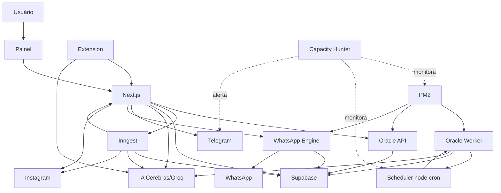

# PMAV5-001 — Estado Operacional Certificado

**Checkpoint:** CP-001

**Modo:** AUDIT

**Data:** 13/07/2026

**Branch:** `codex/pmav5-architecture-unification`

**SHA de inspeção:** `c55bee1b7f32774e52f2d68d1d5feaf79f06d17b`

**Governança:** PMAV5 V1.0

**Escopo:** leitura, inspeção, mapeamento e documentação; nenhuma execução operacional.

## 1. Resumo Executivo

O ecossistema não possui autoridade operacional única aplicada ponta a ponta. O estado certificado é uma federação de orquestradores: PM2 governa o ciclo de vida dos processos Oracle; o próprio Oracle Worker governa seu Scheduler; Next.js governa painel, APIs e Server Actions; Inngest governa jobs assíncronos; Vercel Cron e GitHub Actions governam agendas e execução externas; a Extensão mantém um ingresso alternativo. Supabase é a persistência central compartilhada, mas as transições de negócio são decididas por múltiplos escritores.

O Oracle Worker observado pela auditoria anterior estava online sob PM2, em `SCRAPER_MODE=LOCAL` na VPS. Nessa combinação, ele não executa Discovery local: lê `draft` do Supabase, chama IA e promove ofertas. O mesmo módulo contém execução imediata e `node-cron` a cada quatro horas. `noOverlap: true` protege apenas execuções agendadas dentro de uma instância; não há lock distribuído, timeout global ou política global de retry certificada.

Next.js concentra as responsabilidades pretendidas de painel, curadoria, IA e publicação, mas também mantém Discovery, mutações diretas de estado e caminhos que auto-selecionam ofertas durante a publicação. Inngest executa seis funções registradas, incluindo Discovery e IA sem gate uniforme de `selected`. A Extensão insere `approved`, chama Groq e publica diretamente. Logo, o runtime não corresponde integralmente à Arquitetura Oficial V5.

Foram certificados por evidência estática cinco endpoints Oracle API e 27 arquivos de rota Next.js, sendo a rota Inngest responsável por `GET`, `POST` e `PUT`. A ativação produtiva atual de Next.js/Vercel, Inngest, Extensão, Vercel Cron e GitHub Actions permanece **NÃO CERTIFICADO**. O esquema declarado do banco foi mapeado; o esquema efetivamente implantado não foi consultado e permanece **NÃO CERTIFICADO**.

## 2. Base, método e limites da certificação

Fontes integrais: Constituição, README, Governança, Arquitetura Atual, Arquitetura Oficial, Autoridades, Contratos, Máquina de Estados, Princípios, Checkpoints, Dependências, ADRs, Changelog, Critérios, Sprint PMAV5-000, todos os arquivos em `PMAV5/AUDITORIAS` e a auditoria sistêmica de 13/07/2026. `PMAV5/AUDITORIAS` continha apenas `.gitkeep` antes desta Sprint.

Método: inspeção estática do repositório no SHA indicado; busca de pontos de entrada, rotas, agendadores, flags, providers, escritores Supabase e integrações; consolidação das observações de runtime registradas na auditoria anterior. Não foram executados build, testes funcionais, migrations, scraping, Discovery, IA, publicação, deploy, conexão ao banco, consulta ao Oracle, comandos PM2/systemd/cron produtivos ou qualquer mutação de ambiente.

Limite constitucional encontrado: `PMAV5/13_PROTOCOLO_OPERACIONAL.md`, citado pela Constituição, não existe. Resultado: **NÃO CERTIFICADO** quanto à sequência operacional complementar; a ausência não interrompe AUDIT.

## 3. Estado Operacional Certificado — processos

| Processo/componente | Responsabilidade atual | Origem e inicialização | Consumidores | Dependências | Estado | Autoridade real | Classificação |
|---|---|---|---|---|---|---|---|
| Next.js | painel, autenticação, APIs, Discovery, curadoria, IA e publicação | `next dev/start`; Node/Vercel | usuário, Extensão, cron, Inngest | Supabase, Oracle API, Groq e canais | código implantável; produção não comprovada | App Router, rotas e Server Actions | ATIVO-CAPAZ |
| Painel Next.js | revisão, seleção, rejeição e disparos | requisição autenticada | curadores | Next.js e Supabase | ativação produtiva não comprovada | usuário + Server Actions | ATIVO-CAPAZ |
| Oracle Worker | ciclo de scraping, drafts, IA, links, posts e estados | PM2 → `scripts/oracle-scraper.cjs` | Supabase; fluxo de ofertas | providers, Supabase, Cerebras/Groq | online observado na auditoria anterior | `runScrapingCycle()` | ATIVO |
| Scheduler do Worker | execução imediata e ciclo de quatro horas | criado no bootstrap do Worker | Oracle Worker | `node-cron`, processo PM2 | ativo enquanto a instância estiver ativa | próprio Worker | ATIVO |
| Oracle API | gateway de scraping e pipelines de marketplace | PM2 → Express `:3002` | Next.js e scripts | Oracle Worker importado, Scrape.do, Scrapfly, Rakuten | online observado | rotas Express | ATIVO |
| WhatsApp Engine | sessão Baileys e transporte WhatsApp | PM2 → Express `:3001` | APIs/ações Next.js | Baileys, Supabase e WhatsApp | online observado | transporte técnico | ATIVO |
| PM2 God | manter três processos Node | daemon PM2; origem do daemon não provada | Worker, API, Engine | host Oracle | ativo observado | ciclo de vida de processos | ATIVO |
| `pm2-ubuntu.service` | `pm2 resurrect` no boot | systemd | PM2 | dump PM2 | habilitado e inativo na inspeção anterior | startup técnico | NÃO CERTIFICADO |
| Capacity Hunter | monitorar host, OCI, PM2, Scheduler e SHA | systemd timer a cada cinco minutos | operador/Telegram | Node, PM2, metadata OCI, Git | timer ativo observado | monitoramento somente leitura | ATIVO |
| Inngest | jobs de publicação, stub, analytics, Discovery/IA, tracking e polling | `/api/inngest`, eventos e cron | Next.js e plataformas externas | Inngest, Supabase, Groq e Instagram | registro estático; serviço externo não comprovado | funções registradas | ATIVO-CAPAZ |
| Vercel Cron | polling de comentários | `vercel.json`, diário 00:00 UTC | rota Instagram | Vercel, Next.js | configurado; execução não comprovada | plataforma Vercel | ATIVO-CAPAZ |
| `/api/scraper/cron` | emitir `cron/run-scraping` por usuário | HTTP externo | Inngest | CRON_SECRET, Supabase | chamador/schedule não encontrado | rota Next.js | ÓRFÃO |
| GitHub Actions | renderizar/publicar Reel e atualizar estados | `workflow_dispatch` | Instagram | GitHub, Supabase, Remotion, Instagram | configurado; histórico não comprovado | workflow | ATIVO-CAPAZ |
| Extensão Chrome | extrair produto e solicitar IA/publicação | clique do usuário | API pública de extensão | Chrome, Next.js, Supabase, Groq e canais | instalação/uso não comprovado | cliente externo + rota privilegiada | ATIVO-CAPAZ |
| Supabase | dados, autenticação, sessões, Storage e telemetria | serviço externo | todos os fluxos principais | esquema/RLS/serviço gerenciado | central; schema produtivo não consultado | persistência, não decisão | ATIVO |
| `ai-processor.cjs` | IA e promoção manual por CLI | execução manual | operador | Oracle Worker e Supabase | launcher automático não encontrado | script manual | LEGADO |
| `local-scraper.cjs` e scripts de manutenção | scraping, backfill, limpeza e diagnóstico | CLI/manual | operador | variáveis locais e serviços | executáveis; launcher não encontrado | scripts individuais | ATIVO-CAPAZ |
| cron sistêmico | agendas do host | sistema operacional | processos locais | cron | `crontab` do usuário vazio; inventário global incompleto | sistema operacional | NÃO CERTIFICADO |

## 4. Oracle Worker

### Inicialização, agenda e frequência

- Quem inicia o processo: PM2 God, conforme snapshot da auditoria anterior.
- Quem iniciou o PM2 God atual: **NÃO CERTIFICADO**.
- Ponto de entrada: `scripts/oracle-scraper.cjs:5936` sob `require.main === module`, salvo `ORACLE_SCRAPER_DISABLE_AUTORUN=1`.
- Execução imediata: `runScrapingCycle()` em `scripts/oracle-scraper.cjs:5973`.
- Agenda: `CRON_SCHEDULE = '0 */4 * * *'` em `scripts/oracle-scraper.cjs:58`.
- Scheduler: `node-cron`, timezone `America/Sao_Paulo`, nome `oracle-scraper-v2`.
- Frequência: a cada quatro horas, além da execução imediata no bootstrap.

### Proteções e concorrência

| Controle | Certificação |
|---|---|
| Proteção local | `noOverlap: true` nas invocações do job `node-cron` |
| Lock distribuído | NÃO CERTIFICADO; nenhum lock/lease distribuído encontrado |
| Execução imediata vs. job | a execução imediata ocorre fora do callback protegido; exclusão mútua entre ambas não está certificada |
| Múltiplas instâncias | proteção não atravessa processos/hosts; unicidade depende de PM2/host |
| Retry global do ciclo | NÃO CERTIFICADO; não há política global uniforme em `runScrapingCycle()` |
| Timeout global do ciclo | NÃO CERTIFICADO; não há deadline global no ciclo |
| Timeouts internos | existem timeouts pontuais de providers, mas não constituem garantia global |
| Concorrência interna | lojas são iteradas sequencialmente; operações internas e serviços externos possuem concorrência localizada |

### Fluxo real de `runScrapingCycle()`

1. Determina `process.platform` e `SCRAPER_MODE`, cujo default é `LOCAL`.
2. Em `LOCAL` + Windows: atualiza heartbeat, executa `scrapeStore()` por marketplace, busca `draft`, combina candidatos e chama `processTopOffers()`.
3. Em `LOCAL` + Linux/VPS: verifica heartbeat do notebook, busca `draft` no Supabase e chama `processTopOffers()`; não executa Discovery local.
4. Em `ORACLE` ou `AUTO`: executa `scrapeStore()` e chama `processTopOffers()` na mesma máquina.
5. `processTopOffers()` filtra por score, chama IA, cria links, cria três posts `draft` e grava oferta `approved`, sem gate global de `selected`.
6. Registra métricas em `integration_logs` e encerra o ciclo.

Entradas: agenda, modo/plataforma, flags, marketplaces, heartbeat e ofertas `draft`. Saídas: ofertas `pending_manual_review` em persistores V5 específicos; candidatos; links; posts `draft`; ofertas `approved`; logs e métricas. Consumidores: Supabase/painel e fluxos de publicação. Classificação de conformidade: **NÃO CONFORME** com a autoridade Discovery-Only.

## 5. Oracle API

| Endpoint | Entrada/consumidor | Dependências | Efeito colateral/classificação |
|---|---|---|---|
| `POST /api/scrape` | URL + token; usado por `src/lib/affiliates/scraper.ts`, `src/lib/publish/scraper.ts` e scripts | Scrape.do para Amazon; Scrapfly para demais; Cheerio; normalização | retorna HTML/texto normalizado; não persiste diretamente; bloqueia vários marketplaces em `LOCAL` Linux |
| `POST /api/shopee/trends` | Next.js scraper | funções importadas do Worker | com `SHOPEE_DISCOVERY_V5=true`, executa V5 com `persist:true`; caso contrário usa EPIC 09 |
| `POST /api/shopee/product` | Next.js scraper | EPIC 09 via módulo Worker | varre candidates e retorna produto correspondente; sem escrita explícita na rota |
| `POST /api/netshoes/trends` | Next.js scraper | Rakuten via módulo Worker | retorna produtos; efeitos internos dependem da função importada |
| `POST /api/amazon/trends` | consumidores potenciais | nenhuma | responde 403; legado desativado |

Autenticação: comparação direta do token com `ORACLE_API_KEY`. Inicialização: Express na porta 3002. A API importa `oracle-scraper.cjs`, mas a guarda `require.main` impede iniciar o Scheduler no processo API. Não há IPC, fila ou socket com o processo Worker. A rota Shopee V5 persiste por função compartilhada, ultrapassando o papel de gateway técnico. Classificação: **NÃO CONFORME**.

## 6. Next.js

Responsabilidades certificadas atuais:

| Domínio | Responsabilidade real | Evidência/classificação |
|---|---|---|
| Discovery | trends, import, coupons e Inngest chamam scrapers e persistem | ativo; paralelo ao Worker |
| Curadoria | Server Actions selecionam/rejeitam `pending_manual_review` | ativo-capaz e alinhado parcialmente |
| IA | `/api/ai/generate`, trends, Inngest, Publish Express e Extensão usam Groq | múltiplos gates; nem todos exigem `selected` |
| Publicação | APIs/ações Telegram, WhatsApp, Instagram e Facebook; GitHub dispatch | autoridade fragmentada e persistência desigual |
| Painel | ofertas, publicação, canais, configurações e histórico | responsabilidade própria do Next.js |
| API | 27 arquivos de rota; HTTP, cron, webhook, Inngest e extensão | superfície mista de negócio e técnica |
| Server Actions | ofertas, publicação, links e analytics | mutações diretas Supabase presentes |

### Inventário das APIs Next.js

| Método | Rota |
|---|---|
| POST | `/api/ai/generate` |
| GET | `/api/auth/ml/callback` |
| GET | `/api/auth/ml/login` |
| POST | `/api/facebook/publish` |
| GET | `/api/images/og-test` |
| GET | `/api/images/proxy` |
| GET | `/api/images/whatsapp-premium` |
| GET | `/api/img` |
| GET, POST, PUT | `/api/inngest` |
| GET | `/api/instagram/poll-comments` |
| POST | `/api/instagram/publish` |
| POST | `/api/instagram/test` |
| POST | `/api/posts/bulk-reject` |
| POST | `/api/posts/reject` |
| POST, OPTIONS | `/api/publish/extension` |
| POST | `/api/scraper/coupons` |
| GET, POST | `/api/scraper/cron` |
| POST | `/api/scraper/import` |
| POST | `/api/scraper/trends` |
| GET | `/api/settings/audit` |
| GET, POST | `/api/settings/configs` |
| POST | `/api/settings/connection-test` |
| GET, POST, PUT | `/api/settings/users` |
| POST | `/api/telegram/publish` |
| POST | `/api/telegram/test` |
| GET, POST | `/api/webhooks/instagram` |
| POST | `/api/whatsapp/publish` |

Classificação: **PARCIALMENTE CONFORME**. Exerce as autoridades V5 pós-curadoria, porém também executa Discovery, bypasses de estado e mutações diretas.

## 7. PM2, systemd e cron

| Item | Resultado certificado |
|---|---|
| Processos PM2 observados | `oracle-scraper`, `oracle-api`, `whatsapp-bot`, todos online na auditoria anterior |
| Relação | três processos irmãos sob PM2 God; inicialização concorrente, sem ordem obrigatória |
| Startup do daemon atual | NÃO CERTIFICADO |
| `pm2-ubuntu.service` | habilitado, porém inativo no snapshot anterior; execução efetiva no boot não certificada |
| Restart/autorestart/watch | NÃO CERTIFICADO; não há `ecosystem.config` versionado e o snapshot consolidado não registrou esses atributos |
| Origem das definições | NÃO CERTIFICADO; scripts de update citam nomes, mas não provam a configuração corrente |
| Duplicidades | nenhuma duplicidade entre os três nomes no snapshot; ausência global e contínua não certificada |
| systemd Capacity Hunter | service `oneshot` + timer a cada cinco minutos; ativo observado |
| cron do usuário Ubuntu | vazio no snapshot anterior |
| cron sistêmico completo | NÃO CERTIFICADO |

PM2 é **PARCIALMENTE CONFORME**: atua como gerenciador técnico, mas origem e parâmetros operacionais não estão certificados. systemd do Capacity Hunter é **CONFORME** com monitoramento técnico. `pm2-ubuntu.service` e cron sistêmico são **NÃO CERTIFICADO**.

## 8. Scheduler

O Scheduler oficial real do Oracle Worker é interno ao próprio `scripts/oracle-scraper.cjs`. PM2 inicia o processo, mas não agenda ciclos. O bootstrap chama `runScrapingCycle()` imediatamente e registra o cron `0 */4 * * *`.

Fluxo completo: `PM2 → oracle-scraper.cjs → execução imediata + node-cron → runScrapingCycle() → escolha por SCRAPER_MODE/plataforma → Discovery ou leitura de drafts → processTopOffers() → Supabase/IA/posts/logs`. O Scheduler não chama canais diretamente, porém seu único alvo executa responsabilidades além de Discovery. Classificação: **NÃO CONFORME** com C-006.

O segundo agendamento relevante é `/api/scraper/cron → Inngest cron/run-scraping`; seu chamador externo não foi encontrado. O terceiro é Vercel Cron para polling Instagram. O quarto é o cron interno Inngest `*/5 * * * *` para comentários. Não existe Scheduler único.

## 9. Banco e escritores de estado

O esquema versionado declara ofertas em `draft`, `pending_manual_review`, `selected`, `approved`, `posted`, `rejected` e posts em `draft`, `published`, `failed`, `deleted`. A rota Instagram também usa `processing`, não aceito pelo schema versionado. A migration de reconciliação verifica o baseline, mas não prova que foi aplicada. Schema produtivo: **NÃO CERTIFICADO**.

| Estado | Escritores certificados no código |
|---|---|
| `draft` (oferta) | Discovery Next.js, defaults do schema, Worker legado e scripts de ingestão |
| `pending_manual_review` | persistores Shopee V5 e Mercado Livre V5 no Worker/API compartilhado |
| `selected` | Server Actions de curadoria e APIs Telegram/Instagram/WhatsApp que auto-selecionam pending |
| `approved` | Oracle `processTopOffers`, `/api/ai/generate`, Inngest, `ai-processor.cjs`, Extensão e Publish Express |
| `posted` | APIs Telegram/WhatsApp/Instagram e `scripts/github-publish.ts` |
| `rejected` | Server Actions, rotas de rejeição e scripts de limpeza |
| `posts:draft` | Oracle Worker, Next IA, Inngest, Publish Express e `ai-processor.cjs` |
| `posts:published` | APIs de canal, Facebook e GitHub Actions |
| `posts:processing` | rota Instagram antes do GitHub Actions; incompatibilidade produtiva não certificada |

Não foi encontrado serviço único de transições aplicado. Escritas ocorrem via clientes de sessão e service-role, sem transação global uniforme. Ocorrência produtiva concreta de corrida/duplicação: **NÃO CERTIFICADO**. Banco/Supabase: **PARCIALMENTE CONFORME**.

## 10. Feature Flags e seletores operacionais

“Valor efetivo” distingue default do código de valor observado. Não foram lidos segredos nem ambientes produtivos nesta Sprint.

| Flag/seletor | Leitor/uso | Valor efetivo certificado | Responsabilidade | Classificação |
|---|---|---|---|---|
| `SHOPEE_DISCOVERY_V5` | Worker, Oracle API e scraper Next | ausente no Oracle observado → `false`; Next/Vercel NÃO CERTIFICADO | escolhe V5 persistente ou EPIC 09 | ATIVO; define arquitetura/fallback |
| `AMAZON_NATIVE_TOP20_V5` | Worker | ausente no processo observado → `false` | habilita Amazon V5, que retorna sem persistir | ATIVO-CAPAZ |
| `SCORING_V2_ENABLED` | Worker | default `false`; runtime NÃO CERTIFICADO | alterna score/relatório V2 | ATIVO-CAPAZ |
| `ENABLE_NETSHOES_RAKUTEN` | Worker | default `true`, salvo valor `0`; runtime NÃO CERTIFICADO | habilita Netshoes/Rakuten | ATIVO-CAPAZ |
| `ENABLE_CURATION_ENGINE` | `curation-engine.ts` | default `false`; runtime NÃO CERTIFICADO | ativa curadoria por score | ATIVO-CAPAZ |
| `ENABLE_AI_CURATION` | `curation-engine.ts` | default `false`; runtime NÃO CERTIFICADO | ativa parcela de curadoria IA | ATIVO-CAPAZ |
| `ENABLE_HISTORICAL_SCORING` | `curation-engine.ts` | default `false`; runtime NÃO CERTIFICADO | incorpora histórico | ATIVO-CAPAZ |
| `ENABLE_CONVERSION_ENGINE` | `score-v2.ts` | default `false`; runtime NÃO CERTIFICADO | incorpora score de conversão | ATIVO-CAPAZ |
| `ENABLE_SHADOW_SCORING` | getter em `flags.ts` | default `false`; nenhum consumidor produtivo encontrado | shadow scoring | ÓRFÃO |
| `SCRAPER_MODE` | Worker e Oracle API | `LOCAL` na VPS observada | escolhe notebook/VPS/ORACLE/AUTO | ATIVO; seletor arquitetural |
| `ORACLE_SCRAPER_DISABLE_AUTORUN` | bootstrap Worker | default autorun; valor PM2 NÃO CERTIFICADO | kill switch do bootstrap | ATIVO-CAPAZ |
| `SKIP_STORES` | Worker | default vazio; runtime NÃO CERTIFICADO | desabilita marketplaces localmente | ATIVO-CAPAZ |
| `SHOPEE_OFFICIAL_ONLY` | pipeline Shopee | default `false`; runtime NÃO CERTIFICADO | restringe seleção ao fluxo oficial | ATIVO-CAPAZ |
| `SHOPEE_OFFICIAL_FORCE_ERROR` | pipeline Shopee | default `false`; runtime NÃO CERTIFICADO | injeção de falha controlada | ATIVO-CAPAZ |
| `LLM_DIAGNOSTIC` | Worker | default `false`; runtime NÃO CERTIFICADO | habilita diagnóstico local de LLM | ATIVO-CAPAZ |
| `COPY_ENGINE_MODE` | IA Next.js | default `full`; runtime NÃO CERTIFICADO | seleciona intensidade de copy | ATIVO-CAPAZ |
| `LLM_PROVIDER` / `LLM_FALLBACK` | Worker/core LLM | defaults `cerebras` / `groq`; auditoria confirmou este encadeamento | escolhe providers | ATIVO |
| `SEND_TELEGRAM_ALERTS` | Capacity Hunter | default `false`; ambiente do timer NÃO CERTIFICADO | envio de alertas | ATIVO-CAPAZ |
| `ENABLE_LOGS` | Capacity Hunter | default `true`; ambiente do timer NÃO CERTIFICADO | logs locais | ATIVO-CAPAZ |
| `cron_scraping_enabled` | `/api/scraper/cron`, armazenada em `app_settings` | banco produtivo NÃO CERTIFICADO | habilita eventos por usuário | ATIVO-CAPAZ |
| `ENABLE_CATEGORY_BALANCE` | Selection Engine interno | `true` hardcoded | limita distribuição por categoria | ATIVO |
| `ENABLE_SHOP_BALANCE` | Selection Engine interno | `true` hardcoded | limita distribuição por loja | ATIVO |
| `ENABLE_BRAND_BALANCE` | Selection Engine interno | `true` hardcoded | limita distribuição por marca | ATIVO |
| `ENABLE_PRICE_BALANCE` | Selection Engine interno | `true` hardcoded | limita distribuição por faixa de preço | ATIVO |

Não há configuração canônica única. Flags escolhem pipelines e fallbacks em runtimes diferentes. Conformidade do conjunto: **NÃO CONFORME** com ADR-010.

## 11. IA

| Caminho | Entrada/pré-condição real | Provider | Saída/consumidor | Classificação |
|---|---|---|---|---|
| Worker `processTopOffers` | candidates/drafts por score; não exige `selected` | Cerebras → fallback Groq | links, posts draft, oferta approved | ATIVO; bypass |
| `ai-processor.cjs` | CLI e itens do banco | funções do Worker | posts/approved | LEGADO |
| `/api/ai/generate` | oferta; gates manuais para marketplaces V5 | Groq | score, posts e possível approved | ATIVO-CAPAZ |
| trends Next.js | ofertas descobertas | chama `/api/ai/generate`/Groq | posts e estados | ATIVO-CAPAZ; automático |
| Inngest `run-user-scraping` | resultado de Discovery, sem gate selected | Groq | links, posts draft, possível approved | ATIVO-CAPAZ; bypass |
| Publish Express | ação do usuário; cria approved | Groq | copy para publicação | ATIVO-CAPAZ; bypass |
| Extensão | produto extraído; insere approved antes da IA | Groq | copy e publicação direta | ATIVO-CAPAZ; bypass |

Há sete caminhos de orquestração e dois motores principais. Não existe serviço único de IA nem gate `selected` uniforme. Classificação: **NÃO CONFORME**.

## 12. Publicação

| Canal/caminho | Quem publica | Quem altera estados/cria posts | Estado certificado |
|---|---|---|---|
| Telegram API | Next.js → Bot API | rota auto-seleciona pending, marca post published e oferta posted | ativo-capaz; autoridade Next parcial |
| WhatsApp API | Next.js → WhatsApp Engine/Baileys | rota auto-seleciona, marca published/posted; Engine transporta | Engine conforme como transporte; rota viola gate |
| Instagram com cupom | Next.js → Meta | rota auto-seleciona e marca published/posted | ativo-capaz; bypass |
| Instagram sem cupom/Reel | Next.js → GitHub Actions → Meta | rota marca processing; script GitHub marca published/posted | ativo-capaz; execução externa não comprovada |
| Facebook | Next.js → Meta | marca post published; oferta posted não certificada | ativo-capaz; persistência parcial |
| Publish Express | Server Actions | cria approved e posts; persistência por canal desigual | ativo-capaz; bypass |
| Extensão | rota chama canais diretamente | insere approved; posts persistidos e posted não encontrados | ativo-capaz; bypass |
| Inngest `post/publish` | `publisher.publish` | resultado do publisher; produtor interno do evento não encontrado | função ÓRFÃ/ativo-capaz |

Não existe confirmação/persistência uniforme nem serviço único de publicação aplicado. Classificação: **NÃO CONFORME**.

## 13. Inngest

| Função | Trigger/retry | Responsabilidade | Consumidor/produtor | Classificação |
|---|---|---|---|---|
| `publish-post` | `post/publish`, 3 retries | chama `publisher.publish` | produtor interno não encontrado | ÓRFÃO |
| `process-offer` | `offer/process`, 2 retries | TODO/stub; retorna processed | produtor não encontrado | ÓRFÃO |
| `sync-analytics` | `analytics/sync` | insere venda | produtor externo esperado; não certificado | ATIVO-CAPAZ |
| `run-user-scraping` | `cron/run-scraping`, 1 retry | Discovery, ranking, IA e estados | `/api/scraper/cron` produz; chamador da rota não encontrado | LEGADO |
| `process-click-tracking` | `tracking/click.registered`, 3 retries | evento de clique + contador legado | rota `/go/[...subId]` produz | ATIVO-CAPAZ |
| `instagram-polling` | cron `*/5 * * * *`, 1 retry | polling/DM Instagram | Scheduler Inngest | ATIVO-CAPAZ |

As seis funções estão registradas em `/api/inngest`; ativação do serviço externo é **NÃO CERTIFICADO**. `run-user-scraping` exerce governança paralela e muta estados diretamente. Conformidade do componente: **NÃO CONFORME**.

## 14. Extensão

Fluxo: clique no popup → `content.js` extrai título/preço/imagem/URL → `popup.js` envia para a URL Vercel fixa → `/api/publish/extension` usa service-role → procura usuário de sessão ou adota o primeiro `user_id` existente → valida/deduplica → insere oferta `approved` → cria links → chama Groq → publica Telegram/WhatsApp/Instagram diretamente.

Responsabilidade declarada no manifest: extração de produtos Magalu. Integrações: Chrome scripting, endpoint público CORS `*`, Supabase service-role no servidor, Groq e três canais. Instalação/uso atual: **NÃO CERTIFICADO**. O fluxo ignora `pending_manual_review`, `selected`, serviço único de IA/publicação e identidade autenticada obrigatória. Classificação: **NÃO CONFORME**.

## 15. Capacity Hunter

Finalidade: monitor `oneshot` read-only de CPU, RAM, disco, uptime, metadata OCI, PM2, reinícios, duplicidades, contagem do Scheduler e SHA Git; mantém somente estado local de cooldown/relatório e pode enviar alertas Telegram.

Inicialização: `oracle-capacity-hunter.timer` → `oracle-capacity-hunter.service` → `/usr/bin/node src/index.js --run`, usuário `ubuntu`, a cada cinco minutos em `America/Sao_Paulo`. Dependências: systemd, Node, PM2, metadata OCI, Git, filesystem local e Telegram opcional. Impacto: observabilidade; não inicia/reinicia processos, não altera OCI e não chama marketplaces/IA. Timer ativo foi observado na auditoria anterior. Classificação: **CONFORME**.

## 16. Matriz de Evidências

| ID | Conclusão | Evidência objetiva | Resultado |
|---|---|---|---|
| E-001 | Worker executa imediatamente e agenda 4h | `oracle-scraper.cjs:58,5936,5973-5977` | CERTIFICADO |
| E-002 | proteção é local | `noOverlap:true`; ausência de lock compartilhado | CERTIFICADO |
| E-003 | Worker ainda chama IA e approved | `processTopOffers:3174-3295` | CERTIFICADO |
| E-004 | VPS LOCAL lê drafts | `runScrapingCycle:4564-4603`; auditoria de runtime | CERTIFICADO |
| E-005 | Oracle API possui cinco endpoints | `oracle-api.cjs:44-241` | CERTIFICADO |
| E-006 | API Shopee pode persistir | `oracle-api.cjs:159-173`, `persist:true` | CERTIFICADO |
| E-007 | Next.js possui 27 arquivos de rota | inventário `src/app/api/**/route.ts` | CERTIFICADO |
| E-008 | publicação auto-seleciona | rotas Telegram, Instagram e WhatsApp | CERTIFICADO |
| E-009 | múltiplos escritores | buscas de `status` em `src`, `scripts`, workflow | CERTIFICADO |
| E-010 | schema versionado não aceita processing | `supabase/schema.sql:28,66`; Instagram route | CERTIFICADO |
| E-011 | schema implantado | nenhuma consulta ao banco autorizada | NÃO CERTIFICADO |
| E-012 | sete caminhos IA | Worker, script, rota IA, trends, Inngest, Express e Extensão | CERTIFICADO |
| E-013 | seis funções Inngest registradas | `src/app/api/inngest/route.ts` e functions/tracking | CERTIFICADO |
| E-014 | Extensão bypassa estados | `publish/extension/route.ts:46-210` | CERTIFICADO |
| E-015 | Capacity Hunter é oneshot 5 min | units systemd e `src/index.js` | CERTIFICADO |
| E-016 | três processos PM2 online | auditoria sistêmica de 13/07/2026 | CERTIFICADO |
| E-017 | origem/config PM2 | nenhum ecosystem versionado; snapshot incompleto | NÃO CERTIFICADO |
| E-018 | ativação Next/Inngest/Extensão | sem evidência de runtime atual | NÃO CERTIFICADO |
| E-019 | Vercel Cron diário | `vercel.json` | ATIVO-CAPAZ |
| E-020 | GitHub Reel por dispatch | `.github/workflows/publish-reel.yml` | ATIVO-CAPAZ |
| E-021 | protocolo operacional complementar | arquivo `PMAV5/13_PROTOCOLO_OPERACIONAL.md` ausente | NÃO CERTIFICADO |

## 17. Matriz de Dependências

| Componente | Depende de | Consumido por | Falha/efeito certificado |
|---|---|---|---|
| Oracle Worker | PM2, Supabase, providers, Cerebras/Groq | painel/banco/publicação | para ciclo ou deixa drafts/estados parciais conforme etapa |
| Scheduler | processo Worker e node-cron | Worker | ausência elimina ciclo; duplicação pode duplicar execução |
| Oracle API | PM2, providers, módulo Worker | Next.js | scraping remoto falha |
| Next.js | Vercel/Node, Supabase, Oracle API, Groq, canais | usuário/Extensão/cron | painel e integrações ficam indisponíveis |
| PM2 | host e configuração não certificada | três processos Oracle | ponto único do host para esses processos |
| Supabase | serviço gerenciado e schema | todos os fluxos | ponto central de dados/autenticação |
| Inngest | endpoint Next, serviço Inngest, Supabase | cron/tracking/jobs | jobs não executam ou repetem conforme retry |
| Telegram | Bot API e credenciais | publicadores/Capacity Hunter | envio/alerta falha |
| WhatsApp | Engine, sessão Baileys, destino | Next.js | canal indisponível |
| Instagram | Meta, token, GitHub para Reels | Next.js/Inngest | publicação/polling falha |
| Extensão | Chrome, URL fixa Vercel, rota pública | usuário | ingresso alternativo indisponível |
| Capacity Hunter | systemd, PM2, Git, metadata, Telegram | operador | perda de observabilidade, não de negócio |

## 18. Matriz de Conformidade

| Componente | Requisito V5 | Estado | Evidência resumida |
|---|---|---|---|
| Oracle Worker | Discovery-Only, termina pending | NÃO CONFORME | chama IA, cria posts e approved |
| Oracle API | gateway sem estado/Discovery governante | NÃO CONFORME | Shopee V5 com `persist:true` |
| Next.js | curadoria, IA e publicação | PARCIALMENTE CONFORME | exerce papel, mas também Discovery/bypasses |
| Scheduler | somente Discovery do Worker | NÃO CONFORME | dispara função que executa IA/estados |
| PM2 | gerência técnica apenas | PARCIALMENTE CONFORME | papel técnico; config/origem não certificadas |
| systemd Capacity Hunter | monitor técnico | CONFORME | oneshot read-only a cada cinco minutos |
| Supabase/banco | estado central com transição oficial | PARCIALMENTE CONFORME | central, porém múltiplos escritores diretos |
| IA | somente selected, serviço único | NÃO CONFORME | sete caminhos e bypasses |
| Publicação | approved + draft, serviço único | NÃO CONFORME | múltiplos publicadores e auto-seleção |
| Inngest | executor delegado | NÃO CONFORME | Discovery/IA/estado autônomos |
| Extensão | cliente autenticado de entrada pending | NÃO CONFORME | approved + IA + publicação direta |
| WhatsApp Engine | transporte técnico | CONFORME | sessão/envio; não decide oferta |
| Capacity Hunter | observabilidade sem governança | CONFORME | monitora e alerta somente |
| Feature Flags | não definir arquitetura | NÃO CONFORME | selecionam V5/legado/modos |
| Vercel/GitHub runtimes | execução delegada comprovada | NÃO CERTIFICADO | configuração estática sem atividade atual |
| cron sistêmico | inventário completo | NÃO CERTIFICADO | apenas crontab do usuário foi observado |

## 19. Matriz de Riscos

| Risco certificado | Probabilidade | Impacto | Evidência/estado |
|---|---|---|---|
| múltiplos escritores e saltos de estado | alta | crítico | código em Worker, Next, Inngest, Extensão e scripts |
| IA antes de selected | alta | alto | Worker/Inngest/Extensão/Express |
| publicação duplicada ou estado parcial | média/alta | crítico | publicadores e persistência não uniformes |
| Scheduler duplicado entre instâncias | não certificada | alto | lock somente local |
| fallback Shopee legado | alta no snapshot | alto | flag ausente → EPIC 09 |
| Amazon V5 sem persistência | alta quando habilitada | médio | retorno vazio após Discovery |
| status Instagram `processing` incompatível | não certificada em produção | alto | schema versionado não inclui valor |
| PM2 não restaurar no boot | não certificada | crítico | origem/startup do daemon não provados |
| Extensão escolher usuário indevido | média se usada sem sessão | crítico | fallback para primeiro `user_id` |
| Inngest ativo externamente sem inventário | não certificada | alto | funções implantáveis, runtime não consultado |
| dependência concentrada no Supabase | alta | crítico | todos os fluxos principais dependem dele |
| ausência de protocolo operacional 13 | certa | médio documental | arquivo ausente |

## 20. Grafo Operacional

## 21. Certificação Final

### Componentes conformes

- Capacity Hunter.
- systemd service/timer do Capacity Hunter.
- WhatsApp Engine no limite estrito de transporte técnico.

### Componentes parcialmente conformes

- Next.js.
- PM2.
- Supabase/banco como persistência central.

### Componentes não conformes

- Oracle Worker.
- Oracle API.
- Scheduler do Worker.
- IA.
- Publicação.
- Inngest.
- Extensão.
- Feature Flags e seletores arquiteturais distribuídos.
- GitHub Actions enquanto escritor direto de estados.

### Componentes não certificados

- Origem e startup efetivo do PM2 God/`pm2-ubuntu.service`.
- `autorestart`, `watch`, restart policy e origem integral das definições PM2.
- Ativação produtiva atual de Next.js/Vercel, Inngest, Extensão, Vercel Cron e GitHub Actions.
- Atividade atual do notebook e execução atual do Mercado Livre V5.
- Chamador externo de `/api/scraper/cron`.
- cron sistêmico completo.
- esquema/banco efetivamente implantado, inclusive aceitação de `processing`.
- valores produtivos das flags não observadas na auditoria anterior.
- `PMAV5/13_PROTOCOLO_OPERACIONAL.md`.

## 22. Declaração de escopo

Esta certificação não propõe correções. Nenhuma alteração funcional, operacional, de ambiente, banco, Oracle, PM2, Scheduler, produção, scripts, `.env`, `.env.local`, IA, publicação, deploy, build ou migration foi realizada.
