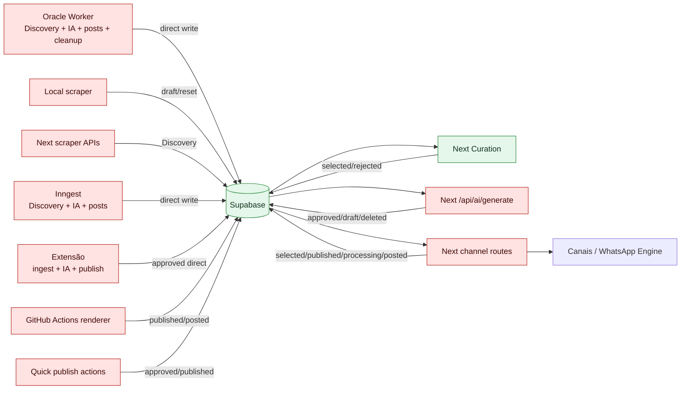
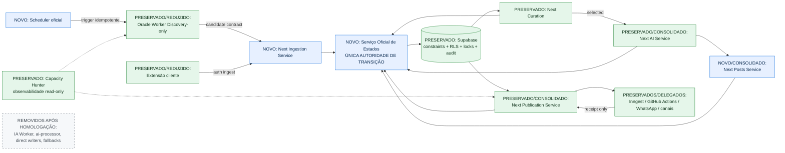

# PMAV5-002 — Certificação do Pipeline Compartilhado e Plano Oficial de Migração

## 1. Identificação

| Campo | Valor |
|---|---|
| Modo | `AUDIT` |
| Data | 2026-07-13 |
| Branch | `codex/pmav5-architecture-unification` |
| SHA inicial | `43976b70a7e10d9e3a0475a14dc948b5bcc622e6` |
| Escopo | Discovery → Persistence → Curation → AI → Posts → Publication → estados finais |
| Resultado | Pipeline atual reconstruído; conflitos certificados; arquitetura final e migração oficial consolidadas |
| Alteração funcional, operacional ou de produção | Nenhuma |

Esta auditoria é documental e estática. Não executa scraping, IA, publicação, banco, migration, build, deploy ou runtime. A ativação externa não observável no repositório permanece `NOT CERTIFIED`. O documento `PMAV5/13_PROTOCOLO_OPERACIONAL.md` não existe no SHA auditado e permanece `NOT CERTIFIED`; a ausência não bloqueia o modo `AUDIT`.

## 2. Fontes e método

Foram confrontados Constituição, arquiteturas atual e alvo, autoridades, contratos, máquina de estados, princípios, checkpoints, dependências, ADRs, critérios, protocolo LLM, changelog, PMAV5-001 e implementação versionada. A busca cobriu produtores, consumidores e mutações de `offers.status` e `posts.status` em `src/`, `scripts/` e `.github/`. Evidência de código demonstra capacidade versionada, não ativação produtiva.

## 3. Veredito executivo

O pipeline compartilhado atual é **federado e concorrente**. Oracle Worker, Next.js, Inngest, Extensão e scripts operacionais conseguem executar segmentos sobrepostos; vários deles escrevem diretamente no Supabase. Não há uma autoridade técnica única aplicada às transições. A máquina normativa existe, porém é contornada por inserções em `approved`, promoções automáticas no momento da publicação, reset de ofertas para `draft`, deleções físicas e escritas finais separadas.

A arquitetura final já definida pelo PMAV5 é coerente e deve ser implementada sem criar um segundo orquestrador:

- Oracle Worker: única autoridade de Discovery e produtor de `pending_manual_review`.
- Next.js: autoridade de Curation, IA, Posts e Publication.
- Serviço Oficial de Estados, dentro do domínio Next.js: única porta para transições de `offers.status` e `posts.status`.
- Supabase: persistência, constraints, RLS, idempotência e trilha de auditoria; não orquestra negócio.
- Scheduler oficial: apenas dispara Discovery no Worker.
- Inngest, GitHub Actions, WhatsApp Engine e canais: executores/transportes delegados, sem autoridade de estado.
- Extensão: cliente autenticado de ingestão, sem IA, publicação ou persistência direta.
- Oracle API: gateway, sem persistência ou decisão de negócio.
- Capacity Hunter: observabilidade, sem ação sobre o pipeline.

## 4. Pipeline atual certificado

### 4.1 Fluxo nominal e desvios

| Etapa | Fluxo nominal observado | Autoridades paralelas/desvios | Estado produzido |
|---|---|---|---|
| Discovery | `scripts/oracle-scraper.cjs` e `src/lib/affiliates/scraper.ts` coletam e persistem | local scraper, rotas Next de trends/coupons, Inngest e Extensão | `draft`, `pending_manual_review` ou diretamente `approved` |
| Persistence | Clientes Supabase espalhados | service role, sessão, admin e fallback de usuário | escrita direta sem serviço único |
| Curation | Server actions selecionam/rejeitam marketplaces manuais | rotas de publicação promovem `pending_manual_review → selected` implicitamente | `selected` ou `rejected` |
| AI | `/api/ai/generate` | Oracle, `ai-processor`, Inngest, quick post, Extensão | `approved`; posts `draft` |
| Posts | rota de IA cria posts por canal | Oracle, `ai-processor`, Inngest, backfill e publish action | `draft`, `deleted`, `published`, `processing` |
| Publication | rotas Next por canal | Extensão, GitHub Actions, generic publisher e actions diretas | `published`, `processing`; oferta `posted` em parte dos fluxos |
| Finalização | post e oferta atualizados em sequência | Facebook não finaliza oferta; Extensão não registra final; falhas não são uniformizadas | estados finais divergentes |

### 4.2 Grafo atual

### 4.3 Matriz dos múltiplos caminhos

| Domínio | Caminhos existentes | Autoridade real hoje | Duplicidade, atalho ou bypass |
|---|---|---|---|
| Discovery | Oracle Worker; `local-scraper`; Next trends/coupons; Inngest `runUserScrapingBackground`; Extensão; cadastro/link manual | nenhuma autoridade técnica exclusiva | cinco produtores persistentes; Extensão e manual saltam estados |
| AI | Next `/api/ai/generate`; Oracle `processTopOffers`; `ai-processor`; Inngest scraping; Extensão; `generateQuickPostAction`; `publishAutomatedOfferAction` experimental | Next é autoridade normativa, mas não exclusiva no código | sete implementações/caminhos, gates e efeitos diferentes |
| Publication | rotas Next Telegram/WhatsApp/Instagram/Facebook; publish actions; Extensão; GitHub script; Inngest generic publisher; automated experimental | Next é autoridade normativa, porém execução/finalização é distribuída | canais finalizam estados de modos diferentes; caminhos sem posts ou sem `posted` |
| Persistence | clientes Supabase de Next; service role de Oracle/scripts/Inngest/Extensão/GitHub; default do schema | Supabase centraliza dados, não comandos | credenciais e regras espalhadas; nenhum gateway único de estado |
| Curation | server actions por marketplace; promoção implícita nas rotas de publicação | Next UI deveria governar | publicação transforma pendente em selecionada sem decisão humana |
| Estados | actions/rotas Next; Oracle; Inngest; Extensão; scripts legados/manutenção; GitHub script | governança documental, não enforcement técnico | direct writers, ausência de CAS uniforme e statements não atômicos |

### 4.4 Matriz de escrita direta no banco

| Componente | Tabelas compartilhadas escritas | Mecanismo | Classificação |
|---|---|---|---|
| Oracle Worker | `offers`, `posts`, `affiliate_links` | cliente Supabase com credencial operacional | Official parcial + Legacy |
| Next actions/APIs | `offers`, `posts`, `affiliate_links`, logs relacionados | cliente por sessão/admin | Official fragmentado + Parallel |
| Inngest | `offers`, `posts`, tracking/analytics | cliente criado no executor | Parallel |
| Extensão endpoint | `offers` | cliente admin/service role | Parallel |
| GitHub publication script | `posts`, `offers` | service role no workflow | Parallel |
| `local-scraper` / `ai-processor` | `offers`, `posts`, `affiliate_links` | scripts com service role | Legacy |
| backfill/sanitize/panel cleanup | `offers`, `posts`, `affiliate_links` | scripts confirmados por flags | Maintenance |
| transportes externos, Oracle API e Capacity Hunter | nenhuma escrita de estado localizada | consumo/telemetria | Consumer |

## 5. Matriz exaustiva de escritores de `offers.status`

`Pré` indica condição de entrada aplicada pelo escritor; `Pós` é o estado pretendido. “Sem CAS” significa ausência de compare-and-set/condição sobre o estado anterior.

| Classe | Componente / arquivo / função | Motivo | Pré → Pós | Concorrência, bypass e observação |
|---|---|---|---|---|
| Official atual | `src/lib/offers/actions.ts` / `updateShopeeManualStatus`, `selectMercadoLivreOfferAction`, `rejectMercadoLivreOfferAction`, equivalentes Amazon | curadoria manual | `pending_manual_review → selected/rejected` | autenticação e filtros de usuário/plataforma/estado; escrita ainda direta, fora do serviço oficial futuro |
| Parallel | `src/app/api/{telegram,whatsapp,instagram}/publish/route.ts` / `POST` + `prepareOfferForPublication` | tornar oferta publicável durante publish | `pending_manual_review → selected` | curadoria implícita; sem decisão humana; update filtra id/user/status e confirma retorno, mas concorre com rejeição |
| Parallel | mesmas rotas Telegram/WhatsApp | finalizar publicação | qualquer estado carregado → `posted` | update separado do post e sem CAS; publicação externa já ocorreu; falha parcial possível |
| Parallel | rota Instagram, ramo cupom | finalizar publicação | qualquer estado carregado → `posted` | duas escritas separadas; ramo assíncrono não conclui oferta localmente |
| Parallel | `scripts/github-publish.ts` / `main` | callback de publicação Instagram | qualquer → `posted` | service role, sem escopo por usuário/estado, separado de `posts.published` |
| Parallel | `src/app/api/ai/generate/route.ts` / `POST` | aprovação por score IA | estado lido → `approved` se score ≥ 7; caso contrário preserva | gates apenas Shopee/ML/Amazon; sem CAS; IA e posts não atômicos |
| Parallel | `src/lib/inngest/functions.ts` / `runUserScrapingBackground` | Discovery + score + IA | novo `draft`; depois `draft → approved` por score | replica o pipeline Next; sem CAS/transação |
| Legacy | `scripts/oracle-scraper.cjs` / `upsertOffer`, `processTopOffers` | ingestão e aprovação no Worker | novo `draft → approved` | Worker acumula Discovery, IA e estados; posts/offer separados |
| Official futuro / atual incompatível | `scripts/oracle-scraper.cjs` / `persistMercadoLivreNativeTop20`, `persistShopeeNativeTop20` | Discovery nativa | novo/upsert → `pending_manual_review` | destino correto, mas Shopee upsert pode sobrescrever estado existente se conflito não for bloqueado no banco |
| Legacy | `scripts/oracle-scraper.cjs` / `cleanupOldDrafts` | faxina | `draft → registro removido` | deleção física; contorna estados finais e pode concorrer com IA |
| Legacy | `scripts/local-scraper.cjs` / `upsertDraftOffer` | ingestão/reprocessamento | novo → `draft`; preço alterado → `draft` | pode regredir estado de oferta existente; sem serviço de estados |
| Parallel | `src/lib/affiliates/scraper.ts` / `discoverAndIngestCoupons`, `discoverAndIngestTrendingOffers` | Discovery Next | novo → `draft`; alterada → `draft` | reset pode regredir estado final; fallback de admin em caminho trending |
| Parallel | `src/app/api/publish/extension/route.ts` / `POST` | ingestão pela extensão | inexistente → `approved` | bypassa `pending_manual_review`, curadoria e serviço de estados; service role/fallback de usuário |
| Experimental | `src/lib/publish/actions.ts` / `generateQuickPostAction` | publicação rápida | inexistente → `approved` | bypass completo; ação exposta à UI de publicação |
| Parallel | `src/lib/offers/actions.ts` / `generateAffiliateLinkAction` ramo `manual` | criar oferta a partir de link | inexistente → `approved` | preço zero; bypass de Discovery/Curation/IA |
| Official atual | `src/lib/offers/actions.ts` / `createOfferAction` | cadastro manual | inexistente → default `draft` | status vem do default do schema; entrada alternativa a Discovery |
| Legacy | `scripts/ai-processor.cjs` / `runAiProcessorCycle` | IA legada | `draft → approved` | apaga posts draft e recria; service role; concorre com Oracle/Next/Inngest |
| Maintenance | `scripts/sanitize-posts-integrity.cjs` / `rejectOffers` | saneamento | vários → `rejected` | dry-run por padrão; escrita em lote com confirmação explícita; sem serviço oficial |
| Maintenance | `scripts/panel-cleanup-apply.cjs` / `main` | limpeza do painel | vários → `rejected` | exige `APPLY_CLEANUP=1` e `DRY_RUN=false`; escrita em lote |

Não foram encontrados escritores de `offers.status` no webhook Instagram, tracking de cliques, analytics, polling de comentários, Oracle API gateway, Capacity Hunter ou generic publisher; são consumidores/auxiliares.

## 6. Matriz exaustiva de escritores de `posts.status`

| Classe | Componente / arquivo / função | Motivo | Pré → Pós | Concorrência, bypass e observação |
|---|---|---|---|---|
| Official atual | `src/app/api/ai/generate/route.ts` / `POST` | substituir copies e criar posts | `draft → deleted`; inexistente → `draft` | marca antigos antes de inserir; sem transação; falha pode deixar canais ausentes |
| Parallel | `src/lib/inngest/functions.ts` / `runUserScrapingBackground` | pipeline IA paralelo | `draft → deleted`; inexistente → `draft` | duplica rota de IA; sem idempotência transacional |
| Legacy | `scripts/oracle-scraper.cjs` / `processTopOffers` | geração de posts | `draft → registro removido`; inexistente → `draft` | deleção física e inserção; depois oferta aprovada separadamente |
| Legacy | `scripts/ai-processor.cjs` / `runAiProcessorCycle` | geração legada | `draft → registro removido`; inexistente → `draft` | mesma colisão do Worker |
| Official atual | rotas Telegram/WhatsApp | publicação concluída | qualquer post carregado → `published` | transporte ocorre antes; update sem condição de estado; oferta finalizada em statement separado |
| Official atual | rota Instagram, ramo cupom | publicação concluída | qualquer → `published` | oferta `posted` em statement separado |
| Official atual incompatível | rota Instagram, ramo GitHub | job enviado | qualquer → `processing` | `processing` não pertence ao enum versionado (`draft/published/failed/deleted`) |
| Parallel | `scripts/github-publish.ts` / `main` | callback do job | qualquer → `published` | sem validar `processing`; depois oferta `posted` separadamente |
| Partial | `src/app/api/facebook/publish/route.ts` / `POST` | publicação Facebook | qualquer → `published` | não atualiza oferta para `posted`; sem CAS |
| Parallel | `src/lib/publish/actions.ts` / `publishToInstagramAction` | publish action direta | inexistente → `published` | insere novo post já final, não transita oferta; Telegram/WhatsApp actions não escrevem status |
| Official atual | `src/app/api/posts/reject/route.ts` / `POST` | descarte individual | qualquer → `deleted` | autentica, mas mutation não filtra `user_id`; risco de escopo |
| Official atual | `src/app/api/posts/bulk-reject/route.ts` / `POST` | descarte em lote | qualquer → `deleted` | mesmo risco de escopo; sem condição de estado |
| Maintenance | `scripts/backfill-approved-posts.cjs` / execução confirmada | completar canais | inexistente → `draft` | dry-run por padrão; pode concorrer com IA |
| Maintenance | `scripts/sanitize-posts-integrity.cjs` / `markPostsDeleted` | saneamento | ativo → `deleted` | confirmação explícita; lote sem serviço de estados |
| Maintenance | `scripts/panel-cleanup-apply.cjs` / `main` | limpeza | ativo → `deleted` | dupla trava de aplicação; lote direto |

Não foi localizado escritor intencional para `posts.failed`. Assim, falhas de transporte retornam erro/log, mas não convergem consistentemente para o estado final definido no contrato.

## 7. Orquestradores e classificação

| Componente | Classe | Escopo observado | Decisão oficial |
|---|---|---|---|
| Next.js UI/API/server actions | **Official** | Curation, IA, Posts e Publication, embora fragmentados | preservar e consolidar em serviços oficiais internos |
| Oracle Worker + PM2/cron interno | **Legacy + Official parcial** | Discovery oficial, mas também IA, posts, cleanup e loop próprio | cortar para Discovery-only; PM2 só gerencia processo |
| Supabase | **Official** | persistência compartilhada | preservar; impor constraints/RLS/idempotência/audit |
| Inngest `runUserScrapingBackground` | **Parallel** | Discovery + IA + posts | desconectar do pipeline; depois manter apenas executor delegado se necessário |
| Inngest `publishPostBackground` | **Orphan** | executor genérico para evento sem produtor localizado | arquivar ou religar exclusivamente ao Publication Service |
| Inngest `processOfferBackground` | **Orphan** | stub sem processamento real | arquivar/remover após prova de ausência de uso |
| Extensão `/api/publish/extension` | **Parallel** | ingestão + IA + publish direto | substituir por endpoint autenticado de ingestão para `pending_manual_review` |
| Rotas Next trends/coupons | **Parallel** | Discovery e chamada automática de IA | retirar Discovery/auto-IA; consumo deve começar em Curation |
| `scripts/ai-processor.cjs` | **Legacy** | IA/posts/aprovação | desconectar e arquivar/remover |
| `scripts/local-scraper.cjs` | **Legacy** | Discovery alternativo e regressão a draft | desconectar; manter somente ferramenta diagnóstica sem escrita, se necessária |
| `scripts/github-publish.ts` | **Parallel** | transporta e finaliza estados | manter transporte; substituir escrita direta por callback idempotente |
| `generateQuickPostAction` / ações diretas | **Experimental** | criação aprovada e publish fora do fluxo | desabilitar entrada produtiva; substituir pelo pipeline oficial |
| `publishAutomatedOfferAction` | **Experimental/Orphan** | dry-run padrão e publicação real incompleta; sem caller interno | arquivar/remover |
| scripts de backfill/sanitize/cleanup | **Maintenance** | correção pontual com escrita direta | manter bloqueados; migrar para comandos administrativos do State Service |
| Scheduler oficial | **Official futuro** | trigger único do Worker | implementar; não decide estado |
| Oracle API | **Consumer/Gateway** | interface de acesso | preservar sem persistência/decisão |
| WhatsApp Engine e canais | **Consumer/Transport** | entrega externa | preservar sem estado próprio |
| Capacity Hunter | **Consumer/Observability** | telemetria | preservar sem acionar pipeline |

## 8. Matriz de autoridades finais

| Domínio | Autoridade final | Escrita permitida | Consumidores delegados | Proibição explícita |
|---|---|---|---|---|
| Discovery | Oracle Worker | criar candidato via contrato de ingestão para `pending_manual_review` | Scheduler oficial, marketplaces | IA, posts, publish, cleanup de estados finais |
| Persistence | Supabase | persistência validada, constraints, RLS, locks, audit log | todos via serviços oficiais | decidir negócio ou expor service role a clientes |
| Curation | Next.js Curation Service | solicitar `pending_manual_review → selected/rejected` ao State Service | UI autenticada | seleção implícita em publicação |
| AI | Next.js AI Service | gerar score/copy; solicitar `selected → approved` | provedor Groq como dependência | descobrir, publicar ou escrever estado diretamente |
| Posts | Next.js Posts Service | criar/revisar posts `draft` via State Service | UI e AI Service | deleção física e status fora do enum |
| Publication | Next.js Publication Service | reservar, publicar e solicitar estados finais | Inngest/GitHub Actions/WhatsApp/canais como executores | transportes escreverem Supabase diretamente |
| Estados | Next.js State Service | única API de transição de offers/posts | serviços oficiais | qualquer update/insert de status fora da porta oficial |
| Scheduling | Scheduler oficial | emitir trigger de Discovery com idempotency key | Oracle Worker | segundo cron/loop concorrente |
| Observabilidade | Capacity Hunter + logs/audit | ler métricas e emitir alertas | todos | alterar estado ou reiniciar fluxo automaticamente |

## 9. Matriz de consumidores e dependências

| Componente | Consome | Produz | Dependências | Estado na arquitetura final |
|---|---|---|---|---|
| Oracle Worker | trigger, configuração e fontes | candidatos normalizados | Scheduler, marketplaces, contrato de ingestão | preservado com escopo reduzido |
| Next Curation | candidatos pendentes | decisão humana | Auth, Supabase, State Service | preservado/consolidado |
| Next AI | ofertas selecionadas | score, copy, posts draft | Groq, State/Posts Services | preservado/consolidado |
| Next Publication | posts draft aprovados para envio | receipts e solicitações finais | transportes, State Service | preservado/consolidado |
| Supabase | comandos validados | dados, locks, audit | migrations/constraints/RLS | preservado/fortalecido |
| Inngest | comandos delegados | resultado idempotente | Next Publication, State callback | opcional e subordinado |
| GitHub Actions | payload renderizável | receipt externo | Publication Service | preservado como executor |
| Extensão | interação do usuário | requisição de ingestão | endpoint Next autenticado | preservada como cliente |
| WhatsApp Engine/canais | payload de publicação | external id/erro | Publication Service | preservados como transportes |
| Oracle API | consultas/comandos autorizados | resposta de gateway | serviços oficiais | preservada sem autoridade |
| Capacity Hunter | logs/métricas/audit | alertas | observabilidade | preservado read-only |

## 10. Matriz de conflitos certificados

| ID | Conflito | Evidência | Efeito | Severidade |
|---|---|---|---|---|
| C-01 | Cinco entradas orquestram segmentos sobrepostos | Oracle, Next APIs, Inngest, Extensão, scripts | duplicação e corrida | Crítica |
| C-02 | Escrita direta de status distribuída | inventários §§5–6 | autoridade normativa não aplicada | Crítica |
| C-03 | Curation implícita durante publicação | `prepareOfferForPublication` | bypass humano `pending → selected` | Crítica |
| C-04 | Inserts diretos em `approved` | Extensão, quick post, affiliate manual | bypass Discovery/Curation/AI | Crítica |
| C-05 | AI paralela | Next, Worker, Inngest, script legado, Extensão, quick post | copies e score divergentes | Alta |
| C-06 | Posts e oferta finalizados separadamente | rotas por canal e GitHub script | `published` sem `posted` ou inverso | Crítica |
| C-07 | `posts.processing` fora do contrato | Instagram route | erro de schema ou estado invisível | Alta |
| C-08 | `posts.failed` nunca consolidado | ausência de escritor localizado | falha sem estado terminal | Alta |
| C-09 | reset para `draft` | scraper Next/local em oferta alterada | regressão de estados finais | Alta |
| C-10 | deleção física | Worker e ai-processor | perda de auditabilidade | Alta |
| C-11 | mutations de reject sem `user_id` | rotas posts reject/bulk | risco multi-tenant | Crítica |
| C-12 | múltiplos schedulers possíveis | cron interno Worker + cron Next/Inngest + plataformas externas não certificadas | ciclos simultâneos | Alta |
| C-13 | upsert Shopee pode sobrescrever status | `persistShopeeNativeTop20` | regressão em conflito | Alta |
| C-14 | fallback de usuário/admin | Extensão e trending scraper | atribuição indevida | Crítica |

## 11. Componentes a desconectar, substituir, arquivar ou remover

Nenhuma ação desta lista é executada nesta Sprint.

| Ação futura | Componentes | Condição anterior à ação |
|---|---|---|
| Desconectar | IA/posts/cleanup do `oracle-scraper.cjs`; `runUserScrapingBackground`; auto-IA das rotas scraper | ingestão oficial, State Service e observabilidade homologados |
| Substituir | `/api/publish/extension`; `generateQuickPostAction`; ramo manual aprovado; escrita do GitHub script | endpoints oficiais autenticados e callbacks idempotentes disponíveis |
| Subordinar | Inngest, GitHub Actions, WhatsApp Engine, canais | contratos de comando/receipt, idempotência e ownership implementados |
| Arquivar | `scripts/ai-processor.cjs`, `scripts/local-scraper.cjs` com escrita, `publishAutomatedOfferAction`, funções Inngest órfãs | telemetria prova ausência de chamadas e rollback empacotado |
| Remover | código arquivado, flags/fallbacks e direct writers | janela de estabilidade, homologação E2E e aprovação humana específica |
| Migrar | backfill/sanitize/panel cleanup | comandos administrativos auditáveis do State Service |

## 12. Arquitetura final certificada

### 12.1 Contrato de transição final

Toda transição deve receber: entidade, id, usuário/tenant, estado esperado, estado desejado, motivo, ator, correlation id e idempotency key. O State Service valida a máquina oficial, executa compare-and-set, grava audit log e retorna conflito quando o estado esperado divergir. Inserts devem atribuir estado somente pelo contrato. Receipts de transporte não têm permissão de banco; retornam ao Publication Service.

Estados oficiais permanecem:

- ofertas: `pending_manual_review → selected → approved → posted`, com `rejected` como terminal de curadoria; `draft` só durante compatibilidade de migração e não como destino oficial de Discovery.
- posts: `draft → published|failed|deleted`. `processing` deve ser substituído por reserva/lock operacional separado do enum de negócio, ou formalizado por ADR antes de qualquer uso; esta certificação não altera o contrato.

## 13. Plano Oficial de Migração

### M-01 — Congelar configuração e contratos canônicos

- **Objetivo:** eliminar divergência de flags, schedulers, enums e ownership.
- **Escopo/componentes:** configuração canônica, secrets references, schemas, contratos de candidate/command/receipt, feature flags de corte.
- **Dependências:** ADRs e arquitetura PMAV5 já aprovados documentalmente.
- **Impacto:** nenhum até ativação; cria base verificável.
- **Riscos:** inventário incompleto de runtime externo.
- **Rollback:** reverter somente artefatos/configuração não ativada.
- **Aceite:** uma fonte por configuração, owners definidos e ambientes inventariados; sem secrets no Git.

### M-02 — Implementar o Serviço Oficial de Estados

- **Objetivo:** tornar uma única porta responsável por toda transição.
- **Escopo/componentes:** State Service, CAS, idempotency keys, audit log, RLS/constraints e adaptadores temporários.
- **Dependências:** M-01 e schema produtivo certificado.
- **Impacto:** introduz caminho novo em shadow mode antes do corte.
- **Riscos:** deadlocks, incompatibilidade de dados existentes, latência.
- **Rollback:** feature flag retorna cada caller ao caminho anterior durante shadow; nenhuma remoção ainda.
- **Aceite:** testes de máquina, concorrência, tenant e idempotência; zero escrita nova fora do serviço em ambiente homologado.

### M-03 — Reduzir Oracle Worker a Discovery-only

- **Objetivo:** estabelecer a autoridade única de Discovery.
- **Escopo/componentes:** `oracle-scraper.cjs`, PM2, cron interno, cleanup, IA e posts incorporados.
- **Dependências:** M-01, M-02 e endpoint de ingestão.
- **Impacto:** candidatos passam a `pending_manual_review`; IA/publicação deixam o Worker.
- **Riscos:** queda de volume, duplicatas ou scheduler duplo.
- **Rollback:** flag restaura versão empacotada do Worker por janela curta; não reativar dois schedulers simultaneamente.
- **Aceite:** Worker só coleta/normaliza/emite; um scheduler e uma execução por idempotency key; nenhuma escrita de posts/approved/posted.

### M-04 — Consolidar ingestão e Curation no Next.js

- **Objetivo:** garantir decisão humana antes de IA.
- **Escopo/componentes:** Next Ingestion/Curation, Extensão, criação manual e `prepareOfferForPublication`.
- **Dependências:** M-02/M-03, autenticação e RLS.
- **Impacto:** todas as origens chegam pendentes; seleção implícita é removida.
- **Riscos:** UX adicional e backlog pendente.
- **Rollback:** interface antiga somente leitura; ingestões preservadas para reprocesso.
- **Aceite:** nenhuma inserção direta em `approved`; tenant obrigatório; publish rejeita oferta não `selected/approved` sem promover estado.

### M-05 — Consolidar IA e Posts no Next.js

- **Objetivo:** uma execução de IA e uma geração de posts por oferta/versão.
- **Escopo/componentes:** `/api/ai/generate`, AI Service, Posts Service, Oracle IA, Inngest scraping, `ai-processor`, quick post e Extensão.
- **Dependências:** M-02/M-04 e contrato de idempotência.
- **Impacto:** apenas `selected` entra; `approved` e posts são persistidos de forma coordenada.
- **Riscos:** custo duplicado durante shadow e posts incompletos.
- **Rollback:** desativar novo consumer, preservando comandos para replay; caminhos legados permanecem desconectados por lock de autoridade.
- **Aceite:** uma IA por idempotency key; zero deleção física; três canais coerentes ou rollback atômico; writers legados sem chamadas.

### M-06 — Consolidar Publication e estados finais

- **Objetivo:** publicação única, idempotente e reconciliável.
- **Escopo/componentes:** Publication Service, rotas Telegram/WhatsApp/Instagram/Facebook, generic publisher, GitHub Actions, Inngest executor e transportes.
- **Dependências:** M-02/M-05, receipt contract e outbox/lock.
- **Impacto:** transportes retornam receipt; somente Publication Service finaliza post/oferta.
- **Riscos:** publicação externa com falha local, duplicação e timeout.
- **Rollback:** pausar consumo da outbox; reconciliar receipts antes de replay.
- **Aceite:** `published|failed` sempre registrado; `posted` derivado por regra explícita; nenhum transporte possui credencial de escrita; `processing` removido do estado de negócio.

### M-07 — Subordinar fluxos paralelos e ferramentas administrativas

- **Objetivo:** eliminar autoridade residual.
- **Escopo/componentes:** Inngest, Extensão, GitHub script, trends/coupons, backfill, sanitize e panel cleanup.
- **Dependências:** M-03 a M-06.
- **Impacto:** componentes chamam comandos oficiais ou ficam read-only.
- **Riscos:** caller externo não inventariado.
- **Rollback:** flags por adapter e fila de compatibilidade auditada.
- **Aceite:** busca estática e telemetria sem direct writers; funções órfãs sem eventos; operações administrativas passam pelo State Service.

### M-08 — Arquivar legado e remover fallbacks

- **Objetivo:** reduzir superfície de execução e ambiguidade.
- **Escopo/componentes:** `ai-processor`, local writer, `publishAutomatedOfferAction`, funções órfãs, IA/cleanup Worker e fallbacks de usuário.
- **Dependências:** M-07 e janela de estabilidade.
- **Impacto:** código primeiro arquivado/desativado, depois removido em Sprint autorizada.
- **Riscos:** integração desconhecida depender do legado.
- **Rollback:** tag/artefato assinado e plano de restauração sem reintroduzir concorrência.
- **Aceite:** telemetria por período acordado sem chamadas; aprovação humana; inventário e runbook atualizados.

### M-09 — Certificar observabilidade e recuperação

- **Objetivo:** provar ownership, SLA, filas, locks, transições e falhas.
- **Escopo/componentes:** audit log, correlation id, métricas, dashboards, alertas, DLQ/replay e Capacity Hunter read-only.
- **Dependências:** M-02/M-06.
- **Impacto:** visibilidade operacional sem autoridade adicional.
- **Riscos:** dados sensíveis em logs e alert fatigue.
- **Rollback:** desativar exportadores, mantendo audit log mínimo.
- **Aceite:** cada oferta rastreável ponta a ponta; alertas de duplicação, stuck e divergência; runbook aprovado.

### M-10 — Homologar E2E e efetuar corte final

- **Objetivo:** comprovar o pipeline oficial e retirar compatibilidade.
- **Escopo/componentes:** todos os serviços, ambientes homologados e casos de falha/concorrência.
- **Dependências:** M-01 a M-09.
- **Impacto:** autoridade final entra em vigor; flags legadas ficam off.
- **Riscos:** regressão de produção e perda de throughput.
- **Rollback:** corte por estágio, pause seguro, replay idempotente e retorno ao último estágio homologado.
- **Aceite:** Discovery → pending → selected → approved/posts → published|failed → posted, incluindo rejeição, retry, concorrência, tenant, auditoria e reconciliação; aprovação humana antes de produção.

## 14. Matriz resumida de migração

| Ordem | Marco | Dependências | Autoridade obtida | Evidência de aceite |
|---:|---|---|---|---|
| 1 | M-01 configuração/contratos | — | configuração | inventário e contratos canônicos |
| 2 | M-02 State Service | M-01 | estados | CAS/idempotência/audit/RLS |
| 3 | M-03 Worker Discovery-only | M-01–02 | Discovery | zero IA/posts no Worker |
| 4 | M-04 ingestão/curadoria | M-02–03 | Curation | todas entradas pendentes/autenticadas |
| 5 | M-05 IA/Posts | M-02–04 | AI/Posts | execução única e persistência coordenada |
| 6 | M-06 Publication | M-02,05 | Publication | receipts e finais consistentes |
| 7 | M-07 subordinação | M-03–06 | delegação | zero direct writers residuais |
| 8 | M-08 arquivo/remoção | M-07 | superfície única | telemetria + aprovação humana |
| 9 | M-09 observabilidade | M-02,06 | evidência operacional | tracing, alertas e runbook |
| 10 | M-10 E2E/cutover | M-01–09 | pipeline completo | homologação formal |

## 15. Riscos globais e ordem de corte

O State Service precede qualquer desligamento porque absorve concorrência sem exigir big bang. O Worker é reduzido antes de consolidar IA para impedir nova produção paralela. Publication é migrada depois de Posts, pois depende de conteúdo e idempotência estáveis. Legado só é arquivado após subordinação e telemetria. Remoção física exige Sprint própria e aprovação humana.

Rollback nunca pode reativar duas autoridades ao mesmo tempo. Cada corte deve possuir owner, feature flag, janela, métrica de sucesso, pause seguro e replay idempotente. Dados publicados externamente não são “despublicados” por rollback automático; são reconciliados por receipt.

## 16. Critérios de certificação desta Sprint

| Critério | Resultado |
|---|---|
| Pipeline Discovery → final reconstruído | PASS |
| Escritores `offers.status` e `posts.status` inventariados | PASS |
| Orquestradores classificados | PASS |
| Autoridades, consumidores, dependências e conflitos matriciados | PASS |
| Arquitetura final consolidada sem alterar ADR | PASS |
| Plano ordenado com risco/rollback/aceite | PASS |
| Dois grafos Mermaid produzidos | PASS |
| Alteração funcional/operacional/produção | ZERO |
| Runtime externo e protocolo 13 | NOT CERTIFIED, sem bloquear AUDIT |

## 17. Conclusão

O Pipeline Compartilhado está certificado documentalmente: o estado atual é federado, possui autoridades concorrentes e não aplica uma porta única de transição. A Arquitetura Oficial de Migração converge para Oracle Worker Discovery-only, Next.js como autoridade do fluxo de negócio, Supabase como persistência protegida e executores externos subordinados. O Plano Oficial de Implementação M-01–M-10 estabelece corte incremental, rollback sem dupla autoridade e critérios verificáveis. Nenhuma implementação, desconexão, remoção ou ativação foi realizada.
