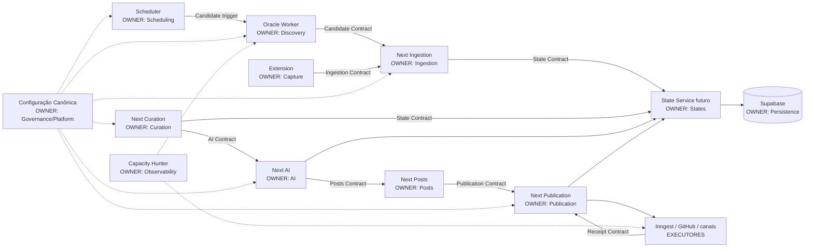

# PMAV5-003 — Configuração e Contratos Canônicos

## 1. Identificação

| Campo | Valor |
|---|---|
| Modo | `IMPLEMENTATION` |
| Implementação | M-01 — Configuração e Contratos Canônicos |
| Checkpoint | CP-003 |
| Data | 2026-07-13 |
| Branch | `codex/pmav5-architecture-unification` |
| SHA inicial | `74a8e1a53775097fb717475ded6523372f6e6f43` |
| Natureza | implementação normativa exclusivamente documental |
| Runtime, banco, schema, migration, deploy ou restart | inalterados |

## 2. Veredito executivo

M-01 estabelece uma definição normativa única para configuração, ambientes, feature flags, contratos, ownership e dependências. Não move valores secretos, não modifica consumidores e não ativa serviços. A autoridade de **definição** passa a ser este registro PMAV5 e os contratos em `PMAV5/CONTRATOS/`; os stores de cada ambiente são apenas autoridades de **valor**, nunca de nomes, responsabilidades ou arquitetura.

O inventário é estático e não expõe valores. Ativação e conteúdo de Vercel, Oracle, GitHub e Inngest permanecem não inspecionados nesta Sprint. Essa fronteira não cria duplicidade oficial: um store materializa a mesma chave canônica em um ambiente específico.

## 3. Regras canônicas de configuração

1. Este documento é a autoridade versionada para nomes, exposição, owner, ambiente e ciclo de vida das configurações PMAV5.
2. `.env.example` é template derivado e sem segredos; não decide arquitetura.
3. `.env.local` é materialização local ignorada pelo Git; herda nomes canônicos e nunca é promovida.
4. Vercel Environment Variables é store de valores do Next.js por ambiente.
5. O store secreto do host Oracle é a materialização de Worker/API/WhatsApp; seu caminho físico permanece operacional e não normativo.
6. GitHub Actions Secrets armazena somente valores consumidos pelo workflow delegado.
7. As chaves Inngest são materializadas no ambiente do endpoint Next.js; Inngest não possui configuração arquitetural independente.
8. PM2 apenas herda o ambiente do processo; não define defaults de negócio nem flags arquiteturais.
9. Nenhum segredo ou valor real é versionado. Rotação ocorre no store proprietário.
10. Uma chave só é oficial quando aparece neste inventário com owner e consumidores. Alias/fallback é legado e tem prazo de remoção.

### 3.1 Precedência

```text
Constituição/ADRs
  → este registro canônico + contratos PMAV5
    → template .env.example
      → store do ambiente (valor)
        → processo consumidor (somente leitura)
```

Um valor no processo não pode redefinir owner, fluxo ou contrato. Ausência de chave obrigatória falha fechada. Defaults não secretos só são permitidos quando documentados; defaults de endpoint, identidade, credencial ou autoridade são proibidos.

## 4. Inventário oficial de arquivos e stores

| Artefato/store | Presença versionada | Papel atual | Decisão canônica | Owner |
|---|---:|---|---|---|
| `PMAV5/AUDITORIAS/PMAV5-003_CONFIGURACAO_CANONICA.md` | sim | novo registro | autoridade de definição/configuração | Governance Lead |
| `PMAV5/CONTRATOS/*.md` | sim | contratos novos | autoridade dos payloads e responsabilidades | owner de cada domínio |
| `.env.example` | sim | template parcial do app | herda o registro; template público, sem valores secretos | Next.js Platform |
| `.env.local` | não; ignorado | esperado por Next e muitos scripts | materialização local única; nunca versionar | operador local |
| `.env` raiz | não; ignorado | default implícito de dotenv | deixa de ser fonte oficial; permitido apenas para Capacity Hunter em seu diretório até M-08 | Migration Manager |
| `.env.production` | não; ignorado | nenhum consumidor explícito certificado | deixa de existir como conceito oficial; Vercel store substitui | Next.js Platform |
| `.env.local.remote` | não; ignorado | fallback em scripts WhatsApp/publish | legado; remover em M-08/CP-008 | WhatsApp adapter owner |
| `oracle.env` | não; ignorado | nenhuma leitura localizada | órfão/removível; não criar | Oracle Platform |
| `oracle-capacity-hunter/.env.example` | sim | template específico | derivado; somente chaves de observabilidade | Capacity Hunter |
| `vercel.json` | sim | build e cron de polling | configuração técnica; não é registro de secrets/flags | Next.js Platform |
| Vercel Environment Variables | externo | valores Next por environment | store oficial de valores Next | Next.js Platform |
| host Oracle secret store | externo | valores Worker/API/WhatsApp/monitor | store oficial de valores Oracle; caminho e conteúdo não certificados | Oracle Platform |
| variáveis PM2 | externo | herança no processo | somente transporte; nenhum default/owner próprio | Oracle Platform |
| GitHub Actions Secrets | externo | 3 secrets no workflow | store oficial de valores do executor GitHub | GitHub executor owner |
| workflow inputs | versionado | 7 inputs de publicação | dados efêmeros de comando, não configuração | Publication Service |
| Inngest dashboard/keys | externo | event/signing keys | store técnico; chaves injetadas no Next | Next.js Platform |

## 5. Inventário definitivo de ambientes

| Ambiente | Componentes | Autoridade de valor | Herda | Permitido | Proibido |
|---|---|---|---|---|---|
| Local development/test | Next e scripts autorizados | `.env.local` ignorado | registro + `.env.example` | valores locais e mocks explícitos | secrets no Git, `.env` concorrente, valores de produção |
| Vercel Preview | Next.js | Vercel Preview Variables | registro canônico | credenciais isoladas de preview | herdar Production automaticamente |
| Vercel Production | Next.js | Vercel Production Variables | registro canônico | somente chaves do Next | flags que escolham arquitetura paralela |
| Oracle Production | Worker, API, WhatsApp, PM2 | store secreto do host | registro canônico | chaves estritamente necessárias por processo | defaults hardcoded, arquivo remoto alternativo, PM2 decidir negócio |
| GitHub Actions | renderer/publisher delegado | Repository/Environment Secrets | Receipt/Publication Contracts | três secrets existentes e inputs do comando | criar autoridade de estado ou copiar todo o env Next |
| Inngest Cloud | executor delegado | Inngest keys no Vercel + dashboard | contrato Inngest e contratos de domínio | autenticação, retry e telemetria | secrets de marketplace ou decisão de fluxo |
| Capacity Hunter | observabilidade Oracle | `.env` materializado no diretório do monitor | template específico derivado | Telegram de alerta e métricas OCI declarativas | mutação de pipeline ou secrets de negócio |

## 6. Catálogo canônico de variáveis

Os nomes abaixo foram encontrados em `.env.example`, `oracle-capacity-hunter/.env.example`, código versionado, workflow e documentação Inngest. “Secret” significa valor exclusivamente server-side.

| Grupo | Chaves canônicas | Owner | Stores/consumidores |
|---|---|---|---|
| App público | `NEXT_PUBLIC_APP_NAME`, `NEXT_PUBLIC_APP_URL`, `NEXT_PUBLIC_SITE_URL`, `NEXT_PUBLIC_INSTAGRAM_USERNAME`, `NEXT_PUBLIC_INSTAGRAM_URL`, `NEXT_PUBLIC_TELEGRAM_NAME`, `NEXT_PUBLIC_TELEGRAM_URL`, `NEXT_PUBLIC_WHATSAPP_URL`, `NEXT_PUBLIC_TIKTOK_URL` | Next.js | Vercel/local; UI, tracking, OG |
| Supabase público | `NEXT_PUBLIC_SUPABASE_URL`, `NEXT_PUBLIC_SUPABASE_ANON_KEY` | Supabase/Next Platform | Vercel/local; browser/SSR |
| Supabase admin | `SUPABASE_SERVICE_ROLE_KEY` (secret) | Supabase Platform | Vercel, Oracle, GitHub conforme mínimo privilégio |
| IA | `GROQ_API_KEY`, `GROQ_API_KEY_2`, `GROQ_MODEL`, `CEREBRAS_API_KEY`, `CEREBRAS_API_KEY_2`, `CEREBRAS_BASE_URL`, `CEREBRAS_MODEL`, `COPY_ENGINE_MODE` | Next AI Service | Vercel/local; Worker apenas até M-05 |
| Telegram | `TELEGRAM_BOT_TOKEN` (secret), `TELEGRAM_CHANNEL_ID` | Telegram transport | Vercel/Oracle |
| WhatsApp | `WHATSAPP_ENGINE_URL`, `WHATSAPP_ENGINE_API_KEY` (secret), `WHATSAPP_TARGET_ID` | WhatsApp transport | Vercel/Oracle |
| Instagram/Meta | `INSTAGRAM_ACCESS_TOKEN`, `INSTAGRAM_BUSINESS_ACCOUNT_ID`, `META_WEBHOOK_VERIFY_TOKEN`, `FACEBOOK_PAGE_ID`, `FACEBOOK_ACCESS_TOKEN` | Instagram/Facebook transports | Vercel/GitHub |
| Cloudinary/GitHub | `CLOUDINARY_CLOUD_NAME`, `CLOUDINARY_API_KEY`, `CLOUDINARY_API_SECRET`, `GITHUB_TOKEN` | Publication Service | Vercel |
| Scheduler técnico | `CRON_SECRET` | Scheduler/Next Platform | Vercel |
| Oracle gateway | `ORACLE_API_KEY`, `ORACLE_REMOTE_URL` | Oracle API | Oracle + cliente autorizado |
| Oracle deployment | `ORACLE_SERVER_IP`, `ORACLE_SERVER_USER`, `ORACLE_PROJECT_DIR`, `ORACLE_PM2_NAME`, `ORACLE_SCRAPER_PM2_NAME` | Oracle Platform | operação local autorizada; não runtime de negócio |
| Scraping providers | `SCRAPFLY_API_KEY`, `SCRAPFLY_API_KEYS`, `SCRAPEDO_API_KEY`, `FIRECRAWL_API_KEY` | Oracle Discovery | Oracle; Next legado até migração |
| Shopee | `SHOPEE_APP_ID`, `SHOPEE_APP_SECRET`, `SHOPEE_HISTORY_FILE` | Oracle Discovery | Oracle |
| Amazon | `AMAZON_CLIENT_ID`, `AMAZON_CLIENT_SECRET`, `AMAZON_PARTNER_TAG`, `AMAZON_MARKETPLACE`, `AMAZON_ACCESS_KEY`, `AMAZON_SECRET_KEY` | Oracle Discovery | Oracle |
| Mercado Livre | `MERCADO_LIVRE_APP_ID`, `MERCADO_LIVRE_CLIENT_ID`, `MERCADO_LIVRE_CLIENT_SECRET`, `MERCADO_LIVRE_REDIRECT_URI`, `MERCADO_LIVRE_AFFILIATE_ID`, `MERCADO_LIVRE_SITE_ID`, `ML_SITE_ID`, `ML_MAX_SCRAPEDO_REQUESTS` | Oracle Discovery / Next OAuth | Oracle/Vercel conforme função |
| Afiliados | `MAGALU_PARTNER_ID`, `RAKUTEN_AFFILIATE_ID`, `RAKUTEN_CLIENT_ID`, `RAKUTEN_CLIENT_SECRET`, `RAKUTEN_ACCESS_TOKEN`, `RAKUTEN_REFRESH_TOKEN`, `RAKUTEN_SID`, `RAKUTEN_NETSHOES_MID`, `ADMITAD_CLIENT_ID`, `ADMITAD_CLIENT_SECRET`, `ADMITAD_WEBSITE_ID` | Oracle Discovery | Oracle |
| Inngest | `INNGEST_EVENT_KEY`, `INNGEST_SIGNING_KEY` | Next Platform | Vercel/Inngest |
| Capacity Hunter | `TELEGRAM_CHAT_ID`, `SEND_TELEGRAM_ALERTS`, `ALERT_COOLDOWN_MINUTES`, `ENABLE_LOGS`, `OCI_ACCOUNT_STATUS`, `OCI_CURRENT_COST`, `OCI_MONTHLY_FORECAST`, `OCI_COST_CURRENCY`, `OCI_POTENTIALLY_BILLABLE` | Capacity Hunter | monitor Oracle |
| Diagnóstico | `SCRAPER_AUDIT_RUN_ID`, `LLM_DIAGNOSTIC`, `LLM_DIAGNOSTIC_LOG_FILE`, `LLM_DIAGNOSTIC_RUN_ID`, `CRAWLEE_AVAILABLE_MEMORY_RATIO`, `CRAWLEE_MEMORY_MBYTES` | QA/Observability | execução local/Oracle autorizada |
| Runtime gerenciado | `NODE_ENV` | plataforma | Node/Vercel; não definido manualmente em template |
| GitHub inputs | `INPUT_POST_ID`, `INPUT_OFFER_ID`, `INPUT_PRODUCT_NAME`, `INPUT_ORIGINAL_PRICE`, `INPUT_CURRENT_PRICE`, `INPUT_IMAGE_URL`, `INPUT_CAPTION` | Publication Service | workflow efêmero |

### 6.1 Aliases e chaves que deixam de ser oficiais

| Chave | Classificação | Substituta/decisão | Prazo |
|---|---|---|---|
| `WHATSAPP_CHANNEL_ID` | legado | `WHATSAPP_TARGET_ID` | M-08 / CP-008 |
| `WHATSAPP_DEFAULT_CHANNEL_ID` | legado | `WHATSAPP_TARGET_ID` | M-08 / CP-008 |
| `WAHA_URL`, `WAHA_API_KEY`, `WAHA_SESSION`, `WAHA_CHANNEL_ID`, `WAHA_*` auxiliares | legado/experimental | contrato WhatsApp + `WHATSAPP_ENGINE_*` | M-07/M-08 |
| `ML_PROVIDER`, `ML_DISCOVERY_MODE`, `ML_SIGNAL_URLS` | órfão/legado | autoridade Oracle Discovery sem seletor arquitetural | M-03/M-08 |
| `LLM_PROVIDER`, `LLM_FALLBACK` | legado arquitetural | Next AI Service possui provider por configuração interna homologada, sem escolher owner | M-05/M-08 |
| `SCRAPER_MODE` | legado arquitetural | owner fixo por contrato; ambiente não escolhe pipeline | M-03 |

## 7. Inventário canônico de feature flags

Flags de segurança/diagnóstico podem permanecer; nenhuma flag pode selecionar a arquitetura permanente.

| Flag | Classe | Owner | Consumidores | Objetivo | Prazo |
|---|---|---|---|---|---|
| `SHOPEE_DISCOVERY_V5` | temporária | Oracle Discovery | Worker, Oracle API, scraper Next legado | corte Shopee V5 | remover em M-03/M-08 |
| `AMAZON_NATIVE_TOP20_V5` | temporária | Oracle Discovery | Worker | corte Amazon nativa | remover em M-03/M-08 |
| `ENABLE_NETSHOES_RAKUTEN` | temporária | Oracle Discovery | Worker | corte provider Netshoes | remover em M-03/M-08 |
| `SCORING_V2_ENABLED` | temporária | Oracle Discovery | Worker | corte de scoring | remover em M-03/M-08 |
| `ENABLE_CURATION_ENGINE` | temporária | Next Curation | curation engine/testes | rollout de engine | remover em M-04/M-08 |
| `ENABLE_AI_CURATION` | temporária | Next Curation | curation engine/testes | rollout de curadoria IA | remover em M-04/M-08 |
| `ENABLE_HISTORICAL_SCORING` | temporária | Next Curation | curation engine | scoring histórico | remover em M-04/M-08 |
| `ENABLE_CONVERSION_ENGINE` | temporária | Next Curation | score V2/testes | conversion scoring | remover em M-04/M-08 |
| `ENABLE_SHADOW_SCORING` | órfã/removível | Next Curation | getter/testes; consumidor produtivo não localizado | shadow scoring | remover em M-04/M-08 |
| `SCRAPER_MODE` | legada | Oracle Platform | Oracle API/Worker | alternar LOCAL/ORACLE | substituir por ownership fixo em M-03 |
| `LLM_PROVIDER` | legada | AI owner | Worker/LLM factory | escolher provider primário | retirar do Worker em M-05; remover arquitetura em M-08 |
| `LLM_FALLBACK` | legada | AI owner | Worker/LLM factory | escolher fallback | mesmo prazo M-05/M-08 |
| `ML_PROVIDER` | órfã/removível | Oracle Discovery | somente template/validador localizado | escolher scraper ML | remover em M-03/M-08 |
| `ML_DISCOVERY_MODE` | órfã/removível | Oracle Discovery | somente template localizado | alternar legacy/signals | remover em M-03/M-08 |
| `SHOPEE_OFFICIAL_ONLY` | experimental | Oracle Discovery QA | Worker test hook | forçar provider oficial | encerrar com M-03 |
| `SHOPEE_OFFICIAL_FORCE_ERROR` | experimental | QA | Worker test hook | simular erro fail-closed | manter somente teste; retirar de produção em M-03 |
| `ORACLE_SCRAPER_DISABLE_AUTORUN` | canônica de teste | QA | testes/diagnósticos do Worker | importar módulo sem executar | sem expiração; proibida em produção |
| `DRY_RUN` | canônica de segurança | Migration Manager | cleanup administrativo | impedir escrita por default | permanente enquanto script existir |
| `APPLY_CLEANUP` | canônica de segurança | Migration Manager | panel cleanup | confirmação dupla | até migrar ferramenta em M-07/M-08 |
| `CONFIRM_BACKFILL` | canônica de segurança | Migration Manager | backfill | confirmação explícita | até M-07/M-08 |
| `CONFIRM_SANITIZE` | canônica de segurança | Migration Manager | sanitize | confirmação explícita | até M-07/M-08 |
| `SEND_TELEGRAM_ALERTS` | canônica operacional | Capacity Hunter | monitor | habilitar alerta, sem mudar pipeline | permanente |
| `ENABLE_LOGS` | canônica operacional | Capacity Hunter | monitor | controlar logs técnicos | permanente |
| `LLM_DIAGNOSTIC` | experimental | QA/Observability | diagnóstico LLM | instrumentação local | remover após M-05/M-09 |
| `VALIDATE_URLS_AMAZON`, `VALIDATE_URLS_ML`, `VALIDATE_URLS_NETSHOES` | experimental de teste | QA | validador token | dataset de teste | somente execução de QA; revisar em M-08 |
| `VALIDATE_URL_AMAZON_OVERRIDE`, `VALIDATE_URL_ML_OVERRIDE` | experimental de teste | QA | validador token | override pontual | somente execução de QA; revisar em M-08 |
| `VALIDATE_QUERIES_SHOPEE`, `VALIDATE_QUERIES_NETSHOES` | experimental de teste | QA | validador token | queries de teste | somente execução de QA; revisar em M-08 |

## 8. Contratos canônicos

| Contrato | Owner único | Produtores | Consumidores | Arquivo |
|---|---|---|---|---|
| Candidate | Oracle Worker | Oracle Discovery | Ingestion Service | `CONTRATO_CANDIDATE.md` |
| State Transition | State Service futuro | serviços oficiais autorizados | Supabase/audit e chamador | `CONTRATO_STATE.md` |
| AI | Next AI Service | Curation/State | Posts Service e State Service | `CONTRATO_AI.md` |
| Posts | Next Posts Service | AI/Curation | Publication Service | `CONTRATO_POSTS.md` |
| Publication | Next Publication Service | UI/automação autorizada | transport adapters | `CONTRATO_PUBLICATION.md` |
| Receipt | transport adapter sob Publication | GitHub/WhatsApp/Telegram/Instagram | Publication/State | `CONTRATO_RECEIPT.md` |
| Ingestion | Next Ingestion Service | Worker/Extensão | State Service | `CONTRATO_INGESTION.md` |

Todos usam `contractVersion`, `correlationId`, `idempotencyKey`, identidade de tenant/ator, timestamps UTC e resultado tipado. Campo desconhecido crítico ou versão incompatível falha fechada. Contrato não é feature flag.

## 9. Ownership definitivo

| Componente | Domínio de que é Owner | Responsabilidade final | Não possui autoridade sobre |
|---|---|---|---|
| Oracle Worker | Discovery | coletar, normalizar, deduplicar, novelty e score determinístico | estado pós-ingestão, IA, posts, publicação |
| Oracle API | gateway de provider | autenticação e resposta técnica | scheduler, Discovery owner, estado ou negócio |
| Next.js | Curation, AI, Posts, Publication e Ingestion | serviços oficiais pós-Discovery | Discovery automatizado |
| State Service futuro | transições de estado | validar/CAS/idempotência/auditoria | conteúdo de IA, transporte ou scheduling |
| Supabase | persistência | dados, constraints, RLS e audit storage | decisão de negócio |
| Scheduler | agenda de Discovery | um comando idempotente por janela | IA, publicação ou estado |
| Inngest | execução assíncrona delegada | retry/queue/telemetria | decisão ou ownership do domínio delegado |
| GitHub Actions | renderização técnica delegada | executar job e devolver receipt | estado e decisão de publicação |
| WhatsApp adapter | transporte WhatsApp | entregar payload e devolver receipt | conteúdo, estado e retry de negócio |
| Telegram adapter | transporte Telegram | entregar payload e devolver receipt | conteúdo e estado |
| Instagram adapter | transporte Instagram | entregar payload e devolver receipt | conteúdo e estado |
| Extension | captura no cliente | autenticar e enviar Ingestion Request | persistência, IA e publicação |
| Capacity Hunter | observabilidade Oracle | métricas, alertas e relatório | mutação ou reinício do pipeline |

Cada domínio possui exatamente um Owner. Executors podem possuir sua mecânica técnica, mas a autoridade de negócio permanece no owner do contrato chamador.

## 10. Matriz de dependências

| De \ Para | Config | Scheduler | Worker | Ingestion | State | Supabase | Curation | AI | Posts | Publication | Transports | Observability |
|---|---:|---:|---:|---:|---:|---:|---:|---:|---:|---:|---:|---:|
| Scheduler | R | — | C | — | — | — | — | — | — | — | — | E |
| Worker | R | E | — | C | — | — | — | — | — | — | — | E |
| Extension | R | — | — | C | — | — | — | — | — | — | — | E |
| Ingestion | R | — | E | — | C | R | — | — | — | — | — | E |
| Curation | R | — | — | — | C | R | — | C | — | — | — | E |
| AI | R | — | — | — | C | R | E | — | C | — | — | E |
| Posts | R | — | — | — | C | R | — | E | — | C | — | E |
| Publication | R | — | — | — | C | R | — | — | R | — | C | E |
| Transport/Inngest/GitHub | R | — | — | — | — | — | — | — | — | E | — | E |
| State Service | R | — | — | — | — | W | — | — | — | — | — | E |

Legenda: `R` lê; `W` persiste; `C` chama; `E` emite/retorna evidência. A matriz é normativa e não afirma que M-02+ já esteja implementado.

## 11. Grafo canônico de dependências



## 12. Validação de M-01

| Critério | Evidência | Resultado |
|---|---|---|
| nenhum componente possui mais de uma configuração oficial | precedência §3 e inventários §§4–6 | PASS normativo |
| nenhum contrato está duplicado | owners/arquivos únicos §8 | PASS |
| nenhuma flag arquitetural define comportamento permanente | flags temporárias/legadas possuem owner e prazo §7 | PASS normativo; remoções ocorrerão nas Sprints indicadas |
| nenhum secret foi exposto | somente nomes foram registrados | PASS |
| nenhum runtime/config store foi alterado | diff restrito a `PMAV5/` | validar antes do commit |
| nenhum serviço, deploy, migration ou schema foi alterado | nenhum comando operacional executado | validar antes do commit |

“PASS normativo” significa que há uma única regra oficial versionada. Não significa que consumidores legados já foram refatorados; isso é expressamente reservado a M-03–M-08.

## 13. Rollback

Reverter o commit documental da PMAV5-003 por novo commit, preservando o histórico. Nenhum valor secreto, runtime ou schema precisa ser restaurado. Se um contrato futuro já tiver consumidor, sua mudança incompatível exigirá nova versão e ADR; não se edita a versão publicada retroativamente.

## 14. Conclusão

A configuração canônica, o catálogo de flags, os owners e sete contratos foram estabelecidos como fonte normativa única. Ambientes e stores apenas materializam valores. Aliases, flags e fontes alternativas foram classificados com prazo, sem remoção ou mudança funcional nesta Sprint.
