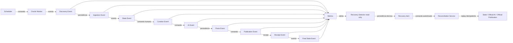

# PMAV5-011 — Auditoria de Observabilidade e Recuperação

## Resumo executivo

A Sprint adiciona o contrato `pmav5.observability/v1`, 43 eventos, 36 métricas, 20 alertas documentados, detectores somente leitura, registro técnico de recuperação sobre a abstração existente de `integration_logs`, replay delegado aos serviços oficiais e endpoints `/api/health` e `/api/readiness`. Não há novo estado de negócio, writer, provider, publisher ou scheduler.

## Inventário anterior

| Origem | Consumidor/formato | Persistência, owner e retenção | Correlação/sensibilidade | Lacuna e ação |
|---|---|---|---|---|
| `console.log` (31 arquivos) | PM2/Vercel/Next; texto/objeto | runtime externo; owners dispersos; retenção não certificada | não uniforme; payload potencial | consolidar em JSON sanitizado |
| `console.error` (36 arquivos) | operadores/runtime | externo; owner do componente | parcial; stack/payload | preservar erro e instrumentar envelope |
| `integration_logs` (25 refs.) | serviços oficiais | Supabase existente; tenant; retenção não certificada | metadata e IDs parciais | preservar como sink/DLQ sem migration |
| `app_settings` (24 refs.) | State/AI/Publication | Supabase; owners oficiais | fingerprint/key/result | preservar para idempotência |
| PM2/Oracle | operador Oracle | infraestrutura externa | logs técnicos | Worker instrumentado; retenção não certificada |
| Next/Vercel | operador web | Vercel externo | requests/erros | Structured Log Adapter |
| Inngest/GitHub Actions | executores subordinados | plataformas externas | eventos/jobs | preservar; retenção não certificada |
| Capacity Hunter | observabilidade read-only | externa ao fluxo | métricas | preservar sem ação automática |
| receipts | Publication Service | storage oficial | external id/hash | preservar; bloquear reenvio cego |
| AuditPorts | State/AI/Publication | `integration_logs` | command/correlation/causation/tenant | bridges oficiais |
| IDs e error codes | contratos/audits | payload/audit | alta cardinalidade | propagar em eventos; proibir como label |
| retries/locks/reservas | serviços oficiais | `app_settings`/adapter | chaves técnicas | preservar; detectar/replay controlado |
| health/readiness/métricas | quase ausentes | sem padrão | baixa sensibilidade | endpoints e catálogos novos |

Retenção concreta de PM2, Oracle, Vercel, Inngest e GitHub Actions permanece **NÃO CERTIFICADA**. Nenhuma configuração externa foi alterada.

## Envelope, eventos e ports

O factory exige versão, event ID, tipo, timestamp, serviço, componente, ambiente e correlation ID; preenche desconhecidos com `null`. Inclui command/idempotency/causation/execution/tenant/user, entidade, offer/post, marketplace/canal/provider/model/transporte, estados/versões, duração/tentativa/replay/resultado/erro/fase/severidade e metadata sanitizada.

A sanitização recursiva remove secrets, tokens, API keys, autorização, cookies, passwords, prompts, responses e payloads, limitando profundidade, arrays e strings. Há 6 eventos Discovery, 4 Ingestion, 5 State, 2 Curation, 8 AI, 9 Publication, 5 Recovery e 4 Health/heartbeat.

Ports: `ObservabilityEventPort`, `MetricsPort`, `HealthPort`, `RecoveryQueuePort`, `ReconciliationRepositoryPort`, `ClockPort`, `UUIDPort` e `OfficialReplayPort`. O núcleo não importa Supabase, console, environment, provider, transporte ou State adapter.

## Adapters e instrumentação

- Structured Log: linha JSON sanitizada por sink injetado.
- Integration Logs: mapeamento tenant-aware à estrutura existente.
- Metrics em memória: counter/gauge/histogram e bloqueio de IDs como labels.
- Recovery em memória e Integration Logs Recovery: DLQ técnica idempotente, sem schema.
- Audit bridges: State, AI e Publication preservam o AuditPort e emitem best-effort.
- Oracle Worker: ciclo, marketplace, conclusão, falha e heartbeat.
- Curadoria: State Service instrumentado preserva ator, tenant, marketplace e decisão.

## Métricas, alertas, detectores e replay

O catálogo contém todas as 36 métricas obrigatórias com tipo, owner, labels, limiar e ação. Há 6 alertas CRITICAL, 7 HIGH, 5 MEDIUM e 2 LOW, todos com owner, métrica, limiar, janela, ação, runbook, escalonamento e resolução. Nenhum alerta externo foi ativado.

Detectores puros identificam pending excessivo, selected preso, approved sem drafts, draft antigo, receipt divergente, reserva expirada e heartbeat ausente. Recovery Item inclui identidades, tenant, fase/entidade, erro sanitizado, tentativas, timestamps, ação e resolução. Seus estados técnicos são `OPEN`, `REPLAYING`, `RESOLVED` e `MANUAL_ACTION_REQUIRED`.

Reconciliation Service exige autenticação, tenant, command ID e idempotency key, valida conflito/permissão e delega apenas a `OfficialReplayPort` de State, AI ou Publication. Receipt final bloqueia transporte repetido. A repository port altera somente estado técnico do Recovery Item.

## Health e readiness

`/api/health` prova resposta do Next.js. `/api/readiness` avalia sem mutação State, AI, Publication, Oracle opcional, provider/transporte, Supabase, idempotency e audit. A implementação certifica configuração, não consulta real ao Supabase; conectividade profunda é limitação explícita para evitar operação externa nesta Sprint.

## Grafo de rastreabilidade

## Provas, limitações e escopo negativo

`observability-recovery-boundary.test.ts` prova ausência de runtimes concretos, writers, providers e transportes no núcleo; detectores sem mutação; reconciliação por replay ports. Bridges e Oracle provam que falha do sink não muda resultado.

Não há dashboard/exporter externo nem ativação automática de detector. Nenhum serviço externo, banco, migration, DDL/DML, runtime real, IA, publicação, Discovery, deploy, PM2, Oracle VPS ou produção foi executado/alterado. Resultados finais de testes e cobertura são registrados no fechamento.

## Certificação Final (PMAV5-011.1)

- **SHA Certificado:** `68cea3177c840cb53bbfa88e400b285328329cf3` (Local = Remoto).
- **Auditoria Funcional:** As alterações da PMAV5-011 são exclusivamente de instrumentação, observabilidade, recuperação, testes, documentação e infraestrutura técnica, preservando integralmente as regras de negócio da Arquitetura Oficial PMAV5.
- **Typecheck Global:** Foram identificados 27 erros totais em 4 arquivos.
  - **Erros no escopo PMAV5-011:** 0.
  - **Erros fora do escopo (UI/Automação legada):** 27.
  - **Conclusão Typecheck:** PASS.
- **Confirmação das Autoridades:** Oracle Worker continua Discovery-Only. State Service, Official AI Service e Official Publication Service continuam autoridades únicas. Nenhum component paralelo (writer, provider, publisher, scheduler) foi criado, e nenhuma feature flag arquitetural foi reintroduzida.
- **Validação de Endpoints:** `/api/health` e `/api/readiness` apenas retornam diagnóstico estático, sem side-effects ou mutações de negócio.
