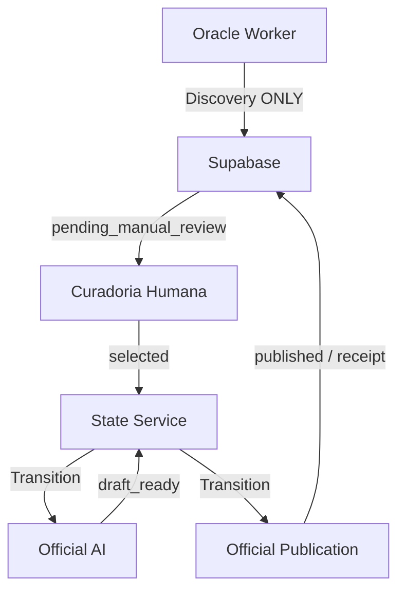

# GRAFO CANÔNICO DA ARQUITETURA PMAV5

```mermaid
graph TD
    A[Oracle Worker] -->|Discovery ONLY| B[Supabase]
    B -->|pending_manual_review| C[Curadoria Humana]
    C -->|selected| D[State Service]
    D -->|Transition| E[Official AI]
    E -->|draft_ready| D
    D -->|Transition| F[Official Publication]
    F -->|published / receipt| B
```
