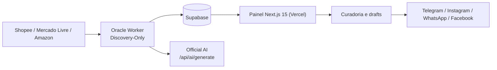

# Caça Oferta Oficial

<!-- docs-status: current -->
<!-- verified-against: 5df6fe73 -->
<!-- verified-on: 2026-09-21 -->

Aplicação Next.js para descoberta, curadoria, geração de conteúdo com IA e publicação de ofertas em canais configurados. O estado das ofertas, posts, links e registros operacionais é mantido no Supabase, com motor de seleção multimarketplace V2 unificado (Amazon, Mercado Livre, Shopee).

O runtime operacional atual está descrito em [docs/CURRENT_SYSTEM_STATUS.md](docs/CURRENT_SYSTEM_STATUS.md). A hierarquia documental está em [docs/DOCUMENTATION_INDEX.md](docs/DOCUMENTATION_INDEX.md). Os relatórios de auditoria estrutural e de infraestrutura estão disponíveis em [docs/PLANO_CONSOLIDACAO_SRC.md](docs/PLANO_CONSOLIDACAO_SRC.md), [docs/AUDITORIA_E_PLANO_ORACLE_VPS.md](docs/AUDITORIA_E_PLANO_ORACLE_VPS.md) e [docs/AUDITORIA_E_PLANO_VERCEL.md](docs/AUDITORIA_E_PLANO_VERCEL.md).

## Arquitetura atual

A arquitetura canônica está em [docs/architecture-current.md](docs/architecture-current.md). A documentação oficial, organizada por assunto, está em [docs/official.md](docs/official.md).



Fluxo principal:

1. O Oracle Worker descobre candidatos nos marketplaces.
2. Os candidatos são persistidos no Supabase para revisão manual e curadoria comercial.
3. A Official AI gera drafts de copy e links rastreáveis por canal.
4. O painel Next.js permite curadoria, aprovação e rejeição.
5. As publicações aprovadas são enviadas pelos transportes oficiais configurados.

O Oracle agenda Discovery em sete horários canônicos (`06:00`, `08:00`, `09:00`, `11:00`, `12:00`, `14:00` e `18:00`, `America/Sao_Paulo`) para os sete nichos ativos: Casa/Cozinha/Organização, Ferramentas, Informática, Beleza, Moda, Pet e Eletrodomésticos. Cupons permanece `manual_only` às 22h e não participa do cron de Discovery.

O ciclo Discovery-Only materializa candidatos de Shopee, Mercado Livre e Amazon; Shein, Magalu e Netshoes permanecem capacidades separadas até homologação própria. A Publicação Expressa é um fluxo independente de ingestão de links, com validação de marketplace e monetização antes da geração de copy.

## Proteções atuais de publicação social

- Ofertas em estado `rejected` não podem ser publicadas pelos fluxos sociais oficiais.
- Instagram publica Feed e Reels com identificação de parceria paga para conteúdo afiliado.
- O Instagram aplica validação de legenda, cota móvel de 24 horas, duplicidade de legenda/vídeo e validações conservadoras de mídia.
- O `Instagram Policy Guard` executa fail-closed antes da publicação e bloqueia categorias sensíveis/proibidas, registrando `instagram.policy.blocked` com regra e motivo.
- Facebook mantém o link afiliado no primeiro comentário, conforme o fluxo atual.
- WhatsApp mantém o Top30 editorial separado da Publicação Expressa; drafts ativos do canal não desaparecem apenas porque a oferta global foi aprovada em outra rede.

## Estrutura do repositório

- `src/app/`: páginas do painel e rotas da API Next.js 15 App Router.
- `src/components/`: componentes visuais e de layout.
- `src/core/`: regras de domínio, IA, estado, publicação e observabilidade.
- `src/lib/`: adaptadores, integrações, ambiente e serviços auxiliares.
- `src/tests/`: testes automatizados Vitest (2.121 testes).
- `scripts/`: workers Oracle, WhatsApp, publicação, vídeo e utilitários operacionais (401 testes CJS).
- `supabase/`: schema e migrations do banco.
- `apps/oracle-capacity-hunter/`: monitoramento operacional do ambiente Oracle.
- `src/remotion/`: composições e templates de vídeos promocionais.
- `public/`: assets estáticos usados pelo painel e pelo Remotion.
- `docs/`: documentação atual, contratos, operação e auditorias consolidadas.
- `docs/archive/`: documentação legada e registros históricos; não é fonte de verdade do runtime.

## Documentação principal

- [Arquitetura atual](docs/architecture-current.md)
- [Documentação oficial](docs/official.md)
- [Estado atual](docs/CURRENT_SYSTEM_STATUS.md)
- [Configuração](docs/configuration.md)
- [APIs](docs/api.md)
- [Deploy](docs/deployment.md)
- [Integrações](docs/integracoes.md)
- [Oracle Cloud](docs/oracle.md)
- [Runbook Oracle](docs/oracle-scripts-runbook.md)
- [Scripts](docs/scripts.md)
- [Troubleshooting](docs/troubleshooting.md)
- [Segurança](docs/SECURITY.md)
- [Governança da documentação](docs/DOCUMENTATION_GOVERNANCE.md)
- [Inteligência Comercial IA](docs/AI_COMMERCIAL_INTELLIGENCE.md)
- [Auditoria e Otimização VPS Oracle](docs/AUDITORIA_E_PLANO_ORACLE_VPS.md)
- [Auditoria e Higienização Vercel](docs/AUDITORIA_E_PLANO_VERCEL.md)
- [Plano de Consolidação de Código](docs/PLANO_CONSOLIDACAO_SRC.md)

## Desenvolvimento local

Requer Node.js 20 ou superior. Configure as variáveis conforme [docs/configuration.md](docs/configuration.md) e mantenha os segredos apenas no `.env.local`.

```bash
npm install
npm run dev
```

Comandos de validação:

```bash
npm run lint
npm run typecheck
npm test
npm run build
npm run security:check
npm run docs:audit
npm run verify
```

Deploys de Produção na Vercel são disparados a partir da branch `main`. Após o deploy, valide `/api/health` e `/api/readiness`.

O fluxo de publicação expressa Shopee exige correspondência exata do `itemId` antes de aceitar metadados.

### Validação API-first de marketplaces

O discovery oficial usa as rotas autorizadas de catálogo/categoria do Mercado Livre e a OpenAPI oficial da Shopee. O endpoint legado de busca aberta do Mercado Livre (`/sites/{site_id}/search`) pode retornar `403` mesmo com OAuth válido; isso é uma restrição de rota, não motivo para relaxar autenticação ou criar fallback aberto.

Antes de qualquer alteração no runtime, execute a suite completa de 2.522 testes automatizados:

```bash
npm test
```

Candidatos sem sinal comercial suficiente devem permanecer fora da seleção; dados ausentes continuam `null` e não são fabricados.

## Serviços e scripts principais

- `scripts/oracle-worker-discovery-only.cjs`: worker oficial de descoberta.
- `scripts/oracle-scraper.cjs`: scheduler e integração do ciclo Oracle.
- `scripts/oracle-api.cjs`: gateway técnico Oracle na porta `3002`.
- `scripts/whatsapp-engine.cjs`: motor Baileys na porta `3001`.
- `scripts/oracle-trends-radar-worker.cjs`: worker dedicado do Radar, separado do ciclo editorial.
- `scripts/video-worker.py` e `scripts/video_worker_runtime.py`: processamento de vídeo quando configurado.

Auditoria da VPS Oracle (`193.122.242.178`) em 21/09/2026 confirmou `oracle-scraper`, `oracle-api`, `whatsapp-bot`, `oracle-trends-radar`, `authorized-reel-verifier` e `video-worker` online no PM2; `TRENDS_RADAR_DEDICATED_RUNTIME=true`; `TREND_EXECUTIVE_MODE=off`; scheduler único com `noOverlap`; e Capacity Hunter passivo. O checkout da VPS está 100% alinhado com o commit canônico `5df6fe73` da `main`.

## IA Executiva de Tendências

O runtime inclui o Radar Executivo de Tendências em `/trends`, com evidência direta, snapshots auditáveis, Score V2, Top 3/Top 20, performance interna e contratos de integração Radar → Oracle. `TREND_EXECUTIVE_MODE=off` permanece o estado seguro. O worker dedicado do Radar está operacional na Oracle com `TRENDS_RADAR_DEDICATED_RUNTIME=true`; o `oracle-scraper` não consome solicitações do Radar no ciclo editorial.
