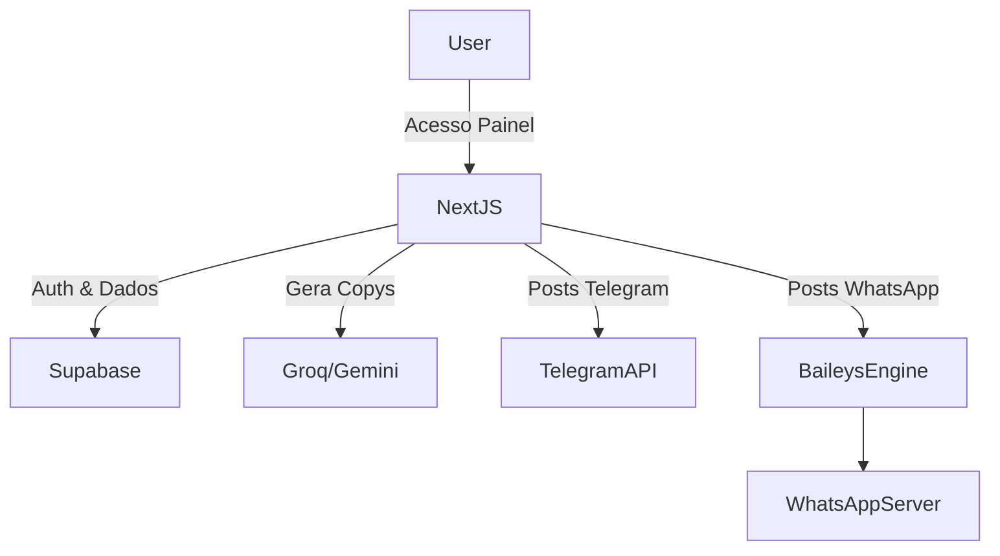

# Caça Oferta Oficial

Plataforma unificada para automação e publicação em massa de ofertas de afiliados, focada na alta conversão através de canais sociais.

# Visão Geral

O objetivo do sistema é facilitar a curadoria, validação e disparo de ofertas para diferentes canais de afiliados (como Telegram, WhatsApp, Instagram e Facebook) de forma automatizada e com copywriting gerado por Inteligência Artificial.

O problema que resolve é o esforço manual de coleta de links, tratamento de imagens, encurtamento com tags de rastreio (SubIDs) e criação de textos persuasivos, aglutinando tudo em uma interface centralizada (dashboard) onde as ofertas são aprovadas e postadas com um clique ou de forma 100% autônoma.

Principais funcionalidades:
- Rastreamento Automático: Geração de links de afiliado com SubIDs para cada canal.
- Disparo Multi-canal: Telegram e WhatsApp.
- Copywriting Inteligente: Geração de copys focadas em gatilhos mentais (Groq/Gemini).
- Dashboard Administrativo: Visão gerencial e acompanhamento de cliques/vendas.
- Extensão Scraper (em dev): Extensão Chrome para facilitar a captura de ofertas diretamente dos sites parceiros.

# Demonstração

1. O operador adiciona o link bruto de uma loja parceira no painel.
2. O sistema recupera a imagem, nome, preço e desconto.
3. A Inteligência Artificial (LLM) cria a estratégia de copy com gatilhos de urgência.
4. O sistema gera os links encurtados com rastreio de SubID específicos por canal.
5. O operador clica em "Aprovar" e o sistema agenda ou dispara imediatamente as mensagens via Telegram API e WhatsApp Engine.

# Arquitetura

O projeto adota uma arquitetura Serverless baseada em Next.js (App Router), interagindo com o Supabase (PostgreSQL, Auth e Storage) e APIs externas para envio de mensagens. O processamento assíncrono é gerido em endpoints específicos de webhooks e `inngest`.



Fluxo dos componentes:
- Frontend (React/Next.js) se comunica com a camada de `app/api` (Server Actions e Endpoints).
- A camada de API persiste as ofertas e links gerados no Supabase e interage com o SDK da IA.
- Workers (via `scripts` e `inngest`) cuidam da postagem em massa.

# Tecnologias Utilizadas

- Frontend: React 19, Next.js 16 (App Router), Tailwind CSS.
- Backend: Next.js API Routes, Node.js (scripts).
- Banco de Dados: Supabase (PostgreSQL), Supabase Auth.
- IA: Groq (llama-3.1) / Google Gemini SDK.
- Infraestrutura: Vercel (Hospedagem), Inngest (Background Jobs).
- APIs: Telegram Bot API.
- Bibliotecas principais: `@whiskeysockets/baileys` (WhatsApp), `lucide-react`, `zod`, `pino`.

# Estrutura do Projeto

- `/src/app`: Rotas da aplicação web e rotas de API do backend.
- `/src/components`: Componentes visuais isolados.
- `/src/lib`: Bibliotecas auxiliares (tracking de SubID, utilitários, IA, Supabase Admin).
- `/supabase`: Configurações de banco de dados (schema SQL, migrations, RLS).
- `/scripts`: Rotinas administrativas e o motor de conexão persistente com o WhatsApp.
- `/docs`: Documentação técnica focada na manutenibilidade.
- `/apps/chrome-extension`: Ferramenta auxiliar (MVP) para raspagem rápida de dados.

# Instalação

Pré-requisitos:
- Node.js versão 20 ou superior.
- Conta e Projeto configurado no Supabase.

Passo a passo:
```bash
# Clone o repositório e instale as dependências
npm install

# Configure as variáveis
cp .env.example .env.local

# Suba a aplicação em modo desenvolvimento
npm run dev
```

# Configuração

Variáveis de ambiente (`.env.local`):
- `NEXT_PUBLIC_SUPABASE_URL`: URL da sua instância Supabase.
- `NEXT_PUBLIC_SUPABASE_ANON_KEY`: Chave anônima para uso client-side.
- `SUPABASE_SERVICE_ROLE_KEY`: Chave administrativa (apenas server-side).
- `GROQ_API_KEY`: Token da API de geração de textos persuasivos.
- `TELEGRAM_BOT_TOKEN`: Token do Bot.
- `TELEGRAM_CHANNEL_ID`: Chat ID de destino (ex: @meucanal).

Integrações exigem configuração prévia nos devidos painéis (BotFather para Telegram).

# Execução

- Ambiente local: `npm run dev` na raiz inicia o painel em `localhost:3000`. O motor de Whatsapp precisa ser inicializado separadamente via `npm run whatsapp`.
- Ambiente de produção: Deploy na Vercel (push na master), conectado ao banco Supabase produtivo.

# Funcionalidades

### Implementadas:
- Cadastro, leitura e exclusão de ofertas no banco de dados.
- Geração inteligente de copywriting via IA usando schema focado em gatilhos mentais.
- Criação e registro automático de SubIDs para Instagram, WhatsApp e Telegram.
- Disparo nativo de mensagens formatadas via Telegram API.
- Painel Administrativo de Autenticação.
- Script engine para conexão com WhatsApp Web (`baileys`).

### Em desenvolvimento:
- Disparo orquestrado automático (Zero touch) via Background Jobs (`inngest`).
- Chrome Extension (scraper visual).

### Planejadas:
- Painel de curadoria via "Motor Quente" (Boost de Conversão da IA).
- Relatórios avançados lendo UTMs.
- Geração nativa de Stories (Imagens) via Puppeteer.

# Fluxos do Sistema

- **Fluxos operacionais**: Criação de oferta -> Análise IA -> Criação de rascunhos -> Aprovação do Operador -> Envio via canais.
- **Fluxos técnicos**: A chamada de AI falha e entra o `runFallback()` para garantir que a interface não bloqueie o usuário. RLS garante segurança de tabelas entre perfis (Supabase).
- **Fluxos de usuários**: O usuário insere a URL -> Aguarda o spinner de geração (copy e URL rastreada) -> Revisa as opções listadas pela IA -> Confirma o envio aos grupos.

# APIs

As principais APIs ficam sob `/src/app/api`:
- `POST /api/ai/generate`: Recebe `{ offerId }`, recupera dados no banco, pede copys à IA, gera rastreio e persiste nos `posts`.
- `POST /api/publish/telegram`: Publica a oferta aprovada no canal do Telegram configurado nas variáveis de ambiente.
- `GET /api/whatsapp/status`: Verifica estado do QRCode via worker Node.
*(Consulte `docs/api.md` para mais detalhes)*.

# Banco de Dados

Modelagem centralizada em PostgreSQL (`supabase/schema.sql`).
- `profiles`: Dados extras de acesso.
- `offers`: Central de ofertas raw.
- `affiliate_links`: Tracking detalhado das URLs. Relacionamento: `1 Offer -> N AffiliateLinks`.
- `posts`: Rascunhos e postagens feitas baseadas num `affiliate_link`.
- `sales`: Controle de ROI.
- `integration_logs` e `app_settings`: Observabilidade e chaves estáticas do usuário.

# Deploy

Hospedado via **Vercel** (`vercel.json` incluso).
1. Conecte seu repositório no Vercel.
2. Defina as variáveis de ambiente base (`NEXT_PUBLIC_SUPABASE_URL`, etc).
3. Todo `git push main` gera uma nova build.
Workers pesados (como o WhatsApp Engine) devem preferencialmente rodar em uma infraestrutura contínua como VPS ou Railway, pois a Vercel tem timeout em Serverless Functions.

# Monitoramento

Logs de requisição e erros de integração são salvos nativamente na tabela `integration_logs` e nas chamadas falhas da IA via `ai_copy_logs`.

# Segurança

- O projeto usa Supabase RLS (Row Level Security) que blinda os dados mesmo usando a Chave Anônima no frontend.
- Nunca expor `SUPABASE_SERVICE_ROLE_KEY` e chaves de IA (ex: Groq) no `.env.local` pro frontend.
- Rotas API do lado do servidor possuem checagem rígida de `supabase.auth.getUser()`.

# Roadmap

As próximas evoluções visam escalar as integrações de entrada: em vez de scraping manual, integração direta via GraphQL / SDKs oficiais de afiliados (Amazon PA-API, Shopee Open Platform), alimentando o banco automaticamente, seguido do disparo 100% autônomo baseado no score da IA.

# Contribuição

Para contribuir:
1. Clone o projeto e crie uma branch.
2. Siga as regras do ESLint/Prettier do projeto (`npm run lint`).
3. Rode `npm run typecheck` antes de realizar os commits.
4. Crie um Pull Request documentando as mudanças.

# Licença

MIT License.
