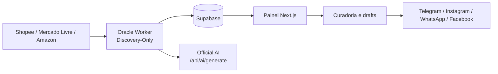

# Caça Oferta Oficial

<!-- docs-status: current -->
<!-- verified-against: 3cf179c -->
<!-- verified-on: 2026-08-11 -->

Aplicação Next.js para descoberta, curadoria, geração de conteúdo com IA e publicação de ofertas em canais configurados. O estado das ofertas, posts, links e registros operacionais é mantido no Supabase.

O runtime operacional atual está descrito em [docs/CURRENT_SYSTEM_STATUS.md](docs/CURRENT_SYSTEM_STATUS.md). A hierarquia documental está em [docs/DOCUMENTATION_INDEX.md](docs/DOCUMENTATION_INDEX.md). Os documentos PMAV5 são registros históricos e contratuais; não substituem a verificação do código e do manifesto de release.

## Arquitetura atual

A arquitetura canônica está em [docs/architecture-current.md](docs/architecture-current.md). A documentação oficial, organizada por assunto, está em [docs/official.md](docs/official.md).



Fluxo principal:

1. O Oracle Worker descobre candidatos nos marketplaces.
2. Os candidatos são persistidos no Supabase para revisão manual.
3. A Official AI gera drafts de copy e links rastreáveis.
4. O painel permite curadoria, aprovação e rejeição.
5. As publicações aprovadas são enviadas pelos transportes oficiais configurados.

O Oracle agenda o Discovery em seis horários fixos por dia (`00:00`, `04:00`, `08:00`, `12:00`, `16:00` e `20:00`, `America/Sao_Paulo`). O ciclo Discovery-Only atual materializa candidatos de Shopee, Mercado Livre e Amazon; Shein, Magalu e Netshoes permanecem capacidades separadas até homologação própria. A Publicação Expressa é um fluxo independente de ingestão de links, com validação de marketplace e monetização antes da geração de copy.

## Estrutura do repositório

- `src/app/`: páginas do painel e rotas da API Next.js.
- `src/components/`: componentes visuais e de layout.
- `src/core/`: regras de domínio, IA, estado, publicação e observabilidade.
- `src/lib/`: adaptadores, integrações, ambiente e serviços auxiliares.
- `src/tests/`: testes automatizados Vitest.
- `scripts/`: workers Oracle, WhatsApp, publicação, vídeo e utilitários operacionais.
- `supabase/`: schema e migrations do banco.
- `apps/oracle-capacity-hunter/`: monitoramento operacional do ambiente Oracle.
- `src/remotion/`: composições e templates de vídeos promocionais.
- `public/`: assets estáticos usados pelo painel e pelo Remotion.
- `docs/`: documentação atual, contratos, PMAV5, operação e históricos.
- `docs/archive/`: documentação legada e registros históricos; não é fonte de verdade do runtime.

## Documentação principal

- [Arquitetura atual](docs/architecture-current.md)
- [Documentação oficial](docs/official.md)
- [Instalação](docs/installation.md)
- [Ambiente e variáveis](docs/ambiente.md)
- [Configuração](docs/configuration.md)
- [APIs](docs/api.md)
- [Banco de dados](docs/banco.md)
- [Deploy](docs/deployment.md)
- [Fluxos](docs/fluxos.md)
- [Integrações](docs/integracoes.md)
- [Oracle Cloud](docs/oracle.md)
- [Scripts](docs/scripts.md)
- [Troubleshooting](docs/troubleshooting.md)
- [Segurança](docs/SECURITY.md)
- [PMAV5 e contratos](docs/PMAV5/README.md)
- [Operação de vídeo](docs/VIDEO_WORKER_CURRENT.md)
- [Governança da documentação](docs/DOCUMENTATION_GOVERNANCE.md)
- [Auditoria documental de 2026-08-09](docs/DOCUMENTATION_AUDIT_2026-08-09.md)

## Desenvolvimento local

Requer Node.js 20 ou superior. Configure as variáveis conforme [docs/ambiente.md](docs/ambiente.md) e mantenha os segredos apenas no `.env.local`.

```bash
npm install
npm run dev
```

Comandos de validação:

```bash
npm run lint
npm run typecheck
npm test
npm run build
npm run security:check
npm run docs:audit
npm run verify
```

## Serviços e scripts principais

- `scripts/oracle-worker-discovery-only.cjs`: worker oficial de descoberta.
- `scripts/oracle-scraper.cjs`: scraper Oracle e integração do ciclo de ofertas.
- `scripts/oracle-api.cjs`: gateway técnico Oracle, normalmente na porta `3002`.
- `scripts/whatsapp-engine.cjs`: motor Baileys, normalmente na porta `3001`.
- `scripts/video-worker.py` e `scripts/video_worker_runtime.py`: processamento de vídeo quando configurado.
- `scripts/github-publish.ts`: fluxo de publicação de vídeos via GitHub/Storage quando habilitado.

Ativação produtiva de Oracle, Vercel, Supabase, PM2, GitHub Actions e provedores externos não é inferida apenas pelo checkout. Confirme o ambiente e siga os runbooks antes de executar operações de produção.

## IA Executiva de Tendências

O runtime versionado inclui o Radar Executivo de Tendências em `/trends`, com evidência direta, snapshots auditáveis, Score V2, Top 3/Top 20, performance interna e contratos de integração Radar → Oracle. O modo operacional de Trend Executive permanece **fail-closed em `off`**; `shadow` não substitui a autoridade do cenário legado e `active` continua bloqueado até evidência suficiente e autorização explícita. Consulte `docs/AI_EXECUTIVE_TRENDS.md` e os relatórios `docs/TREND_EXECUTIVE_*`.
