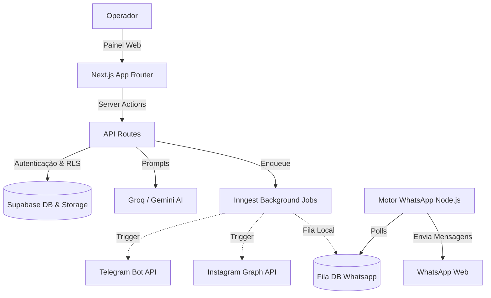

# Caça Oferta Oficial

Plataforma unificada para automação, curadoria e publicação em massa de ofertas de afiliados, focada na alta conversão através de canais sociais e aplicativos de mensageria.

## Visão Geral

O **Caça Oferta Oficial** é um sistema completo projetado para gerenciar o ciclo de vida de ofertas de afiliados. O objetivo é eliminar o esforço manual de coleta de links, tratamento de imagens, rastreamento (SubIDs) e criação de copywriting, consolidando tudo em uma interface centralizada baseada em IA.

**Problema que resolve:** A fragmentação e a ineficiência no processo de marketing de afiliados manual.
**Principais funcionalidades implementadas:**
- **Scraping e Curadoria:** Importação de ofertas de marketplaces (Mercado Livre, Shopee, Amazon, Shein, Magalu) com cálculo de rankeamento e score.
- **Rastreamento Automático:** Geração de links de afiliado encurtados com rastreio de SubID específicos para Telegram, WhatsApp e Instagram.
- **Copywriting por Inteligência Artificial:** Geração de textos focados em gatilhos mentais e conversão utilizando a API do Groq (Llama-3) ou Google Gemini.
- **Disparo Multi-canal:** Publicação automatizada para WhatsApp, Telegram e Instagram (Feed/Stories).
- **Background Jobs:** Processamento assíncrono e orquestração de webhooks usando Inngest.

## Demonstração

O fluxo do sistema opera da seguinte forma:
1. O operador (ou bot via Inngest) coleta a URL/ID de um produto em um marketplace.
2. O scraper extrai os metadados (título, preço original, preço com desconto, imagem, URL original).
3. O motor de Inteligência Artificial gera textos otimizados (hook, body, CTA) customizados para cada rede (WhatsApp, Telegram, Instagram).
4. O módulo de Tracking atrela o ID da oferta a `SubIDs` específicos para gerar URLs rastreáveis únicas por rede.
5. O operador aprova a postagem no Dashboard, e o Inngest ou a API despacha a mensagem imediatamente via Webhooks ou instâncias conectadas.

## Arquitetura

O projeto adota uma arquitetura Serverless baseada em **Next.js 16 (App Router)** com backend orientado a Serverless Functions, persistência e autenticação via **Supabase**, e mensageria distribuída com **Inngest**.



## Tecnologias Utilizadas

- **Frontend:** React 19, Next.js 16 (App Router), Tailwind CSS, Lucide React, Shadcn/UI (UI Components).
- **Backend:** Next.js API Routes, Node.js (`scripts/`), Inngest para orquestração de tarefas assíncronas.
- **Banco de Dados:** Supabase (PostgreSQL), Supabase Auth, Storage (Imagens de Ofertas).
- **Inteligência Artificial:** Groq (`@groq/sdk`), Google Gemini (`@google/generative-ai`).
- **Infraestrutura:** Vercel (Hospedagem Web), Node.js (WhatsApp Worker).
- **APIs:** Telegram Bot API, Instagram Graph API, Scrapers (Marketplaces).
- **Bibliotecas Principais:** `@whiskeysockets/baileys` (WhatsApp), `zod` (Validação de schemas), `pino` (Logging), `sharp` (Imagens).

## Estrutura do Projeto

- `/src/app`: Frontend (Páginas do Dashboard, Autenticação) e Backend (Rotas `/api/` divididas em `ai`, `auth`, `inngest`, `instagram`, `offers`, `publish`, `scraper`, `settings`, `telegram`, `webhooks`, `whatsapp`).
- `/src/components`: Componentes visuais reusáveis organizados por contexto de domínio.
- `/src/lib`: Core da aplicação contendo regras de negócio separadas em módulos (`affiliates`, `ai`, `analytics`, `inngest`, `tracking`, etc.).
- `/supabase`: Configurações de esquema SQL, políticas de RLS e migrações do banco de dados.
- `/scripts`: Ferramentas auxiliares Node.js (ex: Engine de WhatsApp, crons manuais, testes de segurança).
- `/docs`: Documentação técnica focada na manutenibilidade e arquitetura.
- `/apps/chrome-extension`: Ferramenta auxiliar (MVP) para raspagem rápida de dados no navegador.

## Instalação

**Pré-requisitos:**
- Node.js versão 20 ou superior.
- Projeto criado e configurado no Supabase.
- Contas ativas na Inngest, Groq/Gemini, Telegram BotFather e Facebook/Instagram Developer.

**Passo a passo:**
```bash
# Clone o repositório
git clone https://github.com/Andrejr82/Caca_OfertaOficial.git
cd Caca_OfertaOficial

# Instale as dependências
npm install

# Configure as variáveis de ambiente
cp .env.example .env.local
```

## Configuração

O arquivo `.env.local` é o centro de controle. Variáveis obrigatórias incluem:
- **Supabase**: `NEXT_PUBLIC_SUPABASE_URL`, `NEXT_PUBLIC_SUPABASE_ANON_KEY`, `SUPABASE_SERVICE_ROLE_KEY`.
- **IA**: `GROQ_API_KEY` ou `GEMINI_API_KEY`.
- **Inngest**: `INNGEST_EVENT_KEY`, `INNGEST_SIGNING_KEY`.
- **Integrações de Rede**: Chaves de API do Telegram, tokens do Instagram.

*Observação:* Veja `docs/configuration.md` para a lista exaustiva e detalhes de como obter cada chave.

## Execução

### Ambiente de Desenvolvimento
1. Inicie o servidor Web Next.js:
```bash
npm run dev
```
2. O painel estará disponível em `http://localhost:3000`.

### Servidor de WhatsApp (Background)
A conexão com o WhatsApp exige um Worker contínuo. Abra outro terminal e execute:
```bash
npm run whatsapp
```
*Isso gerará um QR Code no terminal. Escaneie-o com seu aplicativo WhatsApp.*

## Funcionalidades

### 🚀 Implementadas (Em Produção)
- Cadastro, leitura e exclusão de ofertas no banco de dados.
- API nativa para importação via extensores (Scraper API em `src/app/api/scraper`).
- Geração de copywriting persuasivo com IA integrado (Groq/Gemini).
- Módulo `lib/tracking` que cria SubIDs exclusivos para Telegram, WhatsApp e Instagram.
- Integração de mensageria assíncrona usando **Inngest** (`publishPostBackground`, `runUserScrapingBackground`).
- Disparo de ofertas para Telegram, Instagram (Feed/Stories) e WhatsApp (`baileys`).
- Dashboard administrativo com componentes unificados (`src/app/(dashboard)`).
- Segurança ativa em nível de banco via **Supabase RLS**.

### 🚧 Em Desenvolvimento / Planejadas
- **Monitoramento de ROI e UTMs:** Aprofundamento do uso da tabela `sales` lendo relatórios automáticos.
- **Chrome Extension Scraper:** Integração avançada via `publish/extension` para publicação direta do navegador.
- **Geração de Imagens para Stories:** Implementação contínua do uso de bibliotecas gráficas e IA.

## Fluxos do Sistema

### Fluxo Operacional de Curadoria
1. Ofertas quentes são inseridas via API de Trends (`/api/scraper/trends`) ou via entrada manual no painel.
2. O job `runUserScrapingBackground` do Inngest processa os links assincronamente.
3. Múltiplas copys (Rascunhos na tabela `posts`) são gravadas após passar pela Engine de AI.
4. O operador revisa no Painel (UI) e autoriza a postagem.

### Fluxo Técnico de Envio
- Ao clicar em "Publicar", o frontend aciona `/api/publish/[canal]`.
- A API cria um evento no **Inngest** (ex: `post/publish`).
- Se canal = `telegram` ou `instagram`, o Inngest dispara a API REST nativa.
- Se canal = `whatsapp`, o status muda e o `whatsapp-engine.cjs` pega o registro da fila interna no PostgreSQL para disparar.

## APIs

A aplicação expõe suas APIs REST na pasta `src/app/api`. As principais são:
- `POST /api/ai/generate`: Envia metadados para IA, gera `affiliate_links` e salva `posts`.
- `POST /api/publish/[canal]`: Publica ou agenda uma oferta em um canal.
- `POST /api/scraper/import`: Ponto de entrada via extensão ou webhooks.
- `GET/POST /api/inngest`: Endpoint para o orquestrador do Inngest rodar funções serverless em background.
*(Consulte `docs/api.md` para a lista completa).*

## Banco de Dados

Modelagem hospedada no **Supabase** (`supabase/schema.sql`):
- `profiles`: Extensão da tabela `auth.users`.
- `offers`: Central de informações e pontuações do produto raw.
- `affiliate_links`: Links rastreáveis (1 `offer` -> N `affiliate_links` separados por canal).
- `posts`: Rascunhos de publicações e histórico das redes.
- `sales`: Conversões e monitoramento de ROI bruto.
- `integration_logs` e `ai_copy_logs`: Tabelas vitais para observabilidade (Auditoria e Testes de Prompts).
- `app_settings`: Armazenamento em formato JSONB das configurações sensíveis dos operadores.

## Deploy

1. **Frontend e API**: Deploy recomendado na Vercel conectado à branch `main` e apontado para as variáveis de ambiente corretas.
2. **Workers (Inngest)**: A Vercel atua como executora Serverless do Inngest, gerida via painel cloud da Inngest.
3. **WhatsApp Engine**: Deve rodar num serviço de contêiner persistente (Railway, Render, VPS) usando `npm run whatsapp`, visto que o WhatsApp Web exige manter os websockets abertos.

## Monitoramento

- **Log Server**: As integrações com APIs salvam sucessos/erros na tabela `integration_logs`.
- **Logs Locais**: A biblioteca `pino` padroniza saídas no terminal.
- O motor da IA armazena estatísticas das escolhas do modelo em `ai_copy_logs` para melhorias de Prompt.

## Segurança

O Caça Oferta Oficial é *Security-first*:
- **RLS (Row Level Security)** em todas as tabelas (o usuário final via token JWT não acessa dados alheios).
- Proteção total de rotas (`src/app/api`) onde o `supabase.auth.getUser()` define as regras.
- Chaves sensíveis (ex: Meta, Groq) nunca vazam para o bundle do Next.js Client.

## Contribuição

Para contribuir:
1. Clone o projeto e crie uma *branch* baseada na issue sendo trabalhada.
2. Certifique-se de validar seus tipos (`npm run typecheck`) e padrões (`npm run lint`).
3. Crie um Pull Request com descrições detalhadas da alteração arquitetural.

## Licença

MIT License.
