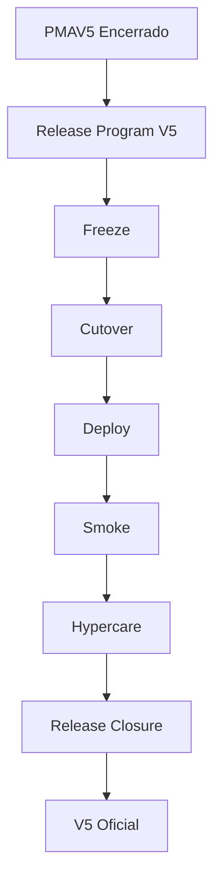

# RELEASE PROGRAM V5

Este diretório governa oficialmente todas as atividades de liberação, incluindo:
Freeze, Cutover, Deploy, Smoke, Hypercare e Closure da versão V5.

O processo de Release V5 é completamente independente da LLM utilizada. O repositório é a Fonte Única da Verdade (SSOT).

## GRAFO CANÔNICO

