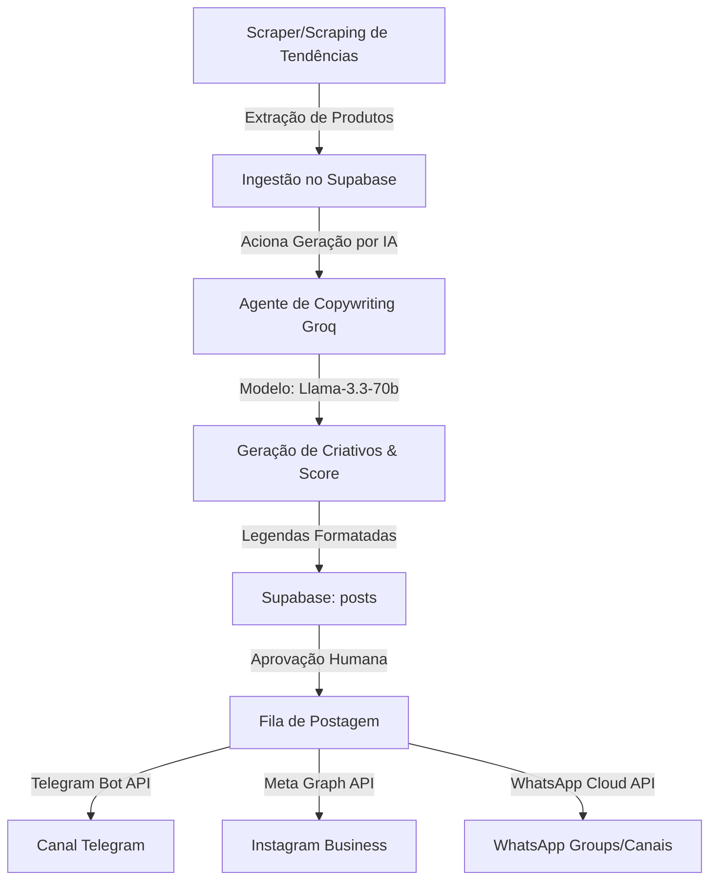

# Documentação Técnica e de Arquitetura — Caça Oferta Oficial (AG-Kit & Groq)

Este documento descreve a arquitetura estendida do sistema **Caça Oferta Oficial**, detalhando as integrações de múltiplos agentes baseados no framework AG-Kit (orquestrado via modelo Groq LLM), estrutura de banco de dados, fluxos de auditoria, segurança e manuais operacionais.

---

## 1. Arquitetura do Sistema

O sistema é construído sobre a arquitetura do **Next.js App Router (React, TypeScript, Tailwind CSS)** integrado ao **Supabase (PostgreSQL, Auth e Storage)** como backend as a service, e consumindo a API da **Groq Cloud** para IA e copywriting.

### Fluxo de Trabalho Multi-Agente


### Componentes de Frontend Principais
* **`AppShell` (`src/components/layout/app-shell.tsx`):** Controla o layout base com o menu lateral unificado (Dashboard, Ofertas, Mensagens, Instagram, Telegram, Facebook, WhatsApp, Tracking, Vendas, Configurações).
* **`TrendsAction` (`src/components/dashboard/trends-action.tsx`):** Formulário interativo para acionar o robô de descoberta de tendências em múltiplos canais (Mercado Livre, Shopee, Shein).
* **`SalesDashboard` (`src/components/dashboard/sales-dashboard.tsx`):** Painel interativo de BI com filtros temporais, gráficos de barra em puro HTML/CSS (comissões por rede/plataforma, top produtos) e suporte a Drill-down.
* **`PostHistoryTable` (`src/components/dashboard/post-history-table.tsx`):** Tabela avançada e interativa com pesquisa, ordenação e filtragem por plataforma e status.

---

## 2. Banco de Dados

O banco de dados PostgreSQL é gerenciado pelo Supabase. Abaixo estão listadas as tabelas principais e seus relacionamentos.

### DDL das Tabelas Principais
* **`profiles`:** Guarda dados do perfil dos usuários.
  * `id` uuid (FK auth.users, PK)
  * `full_name` text
  * `role` text (admin, operator, viewer)
  * `status` text (active, inactive)
* **`offers`:** Cadastro de ofertas e produtos raspados.
  * `id` uuid (PK)
  * `user_id` uuid (FK auth.users)
  * `platform` text (Shopee, Amazon, Magalu, Mercado Livre, Shein, Outro)
  * `product_name` text
  * `original_url` text
  * `current_price` numeric
  * `old_price` numeric
  * `score` numeric (0 a 10)
  * `status` text (draft, approved, posted, rejected)
* **`affiliate_links`:** Links de afiliado com sub_id.
  * `id` uuid (PK)
  * `offer_id` uuid (FK offers)
  * `channel` text (telegram, instagram, whatsapp, facebook, site, blog)
  * `tracked_url` text
  * `clicks` integer
* **`sales`:** Vendas convertidas via links de afiliados.
  * `id` uuid (PK)
  * `offer_id` uuid (FK offers)
  * `affiliate_link_id` uuid (FK affiliate_links)
  * `channel` text
  * `gross_value` numeric
  * `commission_value` numeric
  * `status` text (pending, confirmed, cancelled)
* **`audit_logs`:** Logs de segurança de transações e login/logout.
  * `id` uuid (PK)
  * `user_id` uuid (FK auth.users)
  * `action` text (login, logout, create_user, etc.)
  * `target_user_id` uuid
  * `details` text
  * `created_at` timestamptz

---

## 3. AG-Kit e Estrutura de Agentes (Groq)

A pasta `.agents/` integrada na raiz do projeto fornece as bases de engenharia de prompts e regras para automação.

### Configuração de Agentes e Modelos
Os agentes de descoberta e análise operam no servidor Next.js usando o modelo da **Groq** configurado no `.env.local`:
* **Modelo:** `llama-3.3-70b-versatile`
* **Biblioteca:** Chamadas HTTPS nativas estruturadas para o endpoint de completions da Groq.

### Agentes Criados
1. **Agente Copywriter / Analista de Ofertas:** Especializado em técnicas AIDA, formatação HTML limpa para Telegram, formatação limpa para WhatsApp e cálculo de score com base em regras de conversão.
2. **Agente Scraper de Tendências:** Coleta os mais vendidos do Mercado Livre e simula tendências da Shopee e Shein, acionando a IA para cada produto descoberto.

---

## 4. Manual de Operação

### Para Usuários (Operador / Visualizador)
1. **Descoberta de Tendências:** Acesse o Dashboard, marque os checkboxes das fontes desejadas (Mercado Livre, Shopee, Shein) e clique em **Buscar Tendências**. Novos rascunhos de ofertas serão importados instantaneamente.
2. **Aprovação de Ofertas:** Acesse a tela de Ofertas para validar os preços e visualizar as legendas geradas automaticamente para cada rede social. Altere o status para "Aprovada".
3. **Divulgação / Rastreamento:** Na tela de **Tracking**, selecione a oferta e o canal (Instagram, Facebook, Telegram, WhatsApp, Site, Blog), defina as UTMs (utm_source, utm_campaign) e clique em **Gerar Link**. Utilize o link gerado para as postagens.

### Para Administradores
1. **Auditoria de Ações:** Acesse **Configurações → Usuários & Auditoria** para visualizar em tempo real os logs de logins, logouts, cadastros de novos operadores e redefinição de senhas.
2. **Gerenciamento de Contas:** Crie novas contas de operadores ou visualizadores diretamente na interface informando e-mail, senha e nome. Edite permissões ou desative usuários conforme necessário.
3. **Testes de Conexão:** Acesse a aba **Testes de Conexão** em Configurações para validar se as chaves da API do Telegram Bot, Instagram Meta, WhatsApp e plataformas de e-commerce estão ativas no `.env.local`.

---

## 5. Guia de Desenvolvimento & Deploy

### Instalação Local
1. Instale as dependências:
   ```bash
   npm install
   ```
2. Configure o arquivo `.env.local` na raiz contendo as chaves do Supabase, Telegram Bot, Meta Graph API e a chave da Groq:
   ```env
   GROQ_API_KEY=sua_chave_groq
   GROQ_MODEL=llama-3.3-70b-versatile
   NEXT_PUBLIC_SUPABASE_URL=url_supabase
   NEXT_PUBLIC_SUPABASE_ANON_KEY=chave_anon
   SUPABASE_SERVICE_ROLE_KEY=chave_service_role
   ```
3. Execute o servidor de desenvolvimento:
   ```bash
   npm run dev
   ```

### Manutenção e Validação
* Execute `npm run build` antes de empurrar alterações para o repositório remoto.
* Os scripts de auditoria de qualidade do AG-Kit podem ser executados na raiz usando:
  ```bash
  $env:PYTHONIOENCODING="utf-8"; python .agents/scripts/checklist.py .
  ```
