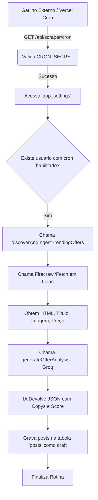

# Arquitetura Real

## 1. Topologia da Solução

Diferente do escopo teórico, a arquitetura do projeto possui dois ambientes operacionais obrigatórios:
1. **Ambiente Web / Nuvem (Vercel ou similar):** Onde o código base em `Next.js` está hospedado. Responde pelas APIs públicas, autenticação, comunicação com APIs externas REST (Telegram, Instagram, Groq) e painel Dashboard.
2. **Ambiente Servidor de Retaguarda (Docker / Máquina Dedicada):** Onde o script `scripts/whatsapp-engine.cjs` DEVE rodar persistentemente com Node.js na porta 3001, mantendo uma sessão Websocket ativa com a Meta (Baileys) via leitura de QR Code. 

Se o painel na nuvem tentar publicar uma oferta no WhatsApp, o `Next.js` disparará um HTTP POST para esse ambiente de retaguarda.

## 2. Fluxograma Cron (Execução Automática)

O fluxo "Automático" é projetado via acionamento REST.

## 3. Limitações de Arquitetura Identificadas
1. **Statefulness do Baileys**: A escolha de usar Baileys quebra o padrão serverless do projeto Next.js. Exige DevOps contínuo para manter a porta 3001 ativa e a sessão salva na pasta `.baileys_auth`.
2. **Dependência de Parsing**: Sem acesso via API da Shopee, Amazon ou MLivre, o sistema faz extração agressiva de código-fonte (Regex e JSON-LD em `scraper.ts`). Isso significa que a aplicação quebra imediatamente se o Marketplace mudar a classe CSS ou estrutura do site (ex: mudança do seletor `andes-money-amount__fraction` no ML).
3. **Limite de Requisição da Groq**: A API é acessada serialmente via uma fila manual em RAM (`groqQueue`). Em cenários de tráfego ultra elevado ou cron operando com centenas de links, a aplicação poderá enfileirar memória local podendo causar "Out of Memory" ou timeouts severos da Vercel Edge.
