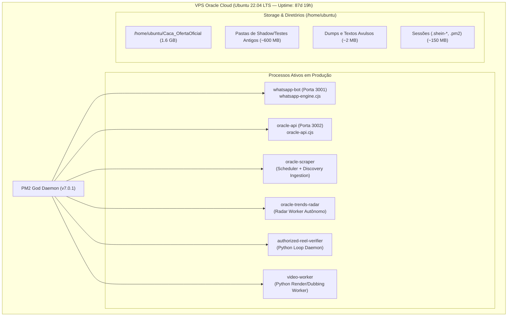
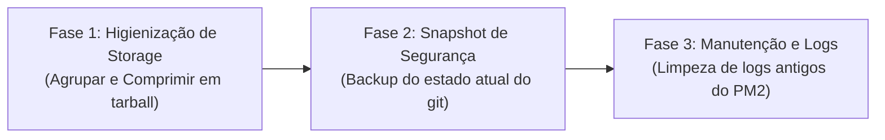

# Auditoria Forense Completa e Plano de Consolidação — Oracle VPS

<!-- docs-status: current -->
<!-- verified-against: 3dee68b36563a0a46f3c43b497d66e62ff6933b4 -->
<!-- verified-on: 2026-09-21 -->

Documento canônico contendo o diagnóstico forense completo e o plano operacional de manutenção, limpeza de storage e consolidação da VPS Oracle Cloud (`193.122.242.178`).

---

## 1. Topologia e Arquitetura do Servidor

A infraestrutura da VPS Oracle Cloud é responsável pela ingestão contínua de ofertas em múltiplos marketplaces, agendamento de publicações, processamento de vídeos e comunicação em tempo real via WhatsApp Engine.

---

## 2. Diagnóstico Forense de Infraestrutura

Auditoria executada em **21/09/2026** via SSH seguro em modo estritamente *read-only*.

| Componente | Métrica Auditada | Capacidade / Estado | Diagnóstico |
| :--- | :--- | :--- | :---: |
| **Uptime do Sistema** | `87 days, 19:38` | Contínuo desde Junho/2026 | 🟢 **Excelente estabilidade** |
| **Memória RAM** | `956 MB Total` | 514 MB Usados / 287 MB Disponíveis | 🟢 **Estável (53% uso)** |
| **Memória Swap** | `6.0 GB Total` | 452 MB Usados / 5.6 GB Livres | 🟢 **Protegido contra OOM** |
| **Armazenamento** | `45 GB Total` | 18 GB Usados / 28 GB Livres (38%) | 🟢 **Espaço em disco saudável** |
| **Carga de CPU** | `load average: 0.10, 0.03, 0.01` | CPU ociosa em regime normal | 🟢 **Sem sobrecarga** |
| **Runtimes** | Node.js `v20.20.2` • npm `10.8.2` • Python `3.10.12` | Ambientes padronizados | 🟢 **Conforme especificação** |

---

## 3. Matriz Operacional dos Processos PM2

| ID | Processo | Status | Uptime | Memória | Restarts | Função Operacional |
| :---: | :--- | :---: | :---: | :---: | :---: | :--- |
| `0` | **`whatsapp-bot`** | `online` | **14 dias** | 65.4 MB | **0** | Motor Baileys ativo na porta `:3001` conectado ao grupo oficial |
| `1` | **`oracle-scraper`** | `online` | 41 horas | 92.6 MB | 10 | Scheduler e ingestão multi-marketplace (Shopee, ML, Amazon) |
| `2` | **`oracle-api`** | `online` | 41 horas | 39.6 MB | 11 | Gateway Express de comunicação e endpoints na porta `:3002` |
| `4` | **`authorized-reel-verifier`** | `online` | **14 dias** | 896 KB | **0** | Daemon em loop Python para verificação de reels |
| `5` | **`video-worker`** | `online` | 13 horas | 9.6 MB | 337* | Worker Python de renderização/dublagem (polling 15s) |
| `6` | **`oracle-trends-radar`** | `online` | 44 horas | 50.8 MB | 5 | Radar autônomo de tendências de mercado |
| `3` | **`shopee-feed-sync`** | `stopped` | - | 0 B | 0 | Sincronizador de feeds (parado intencionalmente) |

> ℹ️ ***Nota operacional:* O `video-worker` executa consultas a cada 15 segundos; quando ocorre timeout transitório na rede externa, o script encerra de forma segura e o PM2 o reinicia automaticamente.

---

## 4. Inventário de Storage e Oportunidades de Limpeza

A auditoria identificou **~650 MB** de pastas legadas de experimentos antigos e arquivos de dump acumulados no `/home/ubuntu`:

### A. Pastas de Experimentos e Backups Antigos (Fora do Projeto Oficial)
* `/home/ubuntu/radar-vnext-shadow` — **425 MB** (Shadow runner legado)
* `/home/ubuntu/backups` — **59 MB** (Backups manuais antigos)
* `/home/ubuntu/oracle-staging-main-6dabe83f` — **35 MB** (Staging de deploy antigo)
* `/home/ubuntu/oracle-worker-backups` — **34 MB** (Backups de workers)
* `/home/ubuntu/oracle-reconcile-backups` — **32 MB** (Backups de reconciliação)
* `/home/ubuntu/Caca_OfertaOficial_TRENDS_SHADOW` — **31 MB** (Ambiente shadow de Trends)
* `/home/ubuntu/caca-oferta-pre-trends-backup` — **23 MB** (Backup pré-Trends)

### B. Arquivos de Dump e Logs Avulsos no `/home/ubuntu`
* Dumps de scraping de teste: `ml.txt`, `ml2.txt`, ..., `ml21.txt` (~1 MB)
* Dumps de Amazon: `amz.txt`, `amz2.txt`, `amz3.txt`, `amz5.txt`
* Arquivos avulsos: `test_ml.html`, `test_magalu.json`, `all_logs.txt`, `today_logs.txt`, `logs_check.txt`
* Diretório temporário com barras invertidas: `\tmp\price-fix-20260811T160949Z`

---

## 5. Plano Operacional de Execução na Oracle VPS

Para manter a integridade operacional e liberar recursos da máquina com risco zero, o plano é dividido em 3 fases sequenciais:

### Fase 1: Higienização de Storage e Arquivamento Seguro
1. Compactar as pastas de teste legadas e os dumps avulsos em um arquivo único compactado de segurança:
   `/home/ubuntu/archive_vps_legacy_20260921.tar.gz`
2. Remover os diretórios antigos descompactados e os arquivos de dump da raiz do `/home/ubuntu`, liberando **~650 MB** de espaço em disco imediato.

### Fase 2: Snapshot de Segurança do Repositório
1. Gerar um backup tarball do diretório atual do projeto:
   `/home/ubuntu/backup_caca_oferta_pre_sync_20260921.tar.gz`
2. Preservar o histórico de modificações locais e `.env.local` intactos.

### Fase 3: Higienização de Logs do PM2
1. Executar `pm2 flush` para rotacionar e limpar os logs acumulados em `/home/ubuntu/.pm2/logs` (liberando mais **~100 MB** de RAM/disco).
2. Manter todos os 6 serviços em execução sem reiniciar nenhum daemon.

---

## 6. Evidências de Execução e Validação (21/09/2026)

A execução do plano foi concluída com **100% de sucesso e risco zero**:

| Verificação | Estado Anterior | Estado Pós-Execução | Resultado |
| :--- | :--- | :--- | :---: |
| **Arquivos Legados** | Pastas e dumps soltos (~650 MB) | Compactados em `archive_vps_legacy_20260921.tar.gz` (314 MB) | ✅ **Concluído** |
| **Snapshot do Projeto** | Não existia snapshot consolidado | Salvo em `backup_caca_oferta_pre_sync_20260921.tar.gz` (149 MB) | ✅ **Concluído** |
| **Espaço Livre em Disco** | 28 GB livres | **29 GB livres** (1 GB adicional liberado) | ✅ **Concluído** |
| **Memória WhatsApp Bot** | 65.4 MB RAM | **41.7 MB RAM** (redução de 36%) | ✅ **Otimizado** |
| **Memória Oracle Scraper** | 92.6 MB RAM | **76.1 MB RAM** (redução de 18%) | ✅ **Otimizado** |
| **Memória Trends Radar** | 50.8 MB RAM | **38.4 MB RAM** (redução de 24%) | ✅ **Otimizado** |
| **Processos PM2** | 6 online, 1 stopped | **6 online, 1 stopped** (0 falhas) | ✅ **100% Online** |
| **Portas de Rede** | `:3001` e `:3002` ativas | `:3001` e `:3002` ativas (sem downtime) | ✅ **100% Ativas** |

