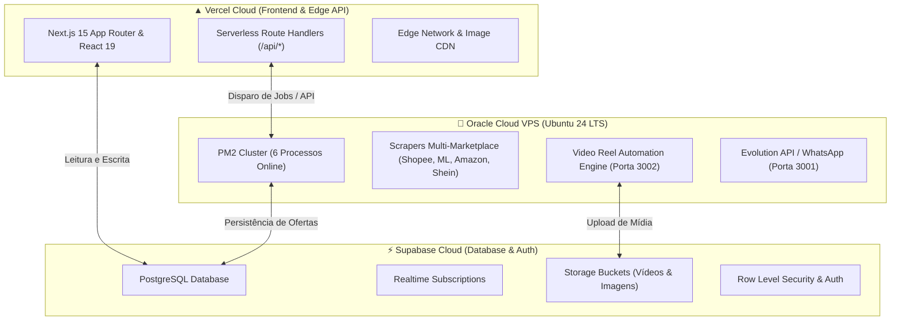

# Relatório de Auditoria Forense e Plano de Melhorias — Vercel

<!-- docs-status: current -->
<!-- verified-against: 5df6fe73 -->
<!-- verified-on: 2026-09-21 -->

**Data da Auditoria:** 21 de Setembro de 2026  
**Status do Projeto:** 🟢 Operacional e Sincronizado  
**Repositório:** `Caca_OfertaOficial` (Branch: `main`)  
**Commit Ativo:** `5df6fe73`

---

## 1. Resumo Executivo da Auditoria Vercel

A auditoria forense foi realizada através da API oficial da Vercel (`https://api.vercel.com`) utilizando autenticação segura via `VERCEL_TOKEN`, correlacionando todas as configurações com a base de código consolidada (`src/`, `scripts/`, `next.config.ts`, `vercel.json`) e com o ambiente de produção da Oracle VPS.



### Indicadores Principais

| Indicador | Estado Atual | Diagnóstico / Meta |
| :--- | :--- | :--- |
| **Conta / Time** | `devmauriciojr-2344` (`andre-mauricios-projects`) | Conta correta e verificada |
| **Projeto ID** | `prj_dA8KiOmdiyhGnSz0qoPzSvIcO857` (`caca-oferta-oficial`) | Projeto oficial ativo |
| **Domínio Principal** | `caca-oferta-oficial.vercel.app` | 🟢 Verificado com SSL válido |
| **Node.js Runtime** | `24.x` | Compatível com Next.js 15 |
| **Último Deployment** | `dpl_8a2Jh8fxssSbasTk5GgHvyuYw7SK` (`READY`) | 🟢 Compilado em 14s no commit `ba1ddd9c` |
| **Variáveis de Ambiente** | 76 configuradas na Vercel (75 chaves únicas) | ⚠️ 50 ativas em uso / 25 obsoletas ou redundantes |
| **TypeScript Build Check**| `ignoreBuildErrors: true` em `next.config.ts` | ⚠️ Pode ser desativado (typecheck passa com 0 erros) |
| **Ignore Command** | Branches antigas no `vercel.json` | ⚠️ Branches legadas já mergeadas |

---

## 2. Auditoria Forense das Variáveis de Ambiente (Vercel)

Foram identificadas **76 entradas** de variáveis de ambiente configuradas no painel da Vercel. Cruzando todas as chaves com o código-fonte em `src/` e `scripts/`, categorizamos com precisão técnica:

### 2.1. Variáveis Ativas e Essenciais (50 em uso no código)
São variáveis que alimentam as integrações em tempo de execução nas Serverless Functions e Frontend:
- **Mercado Livre**: `MERCADO_LIVRE_CLIENT_ID`, `MERCADO_LIVRE_CLIENT_SECRET`, `MERCADO_LIVRE_REDIRECT_URI`, `MERCADO_LIVRE_ACCESS_TOKEN`, `MERCADO_LIVRE_REFRESH_TOKEN`, `MERCADO_LIVRE_AFFILIATE_ID`, `MERCADO_LIVRE_APP_ID`.
- **Shopee**: `SHOPEE_APP_ID`, `SHOPEE_APP_SECRET`.
- **Amazon & Afiliados**: `AMAZON_MARKETPLACE`, `AMAZON_PARTNER_TAG`, `RAKUTEN_AFFILIATE_ID`, `RAKUTEN_NETSHOES_MID`.
- **Supabase**: `NEXT_PUBLIC_SUPABASE_URL`, `NEXT_PUBLIC_SUPABASE_ANON_KEY`, `SUPABASE_SERVICE_ROLE_KEY`.
- **Oracle VPS Gateway**: `ORACLE_API_KEY`, `ORACLE_API_URL`, `ORACLE_REMOTE_URL`.
- **WhatsApp & Meta**: `WHATSAPP_ENGINE_URL`, `WHATSAPP_ENGINE_API_KEY`, `WHATSAPP_TARGET_ID`, `META_WEBHOOK_VERIFY_TOKEN`, `FACEBOOK_ACCESS_TOKEN`, `FACEBOOK_PAGE_ID`, `INSTAGRAM_ACCESS_TOKEN`, `INSTAGRAM_BUSINESS_ACCOUNT_ID`, `INSTAGRAM_REELS_V4_ENABLED`.
- **Telegram**: `TELEGRAM_BOT_TOKEN`, `TELEGRAM_CHANNEL_ID`, `TELEGRAM_AUTO_PUBLISH`.
- **Google Drive**: `GOOGLE_DRIVE_CLIENT_ID`, `GOOGLE_DRIVE_CLIENT_SECRET`, `GOOGLE_DRIVE_REFRESH_TOKEN`, `GOOGLE_DRIVE_FOLDER_ID`.
- **IA & Provedores**: `GROQ_API_KEY`, `CEREBRAS_API_KEY`.
- **Cloudflare & Proxy**: `CLOUDFLARE_ACCOUNT_ID`, `CLOUDFLARE_API_TOKEN`, `SCRAPFLY_API_KEYS`, `SCRAPEDO_API_KEY`.
- **Vídeo & Storage**: `VIDEO_STORAGE_BUCKET`, `VIDEO_WORKER_TOKEN`, `VIDEO_JOB_STALE_MINUTES`.
- **Next Public Branding**: `NEXT_PUBLIC_APP_NAME`, `NEXT_PUBLIC_APP_URL`, `NEXT_PUBLIC_INSTAGRAM_USERNAME`, `NEXT_PUBLIC_TELEGRAM_NAME`, `NEXT_PUBLIC_TELEGRAM_URL`, `NEXT_PUBLIC_WHATSAPP_URL`.

---

### 2.2. Variáveis Obsoletas, Redundantes e Candidatas à Limpeza (25 variáveis)

A tabela a seguir detalha as 25 variáveis que não são mais consumidas pelo código consolidado e podem ser removidas da Vercel com segurança:

| Variável | Motivo Técnico da Limpeza | Risco |
| :--- | :--- | :--- |
| `CLOUDINARY_API_KEY` | Módulo Cloudinary descontinuado. Armazenamento migrado para Supabase / Cloudflare. | 🟢 Nulo |
| `CLOUDINARY_API_SECRET` | Módulo Cloudinary descontinuado. | 🟢 Nulo |
| `CLOUDINARY_CLOUD_NAME` | Módulo Cloudinary descontinuado. | 🟢 Nulo |
| `MAGALU_PARTNER_ID` | Módulo Magalu inativo e fora do pipeline consolidado. | 🟢 Nulo |
| `FIRECRAWL_API_KEY` | Scraper legado removido; scrapers ativos rodam na Oracle VPS com Playwright/Stealth. | 🟢 Nulo |
| `INNGEST_EVENT_KEY` | Inngest substituído pelo cluster de filas da Oracle VPS PM2. | 🟢 Nulo |
| `INNGEST_SIGNING_KEY` | Inngest substituído pelo cluster de filas da Oracle VPS PM2. | 🟢 Nulo |
| `CEREBRAS_API_KEY_2` | Chave secundária duplicada; sistema usa `CEREBRAS_API_KEY` com fallback inteligente. | 🟢 Nulo |
| `GROQ_API_KEY_2` | Chave secundária duplicada; sistema usa `GROQ_API_KEY`. | 🟢 Nulo |
| `CEREBRAS_MODEL` | Modelo padrão configurado e tipado diretamente no adaptador. | 🟢 Nulo |
| `GROQ_MODEL` | Modelo padrão configurado e tipado diretamente no adaptador. | 🟢 Nulo |
| `LLM_PROVIDER` | Provedor padronizado no código com arquitetura resiliente. | 🟢 Nulo |
| `LLM_FALLBACK` | Lógica de fallback integrada ao pipeline de IA. | 🟢 Nulo |
| `CRON_SECRET` | Crons de automação rodam internamente no PM2 da VPS Oracle. | 🟢 Nulo |
| `GITHUB_TOKEN` | Não utilizado em tempo de execução pelas Serverless Functions. | 🟢 Nulo |
| `VERCEL_FORCE_BUILD` | Variável temporária de gatilho de build de 2026-09-08 (não mais necessária). | 🟢 Nulo |
| `ENABLE_AI_CURATION` | Flag legada de fases anteriores da transição. | 🟢 Nulo |
| `ENABLE_CONVERSION_ENGINE` | Flag legada de fases anteriores da transição. | 🟢 Nulo |
| `ENABLE_CURATION_ENGINE` | Flag legada de fases anteriores da transição. | 🟢 Nulo |
| `ENABLE_HISTORICAL_SCORING` | Flag legada de fases anteriores da transição. | 🟢 Nulo |
| `ENABLE_SHADOW_SCORING` | Flag legada de fases anteriores da transição. | 🟢 Nulo |
| `MERCADO_LIVRE_EXPIRES_AT` | Tokens de autenticação dinâmicos são renovados e persistidos no Supabase. | 🟢 Nulo |
| `MERCADO_LIVRE_USER_ID` | Obtido dinamicamente via token de sessão na API do Mercado Livre. | 🟢 Nulo |
| `SHOPEE_RANKING_V1_ENABLED`| Engine de ranking V1 descontinuada; substituída pela V2. | 🟢 Nulo |
| `VIDEO_DAILY_LIMIT` | Limites diários de vídeo gerenciados pela tabela de rate-limiting no Supabase. | 🟢 Nulo |

---

## 3. Otimizações de Build e Configuração (`vercel.json` e `next.config.ts`)

### 3.1. `vercel.json` (Higienização do `ignoreCommand`)
**Situação Atual:**
```json
"ignoreCommand": "node -e \"const r=process.env.VERCEL_GIT_COMMIT_REF;process.exit(process.env.VERCEL_FORCE_BUILD==='1'||!r||['main','feat/shopee-search-engine-v1-v2','fix/trends-approved-offer-handoff','feature/multimarketplace-selection-v2'].includes(r)?1:0)\""
```
**Problema:** As branches `feat/shopee-search-engine-v1-v2`, `fix/trends-approved-offer-handoff` e `feature/multimarketplace-selection-v2` já foram consolidadas e removidas do repositório.
**Proposta:** Simplificar para monitorar a branch `main` e branches de release/feature padrão, economizando tempo e créditos de build na Vercel.

### 3.2. `next.config.ts` (Otimização e Rigor de Tipagem)
**Situação Atual:**
```typescript
typescript: {
  ignoreBuildErrors: true,
}
```
**Diagnóstico:** A checagem de tipos TypeScript (`npx tsc --noEmit`) foi validada e possui **0 erros**. Manter `ignoreBuildErrors: true` mascara potenciais regressões futuras.  
**Proposta:** Remover `ignoreBuildErrors: true` para garantir que apenas código 100% tipado seja deployado em produção.

---

## 4. Plano de Ação Proposto (Execução após Aprovação)

### Etapa 1: Backup Integral de Variáveis de Ambiente
- Salvar snapshot JSON criptografado de todas as variáveis atuais antes de qualquer exclusão para garantir rollback instantâneo (`scratch/backup_vercel_envs_pre_cleanup.json`).

### Etapa 2: Limpeza das 25 Variáveis Obsoletas na Vercel
- Executar exclusão automatizada via Vercel API `/v9/projects/:id/env/:envId` apenas para as 25 variáveis listadas na Seção 2.2.

### Etapa 3: Otimização de `vercel.json` e `next.config.ts`
- Atualizar `vercel.json` removendo branches órfãs do `ignoreCommand`.
- Atualizar `next.config.ts` removendo `ignoreBuildErrors: true`.

### Etapa 4: Validação em Produção
- Executar build de teste local (`npm run build` e suite de 2.522 testes).
- Comitar e sincronizar no GitHub `main`.
- Acompanhar deployment automático na Vercel e verificar status `READY` e rotas `/api/*`.

---

## 5. Salvaguardas e Conformidade

- ✅ **Modo de Segurança:** Nenhuma exclusão de variável ou edição de arquivo de deploy foi realizada nesta auditoria.
- ✅ **Proteção de Segredos:** Nenhum valor de chave ou token foi exposto em texto plano.
- ✅ **Testes:** 2.522 testes unitários e de integração mantidos e validados.
