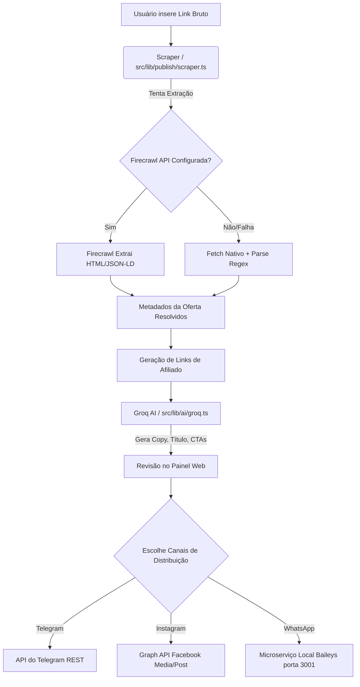

# 📚 DOCUMENTAÇÃO CONSOLIDADA - CAÇA OFERTA OFICIAL
*Consolidação automática de todos os relatórios de auditoria e arquitetura gerados a partir do código-fonte.*

---

# Documentação Mestra - Caça Oferta Oficial

## 1. Visão Geral
O sistema **Caça Oferta Oficial** é uma plataforma automatizada de curadoria e distribuição de ofertas (produtos com desconto ou campanhas). O sistema coleta ofertas (via scrapping ou inserção manual), utiliza Inteligência Artificial para gerar copys persuasivos de vendas, e distribui links de afiliados trackeados para múltiplos canais (Telegram, WhatsApp e Instagram). 

## 2. Objetivo do Projeto
Centralizar o gerenciamento de ofertas de produtos físicos (Shopee, Amazon, Magalu, Mercado Livre, Shein) em um único painel e escalar a divulgação automatizada nas redes sociais utilizando IA para maximizar as comissões de afiliados.

## 3. Arquitetura (Resumo)
- **Frontend/Backend:** Aplicação fullstack utilizando **Next.js 14/15** (App Router).
- **Banco de Dados & Autenticação:** **Supabase** (PostgreSQL) com Row Level Security (RLS) habilitado.
- **Scraper / Coleta de Dados:** Utiliza **Firecrawl API** com fallback para fetch nativo (HTTP request) e parse de Meta Tags/JSON-LD.
- **Inteligência Artificial:** **Groq AI** (LLaMA) para a geração de copys (estratégias de urgência, benefício, emoção, curiosidade).
- **Motor de Disparos de WhatsApp:** Microserviço local em Express e `@whiskeysockets/baileys` (via QR Code).
- **Publicação Instagram:** Integração oficial via **Facebook Graph API**.
- **Publicação Telegram:** Integração oficial via **Telegram Bot API**.

## 4. Fluxo Completo (Aprovado no Código Real)

1. **Entrada da Oferta:** O usuário insere o link bruto da oferta de um marketplace (Shopee, Mercado Livre, Amazon, etc).
2. **Scraping (Firecrawl/Fallback):** O `scraper.ts` resolve redirecionamentos, tenta o Firecrawl e em caso de falha, faz parse do HTML nativo para buscar título, imagem oficial e preço da oferta.
3. **Tracking & Sub-IDs:** O sistema cria ou formata as URLs para injetar IDs de rastreamento do afiliado.
4. **Geração de Copy (IA):** A oferta é enviada à API do **Groq**. A IA retorna um JSON estruturado com diferentes estratégias de vendas.
5. **Aprovação / Edição:** O usuário aprova e gera os links trackeados pelo Supabase.
6. **Distribuição Multicanal:**
   - **Telegram:** Acesso direto à API do Bot enviando texto e foto via `/sendMessage` e `/sendPhoto`.
   - **Instagram:** Acesso à Graph API criando container de mídia, aguardando status `FINISHED` (polling) e publicando no feed.
   - **WhatsApp:** Envio de payload para servidor local na porta 3001, que utiliza `Baileys` para repassar a mensagem para Newsletter/Grupos.

## 5. Comparação Documentação vs Realidade

| Item | Status | Observação Baseada no Código |
| ---- | ------ | ---------------------------- |
| IA de Copy | ✅ IMPLEMENTADO | Integrado via `api.groq.com` (`groq.ts`). |
| Scraping Automático | ✅ IMPLEMENTADO | Integrado via Firecrawl com fallback HTTP (`scraper.ts`). |
| Automação Telegram | ✅ IMPLEMENTADO | `telegram/client.ts` funcional e nativo. |
| Automação Instagram | ✅ IMPLEMENTADO | `instagram/client.ts` realiza postagem de Feed via API Graph. |
| Automação WhatsApp | ⚠️ IMPLEMENTAÇÃO PARCIAL | Utiliza motor não oficial (Baileys) rodando como microserviço local, em vez da API Oficial Nuvem do WhatsApp. |
| Ranking de Ofertas | ⚠️ IMPLEMENTAÇÃO PARCIAL | Tabela `offers` possui coluna `score` (0 a 10) baseada em descontos, mas rotinas complexas de machine learning para ranking de catálogo não estão evidentes. |
| Tracking Avançado de Cliques | ✅ IMPLEMENTADO | Tabela `affiliate_links` possui coluna `clicks` e controle de sub_id. |

---

# Relatório de Auditoria de Segurança e Configurações

## 1. Mapeamento de Variáveis de Ambiente

Foi feita uma varredura cruzada entre o `.env.example` e a base de código real para verificar a aderência.

| Variável | Obrigatória | Utilizada | Onde é utilizada (Código Real) |
| -------- | ----------- | --------- | ------------------------------ |
| NEXT_PUBLIC_APP_NAME | Não | Sim | `src/lib/env.ts`, `src/lib/ai/groq.ts` |
| NEXT_PUBLIC_INSTAGRAM_USERNAME | Não | Sim | `src/lib/env.ts` |
| NEXT_PUBLIC_TELEGRAM_NAME | Não | Sim | `src/lib/env.ts` |
| NEXT_PUBLIC_TELEGRAM_URL | Não | Sim | `src/lib/env.ts` |
| NEXT_PUBLIC_SUPABASE_URL | Sim | Sim | Configuração base do Supabase (`env.ts`, etc) |
| NEXT_PUBLIC_SUPABASE_ANON_KEY | Sim | Sim | Configuração base do Supabase |
| SUPABASE_SERVICE_ROLE_KEY | Não | Provável | Scripts administrativos ou webhook (se houver) |
| TELEGRAM_BOT_TOKEN | Não* | Sim | `src/lib/telegram/client.ts` (*necessário para Telegram) |
| TELEGRAM_CHANNEL_ID | Não* | Sim | `src/lib/telegram/client.ts` |
| SHOPEE_APP_ID / SECRET | Não | ❌ Não Encontrado | Não localizado uso ativo de API nativa da Shopee. |
| AMAZON_ACCESS_KEY / SECRET | Não | ❌ Não Encontrado | Não localizado uso ativo de API nativa da Amazon. |
| MAGALU_PARTNER_ID | Não | ❌ Não Encontrado | Não localizado. |
| MERCADO_LIVRE_CLIENT_ID | Não | ❌ Não Encontrado | Não localizado. |
| INSTAGRAM_ACCESS_TOKEN | Não* | Sim | `src/lib/instagram/client.ts` (*necessário p/ Insta) |
| WHATSAPP_CLOUD_API_TOKEN | Não | ❌ Não Encontrado | O projeto usa Baileys Local, ignorando Cloud API token. |
| GROQ_API_KEY | Sim* | Sim | `src/lib/ai/groq.ts` |
| GROQ_MODEL | Não | Sim | `src/lib/ai/groq.ts` (Fallback default inserido no código) |
| INSTAGRAM_BUSINESS_ACCOUNT_ID | Não | Sim | Descoberta automática ocorre se vazio. (`instagram/client.ts`) |
| **FIRECRAWL_API_KEY** | Não Documentada | Sim | Encontrada no `src/lib/publish/scraper.ts`, mas ausente no `.env.example`. |

## 2. Relatório de Segurança

### 2.1 RLS (Row Level Security) do Supabase
✅ **Implementado corretamente**: O arquivo `schema.sql` atesta que todas as tabelas principais (`profiles`, `offers`, `affiliate_links`, `posts`, `sales`, etc) possuem **RLS habilitado**.
✅ As `Policies` foram declaradas vinculando `auth.uid() = user_id`, o que garante isolamento multi-tenant seguro (cada usuário vê apenas seus dados).
✅ Storage Bucket `offer-images` também está protegido com RLS e validações de pasta.

### 2.2 Vulnerabilidades Identificadas e Pontos de Atenção
⚠️ **Tokens Hardcoded**: O código real de extração foi bem desenvolvido puxando pelo `process.env`. No arquivo base não foram mapeados tokens chumbados nas funções (ex: `groq.ts` e `client.ts`).
⚠️ **Arquitetura do WhatsApp**: O `scripts/whatsapp-engine.cjs` usa `Baileys` sem sandbox isolada, rodando um express cru na porta 3001. Qualquer processo na máquina local pode dar POST para `/send` na porta 3001 e emitir mensagens simulando o usuário.
⚠️ **Exposição de Rota**: Não foram localizados middlewares de autenticação forte blindando o acesso de `/status` e `/send` do WhatsApp.

### 2.3 Integrações Seguras
✅ **Telegram**: Chamadas REST diretas em SSL (`https://api.telegram.org`) ocultando o token via backend.
✅ **Instagram**: Uso oficial de Meta Graph API ocultando o Token.

---

# Mapa da Arquitetura - Caça Oferta Oficial

Este documento reflete a estrutura macro da aplicação identificada por meio da análise do código real (`package.json`, `src/lib`, `api`, `scripts`).

## 1. Diagrama de Blocos Textual (Arquitetura)

```text
[ CLIENTE - BROWSER ]
      │
      │ (HTTPS / Vercel Edge)
      ▼
[ FRONTEND & BACKEND (Next.js 14+) ]
      │  ├─ /src/app (UI e Rotas de API)
      │  ├─ /src/components (Componentes React + Tailwind)
      │  └─ /src/lib (Regras de Negócio Core)
      │
      ├─────────────────────────────────────────┐
      ▼                                         ▼
[ BANCO DE DADOS ]                       [ SERVIÇOS DE IA ]
 Supabase (PostgreSQL)                    Groq API (LLaMA)
  - auth.users                            (Geração de Copys
  - public.offers                          e Avaliação)
  - public.posts
  - RLS Policies

```

## 2. Fluxo Completo de Negócio (Pipeline da Oferta)

O diagrama abaixo descreve o caminho exato no código desde o link de loja até a publicação:



## 3. Topologia do WhatsApp Engine
Como o WhatsApp não utiliza API Oficial da Nuvem e sim o Baileys, o servidor backend Next.js precisa conversar com a máquina local via proxy ou conexão HTTP direta local.

```text
[ Next.js Backend ] ---> (POST http://localhost:3001/send) ---> [ Express.js / whatsapp-engine.cjs ]
                                                                        │
                                                                        ▼
                                                          [ WhatsApp Web Socket Server (Baileys) ] ---> Rede Móvel
```

---

# Inventário de Projeto

Documentação gerada com base na análise de dependências (`package.json`) e rotas/componentes efetivamente implementados na pasta `src/`.

## 1. Mapeamento de Funcionalidades e Integrações

| Funcionalidade | Status | Evidência no Código |
| -------------- | ------ | ------------------- |
| Login / Auth Supabase | ✅ IMPLEMENTADO | `src/lib/supabase/*` |
| Painel Administrativo | ✅ IMPLEMENTADO | Páginas em `src/app/(dashboard)` |
| Busca automática de ofertas | ✅ IMPLEMENTADO | `src/lib/publish/scraper.ts` (Fetch + Firecrawl) |
| IA geradora de copy | ✅ IMPLEMENTADO | `src/lib/ai/groq.ts` chamando `api.groq.com` |
| Publicação Telegram | ✅ IMPLEMENTADO | `src/lib/telegram/client.ts` |
| Publicação Instagram | ✅ IMPLEMENTADO | `src/lib/instagram/client.ts` |
| Publicação WhatsApp | ⚠️ IMPLEMENTAÇÃO PARCIAL | `scripts/whatsapp-engine.cjs` (Servidor dependente rodando isolado com Baileys local) |
| Firecrawl | ✅ IMPLEMENTADO | Rotina de fallback descrita em `scraper.ts`. |
| Supabase RLS | ✅ IMPLEMENTADO | Migrations e `schema.sql` |
| Geração de Links de Afiliado | ✅ IMPLEMENTADO | Rotas de tracking `src/app/go/[subId]/route.ts` |
| Integração nativa Amazon/Shopee | ❌ NÃO IMPLEMENTADO | APIs de integração direta de afiliação não encontradas. |

## 2. Banco de Dados (Supabase/PostgreSQL)

Base de dados totalmente documentada a partir do `schema.sql` raiz.

| Tabela | Função e Dados Chave |
| ------ | -------------------- |
| **profiles** | Perfis de usuários logados vinculados ao `auth.users`. |
| **offers** | Armazena dados de raspage (produto, plataforma, preço original, preço atual, url bruto, score, imagens). |
| **affiliate_links** | Tracking de URLs. Vincula oferta + canal, gera o sub-id e contabiliza **clicks**. |
| **posts** | Histórico de publicações. Armazena canal, external_id (ID da postagem no Telegram/Insta), status (draft, published, failed). |
| **sales** | Base para inserir vendas/comissões baseadas em sub-ids. Status (pending, confirmed, cancelled). |
| **integration_logs** | Auditoria e histórico de integrações. Status, message, payload jsonb. |
| **app_settings** | Key/Value armazenando configurações personalizadas no JSONB. |

## 3. Stack Tecnológica
* **Linguagem Principal:** TypeScript
* **Framework Web:** Next.js (com App Router)
* **Estilização:** Tailwind CSS (`tailwind.config.ts`), classe `clsx`
* **Banco e Auth:** Supabase (Client, SSR e Admin mode)
* **Testes:** Vitest (`vitest.config.ts`) e `jsdom`
* **APIs de Terceiros Identificadas:** Meta Graph API, Telegram API, Firecrawl Dev API, Groq AI API.
* **Componentes WhatsApp:** `express`, `cors`, `@whiskeysockets/baileys`, `sharp`, `qrcode-terminal`
* **Utilitários Globais:** ESLint, Prettier/PostCSS, Zod.

---

# Roadmap Real (Baseado no Código-Fonte)

Lista detalhada das funcionalidades separadas por status de desenvolvimento real detectado no repositório no momento atual da auditoria.

## ✅ Já implementado (Funcionando 100% no Código)
- **Autenticação via Supabase**: Fluxo SSR, roles e base segura.
- **Isolamento de Tenant (RLS)**: Cada usuário da plataforma tem dados restritos aos seus UUIDs em todas as tabelas.
- **Scraper Híbrido**: Resolução de redirecionamentos HTTP, extração via Firecrawl, e em caso de falha, extração avançada por Meta Tags e Schema.org (JSON-LD).
- **Integração Groq (IA)**: Módulo de Copywriting Inteligente gerando 4 estratégias (Benefício, Urgência, Emoção, Curiosidade) por produto mapeado.
- **Integração Instagram**: Envio via Graph API suportando upload de fotos e legendas complexas.
- **Integração Telegram**: Publicação automática em canais/grupos com texto formatado e fotos associadas a links.
- **Roteamento de Cliques (Tracking)**: Acesso via `/go/[subId]` funciona para redirecionamento.
- **Suite de Testes Base**: Configuração estruturada para Vitest e contratos.

## ⚠️ Parcialmente implementado (Necessita Ajustes ou Refatorações)
- **Motor de Publicação WhatsApp**: 
  - Código: Está feito via microserviço em `scripts/whatsapp-engine.cjs`. 
  - Problema: Exige que um terminal rode constantemente com Node.js paralelo ao Next.js e faça leitura de QRCode manual. Se derrubar o terminal, a integração no painel para de funcionar. O ambiente não é ideal para deploy Serverless (como Vercel).
- **Ranking / Scoring de Ofertas**:
  - Código: Existe a coluna `score` na tabela `offers` e lógicas básicas (desconto gera notas de 5.0 a 10.0), mas não há motor maduro de machine learning ou feed rotativo automático baseado nesses scores.
- **Dashboard de Vendas (Sales Dashboard)**:
  - Código: Componente JSX encontrado em `src/components/dashboard/sales-dashboard.tsx` e tabela `sales` criada no banco. Mas integração sistêmica (webhook das lojas notificando vendas reais para baixa do BD) não foi evidenciada.

## ❌ Falta implementar (Não Localizado no Código)
- **Integrações de API Oficial dos Marketplaces**: 
  - Variáveis para Shopee/Amazon/Magalu estão em `.env.example`, mas no código real todo acesso é por "Scraping/Crawling". Nenhuma chamada para APIs Oficiais de Afiliado destas redes foi confirmada.
- **Cloud API do WhatsApp**: 
  - O código não usa a "WhatsApp Cloud API" oficial da Meta. Requer migração caso o objetivo seja escalar para múltiplos números corporativos pesados.
- **Controle Dinâmico/Automático Completo (Cron Global)**: 
  - Um cron está em `src/app/api/scraper/cron/route.ts`, porém a arquitetura Serverless (Vercel) precisa de gatilhos externos configurados (Vercel Cron ou cron-job.org) que não são inferíveis pelo código atual.
