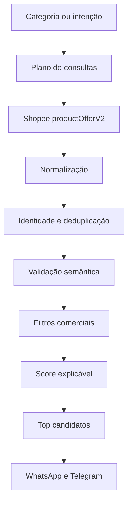
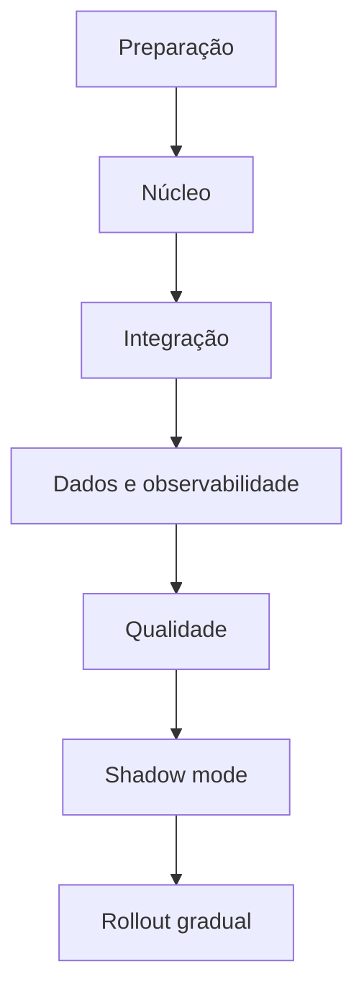
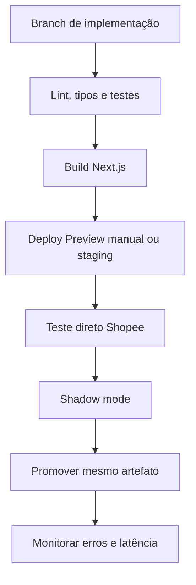
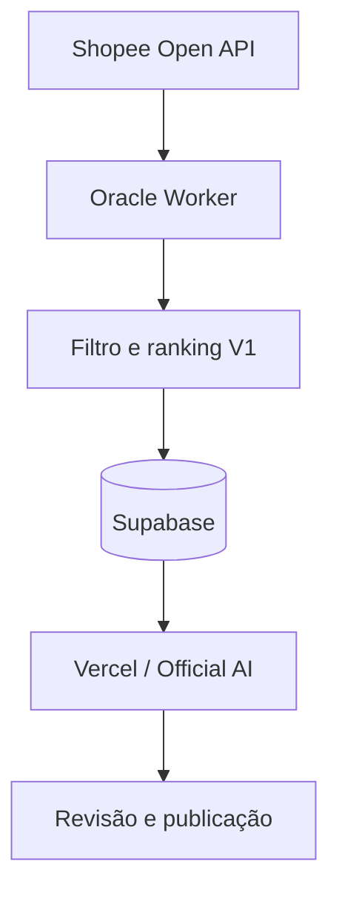

# Plano de Implantação — Motor Oficial de Busca e Ranking Shopee V1

**Projeto:** Caça Ofertas Oficial  
**Marketplace:** Shopee Brasil  
**Versão da estratégia:** `shopee-ranking-v1`  
**Status:** especificação para implementação  
**Escopo desta documentação:** consulta direta à Shopee Open API, proteção semântica por categoria, filtros comerciais, ranking explicável, integração com o fluxo atual, testes, implantação e observabilidade.

---

## 1. Objetivo

Transformar a lógica validada na simulação em um componente oficial, reutilizável e determinístico do Caça Ofertas. O sistema deverá:

1. consultar produtos diretamente na Shopee Affiliate Open API;
2. validar a identidade e a categoria real do produto;
3. rejeitar acessórios, peças e resultados semanticamente incorretos;
4. aplicar filtros mínimos de qualidade e viabilidade comercial;
5. calcular um ranking de 0 a 100 com justificativa auditável;
6. devolver os melhores candidatos por categoria para WhatsApp e Telegram;
7. não depender de ofertas previamente armazenadas para realizar a descoberta;
8. manter compatibilidade com Oracle, Radar e Publicação Expressa.

O algoritmo será reproduzível para uma mesma resposta da API. Produtos, preços, vendas e disponibilidade podem mudar entre chamadas; portanto, “mesmo resultado” significa a mesma seleção e ordenação quando a entrada da Shopee for a mesma.

---

## 2. Situação atual confirmada

### 2.1 Componentes existentes

| Componente | Estado atual | Aproveitamento |
|---|---|---|
| `scripts/contracts/shopee-openapi-v1/productOfferV2.cjs` | Contrato executável com os campos necessários | Manter como fonte única do contrato GraphQL |
| `scripts/shopee-openapi-shadow-engine-v1.cjs` | Assinatura HMAC e planos por cenário | Reutilizar para autenticação e limites |
| `src/lib/trends/shopee-search-adapter.ts` | Consulta direta à Open API e normalização básica | Expandir para paginação, contexto e métricas normalizadas |
| `src/lib/trends/shopee-evidence-collector.ts` | Coleta evidências, vendas, preço, desconto e avaliação | Integrar à explicabilidade do ranking |
| `scripts/shopee-scenario-config.cjs` | Termos permitidos/bloqueados e matching inicial | Evoluir para políticas semânticas estruturadas |
| `src/core/trends/offer-matching.ts` | Bloqueio genérico de acessórios | Substituir lista global por regras contextuais por intenção |
| `src/app/api/trends/match/route.ts` | Consome a busca oficial durante o matching | Passar a consumir candidatos já validados e ranqueados |

### 2.2 Limitações atuais

- O adaptador retorna candidatos sem score comercial.
- O bloqueio de acessórios é global e pode rejeitar produtos legítimos em outros cenários.
- O matching exige palavras, mas não classifica claramente produto principal versus acessório.
- Não há uma versão explícita da estratégia de ranking.
- A explicação dos fatores determinantes não acompanha todos os candidatos.
- Não existe um contrato único de rejeição com código, regra e evidência.
- O desempate atual não usa qualidade comercial.

---

## 3. Arquitetura proposta



### 3.1 Separação de responsabilidades

| Camada | Responsabilidade |
|---|---|
| Contrato Open API | Definir operação, variáveis e campos oficiais |
| Cliente Shopee | Assinar, executar, controlar timeout, paginação e erros |
| Normalizador | Converter tipos, percentuais, URLs e identidade nativa |
| Política de categoria | Confirmar produto principal e bloquear incompatibilidades |
| Filtros comerciais | Aplicar limites eliminatórios configuráveis |
| Ranking | Calcular score, desempates e justificativas |
| Orquestrador | Executar consultas por cenário, deduplicar e limitar resultados |
| Consumidores | Radar, Oracle, matching e publicação |

---

## 4. Contrato de dados do candidato

O motor deverá produzir um objeto interno independente do formato bruto da API:

```ts
export interface ShopeeRankedCandidate {
  marketplace: "Shopee";
  strategyVersion: "shopee-ranking-v1";
  itemId: string;
  shopId: string;
  productName: string;
  categoryId: string | null;
  categoryKey: string;
  queryTerm: string;
  productUrl: string | null;
  affiliateUrl: string;
  imageUrl: string | null;
  currentPrice: number;
  maximumPrice: number | null;
  rating: number;
  sales: number;
  discountPercent: number;
  commissionPercent: number;
  shopeeCommissionPercent: number | null;
  sellerCommissionPercent: number | null;
  shopTypes: number[];
  semanticConfidence: number;
  score: number;
  scoreBreakdown: Record<string, number>;
  determiningReasons: string[];
  capturedAt: string;
}
```

### 4.1 Regras de normalização

- Preços sempre em reais e como `number`.
- Comissão/desconto em percentual de 0 a 100.
- Valores entre 0 e 1 serão convertidos para percentual.
- Não somar campos de comissão sem confirmação contratual; usar `commissionRate` como taxa oficial principal e guardar componentes separadamente.
- Título normalizado com remoção de acentos, espaços duplicados e caixa baixa apenas para matching.
- Preservar título original para publicação.
- Link de afiliado (`offerLink`) é obrigatório para seleção automática.
- Identidade única: `shopee:{shopId}:{itemId}`.
- Data de captura em UTC ISO 8601.

---

## 5. Plano de busca

### 5.1 Entrada

Cada execução recebe:

```ts
interface ShopeeSearchRequest {
  scenarioId: string;
  categoryKey: string;
  limitPerQuery?: number;       // padrão: 20
  maximumPages?: number;        // padrão: 1; ampliar somente com necessidade
  maximumResults?: number;      // padrão: 2 por categoria
  strategyVersion?: string;
}
```

### 5.2 Geração de consultas

Cada categoria terá uma política contendo:

- termos primários;
- sinônimos e aliases;
- identificadores nativos de categoria quando confiáveis;
- classes de produto principal;
- termos negativos;
- exceções explícitas;
- faixas de preço de referência.

Exemplo:

```ts
{
  categoryKey: "eletrodomesticos",
  queries: ["cafeteira elétrica", "liquidificador", "air fryer"],
  requiredProductClasses: ["cafeteira", "liquidificador", "fritadeira", "batedeira"],
  blockedTerms: ["copo", "lâmina avulsa", "refil", "peça", "escova de limpeza"],
  minimumRating: 4.5,
  minimumSales: 10,
  minimumCommissionPercent: 3
}
```

`requiredProductClasses` não é uma lista fechada de toda a categoria. Ela é uma configuração ampliável e versionada. Novos eletrodomésticos podem ser adicionados sem alterar o motor.

### 5.3 Chamada oficial

Operação: `productOfferV2`.

Variáveis iniciais:

```json
{
  "keyword": "liquidificador",
  "page": 1,
  "limit": 20,
  "sortType": 2,
  "isAMSOffer": true
}
```

Campos utilizados:

- `itemId`, `shopId`, `shopName`;
- `productName`, `productLink`, `offerLink`, `imageUrl`;
- `priceMin`, `priceMax`;
- `ratingStar`, `sales`, `priceDiscountRate`;
- `commissionRate`, `shopeeCommissionRate`, `sellerCommissionRate`;
- `shopType`, `productCatIds`;
- `pageInfo`.

### 5.4 Resiliência

- Timeout por chamada: 30 segundos.
- No máximo duas tentativas para erros transitórios (`429`, `5xx`, timeout), com backoff e jitter.
- Não repetir erros de autenticação ou contrato.
- Respeitar o limite oficial de requisições.
- Limitar concorrência por execução.
- Registrar quantidade recebida, aceita, rejeitada e motivo predominante.
- Falha de uma consulta não invalida categorias independentes.

---

## 6. Proteção semântica contra categoria incorreta

### 6.1 Princípio

O motor não usará uma lista única de palavras proibidas. A decisão considerará:

1. categoria solicitada;
2. intenção específica da consulta;
3. classe de produto principal;
4. termos do título;
5. categorias nativas retornadas pela Shopee;
6. padrões de acessório e compatibilidade.

Uma “capa” deve ser rejeitada quando a busca é por sofá, mas pode ser válida em uma categoria editorial própria de capas. Um “carregador” deve ser rejeitado quando a intenção é smartphone, mas aceito quando a intenção é carregador.

### 6.2 Estrutura da política

```ts
interface CategorySemanticPolicy {
  categoryKey: string;
  primaryProductTerms: string[];
  queryAliases: Record<string, string[]>;
  blockedAccessoryTerms: string[];
  blockedCompatibilityPatterns: string[];
  nativeCategoryIds?: string[];
  exceptions?: Array<{
    whenQuery: string;
    allowTerms: string[];
  }>;
}
```

### 6.3 Políticas iniciais

| Categoria | Classes iniciais aceitas | Exemplos bloqueados |
|---|---|---|
| Celulares | smartphone, iPhone, Galaxy, Redmi, Poco, Motorola | capa, película, suporte, fone, kit de reparo, tela, adaptador |
| Eletrodomésticos | liquidificador, cafeteira elétrica, air fryer, batedeira, chaleira, processador | copo, lâmina avulsa, escova, refil, peça |
| Móveis | cadeira, sofá, mesa, armário, rack, cômoda | capa, almofada, protetor, tecido |
| TV & Áudio | Smart TV, televisão, soundbar, caixa de som quando solicitada | controle remoto, suporte, cabo, monitor, capa |
| Moda | camisa, blusa, tênis, calça e demais classes configuradas | pet, bebê ou infantil quando fora da intenção |
| Casa & Cozinha | cama, faqueiro, utensílio, panela e demais classes configuradas | reposição ou peça incompatível |

### 6.4 Confiança semântica

Pontuação de 0 a 1:

- correspondência exata com classe principal: `1.0`;
- alias reconhecido + categoria nativa compatível: `0.9`;
- correspondência parcial suficiente: `0.5–0.8`;
- termo bloqueado ou padrão de acessório: rejeição imediata;
- abaixo de `0.5`: rejeição.

Toda rejeição terá um código estável:

- `missing_native_identity`;
- `missing_affiliate_url`;
- `invalid_price`;
- `semantic_mismatch`;
- `accessory_mismatch`;
- `native_category_mismatch`;
- `rating_below_threshold`;
- `sales_below_threshold`;
- `commission_below_threshold`;
- `duplicate_product`.

---

## 7. Filtros comerciais

### 7.1 Limites iniciais

| Critério | Regra | Comportamento |
|---|---:|---|
| Identidade | `itemId` e `shopId` válidos | Eliminatório |
| Link | `offerLink` HTTPS válido | Eliminatório para publicação automática |
| Preço | `priceMin > 0` | Eliminatório |
| Relevância | ≥ 0,50 | Eliminatório |
| Avaliação | ≥ 4,5 | Eliminatório |
| Vendas | ≥ 10 | Eliminatório |
| Comissão | ≥ 3% | Eliminatório |
| Loja | tipos 1, 2 ou 4 | Bonificação; configurável como filtro por cenário |
| Desconto | sem mínimo global | Usado no ranking |

Os limites deverão estar em configuração versionada, sem números mágicos dentro do adaptador.

### 7.2 Cobertura insuficiente

- Se houver dois ou mais candidatos aprovados: retornar o Top 2.
- Se houver um candidato aprovado: retornar um e registrar cobertura parcial.
- Se não houver candidato: retornar `no_qualified_candidate`.
- Nunca completar a quantidade com produto reprovado.

---

## 8. Ranking oficial

### 8.1 Pesos

| Métrica | Peso |
|---|---:|
| Relevância semântica | 25 |
| Demanda/vendas | 20 |
| Desconto | 15 |
| Avaliação | 10 |
| Qualidade/tipo da loja | 10 |
| Comissão | 10 |
| Competitividade de preço | 5 |
| Atualidade | 5 |
| **Total** | **100** |

### 8.2 Fórmula V1

```text
score =
  25 × semantic_relevance
+ 20 × sales_normalized
+ 15 × discount_normalized
+ 10 × rating_normalized
+ 10 × shop_quality
+ 10 × commission_normalized
+  5 × price_competitiveness
+  5 × freshness
```

Normalizações iniciais:

- `semantic_relevance`: confiança semântica entre 0 e 1;
- `sales_normalized`: `min(1, log10(sales + 1) / 4)`;
- `discount_normalized`: `min(1, discountPercent / 50)`;
- `rating_normalized`: `rating / 5`;
- `shop_quality`: 1 para tipo 1, 2 ou 4; regra refinável por tipo;
- `commission_normalized`: `min(1, commissionPercent / 15)`;
- `price_competitiveness`: comparação com mediana dos candidatos válidos da mesma intenção, com fallback de faixa configurada;
- `freshness`: 1 para captura atual; reduzir quando o candidato vier de feed ou cache permitido.

### 8.3 Desempate determinístico

1. maior score sem arredondamento;
2. maior confiança semântica;
3. maior volume de vendas;
4. maior avaliação;
5. maior desconto;
6. menor preço, quando todos os anteriores forem iguais;
7. `shopId:itemId` em ordem crescente.

### 8.4 Explicabilidade

Cada candidato aprovado deverá retornar:

```json
{
  "score": 94.6,
  "score_breakdown": {
    "semantic_relevance": 25,
    "sales": 18.9,
    "discount": 15,
    "rating": 9.6,
    "shop_quality": 10,
    "commission": 8.7,
    "price": 5,
    "freshness": 2.4
  },
  "determining_reasons": [
    "Produto principal confirmado",
    "Mais de 5 mil vendas",
    "60% de desconto",
    "Comissão de 13%"
  ]
}
```

---

## 9. Alterações por arquivo

### 9.1 Novos arquivos

| Arquivo sugerido | Conteúdo |
|---|---|
| `src/lib/shopee/ranking/types.ts` | Tipos do candidato, política, score e rejeição |
| `src/lib/shopee/ranking/normalization.ts` | Normalização de números, percentuais, textos e URLs |
| `src/lib/shopee/ranking/category-policies.ts` | Políticas semânticas versionadas |
| `src/lib/shopee/ranking/semantic-validator.ts` | Validação de produto principal/acessório |
| `src/lib/shopee/ranking/commercial-filters.ts` | Filtros eliminatórios |
| `src/lib/shopee/ranking/score.ts` | Fórmula, breakdown e desempates |
| `src/lib/shopee/ranking/search-service.ts` | Orquestração de consultas, dedupe e Top N |
| `src/lib/shopee/ranking/__tests__/*` | Testes unitários e snapshots sanitizados |

### 9.2 Arquivos existentes

| Arquivo | Alteração |
|---|---|
| `src/lib/trends/shopee-search-adapter.ts` | Delegar busca e ranking ao novo serviço; manter adaptador compatível |
| `scripts/contracts/shopee-openapi-v1/productOfferV2.cjs` | Manter contrato; adicionar teste de compatibilidade dos campos |
| `scripts/shopee-openapi-shadow-engine-v1.cjs` | Referenciar planos/políticas sem duplicar regra de ranking |
| `scripts/shopee-scenario-config.cjs` | Migrar listas permitidas/bloqueadas para política estruturada ou criar ponte temporária |
| `src/core/trends/offer-matching.ts` | Consumir resultado semântico; manter defesa em profundidade |
| `src/lib/trends/shopee-evidence-collector.ts` | Incluir comissão, shop type e vínculo com score/rejeição |
| `src/app/api/trends/match/route.ts` | Usar serviço oficial ranqueado e registrar versão da estratégia |

---

## 10. Banco de dados e persistência

A busca continuará acontecendo diretamente na Open API. Persistência será posterior à seleção e não será usada como fonte da descoberta.

### 10.1 Estrutura existente aproveitada

`offers` já possui:

- produto, categoria, URL e imagem;
- preço atual e anterior;
- avaliação, comissão e score;
- `shopee_item_id`, `shopee_shop_id`, categoria nativa;
- `marketplace_metrics`, `explainability`;
- posições e identificadores nativos.

### 10.2 Mudanças obrigatórias

Não é obrigatória uma nova tabela para a V1. Usar:

- `offers.score` ou `new_score` para o score final;
- `offers.marketplace_metrics` para métricas normalizadas;
- `offers.explainability` para breakdown, razões e códigos de rejeição quando aplicável.

### 10.3 Colunas recomendadas

| Coluna | Tipo | Motivo |
|---|---|---|
| `captured_at` | `timestamptz` | Diferenciar captura da criação do registro |
| `search_term` | `text` | Auditoria da consulta originadora |
| `strategy_version` | `text` | Reproduzir e comparar rankings |
| `semantic_confidence` | `numeric` | Medir qualidade da classificação |
| `stock_status` | `text` | Evitar publicação de item indisponível quando o campo estiver disponível |

Alternativa sem migração imediata: guardar os cinco campos em `marketplace_metrics`, depois promover somente os mais consultados para colunas.

### 10.4 Índices recomendados, se as colunas forem criadas

```sql
create unique index concurrently if not exists offers_shopee_identity_uq
on public.offers (user_id, shopee_shop_id, shopee_item_id)
where platform = 'Shopee' and shopee_shop_id is not null and shopee_item_id is not null;

create index concurrently if not exists offers_shopee_strategy_score_idx
on public.offers (user_id, strategy_version, score desc, captured_at desc)
where platform = 'Shopee';
```

Qualquer migração deverá preservar RLS e ser validada por advisors de segurança e desempenho.

---

## 11. Integrações consumidoras

### 11.1 Radar de tendências

- Receber apenas candidatos aprovados.
- Preservar evidência direta da Open API.
- Registrar `strategyVersion` e `scoreBreakdown`.

### 11.2 Oracle

- Usar o serviço como fonte de consulta direta.
- Data Feeds `DELTA/FULL` poderão alimentar descoberta futura, mas passarão pelo mesmo validador e ranking.
- Não criar uma segunda fórmula de score.

### 11.3 Publicação Expressa

- Continuar aceitando link manual.
- Enriquecer o item via `itemId`.
- Mostrar avaliação, vendas, desconto e motivo da recomendação.
- Bloquear publicação automática quando o item for semanticamente incompatível.

### 11.4 WhatsApp e Telegram

- Receber título curto, preço, desconto, prova social e link afiliado.
- Não incluir métricas ausentes como se fossem zero.
- Revalidar preço e disponibilidade imediatamente antes da publicação.

---

## 12. Segurança

- Credenciais somente no servidor.
- Nunca expor `SHOPEE_APP_SECRET` em cliente, logs ou respostas.
- Endpoint de busca executado em runtime Node.js.
- Sanitizar erros GraphQL antes de responder ao cliente.
- Redigir cabeçalhos de autorização e payloads assinados nos logs.
- Usar timeout e limite de concorrência.
- Aplicar autenticação e autorização nas rotas internas.
- Nunca persistir resposta bruta contendo dados desnecessários.
- Remover arquivos `.env` de compartilhamento público e rotacionar credenciais expostas.

---

## 13. Observabilidade

### 13.1 Métricas por execução

- chamadas Open API;
- duração total e p95 por chamada;
- candidatos recebidos;
- aprovados e rejeitados;
- taxa de rejeição por código;
- cobertura por categoria;
- score médio e distribuição;
- duplicidades removidas;
- erros de autenticação, contrato, timeout e limite;
- publicações originadas e conversão posterior.

### 13.2 Logs estruturados

```json
{
  "event": "shopee_search_completed",
  "strategy_version": "shopee-ranking-v1",
  "scenario_id": "eletrodomesticos_cozinha",
  "category_key": "eletrodomesticos",
  "received": 40,
  "approved": 8,
  "rejected": 32,
  "top_rejection_codes": ["accessory_mismatch", "rating_below_threshold"],
  "duration_ms": 1840
}
```

Não registrar títulos completos quando não forem necessários para diagnóstico; nunca registrar credenciais.

---

## 14. Estratégia de testes

### 14.1 Testes unitários

- normalização de taxa fracionária e percentual;
- preços inválidos e ausentes;
- normalização de acentos e espaços;
- identidade `shopId:itemId`;
- confiança semântica;
- bloqueio contextual de acessórios;
- exceção válida quando o acessório é a intenção;
- filtros de nota, vendas e comissão;
- cálculo exato de cada componente do score;
- desempate determinístico;
- deduplicação.

### 14.2 Casos obrigatórios de regressão

| Consulta | Produto | Resultado esperado |
|---|---|---|
| smartphone | capa para smartphone | Rejeitar |
| smartphone | kit para troca de tela | Rejeitar |
| smartphone | aparelho Galaxy | Aceitar |
| liquidificador | escova para garrafa/liquidificador | Rejeitar |
| liquidificador | liquidificador Mondial | Aceitar |
| cadeira de escritório | capa de cadeira | Rejeitar |
| cadeira de escritório | cadeira ergonômica | Aceitar |
| Smart TV | controle remoto | Rejeitar |
| Smart TV | televisão 4K | Aceitar |
| controle remoto | controle remoto compatível | Aceitar, se esta for a intenção explícita |

### 14.3 Testes de contrato

- assinatura HMAC com relógio controlado;
- operação e variáveis corretas;
- compatibilidade dos campos de `productOfferV2`;
- resposta com `errors` GraphQL;
- timeout e `429`;
- paginação e `hasNextPage`;
- ausência de campos opcionais.

### 14.4 Integração

- Open API simulada → motor → Top 2;
- rota de matching → candidato ranqueado;
- persistência opcional → leitura de score/explainability;
- revalidação antes da publicação;
- nenhuma consulta à tabela de ofertas durante a descoberta.

### 14.5 Teste ao vivo controlado

- Executar categorias escolhidas com credenciais de ambiente protegido.
- Não persistir na primeira execução.
- Confirmar links, preço e identidade manualmente em amostra.
- Comparar com o resultado do script de validação.
- Guardar somente fixtures sanitizadas, sem credenciais.

---

## 15. Tasks de implementação

### Fase 0 — Preparação

| ID | Task | Entrega | Skill/capacidade |
|---|---|---|---|
| T00 | Criar branch de trabalho | Branch isolada | GitHub |
| T01 | Inventariar consumidores do adaptador | Mapa de chamadas e riscos | GitHub |
| T02 | Congelar fixtures sanitizadas da simulação | Casos de regressão | GitHub + testes |
| T03 | Registrar baseline atual | Cobertura, erros e falsos positivos | Vercel Observability |

### Fase 1 — Núcleo

| ID | Task | Entrega | Skill/capacidade |
|---|---|---|---|
| T10 | Criar tipos do domínio | `types.ts` | Next.js/TypeScript |
| T11 | Criar normalizadores | `normalization.ts` + testes | Next.js/TypeScript |
| T12 | Criar políticas semânticas | `category-policies.ts` | GitHub + domínio Shopee |
| T13 | Criar validador contextual | `semantic-validator.ts` | Next.js/TypeScript |
| T14 | Criar filtros comerciais | `commercial-filters.ts` | Next.js/TypeScript |
| T15 | Criar fórmula e desempates | `score.ts` | Next.js/TypeScript |
| T16 | Criar orquestrador | `search-service.ts` | Next.js + Shopee Open API |

### Fase 2 — Integração

| ID | Task | Entrega | Skill/capacidade |
|---|---|---|---|
| T20 | Atualizar adaptador Shopee | Compatibilidade com consumidores atuais | Next.js |
| T21 | Integrar evidence collector | Evidências e score conectados | Next.js |
| T22 | Atualizar matching | Seleção por ranking, defesa semântica | Next.js |
| T23 | Integrar Oracle | Fonte direta comum | GitHub + Next.js |
| T24 | Integrar publicação | Revalidação e justificativa | Next.js |

### Fase 3 — Dados e observabilidade

| ID | Task | Entrega | Skill/capacidade |
|---|---|---|---|
| T30 | Definir persistência V1 | Uso de JSONB ou migração mínima | Supabase |
| T31 | Revisar consultas e índices | Plano de índices | Supabase Postgres Best Practices |
| T32 | Validar RLS/advisors | Relatório sem alertas críticos novos | Supabase |
| T33 | Instrumentar eventos | Métricas e logs estruturados | Vercel Observability |
| T34 | Criar alertas operacionais | Auth, erro, baixa cobertura | Vercel Observability |

### Fase 4 — Qualidade

| ID | Task | Entrega | Skill/capacidade |
|---|---|---|---|
| T40 | Testes unitários | Cobertura de regras e fórmula | Testes do repositório |
| T41 | Testes de contrato | Compatibilidade Open API | GitHub + testes |
| T42 | Testes de integração | Fluxo ponta a ponta | Vercel Verification |
| T43 | Teste visual do consumidor | Resultado apresentado corretamente | Agent Browser Verify |
| T44 | Revisão de segurança | Segredos, logs e rotas | GitHub + Vercel |

### Fase 5 — Implantação

| ID | Task | Entrega | Skill/capacidade |
|---|---|---|---|
| T50 | Adicionar feature flag | `SHOPEE_RANKING_V1_ENABLED` | Vercel Flags/Env Vars |
| T51 | Deploy Preview | Ambiente isolado | Vercel Deployments/CI-CD |
| T52 | Shadow mode | Comparação antigo × novo | Vercel Observability |
| T53 | Ativação gradual | 10% → 50% → 100% | Vercel Flags |
| T54 | Verificação pós-deploy | API, dados e publicação | Vercel Verification |
| T55 | Documentar operação | Runbook e rollback | GitHub |

---

## 16. Ordem e dependências



Tasks críticas: `T12 → T13 → T14 → T15 → T16 → T20 → T42 → T52 → T53`.

---

## 17. Critérios de aceite

### Funcionais

- Busca direta via `productOfferV2` confirmada.
- Nenhuma leitura de ofertas armazenadas durante a descoberta.
- Produto sem identidade nativa não é selecionado.
- Acessórios incompatíveis são rejeitados contextualmente.
- Produtos principais legítimos não são limitados aos exemplos iniciais.
- Filtros mínimos são configuráveis e versionados.
- Top N ordenado pelo score oficial.
- Breakdown e razões acompanham o resultado.
- Deduplicação por `shopId:itemId`.
- Cobertura insuficiente não é preenchida com item reprovado.

### Qualidade

- 100% dos casos obrigatórios de regressão aprovados.
- Fórmula e desempates determinísticos.
- Sem regressão no contrato GraphQL.
- Sem novo alerta crítico de segurança ou banco.
- Logs não contêm credenciais.

### Operacionais

- Feature flag e rollback testados.
- Shadow mode comparado por pelo menos um ciclo editorial completo.
- Taxa de falso positivo menor que o baseline.
- Erros de autenticação e contrato monitorados.
- Revalidação executada antes da publicação.

---

## 18. Rollout e rollback

### Rollout

1. Deploy Preview com API simulada.
2. Teste ao vivo protegido e sem persistência.
3. Shadow mode: motor novo executa, mas não decide.
4. Comparar Top N, rejeições e cobertura.
5. Ativar para 10% das execuções.
6. Avançar para 50% após estabilidade.
7. Ativar 100%.
8. Manter código anterior durante janela de segurança.

### Rollback

- Desativar `SHOPEE_RANKING_V1_ENABLED`.
- Retornar ao adaptador anterior sem migração reversa.
- Preservar logs e resultados para análise.
- Se houver migração, novas colunas permanecerão inertes; não remover durante incidente.

### Gatilhos de rollback

- aumento relevante de erros Open API;
- queda abrupta de cobertura;
- falso positivo crítico de categoria;
- link afiliado inválido;
- aumento relevante de latência;
- erro de publicação originado pelo novo contrato.

---

## 19. Definition of Done

A implantação estará concluída quando:

- código e testes estiverem revisados;
- contrato direto da Shopee estiver validado;
- políticas iniciais cobrirem as categorias editoriais ativas;
- score V1 estiver documentado e reproduzível;
- consumers utilizarem o serviço comum;
- observabilidade e alertas estiverem ativos;
- shadow mode demonstrar melhoria;
- rollout chegar a 100% sem gatilho de rollback;
- runbook operacional estiver publicado;
- documentação refletir o comportamento final entregue.

---

## 20. Decisões recomendadas

1. **Criar um serviço único de ranking**, evitando fórmulas diferentes em Oracle, Radar e Publicação Expressa.
2. **Usar políticas contextuais**, não uma blacklist global.
3. **Começar sem nova tabela**, aproveitando JSONB e promovendo colunas após medir consultas reais.
4. **Manter feature flag e shadow mode**, pois a alteração afeta seleção editorial.
5. **Versionar score e políticas**, permitindo auditoria e testes A/B.
6. **Nunca garantir produto idêntico entre horários**, mas garantir decisão determinística para a mesma entrada.

---

## 21. Auditoria Vercel e impactos na implantação

### 21.1 Estado confirmado na Vercel

Auditoria realizada em 12/08/2026, somente leitura.

| Item | Estado observado | Impacto no motor Shopee |
|---|---|---|
| Projeto | `caca-oferta-oficial` | Projeto correto confirmado |
| Framework | Next.js | Compatível com Route Handlers e runtime Node.js |
| Runtime | Node.js 24.x | Compatível com `fetch`, `crypto` e `AbortSignal.timeout` usados na integração |
| Build | Next.js 16.2.2 + Turbopack | Testes precisam cobrir bundle server-side do contrato CJS |
| Região observada | `iad1` | Distante do Supabase em São Paulo e do mercado brasileiro; medir antes de escolher `gru1` |
| Deployment mais recente | `READY`, Preview | O rollout deve começar em Preview e não pode ser tratado como produção |
| Branch recente | `feat/radar-multimarketplace-end-to-end` | Há desenvolvimento ativo sobre os mesmos fluxos; evitar implementar sobre branch divergente |
| Deploy automático | Somente `main` e `staging` no `vercel.json` | Branch de implementação exigirá deploy Preview manual ou uso de `staging` |
| Funções observadas | 5 lambdas Node.js no deployment consultado | O novo serviço deve permanecer server-only e evitar dependências desnecessárias no bundle |
| Cron existente | Apenas `/api/instagram/poll-comments` diariamente | Não existe Cron Shopee configurado |
| Domínios | Aliases padrão do projeto | Validação deve usar Preview antes de promover alias de produção |
| Projeto `live` | `false` no snapshot consultado | Confirmar deployment/alias de produção antes de qualquer rollout real |

### 21.2 Configuração do repositório que interfere no deploy

| Configuração | Diagnóstico | Mudança necessária |
|---|---|---|
| `typescript.ignoreBuildErrors: true` | Build aceita erros TypeScript | Remover ou definir `false` antes da ativação da V1 |
| `buildCommand: next build` | Não executa lint, typecheck e testes por si só | Criar gate CI com `npm run verify` antes de promover |
| `installCommand: npm install` | Compatível com `package-lock.json` | Garantir lockfile atualizado e `npm ci` no CI, quando possível |
| Runtime da rota | `nodejs` | Manter; não migrar a busca para Edge |
| Rota de aprovação | Processo síncrono de busca + persistência | Dividir em lotes ou workflow para evitar timeout |
| Cron | Um único job não relacionado | Adicionar Cron Shopee somente se houver necessidade de execução automática |

### 21.3 Erros de runtime relevantes

Foram observados os seguintes sinais na janela de sete dias:

| Sinal | Evidência | Consequência para a implantação |
|---|---|---|
| Timeout da fila de aprovação | `/api/trends/approval-queue/execute` atingiu 60 segundos | Não executar muitas categorias/páginas em uma única requisição síncrona |
| Falhas Inngest | Erros de chave, assinatura e componente paralelo desativado | Não depender do Inngest para a V1 até sua configuração ser corrigida e validada |
| Statement timeout | Etapa `select-editorial-top30` | Evitar adicionar consultas pesadas ao caminho crítico; revisar índices antes do shadow mode |
| Alto volume em `/api/inngest` | Maior rota nos logs das últimas 24 horas | Isolar observabilidade Shopee por evento/rota para não misturar falhas |

Esses erros não são causados pelo novo motor, mas alteram o plano seguro de implantação.

### 21.4 Arquitetura de execução recomendada na Vercel

#### Busca interativa

- Runtime: Node.js.
- Uma categoria/intenção por unidade de trabalho.
- Uma página inicial de 20 produtos por termo.
- Concorrência inicial: no máximo 3 chamadas Shopee simultâneas por execução.
- Orçamento interno recomendado: 25 segundos para busca e ranking.
- Timeout por chamada: 30 segundos, limitado pelo orçamento total da execução.
- Persistência após seleção, fora do loop de chamadas quando possível.

#### Busca em lote

Não concentrar todas as categorias em `/api/trends/approval-queue/execute`. Escolher uma das opções:

1. **V1 recomendada:** dividir por categoria e disparar unidades idempotentes;
2. usar Inngest somente depois de corrigir chaves, assinatura e execução oficial;
3. usar Vercel Workflow para processamento durável caso o lote ultrapasse a duração segura;
4. usar Cron apenas como disparador, nunca como um loop monolítico de todas as buscas.

### 21.5 Região de função

A execução observada ocorreu em `iad1`, enquanto o Supabase está em `sa-east-1`.

Plano de decisão:

1. medir p50/p95 da Shopee Open API e Supabase em `iad1`;
2. criar Preview com rota configurada preferencialmente em `gru1`, se disponível no plano;
3. repetir o mesmo teste;
4. escolher a região com menor latência total e estabilidade equivalente;
5. não alterar globalmente todas as funções sem medir consumidores existentes.

Configuração possível no Route Handler, após validação:

```ts
export const runtime = "nodejs";
export const preferredRegion = "gru1";
```

### 21.6 Duração e Fluid Compute

- Confirmar no projeto se Fluid Compute está habilitado e qual é o limite efetivo do plano.
- Definir `maxDuration` somente depois dessa confirmação.
- Aumentar duração não substitui paginação, idempotência e divisão por categoria.
- Não usar `waitUntil` para trabalho comercial que precisa de garantia de conclusão; ele é adequado para telemetria pós-resposta.

Configuração candidata, sujeita ao plano:

```json
{
  "functions": {
    "src/app/api/trends/approval-queue/execute/route.ts": {
      "maxDuration": 300
    }
  }
}
```

### 21.7 Variáveis de ambiente

Valores não devem aparecer na documentação, logs ou respostas. A implantação precisa confirmar apenas presença e escopo.

| Variável | Production | Preview | Development | Observação |
|---|---|---|---|---|
| `SHOPEE_APP_ID` | Obrigatória | Obrigatória ou credencial sandbox/isolada | Obrigatória | Server-only |
| `SHOPEE_APP_SECRET` | Obrigatória | Obrigatória ou isolada | Obrigatória | Sensível, server-only |
| `SHOPEE_RANKING_V1_ENABLED` | Iniciar `false` | `true` para validação | `true` | Flag simples de emergência |
| `SHOPEE_RANKING_STRATEGY_VERSION` | `shopee-ranking-v1` | Igual | Igual | Não sensível |
| `SHOPEE_SEARCH_CONCURRENCY` | `3` inicialmente | `3` | `1–3` | Configuração operacional |
| `SHOPEE_SEARCH_MAX_PAGES` | `1` inicialmente | `1` | `1` | Proteção de custo/latência |
| `CRON_SECRET` | Obrigatória se houver Cron | Não necessário | Não necessário | Validar header Bearer |
| `INNGEST_EVENT_KEY` | Corrigir se Inngest for usado | Conforme ambiente | Conforme desenvolvimento | Ausência já gerou erros |
| `INNGEST_SIGNING_KEY` | Corrigir se Inngest for usado | Conforme ambiente | Não usar chave de produção | Ausência já gerou erros |

A API conectada permitiu confirmar o projeto e deployments, mas não retornou a lista de variáveis. Portanto, a presença e o escopo das chaves acima são uma task obrigatória de preflight, sem leitura ou exposição de valores.

### 21.8 Feature flag

#### V1 recomendada

Usar variável server-only:

```ts
const rankingV1Enabled = process.env.SHOPEE_RANKING_V1_ENABLED === "true";
```

Motivo: é suficiente para ativação por ambiente e rollback imediato.

#### Evolução opcional

Usar Vercel Flags somente se houver necessidade real de:

- rollout percentual;
- segmentação por usuário/equipe;
- comparação A/B;
- Flags Explorer.

Não adicionar a plataforma de Flags apenas para um booleano global. Caso seja adotada, validar a documentação atual do SDK antes de escrever código.

### 21.9 Cron Shopee opcional

Adicionar somente se a descoberta precisar executar automaticamente.

```json
{
  "crons": [
    {
      "path": "/api/cron/shopee-discovery",
      "schedule": "0 */4 * * *"
    }
  ]
}
```

Requisitos:

- verificar limite de Crons do plano;
- considerar que Cron executa somente em produção;
- validar `Authorization: Bearer ${CRON_SECRET}`;
- endpoint deve apenas criar unidades idempotentes por categoria;
- não publicar automaticamente;
- registrar execução, categoria e estratégia;
- evitar sobreposição entre ciclos.

### 21.10 Observabilidade Vercel específica

Adicionar logs estruturados em todas as fases:

```json
{
  "level": "info",
  "event": "shopee_ranking_completed",
  "strategy_version": "shopee-ranking-v1",
  "request_id": "x-vercel-id",
  "category": "eletrodomesticos",
  "received": 20,
  "approved": 5,
  "rejected": 15,
  "duration_ms": 1320
}
```

Eventos obrigatórios:

- `shopee_search_started`;
- `shopee_api_completed`;
- `shopee_candidate_rejected` agregado por código;
- `shopee_ranking_completed`;
- `shopee_search_failed`;
- `shopee_publication_revalidation_failed`.

Alertas recomendados:

- qualquer erro de autenticação Shopee;
- taxa de falha superior a 5% em 15 minutos;
- p95 superior ao orçamento da rota;
- zero aprovados em várias categorias consecutivas;
- crescimento de `accessory_mismatch` após alteração de política;
- timeout ou status 5xx na fila de aprovação.

Antes da produção, confirmar se há Drain ou integração externa de monitoramento. Se não houver, usar Runtime Logs e varredura de erros pós-deploy como requisito mínimo.

### 21.11 Pipeline Vercel revisado



Gates obrigatórios antes de promover:

1. `npm run lint`;
2. `npm run typecheck`;
3. `npm run test`;
4. `npm run build`;
5. `npm run security:check`;
6. teste de contrato Shopee;
7. teste de regressão de categorias;
8. teste ao vivo em Preview;
9. varredura de logs sem segredos;
10. comparação shadow aprovada.

Usar `promote` para levar a produção exatamente o artefato já testado, em vez de reconstruir.

### 21.12 Novas tasks Vercel

| ID | Task | Entrega | Skill/capacidade |
|---|---|---|---|
| TV01 | Confirmar alias e deployment de produção | Baseline de produção inequívoco | Vercel API |
| TV02 | Auditar presença/escopo das variáveis | Matriz Production/Preview/Development sem valores | Vercel Env Vars |
| TV03 | Remover `ignoreBuildErrors` | Build TypeScript estrito | Next.js + Vercel CI/CD |
| TV04 | Criar pipeline `npm run verify` | Gate obrigatório de Preview | Vercel Deployments/CI-CD |
| TV05 | Medir `iad1` versus `gru1` | Decisão documentada de região | Vercel Functions + Observability |
| TV06 | Definir orçamento e `maxDuration` | Limite compatível com o plano | Vercel Functions |
| TV07 | Dividir aprovação por categoria | Unidades idempotentes abaixo do timeout | Vercel Functions |
| TV08 | Corrigir ou retirar dependência do Inngest | Fluxo assíncrono confiável | Vercel Runtime Logs + Inngest |
| TV09 | Implementar flag server-only | Ativação e rollback por ambiente | Vercel Env Vars |
| TV10 | Avaliar Vercel Flags | ADR: necessário ou dispensado | Vercel Flags |
| TV11 | Decidir Cron Shopee | ADR com plano, frequência e segurança | Vercel Cron Jobs |
| TV12 | Instrumentar logs estruturados | Eventos e dashboards operacionais | Vercel Observability |
| TV13 | Verificar Drain/monitoramento | Preflight de observabilidade | Vercel Observability |
| TV14 | Executar Deploy Preview | Artefato verificável | Vercel Deployments/CI-CD |
| TV15 | Verificação ponta a ponta | Busca → ranking → fila → post | Vercel Verification |
| TV16 | Promover artefato validado | Produção sem rebuild | Vercel Deployments/CI-CD |
| TV17 | Escanear erros pós-deploy | Relatório da primeira hora | Vercel Runtime Logs |

### 21.13 Critérios de aceite Vercel

- Deployment Preview `READY` com o commit correto.
- Build não ignora erros TypeScript.
- Todas as variáveis obrigatórias presentes e corretamente escopadas.
- Nenhuma credencial aparece no bundle ou logs.
- Busca não atinge o limite de duração.
- Região escolhida com medição comparativa.
- Fluxo não depende de Inngest com configuração inválida.
- Feature flag desativa o motor sem novo deploy.
- Cron, se criado, exige `CRON_SECRET` e é idempotente.
- Logs mostram recebidos, aprovados, rejeitados, duração e versão.
- Shadow mode não publica automaticamente.
- Produção recebe o mesmo artefato validado em Preview.
- Varredura pós-deploy não encontra novos erros 5xx relacionados à Shopee.

---

## 22. VPS Oracle: impacto e implantação

### 22.1 Decisão

**A VPS Oracle deve fazer parte desta implantação.** O repositório confirma que o processo `oracle-scraper` é o executor contínuo e autoritativo da descoberta dos marketplaces, inclusive da Shopee. Ele consulta a Open API, aplica cenários e filtros, calcula score, persiste candidatos no Supabase e dispara a Official AI na Vercel. Alterar somente o Next.js/Vercel produziria resultados diferentes entre a busca manual e o ciclo automático.

Esta conclusão é baseada no código e na documentação versionados. O estado operacional atual da VPS, do PM2 e dos timers não foi consultado por SSH e deve ser certificado no preflight.

### 22.2 Estrutura atual identificada

| Componente | Responsabilidade atual | Evidência principal |
|---|---|---|
| `oracle-scraper` | Worker Discovery-Only, execução imediata e ciclos agendados | `scripts/oracle-scraper.cjs` |
| Shopee OpenAPI V1 | Consulta `productOfferV2`, normalização e persistência controlada | adapters e engines em `scripts/shopee-openapi-*` |
| `oracle-api` | Gateway técnico de scraping na porta 3002 | `scripts/oracle-api.cjs` |
| PM2 | Supervisiona `oracle-scraper`, `oracle-api` e `whatsapp-bot` | `docs/oracle.md` |
| Capacity Hunter | Monitora PM2, recursos, heartbeat e SHA sem reiniciar os serviços | `apps/oracle-capacity-hunter` |
| Supabase | Estado central de ofertas, links, posts, logs e checkpoints | worker e migrations |
| Vercel | Official AI, painel, aprovação e publicação | `/api/ai/generate` e rotas de canal |
| Deploy Oracle | Copia conjunto explícito de arquivos por SSH/SCP, cria backup, manifesto e reinicia PM2 | `scripts/update-oracle.js` |

Fluxo certificado:



### 22.3 Pontos que interferem no novo motor

1. O ranking atual existe dentro do worker e usa pesos/faixas próprios; ele precisa ser substituído ou redirecionado para o mesmo módulo canônico da nova estrutura.
2. O deploy da Oracle usa uma lista fechada `DEPLOY_FILES`. Todo novo módulo de política, taxonomia, contrato ou teste de sanidade necessário em runtime deve ser incluído nela.
3. A configuração efetiva é formada por `.env.local` mais `config/oracle-runtime-overlay.env`; flags divergentes podem manter o caminho legado ou bloquear a persistência.
4. `oracle-scraper` e `oracle-api` são reiniciados após o deploy e precisam receber o mesmo overlay fail-closed.
5. A documentação apresenta agendas diferentes: o código auditado contém mais de uma referência de cron. O schedule efetivo deve ser certificado no runtime e consolidado em uma única constante antes do rollout.
6. O Worker chama a Vercel em lotes e usa Supabase como checkpoint. Mudanças de contrato não podem quebrar idempotência, `pending_manual_review` ou paginação.
7. PM2 é supervisor externo; não há `ecosystem.config` versionado nem política de restart completa no repositório. O procedimento operacional precisa registrar comando, usuário, diretório e versão Node sem guardar segredos.
8. O script de deploy referencia uma chave SSH por caminho local e contém defaults de infraestrutura. Migrar esses dados para variáveis seguras é requisito de hardening; nenhum segredo deve permanecer versionado.

### 22.4 Arquitetura alvo compartilhada

Criar um núcleo determinístico e versionado, consumido pela busca manual/Vercel e pelo worker Oracle:

```text
shopee-search-core/
  contract          # candidato normalizado e resultado de decisão
  taxonomy          # categorias, intenção, bloqueios e acessórios
  metrics           # preço, desconto, rating, vendas e confiança
  policy            # aceita/rejeita com códigos explicáveis
  ranking           # score e desempate estável
  strategy-version  # shopee-ranking-v1
```

O núcleo não acessa rede, Supabase, Vercel ou PM2. Os adapters ficam nas bordas:

- Oracle: Open API → normalização → núcleo → persistência/checkpoint;
- Vercel: requisição manual → adapter → núcleo → resposta/fila;
- publicação: revalida preço e disponibilidade, sem recalcular silenciosamente a intenção;
- observabilidade: registra a mesma `strategy_version` nos dois runtimes.

### 22.5 Alterações obrigatórias no deploy Oracle

| Área | Alteração |
|---|---|
| Pacote comum | Incluir todos os arquivos do núcleo na lista de deploy e no manifesto SHA-256 |
| Configuração | Adicionar flags e limites ao overlay versionado, com validação fail-closed |
| Pré-validação | Executar sintaxe, testes unitários e contrato antes de copiar arquivos |
| Instalação | Manter staging, backup e instalação atômica já existentes |
| Sanidade | Validar hash de todos os arquivos críticos, não apenas `oracle-scraper.cjs` |
| Runtime | Confirmar versão Node, dependências e diretório de trabalho do PM2 |
| Reinício | Reiniciar apenas processos afetados e aguardar estado `online` estável |
| Healthcheck | Rodar ciclo dry-run/shadow sem persistência e conferir telemetria |
| Rollback | Restaurar backup, overlay e manifesto anteriores e reiniciar PM2 |
| Segurança | Remover IP e caminho de chave como defaults do código; exigir variáveis do operador |

### 22.6 Flags e parâmetros mínimos

Os nomes finais devem seguir o padrão já usado pelo projeto, mas a implantação precisa controlar explicitamente:

| Controle | Função | Default inicial |
|---|---|---|
| engine V1 | habilita consulta e avaliação | `false` até shadow |
| persistência V1 | permite gravar aprovados | `false` até aceite |
| strategy version | identifica política aplicada | `shopee-ranking-v1` |
| limites por ciclo/categoria | impede explosão de volume | valores atuais certificados |
| atraso e jitter | respeita limites da Open API | valores conservadores |
| timeout do ciclo | encerra execução presa | valor abaixo do próximo ciclo |
| write lock | bloqueio emergencial de escrita | `true` no preflight/shadow |

Valores sensíveis permanecem apenas no ambiente da VPS/Vercel. A documentação registra somente nomes, escopos e presença.

### 22.7 Plano de implantação Oracle

1. **Certificar runtime:** PM2, processos, versão Node, diretório, branch/SHA, agenda efetiva, overlay e presença das variáveis.
2. **Eliminar divergência:** extrair score/política/taxonomia para o núcleo compartilhado e remover cálculo duplicado do worker.
3. **Testar localmente:** contrato Open API, normalização, categorias negativas, acessórios, score, desempate e idempotência.
4. **Preparar deploy:** ampliar `DEPLOY_FILES`, manifesto e verificação de hashes; validar ausência de segredos.
5. **Shadow na Oracle:** consultar a Shopee e produzir decisões/logs sem persistir nem publicar.
6. **Comparar:** medir aprovação, rejeição por motivo, distribuição por categoria/preço e divergência contra o fluxo atual.
7. **Canário:** habilitar persistência para uma categoria e um volume reduzido, sempre em `pending_manual_review`.
8. **Expandir gradualmente:** aumentar categorias e volume somente após os gates.
9. **Estabilizar:** observar pelo menos dois ciclos completos, incluindo chamada à Official AI e filas.
10. **Concluir:** manter backup e versão anterior disponíveis durante a janela de rollback.

### 22.8 Novas tasks Oracle

| ID | Task | Entrega |
|---|---|---|
| TO01 | Inventariar PM2/runtime sem expor segredos | Baseline operacional certificado |
| TO02 | Consolidar o schedule do worker | Uma única agenda documentada e testada |
| TO03 | Extrair núcleo compartilhado | Política/ranking únicos para Oracle e Vercel |
| TO04 | Integrar núcleo ao `oracle-scraper` | Worker sem score duplicado |
| TO05 | Atualizar `DEPLOY_FILES` | Todos os módulos runtime incluídos |
| TO06 | Fortalecer manifesto e hashes | Integridade de todos os arquivos críticos |
| TO07 | Validar overlay fail-closed | Flags coerentes em scraper e API |
| TO08 | Remover defaults sensíveis do deploy | Host, usuário e chave somente por configuração segura |
| TO09 | Criar testes de contrato Oracle | Open API → candidato → decisão |
| TO10 | Criar dry-run/shadow verificável | Zero escrita e relatório comparativo |
| TO11 | Validar idempotência/checkpoints | Sem ofertas ou jobs duplicados |
| TO12 | Validar integração Oracle→Vercel | Lotes e autenticação funcionando |
| TO13 | Executar canário por categoria | Persistência limitada e reversível |
| TO14 | Documentar runbook PM2 | Deploy, healthcheck, logs e rollback |
| TO15 | Observar dois ciclos completos | Evidência de estabilidade operacional |

### 22.9 Critérios de aceite Oracle

- `oracle-scraper`, `oracle-api` e processos não afetados permanecem `online` e estáveis.
- Uma única agenda efetiva está documentada, com proteção contra sobreposição.
- Oracle e Vercel registram a mesma `strategy_version` e retornam a mesma decisão para o mesmo fixture.
- Acessórios e categorias incorretas são rejeitados com códigos explicáveis.
- Shadow mode não grava, não cria drafts e não publica.
- Canário grava somente itens aprovados, idempotentes e em `pending_manual_review`.
- Manifesto, hashes e commit implantado correspondem ao artefato testado.
- Nenhuma credencial ou valor sensível aparece no Git, logs ou manifesto.
- Timeout, retry, jitter e limites da Shopee permanecem dentro do orçamento.
- O disparo Oracle→Vercel completa todos os lotes sem duplicação.
- Rollback restaura arquivos, overlay e processos para a versão anterior.
- Capacity Hunter e logs não indicam regressão após dois ciclos completos.

### 22.10 Fronteira de responsabilidade final

| Runtime | Deve fazer | Não deve fazer |
|---|---|---|
| Oracle | descoberta contínua, normalização, política/ranking, persistência e checkpoint | publicar automaticamente ou manter regra paralela |
| Vercel | busca manual, Official AI, painel, revisão e rotas de publicação | duplicar o scheduler autoritativo sem ADR |
| Supabase | estado, idempotência, filas, auditoria e métricas | decidir sozinho categoria ou score |
| PM2/systemd | supervisão e monitoramento operacional | alterar regras de negócio |

---

## 23. Referências do projeto

- `docs/Shopee_OpenAPI_Docs_Analysis.md`
- `docs/Shopee_OpenAPI_Docs_Analysis_Oracle`
- `scripts/contracts/shopee-openapi-v1/productOfferV2.cjs`
- `scripts/shopee-openapi-shadow-engine-v1.cjs`
- `scripts/shopee-scenario-config.cjs`
- `src/lib/trends/shopee-search-adapter.ts`
- `src/lib/trends/shopee-evidence-collector.ts`
- `src/core/trends/offer-matching.ts`
- `src/app/api/trends/match/route.ts`
- `scripts/update-oracle.js`
- `scripts/oracle-scraper.cjs`
- `scripts/oracle-runtime-overlay.cjs`
- `scripts/oracle-worker-discovery-only.cjs`
- `scripts/oracle-api.cjs`
- `config/oracle-runtime-overlay.env`
- `docs/oracle.md`
- `docs/architecture-current.md`
- `.env.example`
