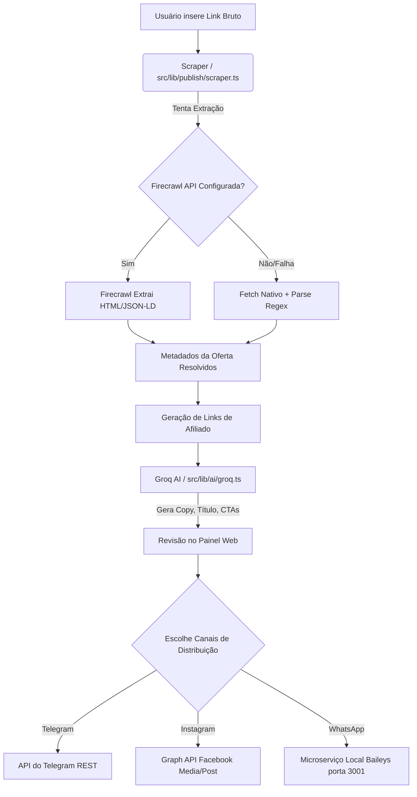

# Mapa da Arquitetura - Caça Oferta Oficial

Este documento reflete a estrutura macro da aplicação identificada por meio da análise do código real (`package.json`, `src/lib`, `api`, `scripts`).

## 1. Diagrama de Blocos Textual (Arquitetura)

```text
[ CLIENTE - BROWSER ]
      │
      │ (HTTPS / Vercel Edge)
      ▼
[ FRONTEND & BACKEND (Next.js 14+) ]
      │  ├─ /src/app (UI e Rotas de API)
      │  ├─ /src/components (Componentes React + Tailwind)
      │  └─ /src/lib (Regras de Negócio Core)
      │
      ├─────────────────────────────────────────┐
      ▼                                         ▼
[ BANCO DE DADOS ]                       [ SERVIÇOS DE IA ]
 Supabase (PostgreSQL)                    Groq API (LLaMA)
  - auth.users                            (Geração de Copys
  - public.offers                          e Avaliação)
  - public.posts
  - RLS Policies

```

## 2. Fluxo Completo de Negócio (Pipeline da Oferta)

O diagrama abaixo descreve o caminho exato no código desde o link de loja até a publicação:



## 3. Topologia do WhatsApp Engine
Como o WhatsApp não utiliza API Oficial da Nuvem e sim o Baileys, o servidor backend Next.js precisa conversar com a máquina local via proxy ou conexão HTTP direta local.

```text
[ Next.js Backend ] ---> (POST http://localhost:3001/send) ---> [ Express.js / whatsapp-engine.cjs ]
                                                                        │
                                                                        ▼
                                                          [ WhatsApp Web Socket Server (Baileys) ] ---> Rede Móvel
```
