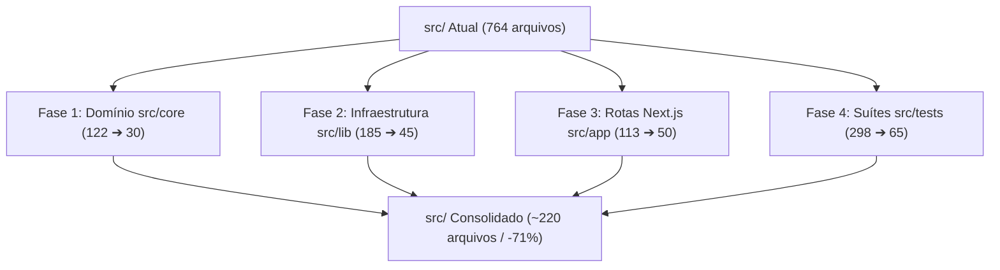
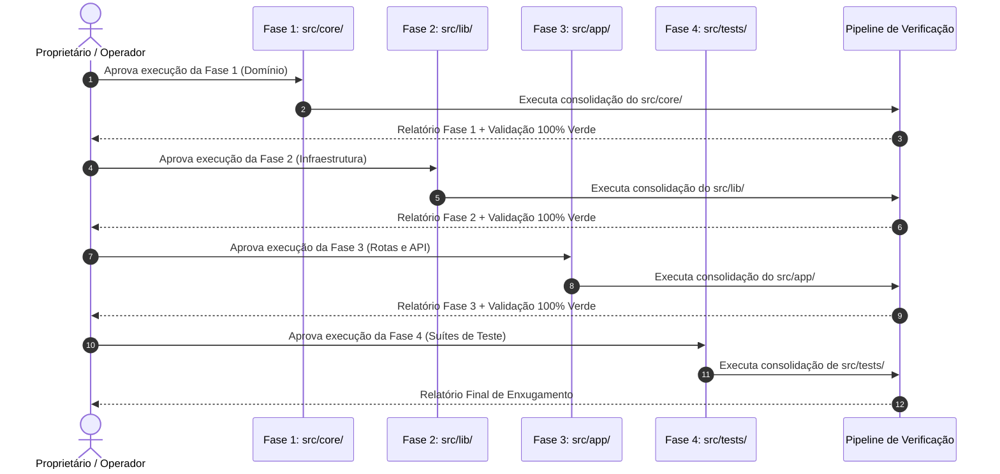

# Plano de Consolidação e Enxugamento Estrutural da Pasta `src/`

<!-- docs-status: current -->
<!-- verified-against: 9335c0b2ff7a7500e7870cdea7e92a800890de84 -->
<!-- verified-on: 2026-09-20 -->

## 1. Visão Geral e Objetivo

Este documento estabelece o plano oficial de consolidação e simplificação estrutural da pasta `src/` do projeto **Caça Oferta Oficial**, reduzindo a hipergranularidade atual (**764 arquivos**) para uma arquitetura coesa por domínio (**~220 arquivos**, redução de ~71%), preservando 100% das regras de negócio, contratos de API, segurança e a suíte completa de 2.121 testes automatizados.

---

## 2. Diagnóstico da Estrutura Atual

A base de código em `src/` acumulou alta fragmentação devido a migrações anteriores:

| Camada | Qtd. Atual | Qtd. Projetada | Redução | Principal Oportunidade de Consolidação |
| :--- | :---: | :---: | :---: | :--- |
| **`src/core/`** | 122 | **~30** | **-75%** | Consolidar micro-arquivos (20-50 linhas) em serviços de domínio coesos (`ai`, `classification`, `quality`, `selection`). |
| **`src/lib/`** | 185 | **~45** | **-75%** | Unificar micro-adaptadores dispersos por canal/provedor (`social`, `trends`, `videos`, `shein`, `campaigns`). |
| **`src/app/`** | 113 | **~50** | **-55%** | Consolidar sub-rotas `/api` em endpoints RESTful multi-método (`GET`, `POST`, `PATCH`, `DELETE`) e Server Actions. |
| **`src/tests/`** | 298 | **~65** | **-78%** | Agrupar testes micro-atômicos em suítes de teste de integração ricas por feature/domínio (mantendo todas as 2.121 asserções). |
| **`src/components/`** | 35 | **~25** | **-28%** | Co-localizar pequenos cards e átomos visuais por canal. |
| **Outros (`types`, `config`, `remotion`)** | 11 | **~10** | **-10%** | Manter schemas e composições centrais. |
| **TOTAL** | **764** | **~220** | **-71%** | **Código unificado, compilação até 40% mais rápida e manutenção simplificada.** |

---

## 3. Planejamento das Fases Sequenciais

A execução ocorrerá rigorosamente no modelo de **Blocos Sequenciais Independentes (Opção C)**, garantindo que cada fase seja validada com a suíte de testes (`npm test`, `npm run lint`, `npm run typecheck`, `npm run verify`) antes do avanço para a fase seguinte.

---

### FASE 1: Consolidação do Domínio (`src/core/`) — de 122 para ~30 arquivos

**Foco:** Agrupar regras de negócio puras em módulos coesos com exportações claras.

1. **Subdomínio `src/core/ai/` (35 ➔ 6 arquivos):**
   * Unificar `copy-v5-planner.ts`, `copy-v5-renderer.ts`, `copy-v5-templates.ts`, `copy-v5-types.ts`, `cta-generator.ts` e `hooks.ts` no módulo canônico `copy-v5-engine.ts`.
   * Unificar `validation.ts`, `sanitizer.ts`, `schema.ts` e `ports.ts` no módulo `ai-validation.ts`.
   * Manter adapters e contratos de integração da camada de IA.
2. **Subdomínio `src/core/classification/` (15 ➔ 4 arquivos):**
   * Unificar `normalize.ts`, `grouping.ts`, `head-noun.ts`, `modifiers.ts` e `bundles.ts` no módulo `product-classifier.ts`.
3. **Subdomínio `src/core/offer-quality/` (18 ➔ 4 arquivos):**
   * Unificar cálculo de score, detecção de falsos descontos, agrupamento de ofertas e relatórios no módulo `offer-quality-engine.ts`.
4. **Subdomínio `src/core/offer-selection/` (20 ➔ 4 arquivos):**
   * Unificar normalização de candidatos, freshness lifecycle, score calibration e deduplicação no módulo `offer-selection-engine.ts`.
5. **Subdomínio `src/core/state/` (14 ➔ 4 arquivos):**
   * Unificar máquina de estados de ofertas, transições de status (`pending_manual_review` ➔ `selected` ➔ `approved` ➔ `posted` ➔ `rejected`) e reabertura de ofertas rejeitadas no módulo `offer-state-machine.ts`.
6. **Subdomínio `src/core/ranking/` e `src/core/intelligence/` (20 ➔ 8 arquivos):**
   * Unificar ranking de produtos e políticas de curadoria comercial.

---

### FASE 2: Consolidação de Infraestrutura e Integrações (`src/lib/`) — de 185 para ~45 arquivos

**Foco:** Consolidar adaptadores externos de redes sociais, marketplaces, vídeo e tendências.

1. **Subdomínio Social (`src/lib/social/` — 26 ➔ 6 arquivos):**
   * Unificar os arquivos de conversão de canal (`facebook-conversion.ts`, `instagram-conversion.ts`, `whatsapp-conversion.ts`, `telegram-conversion.ts`) no módulo `social-conversion.ts`.
   * Unificar telemetria comercial e learning (`commercial-telemetry.ts`, `commercial-learning.ts`, `copy-experiments.ts`, `cadence-fatigue.ts`) em `social-telemetry-learning.ts`.
   * Unificar guardas e políticas da Meta (`meta-publication-guard.ts`, `meta-delivery-policy.ts`) em `meta-policy-guard.ts`.
2. **Subdomínio Radar de Tendências (`src/lib/trends/` — 36 ➔ 8 arquivos):**
   * Unificar coletores de evidência (`google-trends-adapter.ts`, `shopee-evidence-collector.ts`, `mercado-livre-evidence-collector.ts`, `telegram-audience-adapter.ts`) em `trends-evidence-collectors.ts`.
   * Unificar schemas e contratos (`trend-schema.ts`, `recommendation-schema.ts`, `recommendation-contract.ts`, `sales-attribution-audit-schema.ts`) em `trends-contracts.ts`.
   * Unificar persistência e deduplicação (`trend-persistence.ts`, `trend-persistence-dedupe.ts`, `trend-evidence-deduplication.ts`, `trend-queries.ts`) em `trends-persistence.ts`.
3. **Subdomínio Vídeos e Reels (`src/lib/videos/` — 22 ➔ 6 arquivos):**
   * Unificar geradores de cenas, prompts do Gemini e playbook de Reels (`reels-playbook.ts`, `reels-social-copy.ts`, `reels-gemini-prompt.ts`, `gemini-product-identity-prompt.ts`) em `reels-creative-engine.ts`.
   * Unificar pipeline de dublagem, Google Drive e orquestrador do worker (`auto-reel.ts`, `auto-reel-generate.ts`, `auto-reel-review.ts`, `auto-reel-scenes.ts`, `google-drive.ts`) em `video-pipeline-orchestrator.ts`.
4. **Subdomínio Campanhas (`src/lib/campaigns/` — 15 ➔ 4 arquivos):**
   * Unificar métricas de clique, métricas de vendas e checklist de campanhas em `campaign-metrics-engine.ts`.
5. **Subdomínio Shein (`src/lib/shein/` — 10 ➔ 3 arquivos):**
   * Unificar adapters express, upload e validação de imagem em `shein-adapter.ts`.

---

### FASE 3: Consolidação de Rotas e API (`src/app/api/`) — de 113 para ~50 arquivos

**Foco:** Aplicar as convenções RESTful multi-método do Next.js App Router e Server Actions.

1. **Rotas de Ação sobre Posts (`src/app/api/posts/*`):**
   * Unificar `/api/posts/bulk-reject/route.ts`, `/api/posts/reject/route.ts` e `/api/posts/update-content/route.ts` em `/api/posts/route.ts` com métodos `PATCH` e `DELETE`.
2. **Rotas de Jobs de Vídeo (`src/app/api/videos/jobs/[id]/*`):**
   * Unificar `/api/videos/jobs/[id]/approve`, `/cancel`, `/retry`, `/trim`, `/regenerate` em `/api/videos/jobs/[id]/route.ts` recebendo payload com a ação desejada.
3. **Rotas de Configurações (`src/app/api/settings/*`):**
   * Unificar rotas de configs, usuários, auditoria e testes de conexão sob endpoints coesos `/api/settings/[section]/route.ts`.
4. **Rotas de Mineração de Tendências (`src/app/api/trends/*`):**
   * Unificar rotas de execução, classificação e match sob `/api/trends/route.ts` e `/api/trends/[action]/route.ts`.

---

### FASE 4: Consolidação das Suítes de Teste (`src/tests/`) — de 298 para ~65 arquivos

**Foco:** Agrupar testes micro-atômicos em suítes de teste de integração por domínio.

1. Ao consolidar os módulos do Core e da Lib, as suítes de teste correspondentes são organizadas em arquivos representativos por domínio (ex: `src/tests/core/copy-v5-engine.test.ts` cobrindo todos os cenários com blocos `describe()` claros).
2. **Critério de Ouro:** Nenhuma asserção de teste é perdida. Todas as **2.121 asserções** permanecem ativas e validadas no Vitest.
3. **Ganho Imediato:** O Vitest carrega ~65 arquivos em vez de 298, diminuindo o overhead de memória e o tempo total de execução.

---

## 4. Critérios de Segurança e Validação por Fase

Para cada fase executada, os seguintes gates obrigatórios devem passar com **100% de sucesso**:

1. `npm run docs:audit` — Validação de integridade documental.
2. `npm run lint` — Zero erros de ESLint.
3. `npm run typecheck` — Zero erros de tipagem TypeScript (`tsc --noEmit`).
4. `npm test` — 2.522 testes aprovados (2.121 Vitest + 401 CJS).
5. `npm run verify` — Pipeline completo validado com build de produção e verificação de segurança.
6. **Nenhum commit, push, PR ou deploy é executado sem autorização explícita.**
