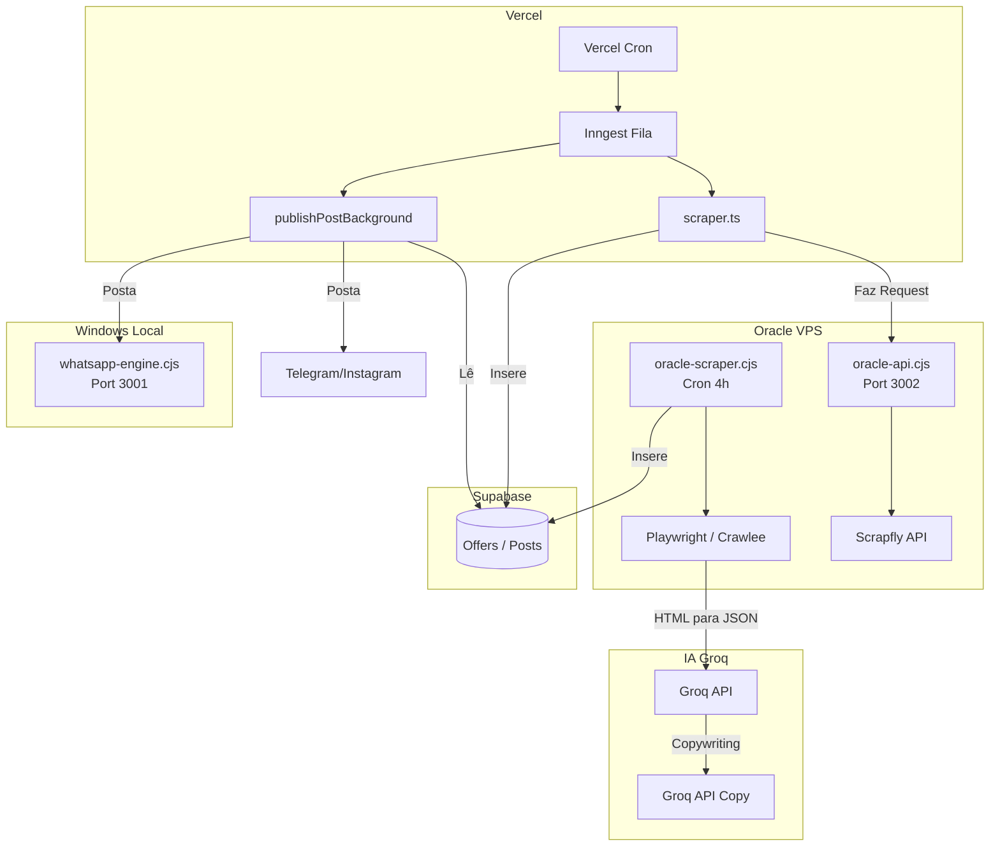

# MISSÃO: Reestruturação da Arquitetura de Scraping (Local vs Oracle)

Esta é a fase de planejamento para cumprir as Etapas 1, 2 e 3 da sua missão como Arquiteto Técnico Principal. O objetivo é remover a carga de web scraping da Oracle VPS e transferi-la integralmente para a máquina Windows local, mantendo a Oracle estritamente como orquestradora.

---

## ETAPA 1 — AUDITORIA (Fluxo Atual)

### Mapeamento dos Componentes

1. **Crawler (Scraping)**
   - **Oracle In-House (`scripts/oracle-scraper.cjs`)**: Roda na VPS via PM2. Usa `crawlee` e `playwright-extra` para raspar lojas (Mercado Livre, Amazon, Magalu) a cada 4 horas.
   - **API Proxy Oracle (`scripts/oracle-api.cjs`)**: Roda na VPS na porta 3002. Atua como proxy para a API do Scrapfly, chamada pela Vercel.
   - **Vercel Inngest (`src/lib/affiliates/scraper.ts`)**: Faz scraping de "Trends" batendo na `oracle-api.cjs` (porta 3002).
2. **Scheduler**
   - **Local/Oracle**: `node-cron` dentro de `oracle-scraper.cjs` agendado para `0 */4 * * *`.
   - **Vercel**: `src/app/api/scraper/cron/route.ts` que enfileira o evento `cron/run-scraping` via Inngest.
3. **PM2**
   - Na Oracle VPS, o PM2 gerencia `oracle-scraper.cjs` e `oracle-api.cjs` (`update-oracle.js` evidencia isso).
4. **Oracle (VPS)**
   - Atualmente concentrando tudo: faz o scraping direto (Playwright), consome o Scrapfly (API proxy), chama a IA (Groq) para formatar e gerar copy, e salva no Supabase.
5. **Vercel (Frontend & Serverless)**
   - Hospeda as rotas Next.js, gerencia a fila Inngest, executa rotas de publicação e faz a chamada de curadoria das ofertas.
6. **APIs**
   - `/api/scrape` (Oracle, porta 3002)
   - `/send` (Local Windows - `whatsapp-engine.cjs`, porta 3001)
   - Rotas Next.js (`/api/telegram/publish`, `/api/instagram/publish`)
7. **Supabase**
   - Banco central. O scraping escreve na tabela `offers`, a IA escreve em `posts` (status: `draft`), e Inngest interage com `sales` e `app_settings`.
8. **IA (Groq)**
   - Chamada em dois momentos: (A) Formatar o HTML sujo em JSON de produtos; (B) Geração de Copy (estratégias, headline, hashtags).
9. **Pipeline Completo (Publicação)**
   - Inngest (`src/lib/inngest/functions.ts` -> `publishPostBackground`) pega as ofertas curadas e posta via provedores (Telegram API, Instagram Graph, e envio local para `whatsapp-engine.cjs`).

### Diagrama de Fluxo Atual (Mermaid)



### Onde cada etapa ocorre hoje:
- **Início do Scraping:** Na Oracle (`oracle-scraper.cjs`) ou no Vercel (que pede para a Oracle raspar via `oracle-api.cjs`).
- **Fim do Scraping:** Após receber o HTML e enviar para a Groq converter em JSON de produtos.
- **Oracle assume:** A Oracle *já é* o ponto central desde o início.
- **IA assume:** No parseamento do HTML (`getScrapingPrompt`) e depois na curadoria (`generateOfferAnalysis`).
- **Publicação ocorre:** Via Inngest (Vercel) ou via chamadas manuais disparando contra as APIs de Telegram/Instagram e o Windows Local (WhatsApp).

---

## ETAPA 2 — IDENTIFICAR ACOPLAMENTOS

Pontos críticos onde a Oracle (e a Vercel) dependem do scraping de forma acoplada:

1. **Arquivo:** `scripts/oracle-scraper.cjs`
   - **Função:** `runScrapingCycle()`, `scrapeStore()`, `crawleeExtract()`
   - **Dependências:** `crawlee`, `playwright-extra`, `puppeteer-extra-plugin-stealth`
   - **Impacto:** Alto. Todo o scraping pesado, proxy Scrapfly e controle de memória do Chromium estão dentro do mesmo arquivo que faz a persistência e a fila VIP.
   - **Risco:** Mudar esse arquivo de ambiente quebra a rotina de postagens automáticas de 4 em 4 horas se não houver um substituto.

2. **Arquivo:** `scripts/oracle-api.cjs`
   - **Função:** `app.post('/api/scrape')`
   - **Dependências:** `scrapfly`, `cheerio`, `axios`
   - **Impacto:** Médio. Vercel depende disso para raspar a Shopee, Shein e Magalu em `scraper.ts`.
   - **Risco:** Sem essa API rodando (ou sendo migrada), a Vercel não conseguirá fazer scraping sob demanda.

3. **Arquivo:** `src/lib/affiliates/scraper.ts`
   - **Função:** `fetchShopeeTrendingProducts()`, `fetchSheinTrendingProducts()`, `fetchMagaluTrendingProducts()`
   - **Dependências:** `fetch("http://193.122.242.178:3002/api/scrape")`
   - **Impacto:** Alto. Frontend (Next.js) está hardcoded com o IP da Oracle para fazer proxy de scraping.
   - **Risco:** Se a Oracle deixar de fazer scraping, o painel Vercel perderá a funcionalidade de buscar tendências até ser redirecionado para o Windows Local.

---

## ETAPA 3 — NOVA ARQUITETURA (Híbrida)

O novo fluxo transferirá a responsabilidade de raspar páginas (peso de CPU, RAM e IPs residenciais) para o Windows, enquanto a Oracle cuidará da gestão, IA e envios.

### Divisão de Responsabilidades

- **Windows Local (Novo IP Residencial)**
  - Rodará o `crawlee` / `playwright`.
  - Será responsável por navegar, gerenciar cookies de sessão, driblar bot-protections e capturar o HTML/Preços.
  - Exporá uma micro-API (como o `whatsapp-engine.cjs` já faz, possivelmente juntos ou lado a lado via `ngrok` ou Cloudflare Tunnels) para a Vercel / Oracle chamarem sob demanda.
  - Alternativamente, rodará o `node-cron` que injeta o dado final diretamente na fila (Supabase).

- **Oracle VPS (Orquestrador & IA)**
  - Avalia o que está no Supabase (ofertas "raw" enviadas pelo Windows).
  - Executa a Groq IA para fazer o Parse final (ou formatação de Copy).
  - Mantém o `node-cron` apenas para verificar se há novos itens raspados, aplicar o Score de Ranking, e orquestrar as filas de envio.
  - Monitora o status do Scraping Local (Heartbeat). Se o Windows sumir, a Oracle alerta.

### Novo Diagrama (Proposto)

```mermaid
graph TD
    subgraph Windows Local
        LocalScraper[Local Scraper\nCrawlee/Playwright] -->|Grava Raw Data| SupabaseOffers[(Supabase: offers_raw)]
        WPEngine[whatsapp-engine.cjs]
    end

    subgraph Oracle VPS (Orquestrador)
        OracleWorker[Oracle Worker\nRanking, IA, Fila] -->|Consulta| SupabaseOffers
        OracleWorker -->|Gera Copy| Groq[Groq API]
        OracleWorker -->|Atualiza status| SupabasePosts[(Supabase: posts draft)]
        OracleWorker -->|Monitora Heartbeat| SupabaseHealth
    end
    
    subgraph Vercel
        Publisher[Inngest Publisher] -->|Lê| SupabasePosts
        Publisher -->|Posta| Telegram/Instagram
        Publisher -->|Posta| WPEngine
    end
    
    LocalScraper -->|Ping (Watchdog)| SupabaseHealth[(Heartbeat Table)]
```

---

## User Review Required

> [!CAUTION]
> Para avançarmos para a **ETAPA 4 (Implementação em lotes)**, precisamos decidir **COMO o Vercel e a Oracle vão se comunicar com o Windows Local**. 
>
> **Temos duas opções de design para o Windows Local:**
> 1. **(Pull via Túnel)**: O Windows hospeda uma API rodando `ngrok` (já faz isso no `whatsapp-engine.cjs`). O código da Vercel (`scraper.ts`) muda a URL do Oracle IP para o Ngrok URL, solicitando o scraping na hora.
> 2. **(Push via Fila - Mais Resiliente)**: O Windows roda um script que faz o scraping ativamente de tempos em tempos (ou observando uma tabela no Supabase) e empurra o HTML para o banco. A Vercel/Oracle só consultam o banco. Isso evita depender do túnel `ngrok` cair.
>
> Recomendo a **Opção 2 (Push / Polling no Supabase)** para máxima resiliência (conforme Etapa 6 - sincronização offline).

## Open Questions
Como prefere seguir com a arquitetura de comunicação entre o Orquestrador (Oracle) e o Scraper (Windows)? 
- Aceita a recomendação de usarmos o Supabase como fila intermediária de scraping para o Windows (Opção 2)?
- Devo começar o primeiro lote de implementação dividindo o código do `oracle-scraper.cjs` em `local-scraper.cjs` (para Windows) e `oracle-orchestrator.cjs` (para Oracle)?

Aguardando sua aprovação desta auditoria e da direção arquitetural para avançar.
