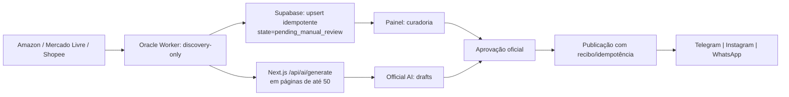

# Estratégia de publicação e evolução de IA — Caça Oferta Oficial

Data da pesquisa: 21 de julho de 2026. Horizonte recomendado: 12–24 meses. Este documento é uma análise somente-leitura do checkout local e de fontes primárias. Onde não existe evidência observável no repositório ou na documentação pública, a conclusão é explicitamente uma hipótese a ser testada, não um facto operacional.

## Resumo executivo

O Caça Oferta Oficial já possui a fundação correta para uma operação confiável: descoberta separada do ato de publicar, estado explícito, idempotência, recibos finais e uma revisão humana antes da divulgação. O maior salto de resultado não virá de aumentar indiscriminadamente o volume de posts. Virá de transformar o ranking atual — principalmente preço, desconto, rating e poucos sinais Shopee — em um sistema de decisão por **oferta × audiência × canal × momento**, com atribuição e experimentação.

Recomendação central:

1. Tratar Telegram e WhatsApp como canais de conversão/alerta; Feed e Facebook como canais de catálogo/confiança; Reels e Stories como descoberta e reativação.
2. Publicar menos itens repetidos e aumentar a novidade verificável: preço real, economia absoluta, cupom elegível, estoque/validade e loja confiável.
3. Usar janela de urgência apenas quando houver evidência no dado de origem. Não gerar escassez artificial.
4. Passar de um score fixo para uma política de exploração controlada: 80–90% de ofertas de maior valor esperado e 10–20% de testes por categoria, faixa de preço, criativo e horário.
5. Instrumentar clique, checkout/compra quando o programa permitir, publicação, falha, cancelamento, rejeição, repetição e fadiga por canal. Sem esse conjunto, não é possível afirmar quais horários, categorias ou marketplaces convertem mais no público do Caça Oferta.

Há também uma restrição de compliance prioritária: o Mercado Livre permite Instagram, Facebook, WhatsApp e Telegram, mas veda promoção em grupos privados ou sites não declarados; a origem e o destino devem ser declarados/permitidos, e o uso de etiquetas por canal é essencial. A Amazon exige disclosure claro, próximo do link, e identificação como Associate. Essas regras devem ser regras duras do Quality Gate, não apenas texto de copy.

## Evidência, escopo e limites

### O que foi efetivamente verificado

- Código versionado, schema/migrations, testes e documentação do checkout em `C:\Projetos_GitHub\Caca_Oferta_V5`.
- Documentação oficial indexada via Context7 para Next.js e Supabase; documentação oficial da Vercel; documentação Oracle atualizada em 2025–2026; fontes oficiais Meta, Telegram, Amazon e Mercado Livre.
- Políticas e superfícies públicas dos marketplaces. Para Shopee, Magalu, Netshoes e Shein, a documentação pública de afiliados/API disponível é limitada ou contextual/contratual. Não foram inventadas capacidades, taxas, catálogos ou limites não publicados.

### O que não é verificável apenas no checkout

- Quantidade atual de produtos por marketplace/categoria/preço/desconto, duração real das promoções, CTR, conversão, receita, audiência, frequência já aplicada e horários vencedores.
- Configuração efetiva de Vercel, Oracle, Supabase, tokens, destinos sociais, permissões, plano contratado ou execuções externas.

Esses pontos exigem consultas read-only a `offers`, `posts`, `affiliate_links`, eventos de clique/conversão e analytics das contas. Portanto, qualquer número de “melhor horário”, “melhor categoria” ou “tempo médio da promoção” seria especulativo hoje. O plano abaixo transforma esses itens em métricas observáveis.

## Mercado e social commerce em 2026

Social commerce de ofertas tem três lógicas diferentes, que não devem competir pelo mesmo KPI:

| Trabalho do conteúdo | Canal principal | Métrica primária | Tipo de oferta |
|---|---|---|---|
| Descoberta | Reels, Instagram Feed, Facebook Reels | alcance qualificado, retenção, compartilhamentos | demonstrável, visual, novidade, comparável |
| Consideração/confiança | Carrossel, Feed, Stories | salvamentos, respostas, cliques | ticket médio/alto, comparativo, guia, lista |
| Conversão/urgência | Telegram, WhatsApp, Stories com link | CTR, EPC, conversão, cancelamento | cupom verificável, queda real de preço, estoque/tempo limitado |

Em 2025–26 a Meta reforçou que interações moldam recomendações, combateu conteúdo spammy e passou a favorecer conteúdo original em Feed/Reels. Facebook informou que passou a mostrar mais Reels recentes; Instagram introduziu reposts que podem ampliar a distribuição do autor original. A inferência operacional é clara: reutilizar o mesmo card/caption em massa, sem contexto ou transformação, é risco de distribuição e de fadiga; conteúdo próprio com prova da oferta e utilidade ao comprador é mais defensável. Isto não autoriza prometer alcance: as plataformas não publicam uma fórmula de ranking que permita isso.

### Psicologia de promoções: uso responsável

- **Economia concreta**: mostre preço atual, preço anterior somente se verificável, economia em R$ e condição de frete/cupom. Isso reduz ambiguidade de comparação.
- **Urgência factual**: use prazo, estoque, campanha ou cupom apenas quando recebidos da fonte; caso contrário use “sujeito a alteração”.
- **Prova de adequação**: rating, volume de vendas, loja oficial/Mall e compatibilidade devem ser sinais, não alegações absolutas.
- **Redução de risco**: destaque vendedor confiável, política do marketplace e condições relevantes; nunca oculte limitação de cupom/variação.
- **Evitar pressão indevida**: não usar contagem inventada, preço riscado sem lastro, “últimas unidades” sem fonte, ou promessa de entrega/garantia que o dado não comprove.

## Arquitetura atual: conclusão baseada no código

### Pipeline canônico

- O Oracle Worker descobre **Shopee, Mercado Livre e Amazon**; persiste candidatos idempotentemente e encaminha os IDs à Official AI. Magalu, Netshoes e Shein são capacidades parciais/legadas ou contratos, não fontes ativas desse ciclo.
- A execução programada do worker é a cada 4 horas (`0 */4 * * *`, `America/Sao_Paulo`, `noOverlap`). A IA recebe páginas de 50; há limites e checkpoints. Isso é uma boa separação entre descoberta e copy, mas não é uma cadência de publicação.
- O estado de entrada observado é `pending_manual_review`; a IA gera drafts para Telegram, Instagram e WhatsApp. A publicação oficial exige oferta aprovada, post draft, versões esperadas, idempotency key e recibo válido. O serviço conclui a oferta somente depois de não restarem drafts relacionados.
- O painel e Supabase constituem o centro de curadoria/auditoria. O gateway Oracle API e o motor WhatsApp/Baileys são processos distintos; a disponibilidade real não pode ser certificada pelo checkout.

### Ranking, inteligência e Quality Gate

O `RankingEngine` usa desconto (35%), preço (30%), impulso por ticket (20%) e rating (15%) na política oficial. A política comercial usa desconto (40%), melhor entre economia absoluta/impulso/premium (45%) e rating (15%). Shopee pode adicionar no máximo 2,5 pontos por Mall, loja oficial, comissão extra, vendas, rating e campanha. O score final combina 70% base e 30% IA.

O `MarketplaceIntelligenceEngine` classifica loja/Mall, popularidade, rating e comissão. A base é útil, porém possui lacunas estratégicas: não há sinal real de idade/validade da oferta, preço histórico, margem/EPC, disponibilidade, duplicidade semântica cross-marketplace, fadiga por audiência, adequação ao canal/horário, custo de oportunidade, nem aprendizagem causal de CTR/conversão. A confiança fixa de 95% não é uma probabilidade calibrada e deve deixar de ser apresentada como certeza até haver validação estatística.

O Quality Gate e a validação de publicação preservam consistência do fluxo. A evolução recomendada é adicionar regras duras de compliance/verdade comercial antes do score: URL de afiliado válida, disclosure obrigatório, preço e moeda válidos, cupom com regra/validade, imagem licenciada/permitida, categoria de risco, produto não proibido e evidência de preço anterior.

### Discovery e diversidade

- Shopee: categoria/API de afiliados; traz sinais de Mall, loja oficial, comissão, vendas, rating e campanhas.
- Mercado Livre: ofertas SSR e categorias/fontes capturadas; os alvos configurados priorizam telefonia, eletrônicos, informática, games, eletroportáteis, TV, beleza e esporte.
- Amazon: Best Sellers por nó/subcategoria; os alvos configurados são concentrados em Kindle/Echo, telefonia, informática, eletroportáteis e eletrônicos.

Há diversidade configurada por catálogo de consultas, mas não uma otimização explícita de portfólio no ranking global. Sem limite por “produto substituto”, marca, subcategoria e janela de repetição, é provável ocorrer concentração em fone/smartwatch/telefonia. Deve haver uma quota suave por categoria e um limite duro por SKU/variante/cluster semântico.

## Análise por marketplace

| Marketplace | Estado no sistema | O que priorizar | Risco/condição |
|---|---|---|---|
| Amazon | Discovery ativo via Best Sellers/HTML | utilidades recorrentes, eletrônicos confiáveis, itens com preço e elegibilidade prováveis | somente links/conteúdo permitidos; disclosure e identificação de Associate são obrigatórios |
| Mercado Livre | Discovery ativo via ofertas SSR | vendedores verdes, categorias elegíveis, Ganhos Extras e cupons; etiquetar cada canal | atribuição típica publicada: 24h; canais permitidos/declarados; não usar grupos privados não declarados |
| Shopee | Discovery ativo via Affiliate Open API/cenários | Mall/loja oficial, comissão extra, vendas/rating, campanhas e cupom válido | contrato/API é autoridade; não inferir cobertura, comissão ou uso de conteúdo sem confirmação contratual |
| Magalu | Não ativo no ciclo canônico | inserir apenas após contrato/feed/API e regra de atribuição verificáveis | não tratar assets/código parcial como integração operacional |
| Netshoes | Não ativo no ciclo canônico | esporte, corrida, futebol, treino e sazonalidade esportiva | validar programa, permissão de imagem e janela de atribuição antes de automatizar |
| Shein | Não ativo no ciclo canônico | moda/beleza de alta rotatividade, com sizing/variação explícitos | alto risco de variação de tamanho/estoque; validar programa/API/uso de criativos |

Não há fonte pública suficiente para estabelecer “categorias mais vendidas”, “tempo médio de promoção” ou “cupons disponíveis” por todos esses marketplaces com rigor de 2025–26. O sistema deve medir isso na sua própria coleta: `first_seen_at`, `last_seen_at`, `price_history`, `coupon_terms`, `stock_signal`, `campaign_id`, `commission_rate`, `published_at`, `clicks`, `orders`, `reversals`.

## Estratégia de publicação proposta

### Cadência inicial — hipótese operacional, não fato universal

Começar conservadoramente por 6 semanas, mantendo um holdout e reduzindo caso aumentem ocultações, bloqueios, descadastros ou queda de CTR:

| Rede/formato | Objetivo | Volume inicial | Espaçamento | Formato e CTA |
|---|---|---:|---:|---|
| Instagram Reels | descoberta | 1/dia, 5–6/semana | >= 4h de qualquer outro post IG | vídeo original de 10–30s, prova visual + preço + “veja condições no link” |
| Instagram Feed/carrossel | confiança/salvos | 3–4/semana | >= 6h de Reel | 3–6 cards: produto, economia, para quem serve, condição, disclosure, CTA |
| Instagram Stories | reativação/urgência | 3–6 frames/dia em 1–2 blocos | >= 4h entre blocos | 1 oferta por sequência; sticker/link; enquete apenas quando útil |
| Facebook Feed/Reels | alcance complementar | 1 post original/dia | >= 6h | adaptar legenda e mídia; não espelhar texto sem transformação |
| Facebook Stories | lembrete | 1–2 blocos/dia | >= 4h | recorte de oferta que já provou clique no canal |
| Telegram canal | conversão imediata | 3–6/dia | >= 90 min | imagem + preço + cupom + condição + link etiquetado; agrupar itens fracos em roundup |
| WhatsApp canal/status | maior intenção e retenção | rampa de 5–8/dia até 15–20/dia + Status | >= 90 min | opt-in, mensagens curtas, benefício verificável, link; escalar somente sem sinal de fadiga e respeitar regras do provedor e destinatário |

“Melhor horário” deve ser uma distribuição de teste, não uma regra de consultoria genérica. Para São Paulo, crie 6 blocos: 07–09, 11–13, 14–16, 17–19, 20–22 e 22–00. Faça randomização estratificada por canal/categoria/ticket; após pelo menos 200–500 cliques por célula relevante, aplique shrinkage Bayesiano/hierárquico antes de eleger vencedores. Medir somente likes não responde a conversão.

### Matriz de seleção por rede

| Rede | Prioridade de categoria | Evitar/restringir | Regra de decisão |
|---|---|---|---|
| Reels | demonstração visual: eletroportáteis, organização, beleza, gadgets, esporte | medicamento, adulto, tabaco, armas, alegações financeiras/saúde, réplica/falsificação | só produzir vídeo se imagem/demonstração explicar valor em <= 3 segundos |
| Feed/carrossel | tecnologia, comparativos, casa, ticket médio/alto e guias | variações sem preço/estoque confiáveis | use quando contexto reduz risco de compra |
| Stories | cupom, oportunidade breve, reposição, seleção do dia | pressão enganosa | use para oferta já elegível e linkável |
| Facebook | casa, família, eletro, esporte, guias e roundups | conteúdo alheio ou texto irrelevante/spam | conteúdo original/adaptado; Facebook anunciou redução de alcance/monetização para spam |
| Telegram | preço, cupom, oferta relâmpago e lista por tema | repetição de SKU e flood | preferir clique/velocidade; limitar sequência e medir views/clicks |
| WhatsApp | seleção de alta confiança e alertas opt-in | broadcast não consentido, frequência alta, produto ambíguo | priorizar menor volume e maior relevância por segmento |

Telegram tem limites técnicos publicados para bots: evite mais de uma mensagem por segundo no mesmo chat, 20 por minuto em grupos e cerca de 30/s para broadcast gratuito; não são metas de marketing. Canais podem ter assinantes ilimitados e contadores de visualização por post. Portanto o limitador deve ser de relevância/fadiga muito antes de ser técnico.

## IA de seleção e publicação

### Guardrails antes do modelo

Rejeitar ou exigir revisão manual se: preço/cupom não verificável; desconto impossível ou >80% sem prova adicional; produto em categoria proibida; URL sem tagging; disclosure incompatível; imagem inválida; título enganoso; marca/loja em blacklist; estoque/campanha expirada; duplicata semântica em janela configurável; ou discrepância entre copy e campos estruturados.

### Score de valor esperado

Substituir o score único por componentes normalizados, auditáveis e versionados:

`EV = P(click | oferta, canal, horário) × P(conversão | click, oferta) × margem_esperada − custo_fadiga − risco_reversão − risco_compliance`

Modelo inicial (sem fingir causalidade):

| Componente | Peso inicial | Sinais |
|---|---:|---|
| Integridade/veracidade | gate | preço, preço anterior, cupom, URL, imagem, disponibilidade |
| Oferta | 20% | % desconto capado, economia R$, frete, cupom, comissão, preço histórico |
| Confiança | 15% | rating calibrado por nº de avaliações, loja oficial/Mall, reputação, devoluções |
| Intenção/categoria | 15% | desempenho histórico por cluster/categoria e sazonalidade |
| Canal/criativo | 15% | formato compatível, CTR histórico, taxa de salvamento/compartilhamento, saturação |
| Momento | 10% | hora/dia, evento, validade, recência, concorrência de posts |
| Audiência/segmento | 15% | opt-in, histórico de clique, preferências, recência/frequência |
| Exploração | 10% | incerteza e diversidade; Thompson Sampling ou UCB com limites de risco |

Os pesos são ponto de partida para experimento e devem ser registrados como `policy_version`. Treinar previsão de CTR e conversão apenas com janela temporal de validação, calibração (Brier/log loss), baseline simples e feature leakage auditado. Não permitir que o LLM determine preço, desconto, condição ou compliance: ele recebe fatos aprovados e gera alternativas de texto/formato.

### Loop de aprendizagem

1. Cada publicação grava `offer_id`, `post_id`, canal, formato, criativo, horário, política, score e motivo.
2. Link por canal/formato/campanha (`subId`) grava clique, origem e timestamp.
3. Importar métricas de afiliado e reversões quando permitidas; separar click, pedido, venda aprovada, comissão e cancelamento.
4. Calcular CTR, EPC, CVR, receita líquida por mil impressões, taxa de ocultação/descadastro, frescor, repetição e falha de publicação.
5. Re-treinar/avaliar semanalmente; promover uma política somente se superar baseline com intervalo de confiança e sem degradar compliance/fadiga.

## Roadmap de 12–24 meses

| Fase | Janela | Entregáveis | Critério de saída |
|---|---|---|---|
| Fundação de medição | 0–30 dias | taxonomia, eventos, tags, disclosure por marketplace/canal, dashboard de funil | 95%+ posts com IDs, tag e status mensuráveis |
| Integridade e diversidade | 31–60 dias | Quality Gate factual, dedupe cross-marketplace, TTL e quotas de portfólio | queda mensurável de duplicata/rejeição; nenhuma publicação sem evidência mínima |
| Experimentação | 61–90 dias | randomização de horários/formatos, holdout, relatório semanal | decisão baseada em cliques/conversões e não em likes |
| Personalização controlada | 3–6 meses | segmentos opt-in, bandit por canal, previsão calibrada | lift validado vs regra atual e guardrails estáveis |
| Expansão de marketplace | 6–12 meses | conectores somente após contrato/API, data contract e teste de compliance | cada fonte com SLA, política, atribuição e rollback |
| Otimização madura | 12–24 meses | valor incremental, causalidade, criativos modulares, orçamento/capacidade | receita líquida incremental e menor fadiga por coorte |

## Checklist de implementação futura

- [ ] Definir lista de categorias proibidas/restritas por canal e marketplace.
- [ ] Versionar policy, prompt e template; registrar explicação de cada escolha.
- [ ] Adicionar `first_seen_at`, `last_seen_at`, histórico de preço e validade de cupom.
- [ ] Criar cluster de produto/variante e cooldown por canal.
- [ ] Exigir URL etiquetada e disclosure renderizado antes da aprovação.
- [ ] Instrumentar impressão/view quando disponível, clique, checkout, compra aprovada e reversão.
- [ ] Segmentar WhatsApp somente por opt-in e preferência declarada.
- [ ] Implantar experiments com holdout, sem mudar todos os canais simultaneamente.
- [ ] Auditar semanalmente posts com alegações de desconto/urgência.
- [ ] Validar cada novo marketplace contra contratos, APIs, imagem e regras de divulgação.

## Consultas necessárias para concluir a Fase 7 com números reais

Sem executar alterações, a auditoria operacional deve extrair: contagem de `offers` por `platform/category/state`, percentis de `current_price`, faixas de desconto, idade `created_at → published_at`, repetição por URL/SKU/título normalizado, drafts/published/failed por canal, e dados de `affiliate_links`/vendas por tag. Depois, cruzar com a duração observada da oferta (`last_seen_at - first_seen_at`) e métricas de rede. Isso é o único modo defensável de responder quais produtos “atualmente extraídos” têm maior conversão por marketplace/rede.

## Fontes primárias e evidências

### Plataforma e infraestrutura

- [Next.js: route handlers, cache e variáveis de ambiente](https://nextjs.org/docs/app/getting-started/route-handlers-and-middleware) — consulta Context7 em 2026-07-21; a documentação mostra que GET route handlers não são cacheados por padrão desde Next 15 e que cache explícito é necessário quando apropriado.
- [Supabase: Row Level Security](https://supabase.com/docs/guides/database/postgres/row-level-security) — consulta Context7 em 2026-07-21; RLS deve ser habilitado e as permissões/policies precisam corresponder ao papel usado.
- [Vercel Cron Jobs: segurança com `CRON_SECRET`](https://vercel.com/docs/cron-jobs/manage-cron-jobs) — consulta oficial via documentação Vercel em 2026-07-21.
- [OCI Compute Metrics and Monitoring](https://docs.oracle.com/en-us/iaas/Content/Compute/References/computemetricsoverview.htm) — atualizado em 2025-01-13.
- [OCI Resource Monitoring](https://docs.oracle.com/en-us/iaas/Content/General/Concepts/resourcemonitoring.htm) — atualizado em 2025-06-13.
- [OCI IAM Policy Reference](https://docs.oracle.com/en-us/iaas/Content/Identity/policyreference/policyreference.htm) — atualizado em 2026-06-09.

### Canais e compliance

- [Telegram Bot FAQ — limites de broadcast](https://core.telegram.org/bots/faq) — consultado em 2026-07-21.
- [Telegram Bot API](https://core.telegram.org/bots/api) — atualizações de 2025 e parâmetros de broadcast pagos/limites.
- [Telegram Channels and statistics](https://core.telegram.org/api/channel) e [estatísticas por mensagem](https://core.telegram.org/api/stats).
- [Amazon Associates Operating Agreement](https://affiliate-program.amazon.com/help/operating/agreement/) — atualizado em 2025-10-15.
- [Amazon: disclosure em social](https://affiliate-program.amazon.com/help/node/topic/GPXFHVYZMTGPUMPE).
- [Mercado Livre: programa de afiliados e criadores](https://www.mercadolivre.com.br/l/afiliados-home) — até 16% anunciado, +1.000 cupons e elegibilidade de vendedores verdes; confirmar a categoria específica antes de selecionar.
- [Mercado Livre: onde compartilhar](https://www.mercadolivre.com.br/l/afiliados-onde-compartilhar) — lista Facebook, Instagram, WhatsApp, Telegram, YouTube, TikTok, X e sites/blogs pessoais.
- [Mercado Livre: FAQ e vedações](https://www.mercadolivre.com.br/l/primeiros-passos-perguntas-frequentes-para-afiliados) — não usar grupos privados ou destinos não declarados; proíbe dados falsos e certos formatos de search/shopping ads.
- [Mercado Livre: atribuição e ganhos](https://www.mercadolivre.com.br/l/afiliados-ganhos-por-venda) — a página informa janela de 24 h e pagamento sujeito a condições.
- [Meta: combate a conteúdo spammy](https://about.fb.com/news/2025/04/cracking-down-spammy-content-facebook/) — 2025.
- [Meta: Facebook Reels mais recentes/relevantes](https://about.fb.com/news/2025/10/finding-sharing-reels-facebook-just-got-easier-more-fun/) — 2025.
- [Meta: conteúdo original no Facebook](https://about.fb.com/news/2026/03/rewarding-original-creators-on-facebook/) — 2026.
- [Meta: reposts/Friends no Instagram](https://about.fb.com/news/2025/08/new-instagram-features-help-you-connect/) — 2025.

### Referência técnica Meta a validar por credencial no ambiente

- [Instagram Content Publishing API](https://developers.facebook.com/docs/instagram-platform/content-publishing/)
- [WhatsApp Cloud API — Send Messages](https://developers.facebook.com/docs/whatsapp/cloud-api/guides/send-messages)
- [Facebook Pages API](https://developers.facebook.com/docs/pages-api/)

As páginas técnicas Meta podem exigir sessão para leitura pública automatizada. Antes de implementar, a equipe deve validar na conta/app da Meta as permissões, tipos de mídia, limites e políticas vigentes; não houve suposição de suporte completo para Stories, Reels, Feed ou WhatsApp apenas pela presença de transportes no checkout.

## Verificação final da pesquisa

As afirmações de arquitetura foram confrontadas com `docs/architecture-current.md`, `scripts/oracle-scraper.cjs`, `scripts/oracle-worker-discovery-only.cjs`, `src/core/ranking/ranking-engine.ts`, `src/core/intelligence/intelligence-engine.ts`, `src/core/ai/official-ai-service.ts` e `src/core/publication/official-publication-service.ts`. As recomendações de cadência/horário são identificadas como hipóteses experimentais por inexistência de métricas de produção no checkout. Regras de marketplace e limites Telegram foram vinculados às fontes oficiais listadas. Nenhuma configuração, código de produção, banco ou credencial foi alterado.
