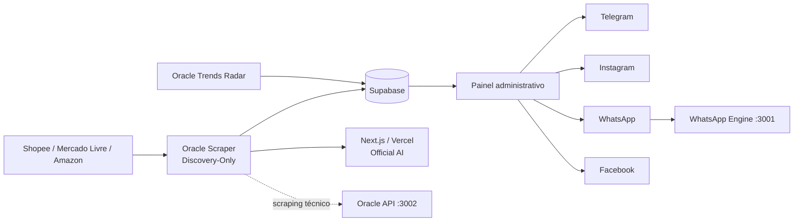
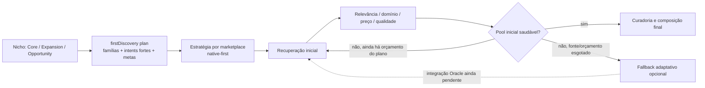

# Arquitetura atual — Caça Oferta Oficial

<!-- docs-status: current -->
<!-- verified-against: e16ce0d1ae525b3f0f9fd95e6554cc62b5c6a0d7 -->
<!-- verified-on: 2026-08-25 -->

> Fonte canônica documental do runtime versionado. A implementação, migrations e testes continuam sendo a autoridade final. Estado de produção é confirmado separadamente por auditoria operacional.

## Visão geral

O Caça Oferta Oficial coleta candidatos de Shopee, Mercado Livre e Amazon, persiste ofertas no Supabase, executa validações e scoring, gera drafts pela Official AI e publica manualmente por transportes oficiais.

## Componentes

| Componente | Responsabilidade |
|---|---|
| Next.js/Vercel | UI, autenticação, APIs, IA e publicação |
| `oracle-scraper` | scheduler e Discovery dos marketplaces |
| `oracle-api` | gateway técnico autenticado na porta 3002 |
| `whatsapp-bot` | motor Baileys na porta 3001 |
| `oracle-trends-radar` | consumo independente do Radar |
| Supabase | Auth, ofertas, posts, links, logs e Storage |
| Capacity Hunter | monitoramento passivo/read-only da VPS |

## Scheduler e matriz editorial

O scheduler canônico usa sete janelas em `America/Sao_Paulo` com `noOverlap`:

- 06h → Casa/Cozinha/Organização
- 08h → Ferramentas
- 09h → Informática
- 11h → Beleza
- 12h → Moda
- 14h → Pet
- 18h → Eletrodomésticos

Cupons permanece `manual_only` às 22h e não participa do cron. O scraper não executa Discovery automaticamente no boot sem `--run-now`.

## Curadoria e contratos

- Os sete nichos comerciais são universos de procura, com Core, Expansion e Opportunity.
- Guardrails por marketplace podem rejeitar falsos positivos sem alterar os motores de busca.
- Mercado Livre/Beleza bloqueia sinais fora do domínio como `nasal`, `nariz`, `nose up`, `arroz` e `padaria`, preservando `modelador de cachos` e demais produtos válidos.
- Discovery não autoriza publicação.

### Arquitetura proposta no PR #177

A branch `fix/quality-catalog-depth-20260827` foi redesenhada para melhorar **a primeira descoberta**. A arquitetura-alvo deixa de depender de uma segunda busca após a curadoria final e passa a formar um pool forte antes do ranking definitivo.

`discovery-retrieval-quality/v1` é a política principal da branch em validação:

- divide cada um dos sete nichos em famílias editoriais;
- transforma termos ambíguos em intents de produto final antes da coleta;
- define metas mínimas de candidatos fortes, famílias distintas, cobertura Core, precisão de recuperação e saúde das queries;
- produz estratégia específica por marketplace sem remover os campos legados do plano de nicho;
- considera a descoberta insuficiente mesmo com alto volume bruto quando o pool forte/diverso não foi formado.

Os três ciclos reais de 27/08/2026 viraram regressões de arquitetura:

- Casa 06h: a Amazon não pode ser considerada saudável quando 18 de 23 queries falham, mesmo que alguns candidatos sejam extraídos;
- Beleza 08h: 245 itens Amazon não bastam se a carteira forte ficar concentrada; Shopee com 7 relevantes em 60 denuncia baixa precisão da recuperação inicial;
- Informática 10h: centenas de candidatos não autorizam encerrar quando produtos de reposição/acessórios dominam e poucos achados editoriais fortes permanecem.

Estratégia desejada por integração:

- Amazon: Browse Node + intent forte, com saúde das queries e sinais comerciais verificáveis como evidência; termos genéricos não devem ser a única intenção.
- Mercado Livre: `official-domain-then-catalog`, domínio nativo e Best Seller como evidências de primeira ordem; produto com domínio incompatível não deve entrar no pool principal.
- Shopee: categoria nativa + intent forte; `avoidBroadCategoryOnly=true` evita depender de categoria ampla para depois rejeitar a maior parte do catálogo.

O gate comum continua podendo rejeitar domínio incompatível e neutralizar preço anterior implausível. A composição comercial continua reduzindo duplicatas e saturação por tipo.

`adaptive-catalog-depth/v1` permanece disponível apenas como `fallback_after_first_discovery_quality_exhausted`. Ele não deve ser o mecanismo principal de qualidade e a chamada de rede adicional continua deliberadamente **desconectada do runtime Oracle** neste PR.

Portanto, o diagrama acima representa a arquitetura-alvo da branch em validação, não o estado operacional atual da VPS. A etapa de fazer os adapters/executores Oracle consumirem `firstDiscovery.intents`, `strategy` e `targets` exige rollout separado.

## Publicação social

`posts.content` é a autoridade da copy do canal. O estado global da oferta não substitui automaticamente o estado específico de cada post.

No WhatsApp:

- Top30 editorial e Publicação Expressa são trilhas separadas;
- Express usa `manual_source=true`;
- draft WhatsApp ativo permanece pendente mesmo se `offers.status=approved` por outro canal;
- posts publicados, deletados, rejeitados ou deferidos permanecem protegidos.

Instagram executa Safety + Policy Guard antes da Graph API. Facebook mantém o link afiliado no primeiro comentário conforme o transporte atual.

## Radar independente

A auditoria Oracle de 25/08/2026 confirmou `oracle-trends-radar` online, `TRENDS_RADAR_DEDICATED_RUNTIME=true` e `TREND_EXECUTIVE_MODE=off`. O `oracle-scraper` não consome Radar no ciclo editorial. O worker dedicado usa polling de 30s e lock local `/tmp/caca-oferta-trends-radar.lock`.

## Estado operacional Oracle auditado

Na auditoria read-only de 25/08/2026 estavam online no PM2: `oracle-scraper`, `oracle-api`, `whatsapp-bot`, `oracle-trends-radar`, `authorized-reel-verifier` e `video-worker`. `shopee-feed-sync` estava parado.

O checkout auditado da VPS estava em `main`, SHA `febe66abb28bd47c738d925befc50ad365c59371`, working tree limpo. Como a `main` pode avançar após a auditoria, o SHA da VPS deve ser comparado antes de qualquer operação.

## Capacity Hunter

O timer `oracle-capacity-hunter.timer` estava ativo a cada 30 minutos. O service estava em `failed` por ausência de `apps/oracle-capacity-hunter/.env`. O Capacity Hunter é passivo e não reinicia serviços automaticamente.

## Fontes de verdade

`src/app/**`, `src/core/**`, `src/lib/**`, `scripts/oracle-scraper.cjs`, `scripts/oracle-api.cjs`, `scripts/oracle-trends-radar-worker.cjs`, `scripts/whatsapp-engine.cjs`, `scripts/commercial-niche-*.cjs`, `scripts/marketplace-scenario-contracts.cjs`, `scripts/marketplace-search-quality.cjs`, `scripts/first-discovery-quality.cjs`, `scripts/adaptive-discovery-policy.cjs`, `supabase/**`, `.env.example`, `vercel.json`.
