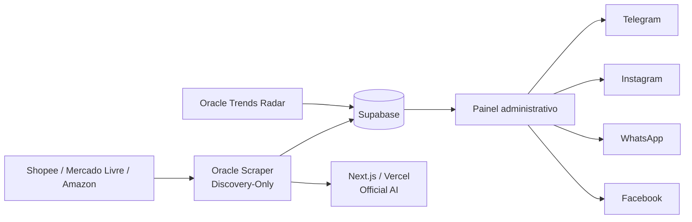
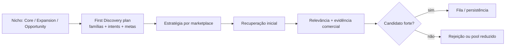

# Arquitetura atual — Caça Oferta Oficial

<!-- docs-status: current -->
<!-- verified-against: 7f35e0d2c0ca22e118b8163a73d18a1c7d995439 -->
<!-- verified-on: 2026-08-27 -->

> Fonte canônica documental do runtime versionado. Estado de produção é confirmado separadamente por auditoria operacional.

## Visão geral

O Caça Oferta Oficial coleta candidatos de Shopee, Mercado Livre e Amazon, persiste ofertas no Supabase, executa validações/scoring, gera drafts pela Official AI e mantém publicação separada do Discovery.



## Componentes

| Componente | Responsabilidade |
|---|---|
| Next.js/Vercel | UI, autenticação, APIs, IA e publicação |
| `oracle-scraper` | scheduler e Discovery dos marketplaces |
| `oracle-api` | gateway técnico autenticado na porta 3002 |
| `whatsapp-bot` | motor Baileys na porta 3001 |
| `oracle-trends-radar` | consumo independente do Radar |
| Supabase | Auth, ofertas, posts, links, logs e Storage |

## Scheduler e matriz editorial

O scheduler canônico usa:

```text
0 6,8,10,12,14,16,18 * * *
```

Timezone `America/Sao_Paulo`, `noOverlap=true`.

- 06h → Casa/Cozinha/Organização
- 08h → Beleza
- 10h → Informática
- 12h → Moda
- 14h → Ferramentas
- 16h → Pet
- 18h → Eletrodomésticos

Cupons permanece `manual_only` às 22h.

## First Discovery Quality V1 — estado atual

A arquitetura do PR #177 foi mergeada na `main` e está ativa na Oracle via:

```text
FIRST_DISCOVERY_QUALITY_V1_MODE=active
```



Características atuais:

- intents refinadas antes da coleta;
- avaliação comum de candidate quality;
- candidatos inelegíveis são excluídos no modo ativo;
- candidatos fortes têm prioridade absoluta;
- ausência de strong não autoriza backfill artificial com weak;
- comissão não define se um candidato é forte;
- desconto implausível não conta como evidência positiva.

## Estratégia por marketplace

### Amazon

Browse Node + intent forte, saúde das queries e sinais como rating, reviews, desconto real, cupom, Prime e posição de origem.

### Mercado Livre

Política `official-domain-then-catalog`, uso de domínio nativo e Best Seller quando disponível. Domínios incompatíveis devem ser rejeitados.

### Shopee

Categoria nativa + intent forte, com `avoidBroadCategoryOnly=true`. Sinais incluem vendas, rating, desconto real, qualidade da loja e posição.

## Lacuna arquitetural conhecida

O `adaptive-catalog-depth/v1` continua desacoplado do executor de rede.

Consequência: quando a primeira cobertura é insuficiente, o runtime pode encerrar o marketplace sem candidatos em vez de aprofundar automaticamente páginas/intents/domínios/categorias.

A auditoria de um ciclo manual de Moda em 27/08/2026 evidenciou:

- Mercado Livre com zero extraídos após cobertura nativa insuficiente;
- Shopee bloqueada antes da extração por `coverageInsufficient`/categoria ampla.

O comportamento operacional desejado é manter os guardrails de qualidade e continuar buscando enquanto houver orçamento seguro de discovery, encerrando zerado somente após esgotamento real das alternativas.

## Oracle produtiva

Auditoria de 27/08/2026:

- branch `main`;
- HEAD `7f35e0d2c0ca22e118b8163a73d18a1c7d995439`;
- working tree limpa;
- `FIRST_DISCOVERY_QUALITY_V1_MODE=active`;
- `oracle-scraper` online, sem crash loop e sem erro de startup após ativação.

## Ambiente local

Execução manual local só deve ser comparada à produção quando checkout e flags coincidirem com a Oracle. O ciclo local auditado em 27/08/2026 registrou release `e157df09f0d8deb53a65a8f48376c89d9cdcdef1`, portanto não representa exatamente o runtime produtivo atual.

## Publicação social

Discovery não autoriza publicação. `posts.content` continua sendo a autoridade da copy do canal, e os transportes sociais permanecem separados da etapa de descoberta.

## Radar independente

- `oracle-trends-radar` online;
- `TRENDS_RADAR_DEDICATED_RUNTIME=true`;
- `TREND_EXECUTIVE_MODE=off`;
- polling 30s;
- lock `/tmp/caca-oferta-trends-radar.lock`;
- `oracle-scraper` não consome Radar.

## Fontes de verdade

`src/app/**`, `src/core/**`, `src/lib/**`, `scripts/oracle-scraper.cjs`, `scripts/oracle-worker-discovery-only.cjs`, `scripts/commercial-niche-*.cjs`, `scripts/marketplace-scenario-contracts.cjs`, `scripts/first-discovery-quality.cjs`, `scripts/first-discovery-candidate-quality.cjs`, `scripts/adaptive-discovery-policy.cjs`, `supabase/**`, `.env.example`, `vercel.json`.