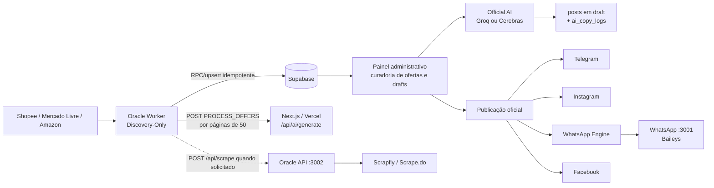
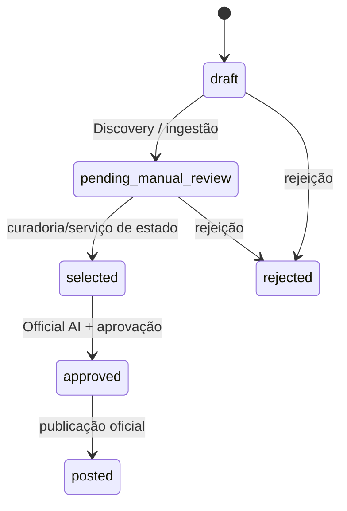

# Arquitetura atual — Caça Oferta Oficial

<!-- docs-status: current -->
<!-- verified-against: 61ce6d2 -->
<!-- verified-on: 2026-08-11 -->

> Fonte canônica documental do runtime versionado. A implementação, as migrations, os testes e o manifesto de release continuam sendo a autoridade final.

## Evoluções incorporadas em agosto de 2026

- Shopee OpenAPI V1 opera como fonte oficial isolada e controlada por flags; o caminho legado não deve ser inferido como equivalente.
- Curadoria Comercial V1 adiciona intenção, score, riscos, aprovação e filas Top 30 por canal.
- A identidade comercial e o histórico de publicação impedem reentrada indevida de ofertas equivalentes.
- `posts.content` concentra a copy oficial; Copy V3 e hashtags dinâmicas alimentam os transportes.
- Telegram e WhatsApp possuem fluxo editorial Top 30. O WhatsApp também expõe rotação `next`; Publicação Expressa continua independente.
- Shein Express usa confirmação assistida e imagem pública validada antes de persistência/publicação.
- Guardas fail-closed separam descoberta, geração controlada de drafts e publicação; Oracle não publica por efeito colateral do ciclo.

## Visão geral

O Caça Oferta Oficial coleta candidatos de marketplaces, grava ofertas no Supabase, executa validações e scoring determinísticos, gera drafts de copy pela Official AI, apresenta esses drafts no painel administrativo e publica manualmente por transportes de canal. A topologia é híbrida: o Next.js/Vercel concentra painel, rotas e serviços oficiais; o Oracle Worker executa Discovery contínua; a Oracle API é um gateway técnico de scraping; o motor WhatsApp é um processo separado.

## Componentes e responsabilidades

| Componente | Responsabilidade verificada | Fonte principal |
|---|---|---|
| Next.js/Vercel | UI, autenticação, APIs, serviços de estado/AI/publicação e cron de polling Instagram configurado | `src/app`, `src/core`, `src/lib`, `vercel.json` |
| Oracle Worker | Discovery dos três marketplaces, contrato Candidate/Ingestion V1, persistência e disparo da Official AI | `scripts/oracle-scraper.cjs`, `scripts/oracle-worker-discovery-only.cjs` |
| Oracle API | Gateway Express em `:3002`; `POST /api/scrape` busca HTML e devolve conteúdo normalizado | `scripts/oracle-api.cjs` |
| WhatsApp Engine | Express/Baileys em `:3001`, status e envio autenticado | `scripts/whatsapp-engine.cjs` |
| Supabase | Auth, tabelas de ofertas/posts/links/logs e Storage usado pelo app | `supabase/schema.sql`, `supabase/migrations`, `src/lib/supabase` |
| Official AI | Geração e regeneração de copy, validação, persistência de posts/drafts e transição quando aplicável | `src/core/ai`, `src/lib/ai/official`, `/api/ai/generate` |
| Painel | Lista ofertas e posts, curadoria, aprovação/rejeição e acionamento de publicação | `src/app/(dashboard)`, `src/components/dashboard` |
| Capacity Hunter | Monitoramento read-only one-shot da VPS, PM2, scheduler, Git e recursos; alertas Telegram | `apps/oracle-capacity-hunter/src` |

## Pipeline implementado

1. Discovery no Oracle Worker para `Shopee`, `Mercado Livre` e `Amazon`.
2. Deduplicação local por `sourceItemId` e validação do contrato Candidate V1.
3. Persistência por `upsert_discovery_offers_v1/v2` e índices únicos quando há identidade nativa; a oferta termina em `pending_manual_review`.
4. O worker chama `/api/ai/generate` com `command=PROCESS_OFFERS`, `correlationId`, `offerIds` e autorização de service role. O ciclo é paginado em lotes de 50 e usa checkpoint persistido.
5. A Official AI lê ofertas `pending_manual_review` sem drafts e gera drafts para os canais habilitados (`telegram`, `instagram`, `whatsapp` e `facebook`). Nesse modo o estado da oferta permanece `pending_manual_review`.
6. Para uma oferta já `selected`, a mesma Official AI pode gerar drafts e aprovar a oferta; o serviço de estado/idempotência registra a transição.
7. O painel lê ofertas/posts do Supabase. Os componentes de aprovação operam sobre posts em `draft`; rejeição em lote marca posts como `deleted`.
8. Rotas de publicação exigem autenticação, aprovação oficial e parâmetros `postId`/`offerId`; os transportes escrevem o resultado e recibos/logs conforme o adaptador.

O schema de `offers` também aceita `draft`, `pending_manual_review`, `selected`, `approved`, `posted` e `rejected`. O schema de `posts` aceita `draft`, `published`, `failed` e `deleted`. Componentes legados ainda executáveis podem escrever caminhos diferentes; isso não deve ser confundido com o caminho canônico.

## Official AI

`POST /api/ai/generate` é a rota oficial. Uma chamada individual recebe `offerId`; um ciclo recebe `command=PROCESS_OFFERS` e só é aceito com bearer igual à `SUPABASE_SERVICE_ROLE_KEY`. O Oracle Worker envia a lista de IDs, divide deterministicamente em páginas de 50 e avança o checkpoint até `batchCompleted`.

O serviço usa providers OpenAI-compatible para Groq (`https://api.groq.com/openai/v1/chat/completions`) e Cerebras (`https://api.cerebras.ai/v1/chat/completions`). A seleção do provider e do modelo depende da composição efetiva em `src/lib/ai/official` e dos providers em `src/core/ai/providers`; não há fallback sintético de links ou troca de prefixo entre canais.

Idempotência é aplicada por `commandId`/`idempotencyKey`, checkpoint do ciclo, persistência de drafts e adaptadores oficiais de Supabase. A regeneração é limitada e valida cópia contra preço, desconto, cupom, frete e rating da oferta.

## Supabase

Tabelas principais do schema/migrations: `profiles`, `offers`, `affiliate_links`, `posts`, `sales`, `integration_logs`, `app_settings`, `ai_copy_logs`, além de objetos de auditoria, categorias, tracking e sessão Baileys adicionados por migrations. `offers` é a entidade de descoberta; `affiliate_links` pertence a uma oferta; `posts` pertence a oferta e opcionalmente a link; `integration_logs` registra integração/ação/status/metadata; `ai_copy_logs` registra a geração de copy.

As migrations mais recentes adicionam contratos V5 de marketplaces, índices nativos e as funções `upsert_discovery_offers_v1` e `upsert_discovery_offers_v2`. Essas funções, índices únicos por identidade e as chaves de idempotência do serviço protegem a ingestão contra duplicação. RLS está habilitado no schema; operações administrativas usam client server-side.

## APIs do Next.js

Rotas de negócio confirmadas incluem `/api/ai/generate`, `/api/ai/regenerate`, `/api/scraper/import`, `/api/scraper/trends`, `/api/scraper/cron`, `/api/scraper/coupons`, `/api/telegram/publish`, `/api/instagram/publish`, `/api/whatsapp/publish`, `/api/facebook/publish`, `/api/publish/extension`, `/api/posts/reject`, `/api/posts/bulk-reject`, `/api/webhooks/instagram`, `/api/instagram/poll-comments`, `/api/auth/ml/*`, `/api/go/[...subId]` e `/api/health`/`/api/readiness`. Há também rotas utilitárias de imagens, settings e teste de integração; a lista física completa está em `src/app/api`.

Inngest está integrado em `/api/inngest` e em `src/lib/inngest/functions.ts` como executor assíncrono delegado. As funções `publishPostBackground` e `processOfferBackground` chamam os serviços oficiais de publicação/IA; funções de scraping, analytics e polling marcadas como `disabledJob` não devem ser descritas como automações ativas.

## Marketplaces e integrações

- Shopee, Mercado Livre e Amazon são os marketplaces efetivamente materializados pelo Oracle Worker Discovery-Only. Cada adapter possui regras e limites próprios; a fonte de comportamento é o script correspondente.
- Magalu, Netshoes e Shein possuem código de integração, contratos ou curadoria em partes do repositório, mas não são marketplaces do ciclo Discovery-Only atual; sua disponibilidade deve ser tratada como capacidade separada, não como etapa garantida do pipeline.
- Telegram, Instagram, WhatsApp e Facebook são canais de posts no schema e em `Official Publication`. A migration `20260723130000_enable_facebook_channel.sql` reconcilia as restrições legadas de `posts`, `affiliate_links` e `sales` com a rota/transport Facebook.

## Oracle Cloud e operação

O código define três processos esperados pelo Capacity Hunter: `oracle-api`, `oracle-scraper` e `whatsapp-bot`. O scraper cria um scheduler `node-cron` `0 0,4,8,12,16,20 * * *`, timezone `America/Sao_Paulo`, com `noOverlap: true`; ao iniciar, executa um ciclo e depois agenda os seguintes. O worker encerra cada ciclo em `pending_manual_review`.

A Publicação Expressa é um fluxo separado: resolve a URL, confirma o produto no marketplace, converte links diretos em destino monetizado quando o adapter possuir credencial válida, persiste o vínculo de afiliado e somente então permite a geração de copy. Falhas de confirmação devem permanecer explícitas; não se deve fabricar produto, link ou identidade.

O Oracle→Vercel é um POST para a URL configurada em `OFFICIAL_AI_TRIGGER_URL`, ou para a base pública resolvida por `APP_URL`, `NEXT_PUBLIC_APP_URL`, `PUBLIC_APP_URL`, `NEXTAUTH_URL`, `AUTH_URL` ou `VERCEL_PROJECT_PRODUCTION_URL`, sempre terminando em `/api/ai/generate`. O request usa bearer da service role quando disponível e timeout de 120 s. O Vercel→Oracle usa `POST /api/scrape` na porta 3002, autenticado por `ORACLE_API_KEY`; a API seleciona Scrapfly para não-Amazon e Scrape.do para Amazon. O botão manual de tendências usa o proxy autenticado `/api/scraper/trends`, que encaminha `category`, `sources`, `limit` e `tenantId` para `POST /api/manual/trends`; a execução permanece no Oracle Worker e reutiliza a mesma fila, persistência e Official AI. O endereço público/privado real deve ser configurado em `ORACLE_REMOTE_URL`.

Logs operacionais são `console.log`/`console.warn`/`console.error` dos processos, logs estruturados da aplicação e `integration_logs`/auditoria no Supabase. O Capacity Hunter coleta PM2, reinícios, quantidade de schedulers, reachability, CPU/RAM/disco, metadata OCI e SHA Git; roda como timer systemd de cinco minutos segundo seu README e código de configuração. Recuperação automática do domínio de dados é best-effort/idempotente; reinício de processos é procedimento operacional, não uma garantia implementada pelo worker.

## Variáveis

A lista segura de referência está em `.env.example`; os valores reais nunca devem ser versionados. O inventário inclui Supabase, Groq/Cerebras, URLs públicas, Oracle, transportes sociais, credenciais de marketplaces, limites de Discovery, observabilidade e armazenamento de mídia. Variáveis de teste, entradas de scripts e aliases de retrocompatibilidade estão marcadas separadamente.

## Operação e limites

Para inspecionar: `pm2 jlist`, logs do processo, `systemctl list-timers oracle-capacity-hunter.timer`, `journalctl -u oracle-capacity-hunter.service` e rotas `/api/health`/`/api/readiness`. Para executar manualmente, use os scripts exportados em `scripts/` com ambiente carregado; o scraper pode ser desabilitado com `ORACLE_SCRAPER_DISABLE_AUTORUN=1` quando for importado para testes.

Limitações verificáveis: produção Oracle/Vercel/Supabase e execução externa do Inngest não podem ser inferidas apenas do checkout; GitHub Actions e alguns adapters são capacidades separadas cuja ativação externa deve ser confirmada; o endpoint `/api/scrape` é técnico e não é a autoridade de Discovery; a documentação não deve prometer publicação automática ou cobertura de todos os marketplaces.

## Fontes de verdade

`src/app/api/**`; `src/core/**`; `src/lib/**`; `src/app/(dashboard)/**`; `scripts/oracle-scraper.cjs`; `scripts/oracle-worker-discovery-only.cjs`; `scripts/oracle-api.cjs`; `scripts/whatsapp-engine.cjs`; `apps/oracle-capacity-hunter/src/**`; `supabase/schema.sql`; `supabase/migrations/**`; `.env.example`; `src/lib/env.ts`; `package.json`; `vercel.json`.

## Avaliação de qualidade V2 (desligada por padrão)

A camada V2 avalia candidatos de Mercado Livre, Amazon e Shopee com identidade
nativa, agrupamento, score explicável e validação de monetização. Nesta branch,
o adaptador de admissão está preparado antes de `selectCopyQueue`, mas
`OFFER_QUALITY_PIPELINE_V2=false` continua desligada; portanto, o runtime
produz exatamente o caminho V1 atual. `shadow` apenas compara V1 × V2, e
somente `active` filtraria candidatos antes da fila, mediante aprovação
explícita e ciclo controlado. Nenhum deploy, gravação Supabase, publicação ou
mudança de PM2 é realizado por esta implementação.

## Radar Executivo de Tendências

A arquitetura inclui uma camada de inteligência de tendências separada da autoridade produtiva do Oracle. Collectors determinísticos persistem evidências; o Radar agrega nichos, Score V2, Top 3/Top 20 e performance interna em snapshots. O contrato Radar → Oracle carrega somente intenção e provenance auditável. Em `shadow`, o cenário legado continua autoritativo; `active` permanece bloqueado. O loop experimental transforma decisões finais em feedback para o próximo Radar sem reponderação automática do score.
