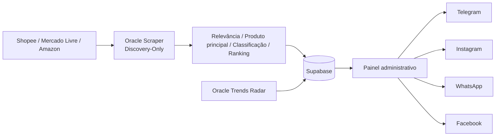

# Arquitetura atual — Caça Oferta Oficial

<!-- docs-status: current -->
<!-- verified-against: 76cb164c2d76b99e23a6d9422d38469c3bb27583 -->
<!-- verified-on: 2026-08-28 -->

> Fonte canônica documental do runtime versionado. Estado de produção é confirmado separadamente por auditoria operacional. O PR #186 permanece isolado até merge/alinhamento Oracle.

## Visão geral

O Caça Oferta Oficial coleta candidatos de Shopee, Mercado Livre e Amazon, aplica contratos editoriais, filtros de qualidade/classificação, persiste ofertas no Supabase, gera drafts pela Official AI e mantém publicação separada do Discovery.

## Componentes

| Componente | Responsabilidade |
|---|---|
| Next.js/Vercel | UI, autenticação, APIs, IA e publicação |
| `oracle-scraper` | scheduler e Discovery dos marketplaces |
| `oracle-worker-discovery-only` | funil comum de identidade, qualidade, classificação e fila |
| Offer Quality V2 | ranking/admissão comercial Amazon/ML quando ativo |
| Shopee OpenAPI V1 | descoberta/ranking nativo e controlled persist |
| Supabase | Auth, ofertas, posts, links, logs e Storage |

## Scheduler e matriz editorial

O scheduler canônico usa `0 6,8,10,12,14,16,18 * * *`, timezone `America/Sao_Paulo`, `noOverlap=true`.

- 06h → Casa/Cozinha/Organização
- 08h → Beleza
- 10h → Informática
- 12h → Moda
- 14h → Ferramentas
- 16h → Pet
- 18h → Eletrodomésticos

Cupons permanece `manual_only` às 22h.

## First Discovery Quality V1

`FIRST_DISCOVERY_QUALITY_V1_MODE=active` na Oracle auditada. O plano trabalha com Core/Expansion/Opportunity, intents fortes, diversidade e evidência comercial antes do ranking final. Ausência de strong não autoriza backfill artificial com weak.

## Funil de qualidade — revisão PR #186

A ordem de decisão passa a ser explicitamente:

1. identidade/URL/preço válidos;
2. produto principal, rejeitando peça/reposição/manutenção clara;
3. aderência ao contrato/intenção;
4. deduplicação;
5. classificação específica do produto;
6. ranking comercial;
7. fila/persistência.

O objetivo é impedir que preço baixo compense classe de produto errada.

### Amazon

- Browse Node continua evidência de recuperação, não identidade absoluta de produto.
- Título/atributos específicos precedem browse node amplo na classificação.
- Offer Quality V2 deixa de bonificar automaticamente itens `<= R$120`; valor comprovado, desconto, confiança, prova social e logística dominam o score.

### Mercado Livre

- Mantém `official-domain-then-catalog` e o mapa V1 certificado.
- O classificador consome `domain_id`/`category_id` das próprias famílias certificadas antes do catálogo genérico.
- Itens já validados semanticamente pelo mapa não devem cair em `review_required` apenas por ausência no catálogo de classificação legado.
- Famílias não certificadas continuam fora da busca automática até certificação explícita.

### Shopee

- Mantém ProductCatIds/OpenAPI V1 e o controlled persist existente.
- O controlled persist reutiliza o gate compartilhado de título/produto principal, além de rating, vendas e integridade de preço.
- Peças/manutenção não devem sobreviver apenas por terem bom rating ou volume de vendas.

## Profundidade de discovery

`adaptive-catalog-depth/v1` continua desacoplado do executor de rede. A qualidade final não deve ser compensada por preenchimento artificial; aprofundamento só deve ocorrer enquanto houver orçamento seguro de busca do marketplace.

## Oracle produtiva

Último alinhamento confirmado antes do PR #186:

- branch `main`;
- HEAD/runtime `940a5b99c4e92d024197f8a8a88e3e33cc20cf1e`;
- working tree limpa;
- `oracle-scraper` online.

O PR #186 não está na Oracle enquanto não for mergeado e alinhado explicitamente.

## Publicação social

Discovery não autoriza publicação. `posts.content` continua sendo a autoridade da copy do canal, e os transportes sociais permanecem separados da etapa de descoberta.

## Radar independente

- `oracle-trends-radar` dedicado;
- `TRENDS_RADAR_DEDICATED_RUNTIME=true`;
- `TREND_EXECUTIVE_MODE=off`;
- polling 30s;
- lock `/tmp/caca-oferta-trends-radar.lock`;
- `oracle-scraper` não consome Radar.

## Fontes de verdade

`src/app/**`, `src/core/**`, `src/lib/**`, `scripts/oracle-scraper.cjs`, `scripts/oracle-worker-discovery-only.cjs`, `scripts/product-title-quality.cjs`, `scripts/classification-coverage.cjs`, `scripts/mercadolivre-domain-category-map-v1.cjs`, `scripts/shopee-openapi-v1-controlled-persist.cjs`, `scripts/commercial-niche-*.cjs`, `scripts/marketplace-scenario-contracts.cjs`, `supabase/**`, `.env.example`, `vercel.json`.