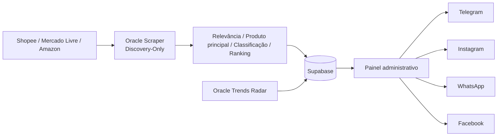

# Arquitetura atual — Caça Oferta Oficial

<!-- docs-status: current -->
<!-- verified-against: cffd8dd3e783538e78a28a0450475fe140414a78 -->
<!-- verified-on: 2026-08-28 -->

> Fonte canônica documental do runtime versionado. Estado de produção é confirmado separadamente por auditoria operacional. O PR #187 permanece isolado até merge/alinhamento Oracle.

## Visão geral

O Caça Oferta Oficial coleta candidatos de Shopee, Mercado Livre e Amazon, aplica contratos editoriais, filtros de qualidade/classificação, persiste ofertas no Supabase, gera drafts pela Official AI e mantém publicação separada do Discovery.

## Componentes

| Componente | Responsabilidade |
|---|---|
| Next.js/Vercel | UI, autenticação, APIs, IA e publicação |
| `oracle-scraper` | scheduler e Discovery dos marketplaces |
| `oracle-worker-discovery-only` | funil comum de identidade, qualidade, classificação e fila |
| Offer Quality V2 | ranking/admissão comercial Amazon/ML quando ativo |
| Shopee OpenAPI V1 | descoberta/ranking nativo e controlled persist |
| Supabase | Auth, ofertas, posts, links, logs e Storage |

## Scheduler e matriz editorial

O scheduler canônico usa `0 6,8,10,12,14,16,18 * * *`, timezone `America/Sao_Paulo`, `noOverlap=true`.

- 06h → Casa/Cozinha/Organização
- 08h → Beleza
- 10h → Informática
- 12h → Moda
- 14h → Ferramentas
- 16h → Pet
- 18h → Eletrodomésticos

Cupons permanece `manual_only` às 22h.

## Funil de qualidade

A ordem de decisão permanece:

1. identidade/URL/preço válidos;
2. produto principal, rejeitando peça/reposição/manutenção clara;
3. aderência ao contrato/intenção;
4. deduplicação;
5. classificação específica do produto;
6. ranking comercial;
7. fila/persistência.

O PR #187 endurece essa ordem sem criar motor paralelo.

### Amazon

- Browse Node permanece evidência auxiliar, não identidade absoluta.
- A classificação prioriza a primeira evidência específica do produto no título, evitando que menções secundárias dominem a classe.
- Resultados ambíguos de `scanner` e `switch de rede` passam por semântica específica.
- O score legado tem influência reduzida; desconto real, confiança, prova social, loja oficial e logística ganham prioridade.

### Mercado Livre

- Mantém certified-first, mapa V1 e exploração editorial estrita via endpoint oficial.
- O classificador consome evidências de domínio/categoria e catálogo editorial antes de enviar itens válidos para revisão manual.
- A paginação oficial usa a quantidade bruta retornada pela API para decidir continuidade; o número de sobreviventes semânticos não encerra prematuramente a família.
- Profundidade controlada: offsets `0`, `30`, `60` e `90`, preservando os mesmos guardrails de domínio, família e produto principal.
- Aliases editoriais ampliam cobertura de famílias sem alterar autenticação nem endpoint.

### Shopee

- Mantém ProductCatIds/OpenAPI V1 e controlled persist existente.
- O gate compartilhado de produto principal bloqueia peças, acessórios e consumíveis antes da persistência quando a intenção não é explicitamente acessória.

## Profundidade de discovery

O sistema não deve preencher volume artificialmente com produto fraco. O aprofundamento acontece somente enquanto houver orçamento seguro no mecanismo já existente de cada marketplace.

## Oracle produtiva

Último alinhamento confirmado antes do PR #187:

- branch `main`;
- HEAD/runtime `bd62fbf4784ce6ad1f5c123240e51c7815aaafb1`;
- working tree limpa;
- `oracle-scraper` online.

O PR #187 não está na Oracle enquanto não for mergeado e alinhado explicitamente.

## Publicação social

Discovery não autoriza publicação. `posts.content` continua sendo a autoridade da copy do canal, e os transportes sociais permanecem separados da etapa de descoberta.

## Radar independente

- `oracle-trends-radar` dedicado;
- `TRENDS_RADAR_DEDICATED_RUNTIME=true`;
- `TREND_EXECUTIVE_MODE=off`;
- polling 30s;
- lock `/tmp/caca-oferta-trends-radar.lock`;
- `oracle-scraper` não consome Radar.

## Fontes de verdade

`src/app/**`, `src/core/**`, `src/lib/**`, `scripts/oracle-scraper.cjs`, `scripts/oracle-worker-discovery-only.cjs`, `scripts/product-title-quality.cjs`, `scripts/curation-policy.cjs`, `scripts/classification-coverage.cjs`, `scripts/mercadolivre-official-intents-v5.cjs`, `scripts/mercadolivre-domain-category-map-v1.cjs`, `scripts/shopee-openapi-v1-controlled-persist.cjs`, `scripts/commercial-niche-*.cjs`, `scripts/marketplace-scenario-contracts.cjs`, `supabase/**`, `.env.example`, `vercel.json`.
