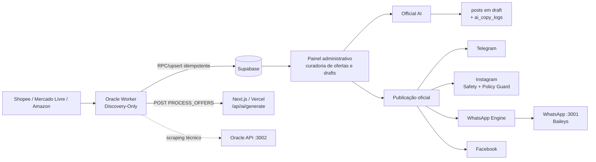
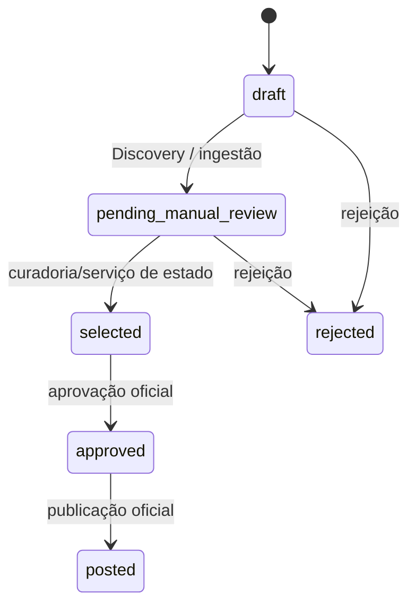

# Arquitetura atual — Caça Oferta Oficial

<!-- docs-status: current -->
<!-- verified-against: bbc19859e630c0db15aeb162056cfb56673bba19 -->
<!-- verified-on: 2026-08-18 -->

> Fonte canônica documental do runtime versionado. A implementação, as migrations, os testes e o manifesto de release continuam sendo a autoridade final.

## Evoluções incorporadas em agosto de 2026

- Shopee OpenAPI V1 opera como fonte oficial isolada e controlada por flags; o caminho legado não deve ser inferido como equivalente.
- Curadoria Comercial V1 adiciona intenção, score, riscos, aprovação e filas Top 30 por canal.
- A identidade comercial e o histórico de publicação impedem reentrada indevida de ofertas equivalentes.
- `posts.content` concentra a copy oficial; Copy V3 e hashtags dinâmicas alimentam os transportes.
- Telegram e WhatsApp possuem fluxo editorial Top 30. O WhatsApp também expõe rotação `next`; Publicação Expressa continua independente.
- Shein Express usa confirmação assistida e imagem pública validada antes de persistência/publicação.
- Guardas fail-closed separam descoberta, geração controlada de drafts e publicação; Oracle não publica por efeito colateral do ciclo.
- Ofertas `rejected` são bloqueadas nos fluxos sociais oficiais.
- Instagram Feed e Reels usam disclosure de parceria paga para conteúdo afiliado; Safety valida legenda, cota, duplicidade e mídia.
- O `Instagram Policy Guard` é executado em `/api/instagram/publish` antes da aprovação/publicação e antes da Graph API, bloqueando fail-closed categorias sensíveis ou contexto indisponível.
- O Radar de Tendências possui engine, runner e worker dedicado separados do ciclo editorial; o worker dedicado continua protegido por `TRENDS_RADAR_DEDICATED_RUNTIME=true`.

## Visão geral

O Caça Oferta Oficial coleta candidatos de marketplaces, grava ofertas no Supabase, executa validações e scoring determinísticos, gera drafts de copy pela Official AI, apresenta esses drafts no painel administrativo e publica manualmente por transportes de canal. A topologia é híbrida: o Next.js/Vercel concentra painel, rotas e serviços oficiais; o Oracle Worker executa Discovery; a Oracle API é um gateway técnico de scraping; o motor WhatsApp é um processo separado.

## Componentes e responsabilidades

| Componente | Responsabilidade verificada | Fonte principal |
|---|---|---|
| Next.js/Vercel | UI, autenticação, APIs e serviços de estado/AI/publicação | `src/app`, `src/core`, `src/lib`, `vercel.json` |
| Oracle Worker | Discovery dos marketplaces, persistência e disparo controlado da Official AI | `scripts/oracle-scraper.cjs`, `scripts/oracle-worker-discovery-only.cjs` |
| Oracle Radar Worker | Consumo independente das solicitações do Radar; fail-closed sem flag dedicada | `scripts/oracle-trends-radar-worker.cjs`, `scripts/oracle-trends-radar-runner.cjs`, `scripts/oracle-trends-radar-engine.cjs` |
| Oracle API | Gateway Express em `:3002`; scraping técnico autenticado | `scripts/oracle-api.cjs` |
| WhatsApp Engine | Express/Baileys em `:3001`, status e envio autenticado | `scripts/whatsapp-engine.cjs` |
| Supabase | Auth, tabelas de ofertas/posts/links/logs, auditoria e Storage | `supabase/schema.sql`, `supabase/migrations`, `src/lib/supabase` |
| Official AI | Geração/regeneração de copy e persistência de drafts | `src/core/ai`, `src/lib/ai/official`, `/api/ai/generate` |
| Publicação oficial | Aprovação, idempotência, transportes, recibos e observabilidade | `src/core/publication`, `src/lib/publication/official` |
| Instagram Safety/Policy | validação preventiva de legenda, cota, duplicidade, mídia e política comercial | `src/lib/instagram/safety.ts`, `src/lib/instagram/policy-guard.ts`, `/api/instagram/publish` |
| Painel | Lista ofertas/posts, curadoria, aprovação/rejeição e acionamento de publicação | `src/app/(dashboard)`, `src/components/dashboard` |
| Capacity Hunter | Monitoramento read-only da VPS, PM2, scheduler, Git e recursos | `apps/oracle-capacity-hunter/src` |

## Pipeline implementado

1. Discovery no Oracle Worker para os marketplaces habilitados.
2. Deduplicação e validação do contrato de candidato.
3. Persistência idempotente no Supabase; candidatos seguem para revisão manual.
4. O worker chama `/api/ai/generate` em lotes controlados com service-role e checkpoint.
5. A Official AI gera drafts para os canais habilitados sem transformar Discovery em autorização de publicação.
6. O painel opera sobre ofertas/posts persistidos e mantém ações de aprovação/rejeição explícitas.
7. Rotas oficiais de publicação validam autenticação, relacionamento entre oferta/post, estado e idempotência antes do transporte.
8. Instagram acrescenta Safety + Policy Guard antes da aprovação/publicação; bloqueios preventivos não chamam a Graph API.
9. Transportes registram resultado, recibos e observabilidade conforme o adaptador oficial.

O schema de `offers` aceita estados como `draft`, `pending_manual_review`, `selected`, `approved`, `posted` e `rejected`. O schema de `posts` aceita `draft`, `published`, `failed` e `deleted`. Componentes legados ainda executáveis não devem ser confundidos com o caminho canônico.

## Official AI

`POST /api/ai/generate` é a rota oficial. Uma chamada individual recebe `offerId`; um ciclo recebe `command=PROCESS_OFFERS` e exige autorização de serviço. O Oracle Worker envia IDs em páginas controladas e usa checkpoint até conclusão do batch.

A seleção do provider/modelo depende da composição efetiva em `src/lib/ai/official` e `src/core/ai/providers`. A IA não deve fabricar links, preços, descontos, frete, rating, identidade ou compliance. Idempotência é aplicada por command/idempotency keys, persistência de drafts e adaptadores oficiais.

## Supabase

O Supabase mantém autenticação, ofertas, links afiliados, posts, registros de integração, settings, auditoria, logs de IA, jobs e Storage. Migrations e RPCs protegem ingestão/idempotência e RLS permanece parte da fronteira de segurança. Operações administrativas usam clients server-side.

## APIs e publicação social

Rotas de negócio incluem `/api/ai/generate`, `/api/ai/regenerate`, rotas de scraper/Express, `/api/telegram/publish`, `/api/instagram/publish`, `/api/whatsapp/publish`, `/api/facebook/publish`, ações de posts, autenticação de marketplace e health/readiness.

No Instagram, a fronteira oficial é `/api/instagram/publish`: a rota valida o draft, mídia/Reel, histórico recente, cota da Meta quando disponível, legenda duplicada, vídeo duplicado e o contexto de política da oferta. `evaluateInstagramPolicy` roda antes de `approveOfficialOfferForPublication`. Um bloqueio retorna `INSTAGRAM_POLICY_BLOCKED` ou `INSTAGRAM_POLICY_INPUT_INVALID` e registra `instagram.policy.blocked` com IDs, regra, código e motivo. Feed e Reels usam `is_paid_partnership: true` no container atual.

No Facebook, o fluxo atual mantém o link afiliado fora da copy principal e usa o primeiro comentário quando solicitado pelo transporte.

## Marketplaces e integrações

- Shopee, Mercado Livre e Amazon são os principais caminhos de Discovery materializados pelo worker oficial; cada adapter possui contrato próprio.
- Magalu, Netshoes e Shein possuem capacidades separadas no repositório e não devem ser inferidos como parte garantida do ciclo Discovery-Only.
- Telegram, Instagram, WhatsApp e Facebook são canais de publicação oficial; disponibilidade externa exige validação de credenciais e smoke test.

## Oracle Cloud e operação

O scheduler principal usa seis janelas diárias em `America/Sao_Paulo` com proteção contra sobreposição. O endpoint Oracle `/api/scrape` é gateway técnico e não é a autoridade de Discovery.

A Publicação Expressa permanece separada: resolve/valida produto e marketplace, monetiza quando possível, persiste o vínculo e só então gera copy. Falhas de confirmação permanecem explícitas.

Para o Radar `/trends`, `scripts/oracle-trends-radar-engine.cjs` mantém o engine marketplace-first, `scripts/oracle-trends-radar-runner.cjs` seleciona/valida o consumidor e recusa origem editorial aposentada (`editorial_consumer_retired`), e `scripts/oracle-trends-radar-worker.cjs` é o loop automático dedicado. `TRENDS_RADAR_DEDICATED_RUNTIME=true` é requisito fail-closed para o worker dedicado. O ciclo editorial do `oracle-scraper` não volta a consumir solicitações do Radar; CLI/manual controlado permanece disponível para diagnóstico. O lock do worker é local ao host e não substitui claim distribuído entre múltiplas instâncias.

## Variáveis e operação

`.env.example` é o inventário seguro; valores reais nunca são versionados. Para inspeção operacional use health/readiness, logs da Vercel, PM2/systemd, logs estruturados e dados/auditoria no Supabase. Capacidade versionada não prova ativação produtiva de Vercel, Oracle, Supabase, Meta, Inngest ou marketplaces.

## Avaliação de qualidade V2

A camada V2 de qualidade permanece protegida por flags. `OFFER_QUALITY_PIPELINE_V2=false` mantém o caminho atual; shadow compara resultados sem mudar a autoridade e active exige aprovação explícita e rollout controlado.

## Radar Executivo de Tendências

Collectores determinísticos persistem evidências; o Radar agrega nichos, Score V2, Top 3/Top 20 e performance interna em snapshots. O contrato Radar → Oracle carrega intenção e provenance auditável. `TREND_EXECUTIVE_MODE=off` continua sendo o estado seguro; `shadow` não substitui a autoridade do cenário legado e `active` permanece bloqueado até readiness e autorização.

## Fontes de verdade

`src/app/api/**`; `src/core/**`; `src/lib/**`; `src/app/(dashboard)/**`; `scripts/oracle-scraper.cjs`; `scripts/oracle-worker-discovery-only.cjs`; `scripts/oracle-api.cjs`; `scripts/oracle-trends-radar-engine.cjs`; `scripts/oracle-trends-radar-runner.cjs`; `scripts/oracle-trends-radar-worker.cjs`; `scripts/whatsapp-engine.cjs`; `apps/oracle-capacity-hunter/src/**`; `supabase/schema.sql`; `supabase/migrations/**`; `.env.example`; `src/lib/env.ts`; `package.json`; `vercel.json`.
