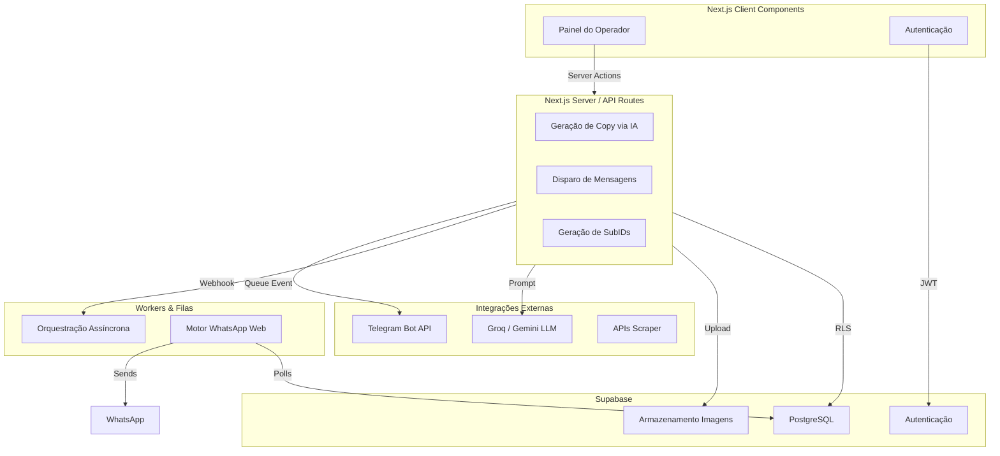

# Arquitetura do Sistema

O Caça Oferta Oficial é desenhado como um monolito modular na Vercel utilizando Next.js (App Router) como core, aliado a serviços de banco de dados e mensageria distribuída.

## Visão Geral

## Componentes Principais

### Frontend (Next.js 16)
Utiliza a nova infraestrutura do React 19 e App Router (`src/app`). As páginas principais interagem com componentes isolados (`src/components`) utilizando Tailwind CSS para estilos.

### Banco de Dados (Supabase)
Atua como camada de persistência definitiva. As chaves de acesso são separadas em "Anon Key" (com segurança a nível de linha - RLS) para clientes, e "Service Role Key" exclusiva do ambiente Node.js.

### Motor de Copywriting (IA)
A geração de persuasão (`src/lib/ai/`) constrói um payload baseado no desconto e dados brutos, enviando para LLMs como o Groq/Gemini, que retornam em um schema JSON predeterminado com `headline`, `hook`, `body` e `cta`.

### Distribuição (Publishing)
Cada oferta possui N links de afiliado rastreados (um para cada canal). A postagem no Telegram ocorre imediatamente pela sua API HTTP nativa. A postagem no WhatsApp exige um processo persistente (`scripts/whatsapp-engine.cjs`) utilizando websockets via biblioteca `baileys` para se conectar a um aparelho celular.
