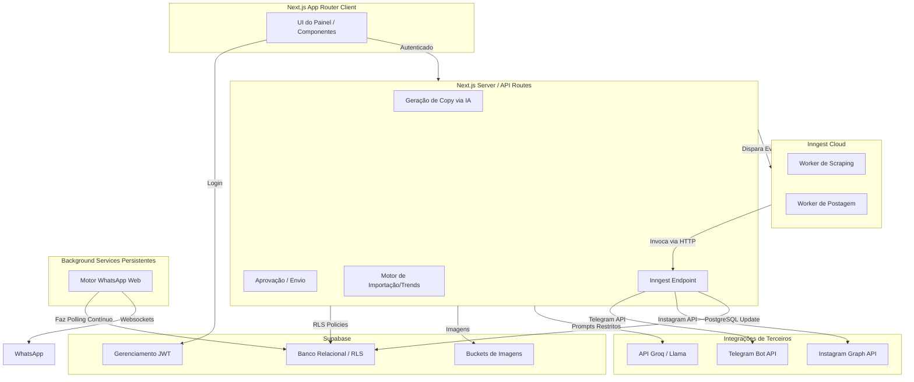

# Arquitetura do Sistema

O **Caça Oferta Oficial** possui uma arquitetura Serverless fortemente acoplada, desenhada para ser elástica na Vercel e robusta com processamento assíncrono via Inngest e persistência transacional via Supabase.

## Diagrama Geral de Arquitetura

## Separação de Componentes (Nova Arquitetura de 3 Pilares)

Recentemente, a arquitetura de scraping foi severamente desacoplada para isolar 3 responsabilidades que não se comunicam via HTTP diretamente:

1. **Notebook Windows (Scraping):** O único motor que abre instâncias do Playwright, aciona o Scrapfly, coleta o HTML, valida a estrutura (HTML/Product Validator) e **grava diretamente no Supabase**.
2. **Oracle VPS (Processamento e IA):** O Worker da Oracle **não executa scraping**. Ele fica num loop contínuo lendo o Supabase em busca de novas ofertas, calcula o Score Comercial, injeta a copy gerada por IA (Groq/Gemini) e comanda as publicações de redes sociais.
3. **Ngrok (Webhook):** Mantém exclusivamente o webhook ativo para recebimento de mensagens do WhatsApp e **não participa** da cadeia de scraping ou IA.

### 1. Camada de Apresentação (Frontend)
Construído sobre o App Router do Next.js 16 (`/src/app/(dashboard)`).
Nesta camada não há segredos vazeados. Ela lê dados passados por Server Components ou faz mutações por Server Actions/API Routes com tokens protegidos.

### 2. Camada API e Orquestração
Sediada em `/src/app/api`, expõe módulos separados por domínio (ex: `/api/ai/`, `/api/instagram/`, `/api/inngest/`).
- O **Inngest** age como uma cola assíncrona. Quando a API quer processar ofertas de uma lista longa, ela dispara um evento para a nuvem da Inngest, que bate de volta no endpoint `POST /api/inngest` fazendo o processamento real sem derrubar o cliente ou estourar timeouts da Vercel.

### 3. Camada de Persistência (Supabase)
Todo o estado vive no Supabase. O RLS (Row Level Security) garante que um cliente chamando o supabase diretamente pelo Client-side SDK só veja os dados atrelados ao seu próprio JWT.

### 4. Camada de Trabalhadores Contínuos
O envio para o WhatsApp exige um socket ativo, incompatível com Serverless Functions. Para isso, o script Node puro `/scripts/whatsapp-engine.cjs` lê as mensagens autorizadas pela tabela `posts` e entrega via protocolo `baileys` nativo.
