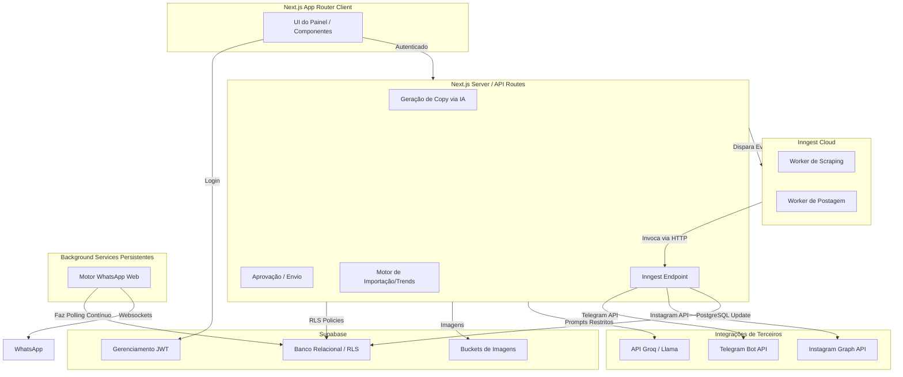

# Arquitetura do Sistema

O **Caça Oferta Oficial** possui uma arquitetura Serverless fortemente acoplada, desenhada para ser elástica na Vercel e robusta com processamento assíncrono via Inngest e persistência transacional via Supabase.

## Diagrama Geral de Arquitetura

## Separação de Componentes (Nova Arquitetura Desacoplada)

A arquitetura monolítica antiga (`oracle-scraper.cjs`) foi severamente desacoplada para isolar responsabilidades e blindar o sistema contra bloqueios de segurança (WAF):

1. **Minerador de Dados (`scripts/local-scraper.cjs`):** Roda localmente, delegando o by-pass do Mercado Livre para a API do Scrape.do (Proxy Residencial Premium sem renderização de tela). Salva tudo no Supabase como `draft`.
2. **Cérebro de Marketing (`scripts/ai-processor.cjs`):** Um script isolado que varre as ofertas `draft`, calcula scores, e envia para a **Camada LLM Abstrata (Factory)**. Ele formata os posts de redes sociais (Copy) e salva no banco pronto para publicação (`approved`).
3. **Camada LLM Abstrata (`src/core/llm/`):** Todos os scripts chamam Inteligência Artificial exclusivamente via `LLMFactory`. Ela é configurada no `.env` para usar o **Cerebras** primariamente, com fallback automático para **Groq**. Nenhum modelo fica hardcoded.
4. **Publicação (Dashboard Web):** As publicações finais ocorrem de maneira semiautomática ou manual pelo painel da Vercel.

### 1. Camada de Apresentação (Frontend)
Construído sobre o App Router do Next.js 16 (`/src/app/(dashboard)`).
Nesta camada não há segredos vazeados. Ela lê dados passados por Server Components ou faz mutações por Server Actions/API Routes com tokens protegidos.

### 2. Camada API e Orquestração
Sediada em `/src/app/api`, expõe módulos separados por domínio (ex: `/api/ai/`, `/api/instagram/`, `/api/inngest/`).
- O **Inngest** age como uma cola assíncrona. Quando a API quer processar ofertas de uma lista longa, ela dispara um evento para a nuvem da Inngest, que bate de volta no endpoint `POST /api/inngest` fazendo o processamento real sem derrubar o cliente ou estourar timeouts da Vercel.

### 3. Camada de Persistência (Supabase)
Todo o estado vive no Supabase. O RLS (Row Level Security) garante que um cliente chamando o supabase diretamente pelo Client-side SDK só veja os dados atrelados ao seu próprio JWT.

### 4. Camada de Trabalhadores Contínuos
O envio para o WhatsApp exige um socket ativo, incompatível com Serverless Functions. Para isso, o script Node puro `/scripts/whatsapp-engine.cjs` lê as mensagens autorizadas pela tabela `posts` e entrega via protocolo `baileys` nativo.
