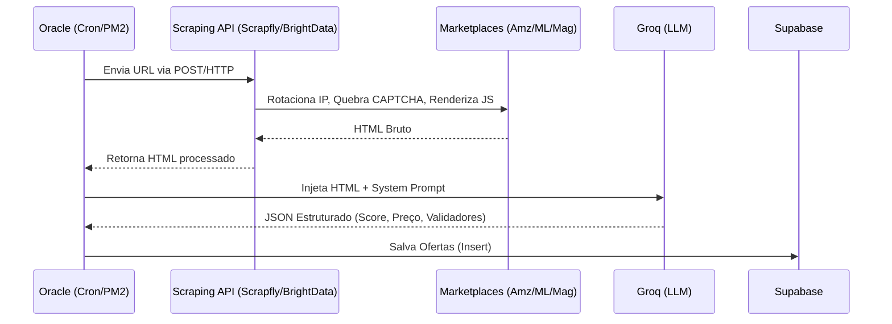

# REARQUITETURA DEFINITIVA — ORQUESTRADOR ORACLE & SCRAPER DESCOPLADO

Este documento estabelece o plano estratégico para extinguir a dependência do Playwright/Crawlee rodando na Oracle (que sofre banimentos e esgotamento de memória) e migrar o sistema para uma arquitetura "Scraping-as-a-Service", elevando a Oracle ao papel exclusivo de Orquestrador e Analista de IA.

---

## ETAPA 1: Mapeamento de Acoplamento Atual

O scraping in-house está centralizado, mas possui rastros profundos nos scripts:

| Arquivo | Função / Componente | Dependência | Impacto da Remoção |
|---|---|---|---|
| `scripts/oracle-scraper.cjs` | `crawleeExtract()` | Playwright, Crawlee, Stealth | **Crítico**. O core da extração; precisará ser totalmente refatorado para usar Fetch/Axios chamando API externa. |
| `scripts/oracle-scraper.cjs` | `browserPoolOptions` | Crawlee | Baixo. Será deletado. |
| `scripts/temp-runner.cjs` | Engine duplicada de backup | Crawlee/Playwright | Alto. Terá de ser reescrito ou removido caso `oracle-scraper` assuma. |
| `scripts/diagnostico-final.js` | Diagnóstico de rede | Playwright, Stealth | Nenhum impacto produtivo. |
| `scripts/crawlee_test.cjs` | Teste Isolado | Crawlee | Nenhum impacto produtivo. |
| `scripts/test-amz-mag.js` | Teste unitário | Instancia `crawleeExtract` | Alto. Precisará ser atualizado para a nova interface. |

---

## ETAPA 2: Arquitetura Alvo

A Oracle não fará mais download de imagens, não abrirá Chromium, e não gerenciará sessões do Datadome. Ela enviará as URLs para um serviço externo, e receberá apenas strings HTML.

**Fluxo Desacoplado (24/7):**

---

## ETAPA 3: Plano de Migração (Fases)

Para evitar quebra em produção, a transição será feita no formato *Shadow API*.

* **Fase 1 (Desenvolvimento Paralelo):** Criação de um novo arquivo orquestrador (ex: `scripts/oracle-orchestrator.cjs`). O código antigo continua rodando intacto em PM2. O novo arquivo implementará a chamada REST para o provedor de Scraping escolhido.
* **Fase 2 (Homologação A/B):** O `test-amz-mag.js` passará a apontar para o `oracle-orchestrator`. Avaliaremos se o HTML retornado pela API externa é 100% lido pela nossa lógica atual da Groq.
* **Fase 3 (Virada de Chave):** Atualização do PM2 para iniciar o `oracle-orchestrator.cjs` e encerramento do `oracle-scraper.cjs`. Remoção dos pacotes pesados (`playwright-extra`, `crawlee`, `puppeteer-extra-plugin-stealth`) do `package.json` para aliviar a VPS.

---

## ETAPA 4: Arquivos Afetados

| Arquivo | Motivo da Alteração | Risco | Rollback |
|---|---|---|---|
| `scripts/oracle-scraper.cjs` | *(Nenhum. Será mantido como legado/fallback)* | Nulo | Retornar PM2 para rodar este arquivo. |
| `scripts/oracle-orchestrator.cjs` (Novo) | Novo motor. Conterá todo o fluxo, mas o `crawleeExtract` será substituído por `apiExtract` (Fetch na Scraping API). | Baixo | Deletar arquivo. |
| `package.json` | Remoção do Crawlee e Playwright (na Fase 3) para economizar RAM, CPU e espaço no servidor. | Médio | `npm install crawlee playwright-extra` |
| `.env.local` | Inserção do endpoint e token definitivo da nova API de scraping. | Nulo | Reverter string. |

---

## ETAPA 5: Plano de Testes de Extração Externa

Assim que a integração da Fase 1 ocorrer, executaremos uma rotina que fará a extração via provedor terceiro.

1. **Amazon:** Validar se o HTML fornecido possui a grid de pesquisa, garantindo que o provedor executa o JavaScript necessário para popular produtos.
2. **Mercado Livre:** Validar estritamente o contorno do *Datadome*. A API não pode retornar HTTP 403, 302, ou HTMLs com "Account Verification".
3. **Magalu:** Validar o bypass completo do Cloudflare Turnstile, garantindo que o retorno seja a listagem real e não o "Just a Moment".

---

## ETAPA 6: Estudo Financeiro e Provedores (Scraping as a Service)

A Oracle hoje custa **$0/mês**, mas demanda dezenas de horas de engenharia por quebrar com WAFs e esgotar os 24GB de RAM nativos gerindo Chromiums. Abaixo o custo terceirizado (Base 1000 reqs):

| Provedor | Custo p/ 1000 Requisições | Bypass Anti-Bot Ativo? | Escalabilidade | Risco de Bloqueio |
|---|---|---|---|---|
| **Oracle Nativa (Atual)** | $0.00 | ❌ Não (Ban imediato via IP) | Péssima (RAM esgota) | **Extremo (99%)** |
| **Scrapfly API** | ~$1.20 | ✅ Sim (ASP e Rotação nativa) | Alta | Baixo |
| **Bright Data (Web Unlocker)** | ~$3.00 | ✅ Sim (O mais avançado do mundo) | Ilimitada | Nulo (Menor do mercado) |
| **Oxylabs (Web Unblocker)** | ~$2.00 | ✅ Sim (ML e IA Cloudflare bypass) | Ilimitada | Quase Nulo |
| **SmartProxy (Site Unblocker)** | ~$2.00 (ou cobrado por GB) | ✅ Sim (Contorna Datadome bem) | Alta | Baixo |

---

## ETAPA 7: Recomendação Final e Veredito

> [!IMPORTANT]
> **Recomendação Definitiva:** Migração para o **Scrapfly API** (Web Scraping API Mode) ou **Firecrawl**.

1. **Qual arquitetura é mais robusta?**
   Oracle como Orquestrador Cérebro (IA) + Web Unlocker Externo (BrightData ou Scrapfly).
2. **Qual arquitetura é mais barata?**
   O **Scrapfly** possui a melhor relação Custo/Benefício para operações de volume médio, possuindo planos de entrada bem mais acessíveis (a partir de $29/mês), e você já possui chaves ativas do Scrapfly no projeto.
3. **Qual arquitetura é mais escalável?**
   Qualquer um (BrightData/Scrapfly). Delegar o browser headful tira 95% do processamento da Oracle. A Oracle passará a processar apenas texto (JSON e chamadas de API), permitindo escalar o número de coletas infinitamente.
4. **Qual arquitetura tem menor risco de bloqueio?**
   Bright Data Web Unlocker. Eles terceirizam o CAPTCHA e possuem parcerias, porém o Scrapfly possui o modo Anti-Scraping Protection (ASP) que tem se mostrado letal contra Mercado Livre.
5. **Qual arquitetura recomenda para o Caça Oferta Oficial?**
   Vou recomendar o uso direto da **Scrapfly API**. Como já tentamos usar o "Scrapfly Proxy" e a conexão falhou, a abordagem robusta é utilizar o **Scrapfly Web Scraping API via HTTPS/REST**. Em vez de rodar o Playwright e tunelar o proxy, a Oracle fará apenas um `fetch()` para o endpoint da Scrapfly passando a URL da Magalu/ML, e a API da Scrapfly já devolverá o HTML pronto e limpo em texto.
