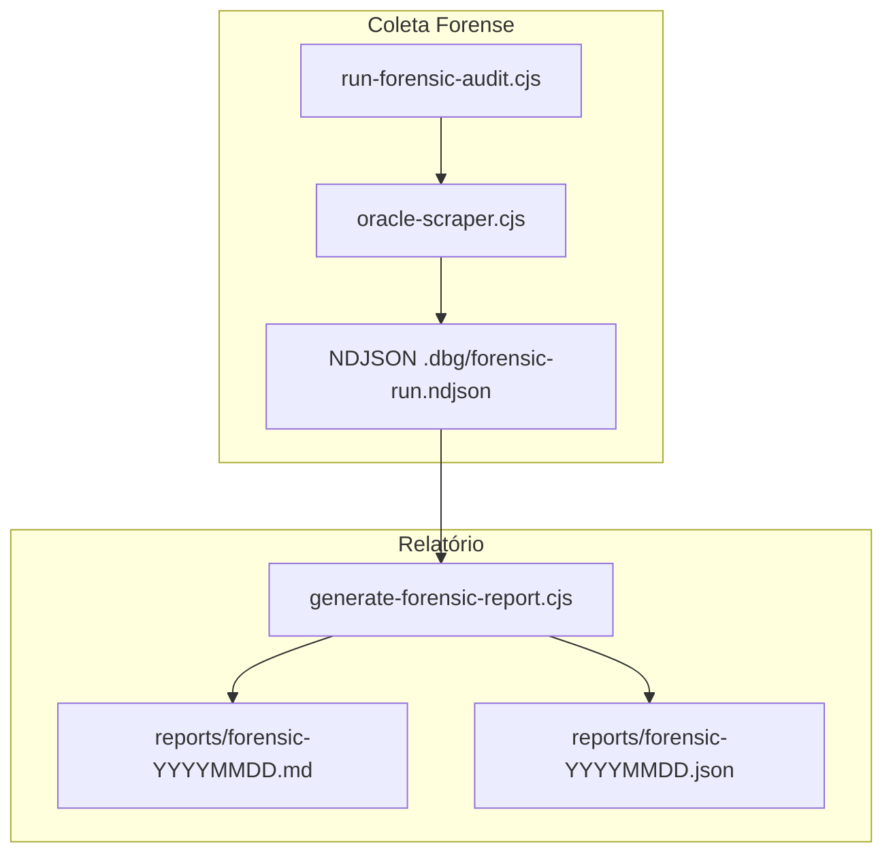

# Diagnóstico Forense do Oracle Scraper

## Contexto atual

O pipeline já possui instrumentação parcial em [`scripts/oracle-scraper.cjs`](scripts/oracle-scraper.cjs) (regiões `#region debug-point A–E`, ~20 eventos NDJSON via `emitAuditEvent`). Um run anterior (`full-audit-run`) gerou ~1000 linhas em [`.dbg/trae-debug-log-golden-queries-audit.ndjson`](.dbg/trae-debug-log-golden-queries-audit.ndjson).

**Lacunas vs. requisitos:**

| Etapa | Cobertura atual | Falta |
|-------|-----------------|-------|
| Golden Queries | `query-batch-selected` | — |
| Download HTML | `extract-summary` | contagem explícita de páginas; motivo HTML inválido |
| Parser DOM | `selectorsFound`, `cardsWithPrice`, `productsSentToLlm` | eliminações por motivo (sem preço, sem URL, dedup, truncamento) |
| HTML Validator | `html-validator-rejected` | motivo específico (espelho read-only) |
| LLM | agregado em `cycleMetrics` | delta sent→returned; rejeições individuais pós-LLM |
| validateProduct | `validator-preview` (agregado) | evento por produto rejeitado com todos os campos |
| Score | `offer-scored` | distribuição; near-miss 4–5; corte ≥5 |
| Deduplicação | `offer-upserted-existing` | dedup parser + título/hash (pós-processamento) |
| Approved/Posts | `offer-approved`, `approval-pipeline-summary` | rejeitados no corte VIP; posts criados |

**Restrição arquitetural:** com `SCRAPER_MODE=LOCAL` no Windows o ciclo **para em DRAFT** (sem `processTopOffers`). Para medir Score→Approved→Posts, o run usará **`SCRAPER_MODE=ORACLE`** via runner controlado.



---

## Estratégia: observação pura, zero mudança de fluxo

1. **Não tocar** em [`src/core/scraper/product-validator.ts`](src/core/scraper/product-validator.ts), [`validator.ts`](src/core/scraper/validator.ts), [`html-validator.ts`](src/core/scraper/html-validator.ts), score, LLM, Golden Queries.
2. **Isolar** toda lógica nova em módulo descartável [`scripts/lib/forensic-audit.cjs`](scripts/lib/forensic-audit.cjs) — carregado somente quando `SCRAPER_FORENSIC_AUDIT=1`.
3. **Hooks mínimos** em `oracle-scraper.cjs` dentro de `#region forensic-audit` (blocos `if (FORENSIC_ENABLED) { ... }`) — removíveis em bloco único ao final.
4. **Validação read-only** reutilizando `buildValidationPreview()` + `validateProduct()` já importados — mesma abordagem existente, sem chamar `sanitizeScrapedData` duas vezes de forma diferente.
5. **Motivo HTML** via função espelho `getHtmlRejectReason()` no módulo forense (copia a lógica de `html-validator.ts` para leitura, sem modificar o validator real).

---

## Fase 1 — Módulo forense (`scripts/lib/forensic-audit.cjs`)

Responsabilidades:

- **Config:** `FORENSIC_LOG_FILE` (default `.dbg/forensic-run.ndjson`), `FORENSIC_RUN_ID`
- **API:**
  - `emitForensic(stage, event, data)` — append NDJSON (sem POST ao debug server, para reduzir overhead)
  - `mapRejectReason(code)` — agrupa códigos em buckets do requisito (sem_imagem, sem_preco, confidence, url, categoria, titulo, duplicado, outros)
  - `getHtmlRejectReason(html, source)` — espelho read-only
  - `buildProductRejectionRecord(product, store, stage, reason, meta)` — payload padronizado
  - helpers: `normalizeTitleHash`, `bucketScore(score)`, `increment`

**Schema de eventos novos** (prefixo `forensic-*` para distinguir dos debug-points A–E):

| Evento | Quando | Campos-chave |
|--------|--------|--------------|
| `forensic-query-summary` | fim de cada query em `scrapeStore` | marketplace, categoria, goldenQuery, durationMs, pagesDownloaded, htmlValid/invalid, found, sentParser, sentLlm, sentValidator, approved, rejected, scoreMin/Max/Avg |
| `forensic-product-rejected` | rejeição em qualquer etapa | marketplace, categoria, goldenQuery, titulo, preco, hasImage, url, confidence, score, stage, reason, durationMs |
| `forensic-parser-stats` | após `page.evaluate` | selectorsFound, cardsWithPrice, eliminatedNoPrice, eliminatedNoUrl, eliminatedDedup, eliminatedTruncated |
| `forensic-html-result` | após validateHtml | valid, reason |
| `forensic-llm-batch` | após parse LLM | sentToLlm, returnedFromLlm, deltaLost |
| `forensic-score-cut` | em `processTopOffers` | produto abaixo de APPROVAL_SCORE (5.0) ou excedente VIP |
| `forensic-dedup` | parser dedup / DB existing | type: url_parser \| url_db \| title \| hash |
| `forensic-posts-created` | após insert posts | offerId, postsCount: 3 |
| `forensic-funnel-snapshot` | fim do ciclo | contadores globais por etapa |

---

## Fase 2 — Hooks em `oracle-scraper.cjs` (somente `#region forensic-audit`)

Pontos de instrumentação (observação, sem `return`/`if` extra):

### 2.1 Parser — `crawleeExtract` / `page.evaluate`

Estender o retorno de `page.evaluate` com contadores diagnósticos **adicionais** (não usados pelo fluxo):

```javascript
// Campos extras só para auditoria (ignorados pelo pipeline)
parserStats: { noPrice, noUrl, deduped, truncated }
```

Emitir `forensic-parser-stats` após evaluate.

### 2.2 HTML Validator — após `validateHtml()`

```javascript
if (FORENSIC_ENABLED) {
  emitForensic('html_validator', 'forensic-html-result', {
    valid: ok, reason: ok ? null : getHtmlRejectReason(rawExtractedData, storeName), ...
  });
}
```

### 2.3 LLM — após `JSON.parse`

- `forensic-llm-batch`: `sentToLlm = evalResult.sent`, `returnedFromLlm = returnedProducts.length`
- Loop read-only sobre `returnedProducts` chamando `validateProduct()` **antes** de `sanitizeScrapedData`:
  - rejeitados → `forensic-product-rejected` stage=`validateProduct`
  - incluir score calculado via `calculateScoreV1()` (observação, não altera aprovação)

### 2.4 Pós-sanitize — comparar preview vs resultado

Registrar produtos eliminados pelo `slice(0, limit)` como stage=`limit_cap` (observação).

### 2.5 `scrapeStore` — skippedMissingCore

Emitir `forensic-product-rejected` stage=`missing_core` para produtos sem nome/preço após validator.

### 2.6 `upsertOffer`

- `isNew: false` → `forensic-dedup` type=`url_db`
- manter `offer-scored` existente; forense adiciona score ao registro de produtos que passaram

### 2.7 `processTopOffers`

Para cada candidato:
- `score < 5.0` → `forensic-score-cut` + `forensic-product-rejected` stage=`score_threshold`
- excedente VIP (leftover) → stage=`vip_cap`
- aprovados → `forensic-posts-created` (3 posts)

### 2.8 `scrapeStore` query-end

Emitir `forensic-query-summary` consolidando contadores acumulados da query.

### 2.9 `runScrapingCycle` end

Emitir `forensic-funnel-snapshot` com totais globais.

---

## Fase 3 — Runner controlado (`scripts/run-forensic-audit.cjs`)

Orquestra execução **ORACLE/AUTO controlada** nos 3 marketplaces:

```bash
SCRAPER_FORENSIC_AUDIT=1 \
SCRAPER_AUDIT_RUN_ID=forensic-$(date) \
SCRAPER_MODE=ORACLE \
FORENSIC_STORES="Mercado Livre,Amazon,Magalu" \
FORENSIC_QUERIES_PER_STORE=3 \
FORENSIC_CATEGORIES_PER_RUN=3 \
node scripts/run-forensic-audit.cjs
```

Implementação:
- Carrega `oracle-scraper.cjs` via VM (padrão de [`scripts/test-oracle-controlled.cjs`](scripts/test-oracle-controlled.cjs))
- Desabilita auto-run no boot
- Sobrescreve temporariamente `STORE_QUERY_SETTINGS` / loop de stores via env (sem alterar defaults permanentes)
- Executa `runScrapingCycle()` com funil completo (scrape + `processTopOffers`)
- Ao final, invoca gerador de relatório automaticamente

**Estimativa de tempo:** ~3 lojas × 3 queries × ~15–30s/query + LLM + approval ≈ **15–45 min** (vs. ~2h no ciclo completo de 24 queries/loja).

---

## Fase 4 — Gerador de relatório (`scripts/generate-forensic-report.cjs`)

Lê NDJSON (forense + eventos A–E legados), agrega e produz:

- [`reports/forensic-{runId}.md`](reports/forensic-{runId}.md) — relatório executivo
- [`reports/forensic-{runId}.json`](reports/forensic-{runId}.json) — dados estruturados para reprocessamento

### Seções implementadas (Etapas 1–16)

| # | Seção | Fonte de dados |
|---|-------|----------------|
| 1 | Total Golden Queries | `query-batch-selected` + `query-start` |
| 2 | Páginas baixadas por marketplace | `forensic-query-summary.pagesDownloaded` |
| 3 | HTML válido/inválido + motivos | `forensic-html-result` |
| 4 | Produtos encontrados por marketplace/categoria | `forensic-parser-stats` + `extract-summary` |
| 5 | Eliminações no parser por motivo | `forensic-parser-stats` |
| 6 | Eliminações HTML Validator | `forensic-html-result` agrupado |
| 7 | Eliminações IA | `forensic-llm-batch` delta + parse/format errors |
| 8 | Eliminações validateProduct | `forensic-product-rejected` stage=validateProduct, buckets + % |
| 9 | Distribuição scores 0–10 | `offer-scored` / `forensic-score-cut` |
| 10 | Mortos no corte score≥5 | `forensic-score-cut` |
| 11 | Duplicidade | `forensic-dedup` + análise pós-hoc título/hash |
| 12 | Tempo médio por marketplace | `forensic-query-summary.durationMs` |
| 13 | Ranking Golden Queries | tabela ordenada por taxa aprovação |
| 14 | Ranking categorias | agregação por queryCategory |
| 15 | Top 50 motivos rejeição | `forensic-product-rejected.reason` |
| 16 | Funil completo | snapshot com qty, % perda, % acumulado |

### Relatório executivo (10 itens)

Gerado automaticamente no final do `.md`:

1. Top 10 gargalos (maior perda absoluta entre etapas consecutivas)
2. % perdido por etapa
3. Etapa que mais elimina
4. Melhor marketplace (taxa aprovação × volume)
5. Melhor categoria
6. Melhor Golden Query
7. Regra/motivo que mais elimina
8. Top 20 produtos por score (mesmo rejeitados)
9. Top 20 near-miss (score 4.0–4.99)
10. Estimativa de ganho por gargalo (counterfactual: "se etapa X tivesse 0% rejeição, +N aprovados")

A estimativa de ganho usa aritmética de funil **sem simular correções** — apenas mostra o teto teórico se cada etapa deixasse de filtrar.

---

## Fase 5 — Execução e entrega

1. Rodar `node scripts/run-forensic-audit.cjs`
2. Revisar `reports/forensic-*.md`
3. Validar amostra manual: cruzar 5 produtos rejeitados no relatório com eventos NDJSON
4. **Remover instrumentação:** deletar `scripts/lib/forensic-audit.cjs`, `scripts/run-forensic-audit.cjs`, `scripts/generate-forensic-report.cjs`, e todas as regiões `#region forensic-audit` de `oracle-scraper.cjs`

Os relatórios em `reports/` permanecem como evidência; `.dbg/forensic-run.ndjson` fica como raw data.

---

## Arquivos tocados

| Arquivo | Ação |
|---------|------|
| [`scripts/lib/forensic-audit.cjs`](scripts/lib/forensic-audit.cjs) | **Criar** — módulo isolado |
| [`scripts/run-forensic-audit.cjs`](scripts/run-forensic-audit.cjs) | **Criar** — runner ORACLE controlado |
| [`scripts/generate-forensic-report.cjs`](scripts/generate-forensic-report.cjs) | **Criar** — agregador + relatório |
| [`scripts/oracle-scraper.cjs`](scripts/oracle-scraper.cjs) | **Editar** — hooks `#region forensic-audit` (~80–120 linhas) |
| `reports/forensic-*.md` | **Gerar** na execução |
| `.dbg/forensic-run.ndjson` | **Gerar** na execução |

**Não alterar:** validator, score, LLM, Golden Queries bank, sanitizeScrapedData, html-validator.ts.

---

## Riscos e mitigações

| Risco | Mitigação |
|-------|-----------|
| Overhead de I/O no NDJSON | Escrita append-only; detalhe completo só em rejeições; agregados por query |
| Duplicação de eventos (debug A–E + forense) | Forense usa arquivo separado `.dbg/forensic-run.ndjson` |
| Run longo mesmo controlado | Env `FORENSIC_QUERIES_PER_STORE=3` ajustável; default conservador |
| Produtos near-miss sem score | Calcular score via `calculateScoreV1()` em hook read-only antes do corte |
| Split LOCAL sem Posts | Runner força `SCRAPER_MODE=ORACLE` |

---

## Critérios de sucesso

- Relatório cobre as 16 etapas + 10 itens executivos com números reais do run
- Nenhuma regra de negócio alterada (diff em core/scraper = zero)
- Funil medido até Posts com `SCRAPER_MODE=ORACLE`
- Instrumentação removível em bloco único após investigação
