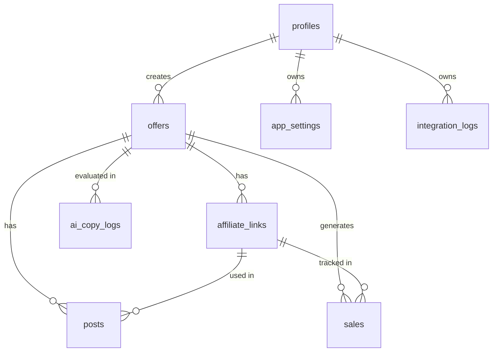

# Modelagem do Banco de Dados (Supabase)

O esquema central é gerido e migrado primariamente em `supabase/schema.sql`.

## ER Diagram

## Tabelas Principais

### `profiles`
Espelho da tabela `auth.users` interna do Supabase. Guarda informações extras como `full_name`. Relacionada 1:1 via gatilhos.

### `offers`
A tabela base do produto.
- Colunas Chave: `platform`, `product_name`, `original_url`, `current_price`, `old_price`, `score` (calculado), `status` (draft, approved, posted, rejected).
- `explainability`: Um campo `jsonb` onde são guardados os dados do motor de curadoria justificando a nota comercial da oferta.

### `affiliate_links`
Sistema de Rastreamento. Mapeia a oferta para os canais, contendo SubIDs únicos.
- O sistema obriga a restrição `unique (offer_id, channel)`. Portanto, para 1 oferta há no máximo 1 link pra Telegram, 1 pra Insta, etc.
- Armazena a contagem de cliques.

### `posts`
As cópias de persuasão de fato (texto completo pronto para envio).
- Coluna Chave: `content`, `channel`, `status` (draft, published, failed).
- O Worker do Whatsapp verifica os `posts` não publicados e os marca como `published`.

### `sales`
Para tracking de conversões diretas baseados nos retornos de webhooks dos Afiliados.
- Contém o `gross_value` e o `commission_value`.

### `integration_logs` e `ai_copy_logs`
Tabelas vitais para observabilidade.
- `integration_logs`: Log de comunicação REST externa (sucessos/erros e raw bodies).
- `ai_copy_logs`: Log de testes A/B e performance de Prompts da LLM, contendo notas e a estratégia que venceu na geração.

### `app_settings`
Repositório central para tokens e integrações particulares do usuário, salvas em `jsonb` puro para escalabilidade horizontal.

## Segurança e Acesso
Todo o banco possui **Row Level Security (RLS)** ativo. Nenhuma *query* vinda do cliente contendo apenas a JWT (Token do Supabase Auth) retornará `offers` de outro `user_id`. O Supabase Admin (via backend Node) sobrescreve essa política usando a **Service Role Key** para processamentos de Workers/Inngest.
