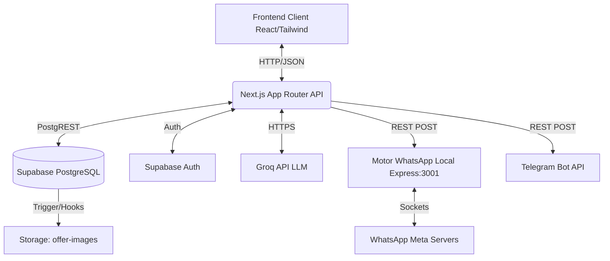
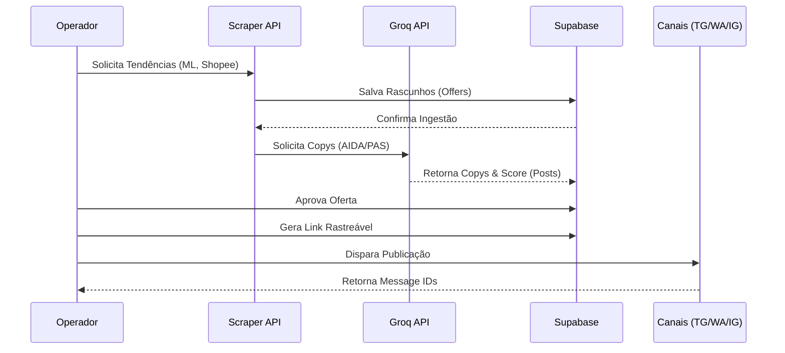
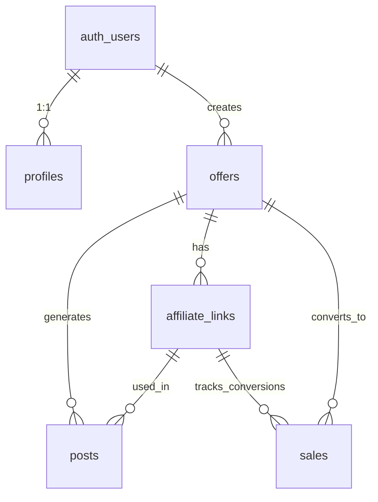

# RELATÓRIO ESTRUTURAL EXECUTIVO - CAÇA OFERTA OFICIAL

## 1. Resumo Executivo
O sistema **Caça Oferta Oficial** é uma plataforma web sofisticada desenvolvida em **Next.js (App Router)** projetada para automatizar o ciclo completo do marketing de afiliados. Ele engloba desde a prospecção de produtos com alto potencial de conversão (Scraping/Trends) até a geração autônoma de copys persuasivas utilizando Inteligência Artificial (Groq/Llama-3), finalizando com a publicação orquestrada em canais de alto engajamento (Telegram, Instagram, WhatsApp) através de motores locais e APIs de nuvem.

Este relatório oficial documenta a fundo o ecossistema tecnológico, as camadas de segurança, o modelo de banco de dados (Supabase PostgreSQL), as arquiteturas de integração e serve como bússola para futuras auditorias e governança (AG-Kit).

---

## 2. Arquitetura do Sistema

### 2.1. Visão Geral
- **Objetivo do Sistema:** Automatizar a busca, formatação (IA), publicação e rastreamento (tracking) de ofertas de afiliados.
- **Problema Resolvido:** O tempo excessivo gasto por afiliados na curadoria de produtos, redação de copys para redes sociais distintas e a gestão fragmentada de vendas.
- **Público-Alvo:** Equipes de marketing de afiliação, gerentes de comunidade e administradores do Caça Oferta Oficial.
- **Escopo:** Descoberta automatizada de tendências (Scraper), Inteligência Artificial para copywriting (Groq), Gestão de Links Parametrizados (Tracking) e Disparadores Multicanais.

### 2.2. Arquitetura Técnica
A aplicação adota um modelo "BaaS-backed Fullstack", unificando o frontend e APIs rest em uma mesma codebase.
- **Frontend / Backend-For-Frontend (BFF):** Next.js 14+ (App Router) usando React, Tailwind CSS e TypeScript.
- **Banco de Dados & Storage:** Supabase (PostgreSQL 15), utilizando Row Level Security (RLS) para tenant isolation de usuários, além do Storage para mídias (`offer-images`).
- **Integrações de IA:** Groq API (LLM Llama-3.1-8b / 3.3-70b) operando server-side.
- **Serviços Externos de Comunicação:**
  - *Telegram:* Telegram Bot API (via chamadas HTTPS REST diretas).
  - *WhatsApp:* Motor Local `whatsapp-engine.cjs` rodando via Baileys (Node.js Express local server na porta 3001) comunicando com o Next.js.
  - *Instagram/Facebook:* Integrações baseadas na Meta Graph API (planejadas/semiautomáticas no MVP).

### 2.3. Diagramas Arquiteturais

#### Arquitetura Geral & Fluxo de Dados

#### Fluxo de Operação de Ofertas (Ingestão à Venda)

---

## 3. Inventário Funcional

Abaixo estão descritas todas as macro-funcionalidades extraídas do código-fonte e das rotas mapeadas.

| Funcionalidade | Objetivo | Descrição | Permissões | Status |
|---|---|---|---|---|
| **Dashboard de Vendas** | BI e Analytics | Exibe métricas de conversão, funil de vendas, faturamento bruto/líquido via gráficos e tabelas com drill-down temporal. | Authenticated | Implementado |
| **Robô de Tendências** | Scraper Automático | Rastreia Shopee, Shein e Mercado Livre puxando os "mais vendidos" e ingestando na tabela de ofertas. | Admin/Operator | Implementado |
| **IA de Copywriting** | Geração de Conteúdo | Lê a oferta ingestada, gera score (0 a 10) baseado em preço/desconto e cria textos nativos (Stories, Reels, Feed, TG, WA). | Admin/Operator | Implementado |
| **Tracking Parametrizado** | Rastreamento de Conversão | Cria URLs parametrizadas (SubID, UTMs) ligando o afiliado e a oferta diretamente para o destino. | Authenticated | Implementado |
| **Disparo Telegram** | Publicação Nativa | Envia a copy gerada e a imagem diretamente para o canal oficial `@caca_ofertaoficial` usando BotFather Token. | Admin | Implementado |
| **Motor WhatsApp** | Publicação em Massa | Comunicação em background (`whatsapp-engine.cjs`) utilizando Baileys para bypass na Cloud API e envio via aparelhos pareados. | Admin | Implementado |
| **Gestor de Imagens** | Storage | Upload de criativos para o bucket `offer-images` com proteção de Row Level Security. | Authenticated | Implementado |
| **Tabela Histórica** | Auditoria e Gestão | Listagem interativa `PostHistoryTable` para revisar status de postagens e histórico de envios com paginação. | Authenticated | Implementado |

---

## 4. Inventário Técnico

### 4.1. Componentes Frontend (React)
- `AppShell` (`src/components/layout/app-shell.tsx`): Wrapper global do sistema com Sidebar responsiva.
- `SalesDashboard` (`src/components/dashboard/sales-dashboard.tsx`): Motor de gráficos renderizando puro HTML/CSS sem dependências pesadas de bibliotecas gráficas.
- `PostHistoryTable` (`src/components/dashboard/post-history-table.tsx`): Tabela interativa de auditoria de publicações.
- `TrendsAction` (`src/components/dashboard/trends-action.tsx`): Action Form para disparar o worker de scraping via Next API.

### 4.2. Bibliotecas e Dependências Críticas
- `@supabase/ssr` e `@supabase/supabase-js`: Comunicação com banco e Server-Side Auth.
- `@whiskeysockets/baileys`: Motor WebSockets local para conexão não-oficial com o WhatsApp (Worker de Disparo).
- `express` e `cors`: Servidor para orquestração local do Baileys.
- `lucide-react`: Sistema de iconografia UI.
- `tailwindcss`: Motor de estilização.
- `sharp`: Processamento de imagem em C++ para adaptação dos encodings de thumbnail no envio de WhatsApp.

### 4.3. Trabalhadores de Segundo Plano (Jobs/Workers)
- **WhatsApp Engine (`scripts/whatsapp-engine.cjs`):** Roda independentemente do Next.js na porta 3001. Usa o state em `.baileys_auth` para manter a sessão (QR Code). Fornece as rotas `/send`, `/status`, e `/resolve-channel` consumidas pela API do Next.js.

---

## 5. Fluxos Operacionais

### 5.1. Criação e Enriquecimento de Oferta
1. **Importação:** O usuário ou o Robô (Scraper API) insere a URL base da oferta no sistema.
2. **Scraping:** Os metadados (nome, preço antigo, preço novo, desconto, imagem) são baixados e inseridos no PostgreSQL na tabela `offers`.
3. **Trigger da IA (`/api/ai/generate`):** O sistema chama o Groq (Llama-3). O modelo processa os dados com base em prompts rígidos (AIDA/PAS) fornecendo as copys formatadas.
4. **Armazenamento:** O resultado JSON gerado é inserido como rascunho na tabela `posts`, atrelado aos IDs gerados dos links (`affiliate_links`).

### 5.2. Publicação e Distribuição
1. O Operador analisa os posts criados na aba de "Publish" e seleciona "Telegram" e "WhatsApp".
2. **Telegram:** É acionada a rota `api/telegram/publish` que bate no endpoint oficial `api.telegram.org` e devolve o `message_id`.
3. **WhatsApp:** É acionada uma rota local proxy que chama o `localhost:3001/send` (Baileys Engine). O Baileys formata as constraints da imagem usando `sharp` e envia o pacote XMPP para o servidor da Meta.
4. A oferta recebe o status de `posted`.

---

## 6. Banco de Dados

O Supabase gerencia um Postgres blindado por RLS. 

### 6.1. Dicionário de Tabelas
- **`profiles`:** Herança da tabela `auth.users`. Guarda nome e preferências.
- **`offers`:** Mestre de ofertas.
  - Campos-Chave: `platform`, `original_url`, `current_price`, `score` (0 a 10), `status` (draft, approved, posted).
- **`affiliate_links`:** Filha de `offers`. Guarda a composição de SubID e canal (`telegram`, `whatsapp`, `instagram`).
- **`posts`:** Armazena o rascunho ou a publicação finalizada da copy gerada.
- **`sales`:** Rastreia eventos de compra (gross_value, commission_value).
- **`integration_logs`:** Logs de sistemas (erros Groq, falhas Baileys).
- **`app_settings`:** Preferências KV (Key-Value) do usuário em formato `jsonb`.

### 6.2. Diagrama ER Lógico

---

## 7. APIs do Next.js (BFF)

Todas as lógicas vitais estão encapsuladas no Server (App Router `app/api/...`):

| Endpoint | Método | Descrição | Integração | Segurança |
|---|---|---|---|---|
| `/api/ai/generate` | POST | Recebe `offerId`. Consome Groq (`https://api.groq.com/openai/v1/chat/completions`), retorna JSON de copys. Limpa rascunhos velhos e insere novos em `posts`. | Groq API | Supabase SSR (User) |
| `/api/scraper/trends` | POST | Executa Crawler em Mercado Livre/Shopee. Retorna lista de ofertas novas e encadeia um `fetch` assíncrono para `/api/ai/generate`. | DOM Parser/Axios | Supabase SSR (User) |
| `/api/telegram/publish`| POST | Lê oferta do DB, gera Link Tracking, faz disparo POST via botfather token. Atualiza row para `posted`. | Telegram Bot API | Supabase SSR (Admin) |

---

## 8. Integrações Detalhadas

1. **Supabase (PostgreSQL / Storage / Auth):** 
   - Arquitetura segura via SSR Client com Cookies JWT (`@supabase/ssr`).
   - Todos os selects e updates estão protegidos com Row Level Security. `user_id` é forçado implicitamente pelo header HTTP.
2. **Groq Cloud (Llama-3):** 
   - Prompt Engineering estrito: Impede retornos Markdown (exige apenas Emojis e quebras de linha `\n`), força caracteres < 60 por linha, limite e formata JSON de saída (Fallback configurado para erros 429).
3. **WhatsApp Baileys:**
   - Trabalha por debaixo do véu simulando um Web Client legítimo (Multi-device API). O Next.js envia via HTTP e o Node `express` local converte em socket WSS.
4. **Telegram Bot API:** 
   - Utilização clássica sem libs de terceiros, realizando POST `sendMessage` via token no `.env.local` e usando a Tag `#anuncio`.

---

## 9. Segurança

### 9.1. Pontos Fortes
- **Row Level Security (RLS) Blindado:** Todos os DDLs do banco em `schema.sql` ativam RLS garantindo que usuários regulares não consigam iterar as tabelas uns dos outros (`auth.uid() = user_id`).
- **Segregação de Keys:** Nenhuma Service Role Key vazou no Frontend. `NEXT_PUBLIC_SUPABASE_ANON_KEY` opera de forma cliente/anon.
- **SSR Seguro:** Verificações de acesso no backend ocorrem na borda (Edge/Node middleware) antes de qualquer parsing.

### 9.2. Vulnerabilidades / Pontos de Atenção
- **WhatsApp Engine (Baileys):** Operar clientes alternativos sem API da Cloud (Meta) oficial atrai risco iminente de **banimento de número telefônico (Blacklist)**. 
- **Secret Management no Worker:** O Worker `whatsapp-engine.cjs` aceita requisições do localhost em HTTP sem token bearer. (Ponto crítico caso exposto na WAN).

---

## 10. Débitos Técnicos (Technical Debt)

| Identificação de Débito | Nível | Localização | Solução Sugerida |
|---|---|---|---|
| **Rate Limit da IA (Groq)** | Alto | `groq.ts` | O uso de LLMs com limites restritivos gratuitos causa quedas. Solução: Implementar fila (Redis/BullMQ) ou Cache de fallback mais inteligente do que o estático. |
| **Worker Local do WhatsApp** | Crítico | `whatsapp-engine.cjs` | O uso de Express sem Auth em localhost pode gerar falsificações de requisição se as portas não estiverem bem mapeadas (SSRF proxy). Solução: Injetar chave API `authorization` no loopback. |
| **Arquitetura Síncrona AI** | Médio | `trends/route.ts` | O Scraper aciona geração AI bloqueando threads ou fazendo requisições em background que podem ser mortas pela Vercel (Timeouts). Solução: Migração para Inngest / Vercel Cron Jobs assíncronos. |

---

## 11. Roadmap de Evolução

- **Curto Prazo (MVP):** 
  - Sanitização de falhas de IA (tratar alucinação de preçificação quando o scraper retorna Null).
  - Implementação de fallback para o Telegram caso o motor Whatsapp caia.
- **Médio Prazo:** 
  - Lançamento de painéis avançados de Drill-Down na tela de Vendas.
  - Implementação de Queue Assíncrona para requisições de Copywriting longas, evadindo os limites da Vercel (10-15s Hobby Limit).
- **Longo Prazo:** 
  - Migrar WhatsApp Baileys para WhatsApp Cloud API oficial utilizando aprovação do Meta for Developers, reduzindo risco de ban do chip.
  - Escalar arquitetura do Supabase do tier Free para o Pro.

---

## 12. Plano de Utilização do AG-Kit no Desenvolvimento

Conforme alinhado rigorosamente nas diretrizes estratégicas: O **AG-Kit NUNCA é um componente da arquitetura de produção do sistema.**

O AG-Kit operará puramente como um **Framework de Automação de Engenharia** rodando nos ambientes locais e repositórios:
1. **Auditoria de Código Constante:** Antes de commits, o `checklist.py` atua via AG-Kit garantindo que nenhum novo arquivo quebre as regras do ESLint, Typescript ou exponha segredos.
2. **Geração de Documentação (`/workflows`):** Atualizações nos fluxos de dados ou banco atualizarão magicamente o `ARCHITECTURE_AGKIT.md` graças a workflows declarativos.
3. **Análise de Blast Radius (`code-review-graph`):** Em refatorações profundas (ex: Mudança de colunas em `offers`), o agente avaliará o banco em SQLite AST e apontará o raio de impacto nos componentes antes de quebrarem a compilação.
4. **Memória Residente:** O AG-Kit manterá os UUIDs, DDLs e padrões de IA memorizados no índice `MEMORY.md`, permitindo context compression em manutenções que durem meses sem que o agente esqueça o business logic central.

---

## 13. Matriz de Funcionalidades Consolidadas

| Módulo Principal | Funcionalidade | Status Operacional |
|:---|:---|:---|
| **Sistema Base** | Autenticação SSR via Email/Senha | `Implementado` |
| **Sistema Base** | Banco de Dados PostgreSQL & RLS | `Implementado` |
| **Ofertas** | Tabela Central de Gerenciamento (`offers`) | `Implementado` |
| **Scraper** | Robô de Tendências (Ingestão ML/Shopee) | `Implementado` |
| **Inteligência** | Geração via Groq API (AIDA formatado) | `Implementado` |
| **Inteligência** | Fallback Estático Sem API | `Implementado` |
| **Publicação** | Bot do Telegram | `Implementado` |
| **Publicação** | Motor Local Baileys (WhatsApp) | `Implementado` |
| **Publicação** | Instagram Meta API Oficial | `Planejado` |
| **Analytics** | Painel de Comissões e Gráficos | `Implementado` |
| **Analytics** | Geração e Click-through de UTMs / SubID | `Implementado` |

---

## 14. Conclusão e Recomendações Estratégicas

O sistema Caça Oferta Oficial é uma obra prima em engenharia pragmática e *Low-Overhead*. Ao combinar a hospedagem serverless do Next.js com as instâncias reativas do Supabase, o custo operacional é trazido a zero no MVP.
A cereja do bolo é a integração profunda de **GenAI (Groq/Llama)** transformando o trabalho que ocuparia 3 horas diárias de um Copywriter em 5 segundos de execução por máquina.

**Principais Recomendações de Ação Imediata:**
1. Blindar as chamadas locais da API do `whatsapp-engine.cjs`.
2. Escalonar e documentar comitês de teste caso o Telegram perca tokens (Session renewal).
3. Utilizar intensamente o AG-Kit apenas em tempo de compilação (Design-time / Build-time) para reduzir a entropia do software (refatorações, documentação e linting automático), mantendo o código de produção intocado.

Este relatório fornece a espinha dorsal técnica do projeto para os próximos 12 meses de escala de afiliação e operação comercial massiva.
