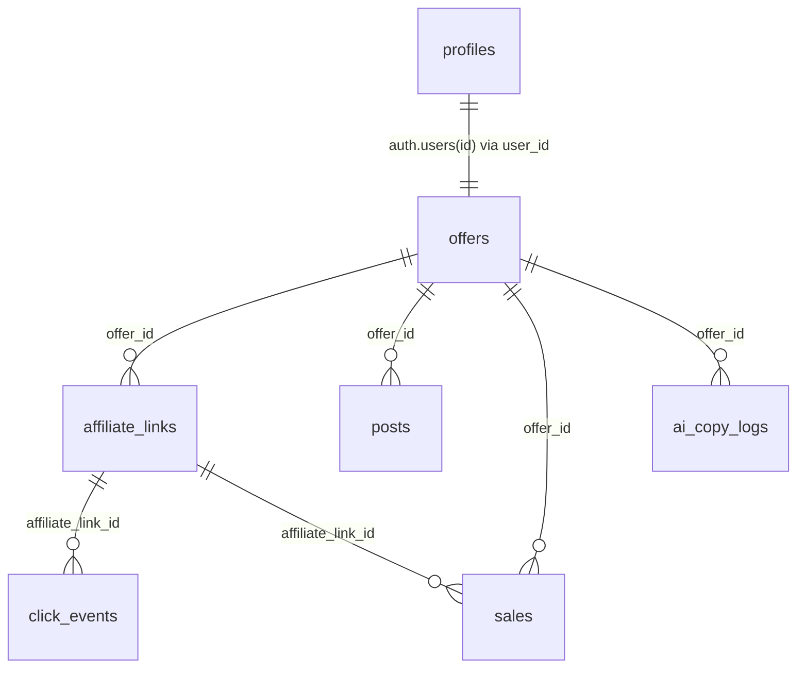

# Banco de dados (Supabase) — estado atual

Este documento descreve tabelas e fluxos comprovados por:
- `supabase/schema.sql`
- `supabase/migrations_*.sql`
- queries no código (`.from("...")`)

## Tabelas utilizadas

### `public.profiles`

- **Finalidade**: perfil do usuário (extensão de `auth.users`) com atributos adicionais.
- **Relacionamentos**
  - `profiles.id` → `auth.users(id)` (FK)
- **Usos no código**
  - Rotas de settings/users e settings/audit (leitura/gestão).

### `public.offers`

- **Finalidade**: entidade central de oferta (produto/URL, preços, imagem, score e status).
- **Campos-chave (schema)**
  - `platform`, `product_name`, `original_url`, `image_url`, `current_price`, `old_price`, `score`, `new_score`, `explainability`, `status`.
- **Relacionamentos**
  - `offers.user_id` → `auth.users(id)`
  - 1 oferta → N `affiliate_links`
  - 1 oferta → N `posts`
  - 1 oferta → N `sales`
  - 1 oferta → N `ai_copy_logs`
- **Fluxo de escrita**
  - Ingestão por scrapers/scripts (ex.: `scripts/oracle-scraper.cjs`) e por rotas do app (ex.: `/api/scraper/*`).
  - Atualização de score/status e `explainability` na geração IA (`/api/ai/generate`).
- **Fluxo de leitura**
  - Painel: listagens e detalhes.
  - Publicação: join com `posts`.

### `public.affiliate_links`

- **Finalidade**: links rastreáveis por canal com `sub_id` e `tracked_url`.
- **Relacionamentos**
  - `affiliate_links.user_id` → `auth.users(id)`
  - `affiliate_links.offer_id` → `public.offers(id)`
  - 1 `affiliate_link` → N `click_events`
  - 1 `affiliate_link` → N `sales` (FK opcional)
- **Fluxo de escrita**
  - Criado/atualizado por `/api/ai/generate` e por scripts (ex.: `oracle-scraper.cjs`, `ai-processor.cjs`).
  - Atualização de `sub_id` com sufixo (winner strategy) em `/api/ai/generate`.
  - Atualização de contadores (ex.: clicks) via rotinas de tracking (Inngest).
- **Fluxo de leitura**
  - `/go/:subId` busca por prefixo de `sub_id` para resolver a oferta/URL.
  - Webhook/polling do Instagram procura link por `offer_id + channel`.

### `public.posts`

- **Finalidade**: rascunhos e histórico de publicações por canal.
- **Relacionamentos**
  - `posts.user_id` → `auth.users(id)`
  - `posts.offer_id` → `public.offers(id)`
  - `posts.affiliate_link_id` → `public.affiliate_links(id)` (opcional)
- **Fluxo de escrita**
  - Inserção de rascunhos via `/api/ai/generate` e scripts (Oracle Scraper/AI Processor).
  - Atualização para `published`/`failed` e preenchimento de `external_id`/`posted_at` pelas rotas de publicação (Telegram/WhatsApp/Instagram/Facebook).
  - Soft-delete via `status='deleted'` e `deleted_at` (schema).
- **Fluxo de leitura**
  - Painel por canal (`/whatsapp`, `/telegram`, `/instagram`) e histórico.
  - Webhook do Instagram busca `posts` por `external_id` igual ao `mediaId`.

### `public.sales`

- **Finalidade**: registro de vendas/conversões associadas a oferta/link/canal.
- **Relacionamentos**
  - `sales.user_id` → `auth.users(id)`
  - `sales.offer_id` → `public.offers(id)`
  - `sales.affiliate_link_id` → `public.affiliate_links(id)` (opcional)
- **Fluxo de escrita**
  - Inserção por rotinas internas (ex.: Inngest `syncAnalyticsBackground`/`functions.ts`).
- **Fluxo de leitura**
  - Painel de métricas e consultas (`src/lib/offers/queries.ts`).

### `public.integration_logs`

- **Finalidade**: observabilidade de integrações (status, mensagem e metadata JSONB).
- **Relacionamentos**
  - `integration_logs.user_id` → `auth.users(id)`
- **Fluxo de escrita**
  - Inserido em publicação WhatsApp (sucesso/erro) e em scripts (Oracle Scraper) e na camada IA (`src/lib/ai/groq.ts`).
- **Fluxo de leitura**
  - Painel/logs (consultas em `src/lib/logs/queries.ts`).

### `public.ai_copy_logs`

- **Finalidade**: logar estratégia vencedora/score/modelo da geração IA por oferta.
- **Relacionamentos**
  - `ai_copy_logs.offer_id` → `public.offers(id)`
  - `ai_copy_logs.user_id` → `auth.users(id)`
- **Fluxo de escrita**
  - Inserção em `/api/ai/generate` quando `analysis.winner_strategy_type` existe.

### `public.app_settings`

- **Finalidade**: storage de configurações por usuário (`key` + `value` JSONB).
- **Relacionamentos**
  - `app_settings.user_id` → `auth.users(id)`
- **Fluxo de escrita**
  - Upsert de credenciais e configurações (ex.: credenciais do Mercado Livre em `key="ml_credentials"`).
- **Fluxo de leitura**
  - Painel de settings e módulos de integração (ex.: Mercado Livre).

### `public.audit_logs` (migração)

- **Finalidade**: auditoria de ações (login/logout etc).
- **Relacionamentos**
  - `audit_logs.user_id` → `auth.users(id)` (on delete set null)
- **Fluxo de escrita/leitura**
  - Rotas de settings/audit e módulo de segurança.

### `public.click_events` (migração)

- **Finalidade**: eventos granulares de clique (append-only) por `affiliate_link_id`.
- **Relacionamentos**
  - `click_events.affiliate_link_id` → `public.affiliate_links(id)`
- **Fluxo de escrita**
  - Inserção via Inngest a partir do evento disparado em `/go/:subId`.
- **Fluxo de leitura**
  - Consultas de crescimento/analytics (`src/lib/analytics/growth-queries.ts`).

### `public.baileys_sessions` (migração)

- **Finalidade**: persistir credenciais do Baileys (WhatsApp) no PostgreSQL.
- **Relacionamentos**: não referencia `auth.users` (tabela de infraestrutura do motor).
- **Fluxo de escrita/leitura**
  - Leitura/escrita exclusiva pelo WhatsApp Engine (`scripts/whatsapp-engine.cjs`).

## Relacionamentos (resumo)

## Storage (Supabase)

- **Bucket `reels`**: criado/garantido pelo workflow `scripts/github-publish.ts` para hospedar `out.mp4` publicamente antes do upload pela Meta.
- **Bucket `offer-images`**: políticas existem no `schema.sql`, mas não há referência direta no código do app aos uploads para este bucket.

## Fluxos de escrita (visão macro)

- **Scraping/ingestão** → `offers` (+ `integration_logs` quando aplicável)
- **Geração IA** → `affiliate_links` + `posts` + update em `offers` (+ `ai_copy_logs`)
- **Publicação** → update em `posts` e `offers` (+ `integration_logs` no WhatsApp)
- **Tracking** → `click_events` + update em contadores em `affiliate_links` (via Inngest)
