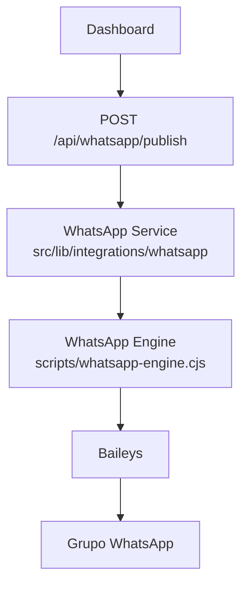
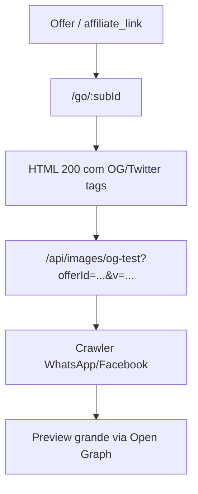

# Épica WhatsApp

## Índice

1. [Visão Geral](#1-visão-geral)
2. [Decisões Técnicas](#2-decisões-técnicas)
3. [Sprints Executadas](#3-sprints-executadas)
4. [Arquitetura Final](#4-arquitetura-final)
5. [Arquivos Importantes](#5-arquivos-importantes)
6. [Compatibilidade](#6-compatibilidade)
7. [Homologações](#7-homologações)
8. [Dívidas Técnicas](#8-dívidas-técnicas)
9. [Lições Aprendidas](#9-lições-aprendidas)
10. [Próxima Épica](#10-próxima-épica)

## 1. Visão Geral

Épica WhatsApp foi criada para tirar publicação do modo experimental e transformar fluxo em operação controlada, rastreável e homologável.

Problema inicial:

- Canal WhatsApp (`@newsletter`) devolvia ACK pelo Baileys, mas não comprovava publicação visível.
- Preview de link tinha comportamento inconsistente, com cache agressivo e imagem repetida.
- Destino de publicação não estava consolidado como configuração operacional única.
- Havia lacuna entre sucesso técnico do engine e sucesso visual real no cliente WhatsApp.

Limitações encontradas no Canal WhatsApp:

- `sendMessage()` para `@newsletter` retornava ACK sem prova de postagem visível.
- Mídia nativa em canal não ficou comprovada com Baileys `7.0.0-rc13`.
- Preview do link no canal dependia de crawler, cache e Open Graph, não de upload nativo.
- Canal exigia auditoria separada para distinguir ACK interno de publicação real.

Tecnologias avaliadas ao longo da épica:

- Baileys
- WhatsApp Web
- WAHA
- Meta Cloud API / Business Platform
- Evolution API
- OpenWA
- Venom
- WPPConnect
- Green API
- UltraMSG
- Whapi

Decisões arquiteturais tomadas:

- Parar de tratar Canal como fluxo principal.
- Adotar Grupo WhatsApp como destino operacional oficial.
- Centralizar resolução de destino em `WHATSAPP_TARGET_ID`.
- Manter `WHATSAPP_CHANNEL_ID` e `WHATSAPP_DEFAULT_CHANNEL_ID` como compatibilidade/legado.
- Usar `/go` + Open Graph premium como caminho suportado para preview grande, sem insistir em mídia nativa no canal.

## 2. Decisões Técnicas

### Por que Canal foi abandonado

- Canal não entregou prova confiável de mídia visível com Baileys na versão instalada.
- ACK, `messageId` e `status: 1` não bastaram como critério de sucesso.
- Auditoria mostrou diferença entre aceitação do engine e publicação real no app.

### Por que Grupo foi adotado

- Grupo publica via mídia nativa com imagem + legenda em uma única postagem.
- Homologação real confirmou entrega visual, legenda, link e CTA.
- Grupo reduz incerteza operacional e elimina dependência de comportamento opaco de `@newsletter`.

### Por que `WHATSAPP_TARGET_ID` foi criado

- Havia necessidade de um destino operacional único, explícito e configurável.
- Nome novo separa fluxo atual de nomes antigos presos ao conceito de canal.
- Permite alternar Grupo e Canal sem reescrever motor, cliente ou rota de publicação.

### Por que manter retrocompatibilidade

- Scripts legados, testes históricos e auditorias antigas ainda referenciam `@newsletter`.
- `WHATSAPP_CHANNEL_ID` e `WHATSAPP_DEFAULT_CHANNEL_ID` continuam úteis como fallback controlado.
- Compatibilidade preserva diagnóstico histórico sem reabrir migração técnica.

### Alternativas descartadas

- Continuar insistindo em mídia nativa no Canal sem prova real.
- Migrar para WAHA na Oracle atual de 1 GB RAM.
- Alterar arquitetura inteira de publicação antes de estabilizar destino e preview.
- Unificar todos os construtores de legenda durante Sprint focada só em WhatsApp.

## 3. Sprints Executadas

### Sprint 01

- Número: 01
- Nome: Preview Premium com imagem correta
- Objetivo: criar imagem Open Graph 1200x630 e integrar `/go` com `og:image` exclusivo por oferta.
- Escopo: rota de imagem OG, helper com `sharp`, meta tags OG/Twitter e versionamento determinístico.
- Arquivos principais:
  - `src/app/api/images/og-test/route.ts`
  - `src/lib/images/og-preview.ts`
  - `src/app/go/[...subId]/route.ts`
- Resultado: `/go` passou a entregar HTML com `og:image` premium, `canonical`, `twitter:image`, `og:image:width=1200`, `og:image:height=630`.
- Status: concluída
- Commit: `071bb25` (`feat: add premium whatsapp og previews`)
- Push: sim
- Oracle: não alterada
- Homologação: local e depois produção Vercel
- Critério de aprovação: HTML exclusivo por oferta e OG image versionada
- Critério de não regressão: links continuam redirecionando e não compartilham a mesma imagem

### Sprint 02

- Número: 02
- Nome: Auditoria forense do crawler Open Graph do WhatsApp
- Objetivo: descobrir por que preview do Canal não exibia imagem correta de forma confiável.
- Escopo: comparação técnica de crawler, redirects, HTML, headers e cache entre Caça Oferta Oficial e referência externa.
- Arquivos principais:
  - `docs/baileys_link_preview_audit.md`
  - `src/app/go/[...subId]/route.ts`
  - `scripts/whatsapp-engine.cjs`
- Resultado: auditoria concluiu que ACK e preview do Baileys não provavam publicação real; cache do WhatsApp e leitura de OG eram fatores centrais.
- Status: concluída
- Commit: não houve commit dedicado nesta sprint de auditoria
- Push: não
- Oracle: não alterada
- Homologação: investigação técnica e testes reprodutíveis
- Critério de aprovação: causa técnica documentada com evidência reproduzível
- Critério de não regressão: nenhuma alteração funcional no pipeline

### Sprint 03

- Número: 03
- Nome: Corrigir entrega da imagem Open Graph em produção
- Objetivo: resolver falha de runtime do `sharp` em produção e garantir resposta `200 image/jpeg`.
- Escopo: empacotamento de runtime do `sharp` e ajuste da rota de imagem OG.
- Arquivos principais:
  - `next.config.ts`
  - `src/app/api/images/og-test/route.ts`
- Resultado: produção Vercel passou a servir `og:image` corretamente como JPEG.
- Status: concluída
- Commit: `32a7eda` (`fix: include sharp runtime files for og images`)
- Push: sim
- Oracle: não alterada
- Homologação: produção Vercel validada após deploy
- Critério de aprovação: `/api/images/og-test` responder `200` com `Content-Type: image/jpeg`
- Critério de não regressão: `/go` continua apontando para imagem otimizada sem quebrar redirect

### Sprint 04

- Número: 04
- Nome: Migração técnica Canal para Grupo
- Objetivo: concluir pipeline configurável de publicação para Grupo como alvo principal, preservando Canal como legado.
- Escopo: resolução de destino, fallback de variáveis, integração app-engine, testes de alvo e documentação operacional mínima do fluxo técnico.
- Arquivos principais:
  - `scripts/whatsapp-engine.cjs`
  - `src/lib/integrations/whatsapp/index.ts`
  - `src/lib/integrations/whatsapp/target.ts`
  - `src/app/api/whatsapp/publish/route.ts`
  - `src/lib/publisher/index.ts`
- Resultado: pipeline passou a detectar `group` e `newsletter`, resolver `WHATSAPP_TARGET_ID` e publicar de forma configurável.
- Status: concluída
- Commit: `5080c83` (`feat(whatsapp): finalize configurable group/channel publishing pipeline`)
- Push: sim
- Oracle: não alterada nesta sprint documental; mudança ficou no código e env
- Homologação: rota e engine validados com resolução de alvo e publicação por JID configurável
- Critério de aprovação: Grupo operacional configurável sem remover compatibilidade com Canal
- Critério de não regressão: `WHATSAPP_CHANNEL_ID`, `WHATSAPP_DEFAULT_CHANNEL_ID` e alias legados preservados

### Sprint 05

- Número: 05
- Nome: Consolidação operacional WhatsApp
- Objetivo: consolidar Grupo como destino operacional oficial em documentação, exemplos e scripts de homologação.
- Escopo: documentação e scripts auxiliares, sem alterar motor, pipeline ou dashboard.
- Arquivos principais:
  - `README.md`
  - `.env.example`
  - `docs/ambiente.md`
  - `docs/arquitetura.md`
  - `docs/integracoes.md`
  - `docs/scripts.md`
  - `scripts/test-ab.cjs`
  - `scripts/test-final.cjs`
  - `scripts/test-wa-image.cjs`
- Resultado: docs passaram a tratar Grupo como padrão; Canal ficou classificado como compatibilidade/legado.
- Status: concluída
- Commit: `ed81f27` (`docs(whatsapp): consolidate group as operational target`)
- Push: sim
- Oracle: não alterada
- Homologação: auditoria documental e validação de referências operacionais
- Critério de aprovação: Grupo como padrão oficial em docs e exemplos
- Critério de não regressão: nenhum fluxo funcional do motor ou publicação alterado

### Sprint 06

- Número: 06
- Nome: Qualidade visual da publicação no Grupo
- Objetivo: melhorar formato visual da legenda usada pelo WhatsApp Grupo e homologar em publicação real.
- Escopo: alterar apenas construtores usados pelo fluxo WhatsApp Grupo, sem unificar Telegram/Instagram e sem tocar no motor.
- Arquivos principais:
  - `src/lib/post-builder/index.ts`
  - `src/lib/messages/generate.ts`
  - `src/tests/post-builder.test.ts`
  - `src/tests/messages.test.ts`
- Resultado: legenda do Grupo passou a usar blocos explícitos de preço, marketplace, link da oferta e CTA. Homologação real confirmou imagem + legenda + link + CTA em única postagem.
- Status: implementada localmente e homologada; pendente de commit
- Commit: não
- Push: não
- Oracle: não alterada para implementar; homologação usou engine já ativo
- Homologação: uma publicação real no Grupo confirmou mensagem única, imagem, legenda nova, link e CTA, sem duplicidade
- Critério de aprovação: publicação única no Grupo com imagem e legenda nova
- Critério de não regressão: Telegram, Instagram e motor WhatsApp permanecem inalterados

## 4. Arquitetura Final

Fluxo operacional final:

Papel de cada componente:

- Dashboard: inicia publicação aprovada pelo usuário.
- Publish API: carrega `post`, resolve `offer`, escolhe imagem final e define `targetId`.
- WhatsApp Service: valida payload, chama engine HTTP e centraliza retry/log.
- Engine: baixa/processa imagem, escolhe branch `group` ou `newsletter` e fala com Baileys.
- Baileys: camada WebSocket com sessão autenticada no WhatsApp.
- Grupo WhatsApp: destino operacional oficial e homologado visualmente.

Preview suportado para links:

## 5. Arquivos Importantes

| Arquivo | Função / ponto central | Responsabilidade | Dependências |
|---|---|---|---|
| `src/app/api/whatsapp/publish/route.ts` | `POST` | Carregar post/oferta, resolver imagem e disparar publicação | Supabase, `resolveConfiguredWhatsAppTargetId`, `whatsappService` |
| `src/lib/integrations/whatsapp/index.ts` | `WhatsAppService.sendMedia` | Cliente HTTP do engine, validação, retry e logs | `fetch`, `zod`, env `WHATSAPP_ENGINE_*` |
| `src/lib/integrations/whatsapp/target.ts` | `resolveConfiguredWhatsAppTargetId` | Resolver alvo principal e fallback legado | env `WHATSAPP_TARGET_ID`, `WHATSAPP_CHANNEL_ID`, `WHATSAPP_DEFAULT_CHANNEL_ID` |
| `scripts/whatsapp-engine.cjs` | `/send`, `/status`, `/resolve-target/:code` | Motor WhatsApp, processamento de imagem e envio via Baileys | Express, Baileys, Sharp, Supabase, env `WHATSAPP_*` |
| `src/app/go/[...subId]/route.ts` | `GET` | Entregar HTML com Open Graph e redirecionar para link afiliado | Supabase, Inngest, OG image route |
| `src/app/api/images/og-test/route.ts` | `GET` | Gerar imagem 1200x630 JPEG para preview | `sharp`, helper de preview |
| `src/lib/images/og-preview.ts` | helper de geração | Normalizar imagem original e montar canvas OG | `sharp`, fetch da imagem de origem |
| `src/lib/post-builder/index.ts` | `buildWhatsappPost`, `buildCouponWhatsappPost` | Montar legenda do fluxo principal do WhatsApp | copy, offer, affiliate link |
| `src/lib/messages/generate.ts` | `generateWhatsAppMessage` | Construtor alternativo usado em fluxo legado/cupom | offer, tracked link |
| `docs/baileys_link_preview_audit.md` | auditoria técnica | Registrar provas sobre preview, cache e limitações do canal | testes e análise de protocolo |

## 6. Compatibilidade

Compatibilidade preservada por desenho:

- `WHATSAPP_TARGET_ID`
  - configuração oficial atual
  - aceita Grupo `...@g.us`
  - também pode apontar para Canal legado, se necessário

- `WHATSAPP_CHANNEL_ID`
  - nome legado
  - mantido como fallback de compatibilidade
  - não deve ser tratado como configuração principal

- `WHATSAPP_DEFAULT_CHANNEL_ID`
  - fallback legado adicional
  - preservado para fluxos antigos e `Publisher`

- `newsletter`
  - permanece no código para detecção de tipo, auditoria e retrocompatibilidade
  - não é mais fluxo operacional recomendado

- `fallback`
  - ordem atual de resolução: `WHATSAPP_TARGET_ID` > `WHATSAPP_CHANNEL_ID` > `WHATSAPP_DEFAULT_CHANNEL_ID`

- retrocompatibilidade
  - alias `/resolve-channel/:code` continua existindo
  - scripts históricos com `@newsletter` foram mantidos como legado
  - documentação distingue claramente operação atual de referência histórica

## 7. Homologações

Homologações importantes:

1. Preview Open Graph local
- HTML de `/go` validado com `og:title`, `og:description`, `og:image`, `twitter:image`, `canonical`.
- Três ofertas diferentes confirmaram imagem exclusiva e versionamento determinístico.

2. Preview Open Graph em produção
- `/api/images/og-test` passou a responder `200 image/jpeg` após correção do runtime do `sharp`.
- `/go` em produção voltou a servir preview válido para crawler.

3. Canal WhatsApp
- Texto simples chegou.
- Mídia em `@newsletter` ficou sem prova visual apesar de ACK.
- Conclusão: ACK não equivale a publicação real.

4. Reautenticação da sessão
- Sessão passou a usar número correto `5521978733065`.
- Erro `Not Allowed` em newsletter deixou de ser problema de sessão e passou a ser problema de suporte real do fluxo.

5. Grupo WhatsApp
- Publicação controlada com imagem e nova legenda chegou de forma visível.
- Validação final: mensagem chegou, imagem chegou, legenda nova apareceu, link apareceu, CTA apareceu, uma única postagem, sem duplicidade.

Problemas encontrados:

- ACK falso em Canal.
- Cache agressivo de preview/link no ecossistema WhatsApp.
- Runtime do `sharp` ausente em produção.
- Múltiplos construtores de legenda para WhatsApp.
- Processamento de imagem do engine ainda limitado a `width: 800` e `quality: 80`.

Como foram resolvidos:

- Canal saiu de fluxo principal.
- Grupo virou destino operacional oficial.
- `/go` passou a usar OG image otimizada 1200x630.
- Runtime do `sharp` foi corrigido.
- Documentação e variáveis foram consolidadas.

Resultado final:

- Publicação operacional oficial ficou estabilizada em Grupo.
- Preview premium ficou baseado em Open Graph e não em mídia nativa de Canal.
- Base pronta para próxima épica sem quebrar compatibilidade legada.

## 8. Dívidas Técnicas

Registrar, não resolver:

- múltiplos construtores de legenda WhatsApp
- pipeline de imagem do engine ainda reduz para `width: 800` e `jpeg quality: 80`
- analytics específico do WhatsApp ainda limitado
- dashboard ainda carrega nomenclaturas históricas em alguns pontos
- auditoria e abstração de fallback legado ainda podem ser simplificadas
- migração futura para alternativa ao Baileys em Canal depende de infraestrutura melhor e prova técnica real

## 9. Lições Aprendidas

- ACK de biblioteca não é critério de sucesso em canal WhatsApp.
- Homologação visual real no app vale mais que retorno `200` ou `messageId`.
- Preview grande e previsível depende mais de Open Graph correto que de improviso com mídia em Canal.
- Variável operacional única reduz erro humano e risco de publicar no destino errado.
- Retrocompatibilidade deve ficar explícita e documentada, não implícita.
- Sprints de auditoria evitaram mudanças erradas em produção.
- Melhorar legenda do Grupo exigiu tocar só construtores realmente usados por esse fluxo.

## 10. Próxima Épica

Épica WhatsApp Foundation foi encerrada.

Próxima épica: WhatsApp Evolution

Sprints planejadas:

- Sprint 07: Imagem Premium
- Sprint 08: Templates Visuais
- Sprint 09: Dashboard
- Sprint 10: Analytics
- Sprint 11: Refatoração
- Sprint 12: IA

Objetivo da próxima épica:

- elevar qualidade visual e observabilidade
- reduzir dívida técnica acumulada
- preparar futura evolução de motor, imagem e dashboard sem reabrir problema estrutural já encerrado

## Referência para Execução das Próximas Sprints

A partir deste documento, toda nova Sprint da épica "WhatsApp Evolution" deverá iniciar obrigatoriamente consultando este histórico.

Sprints planejadas:

- Sprint 07 — Imagem Premium
- Sprint 08 — Templates Visuais
- Sprint 09 — Dashboard de Publicação
- Sprint 10 — Analytics
- Sprint 11 — Refatoração
- Sprint 12 — IA

Cada Sprint deverá:

- preservar toda a arquitetura homologada nas Sprints 01–06;
- consultar este documento antes de qualquer alteração;
- registrar ao final:
  - objetivo;
  - arquivos alterados;
  - homologação;
  - commit;
  - push;
  - atualização da Oracle (quando houver);
  - critérios de aprovação;
  - critérios de não regressão.

Ao concluir cada Sprint, este documento deverá ser atualizado para refletir o novo estado da épica.

Este documento passa a ser a referência oficial da evolução do WhatsApp no projeto.
